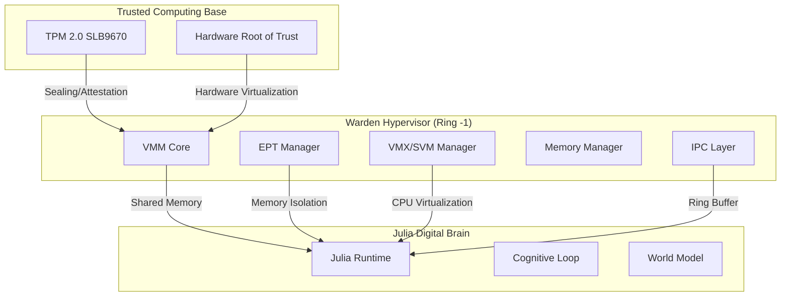
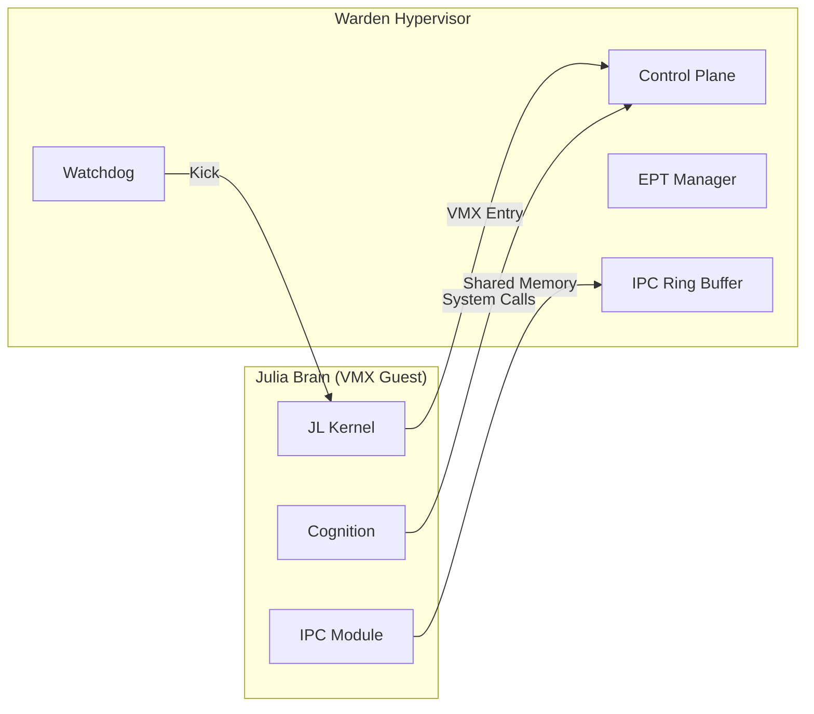
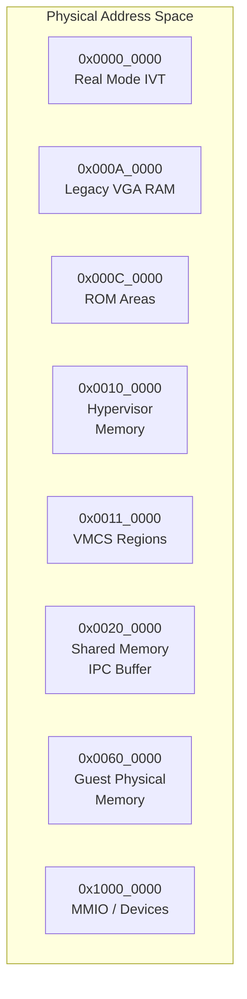
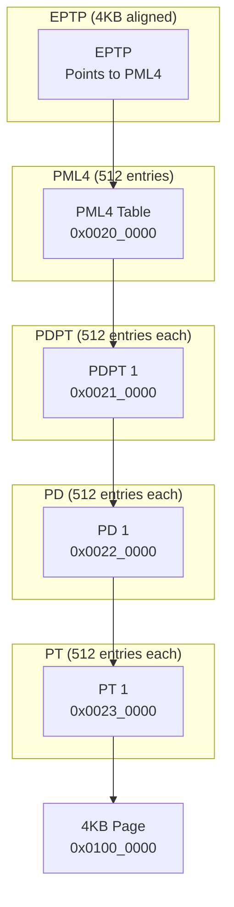
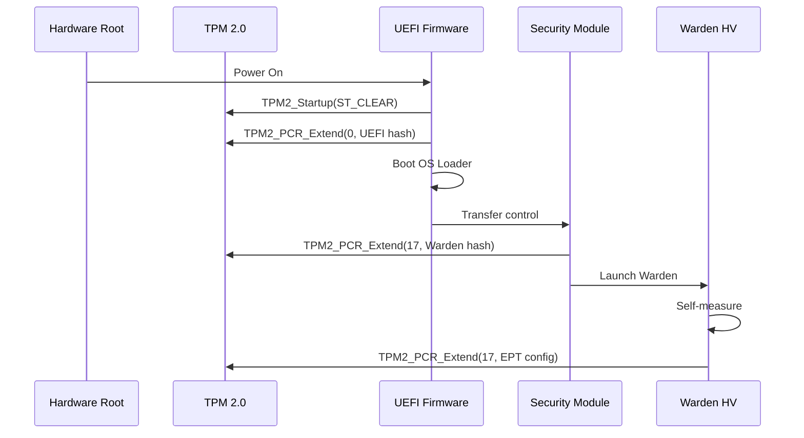
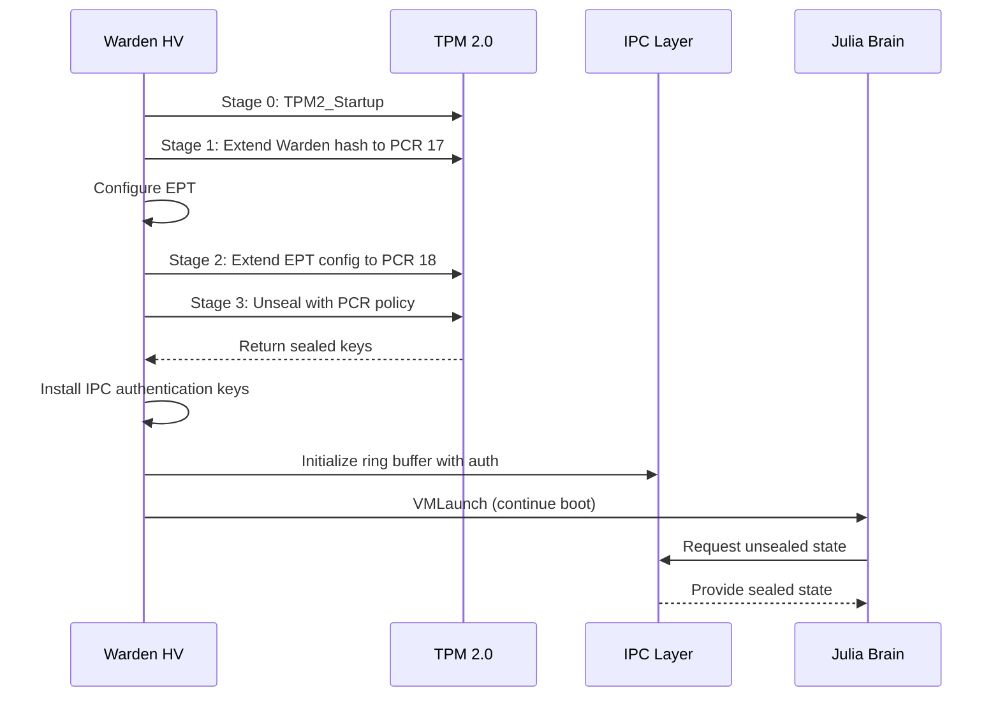
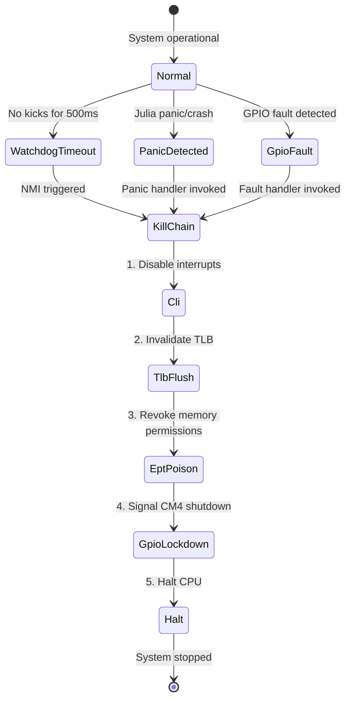

# Rust Warden Type-1 Hypervisor - Technical Specification

> **Version:** 1.0.0  
> **Classification:** Technical Specification - Hypervisor Architecture  
> **Status:** Implementation Reference  
> **Target Platform:** x86_64 (Intel VT-x / AMD SVM)  
> **Integration:** Julia Digital Brain (adaptive-kernel)

---

## Table of Contents

1. [Hypervisor Architecture Overview](#1-hypervisor-architecture-overview)
2. [Core Technical Specifications](#2-core-technical-specifications)
3. [EPT Isolation Implementation](#3-ept-isolation-implementation)
4. [TPM 2.0 Secure Boot (4-Stage)](#4-tpm-20-secure-boot-4-stage)
5. [IPC Ring Buffer Design](#5-ipc-ring-buffer-design)
6. [Fail-Closed Hardware Integrity](#6-fail-closed-hardware-integrity)
7. [Build and Integration](#7-build-and-integration)
8. [Appendices](#8-appendices)

---

## 1. Hypervisor Architecture Overview

### 1.1 Design Philosophy and Goals

The Rust Warden Type-1 Hypervisor serves as the foundational security substrate for the Itheris + Julia Digital Brain cognitive system. Unlike traditional hypervisors designed for server virtualization, Warden operates with a fundamentally different design philosophy centered on **sovereign security** and **deterministic fail-closed behavior**.

#### Core Design Principles

| Principle | Description | Implementation Priority |
|-----------|-------------|----------------------|
| **Minimal Trust Surface** | Hypervisor code must be auditable, with no unverified external dependencies | Critical |
| **Hardware-Enforced Isolation** | Memory and execution boundaries enforced at hardware level (EPT/NPT) | Critical |
| **Deterministic Fail-Closed** | Any undefined state triggers immediate containment | Critical |
| **Zero-Copy IPC** | Shared memory communication between Warden and Julia Brain | High |
| **TPM-Bound Attestation** | All boot measurements bound to TPM 2.0 PCRs | High |
| **Real-Time Awareness** | Predictable latency for cognitive processing loops | Medium |

#### Architectural Goals



### 1.2 Component Breakdown

The hypervisor consists of six primary components, each serving a distinct role in maintaining system security and isolation.

#### 1.2.1 VMX/SVM Manager

The VMX (Intel Virtual Machine Extensions) and SVM (AMD Secure Virtual Machine) manager provides the core virtualization primitives. This component:

- Detects hardware virtualization capabilities at boot
- Manages VMCS (Virtual Machine Control Structure) for Intel
- Manages VMCB (Virtual Machine Control Block) for AMD
- Handles VM exit/entry transitions
- Routes exits to appropriate handlers (EPT, interrupt, I/O)

**Location:** `itheris-daemon/src/hypervisor/vmx.rs` / `itheris-daemon/src/hypervisor/svm.rs`

```rust
/// VMX/SVM capability detection result
pub struct HypervisorCapabilities {
    pub has_vtx: bool,           // Intel VT-x
    pub has_vtx_ept: bool,       // Intel EPT
    pub has_uglobal: bool,       // Intel UGLA
    pub has_svm: bool,           // AMD SVM
    pub has_npt: bool,           // AMD Nested Page Tables
    pub has_pat: bool,           // Page Attribute Table
    pub has_pge: bool,           // Page Global Bit
    pub cpuid_vendor: CpuVendor,
}

/// Initialize virtualization support
pub fn init_hypervisor() -> Result<HypervisorCapabilities, HypervisorError>
```

#### 1.2.2 EPT Handler

The Extended Page Table (EPT) handler manages the second-level address translation that provides memory isolation between the hypervisor and guest (Julia Brain). Key responsibilities:

- Construct and manage EPT page tables
- Handle EPT violations (VM exits)
- Implement memory permission bits (read/write/execute)
- Support memory caching attributes (WB, WT, UC, etc.)
- Handle EPT misconfigurations

**Location:** `itheris-daemon/src/hypervisor/ept.rs`

```rust
/// EPT page table entry structure
#[repr(C, align(4096))]
pub struct EptPte {
    pub read: bool,           // Read permission
    pub write: bool,          // Write permission
    pub execute: bool,        // Execute permission
    pub memory_type: EptMemoryType,
    pub ignore_pat: bool,
    pub page_size: bool,
    pub accessed: bool,
    pub dirty: bool,
    pub reserved: u64,
    pub physical_address: u64,
}

/// EPT violation exit qualification
pub struct EptViolation {
    pub read_violation: bool,
    pub write_violation: bool,
    pub execute_violation: bool,
    pub guest_linear_address: u64,
    pub guest_physical_address: u64,
}
```

#### 1.2.3 Memory Manager

The Memory Manager handles all allocation and deallocation within the hypervisor, implementing a vmalloc-style allocator for the non-contiguous memory regions required by the hypervisor. Features:

- Buddy system allocation for page-level allocations
- Slab allocation for fixed-size structures
- Memory reservation for shared regions
- Integration with EPT for mapping management

**Location:** `itheris-daemon/src/hypervisor/memory.rs`

```rust
/// Memory region types
pub enum MemoryRegionType {
    /// Warden internal use (Ring -1)
    WardenSpace,
    /// Julia guest physical memory
    GuestPhysical,
    /// Shared memory region (IPC)
    Shared,
    /// Memory-mapped I/O
    MMIO,
}

/// Reserved memory regions
pub const WARDEN_MEMORY_MAP: &[(u64, u64, MemoryRegionType)] = &[
    // Warden hypervisor code and data
    (0x0000_1000, 0x0001_0000, MemoryRegionType::WardenSpace),    // 60KB
    // Julia guest physical memory
    (0x0100_0000, 0x1000_0000, MemoryRegionType::GuestPhysical), // 256MB guest RAM
    // IPC shared memory ring buffer
    (0x0100_0000, 0x0110_0000, MemoryRegionType::Shared),          // 64MB IPC
];
```

#### 1.2.4 IPC Layer

The IPC Layer provides the communication channel between the Rust hypervisor and Julia Digital Brain. This is implemented as a lock-free circular buffer with memory-mapped shared memory.

**Location:** `itheris-daemon/src/hypervisor/ipc.rs` / `adaptive-kernel/kernel/ipc/RustIPC.jl`

```rust
/// IPC ring buffer configuration
pub const IPC_BUFFER_BASE: u64 = 0x0100_0000;
pub const IPC_BUFFER_SIZE: usize = 64 * 1024 * 1024; // 64MB
pub const MESSAGE_SLOT_SIZE: usize = 256;
pub const MAX_MESSAGE_SLOTS: usize = (IPC_BUFFER_SIZE - 128) / MESSAGE_SLOT_SIZE;

/// Message header structure
#[repr(C)]
pub struct IpcMessageHeader {
    pub magic: u32,           // 0x49454350 ("JECP")
    pub version: u16,
    pub flags: u16,
    pub sequence: u64,
    pub timestamp_ns: u64,
    pub msg_type: u16,
    pub payload_size: u16,
    pub checksum: u32,
}
```

### 1.3 Integration Points with Julia Digital Brain

The hypervisor integrates with the Julia Digital Brain through multiple interfaces:



#### Integration Interface Summary

| Interface | Mechanism | Purpose |
|-----------|-----------|---------|
| IPC | Shared Memory Ring Buffer | High-throughput message passing |
| Control | VM Exits + Hypercalls | System control and state management |
| Memory | EPT Mapping | Shared memory region permissions |
| Watchdog | Hardware Timer | Failure detection and kill chain |

---

## 2. Core Technical Specifications

### 2.1 Direct Hardware Access using x86_64 Crate

The hypervisor uses the [`x86_64`](https://docs.rs/x86_64) crate for low-level hardware access. This crate provides safe abstractions for x86_64 specific operations including:

- CR0-CR4 control register manipulation
- MSR (Model Specific Register) access
- CPUID instruction invocation
- Page table manipulation
- Interrupt descriptor table management

**Cargo Dependency:**

```toml
[dependencies]
x86_64 = "7.0"
```

#### Initialization Sequence

```rust
use x86_64::registers::control::*;
use x86_64::registers::model_specific::*;
use x86_64::structures::idt::*;

pub fn hypervisor_early_init() -> Result<(), HypervisorError> {
    // Verify CPU supports required features
    let cpuid = x86_64::instructions::cpuid::CpuId::new();
    
    let vtx_info = cpuid.get_virtualization_info()
        .ok_or(HypervisorError::NoVirtualizationSupport)?;
    
    if !vtx_info.has_vmx() {
        return Err(HypervisorError::NoVmxSupport);
    }
    
    // Enable VMX operation
    let msr = x86_64::registers::model_specific::Msr::new(IA32_FEATURE_CONTROL)
        .map_err(|_| HypervisorError::MsrAccessFailed)?;
    
    // Enable VMX outside SMX
    msrcall::wrmsr(IA32_FEATURE_CONTROL, msr.read() | 0x5);
    
    // Disable paging (required for VMXON)
    Cr0::write(Cr0::read().without_paging());
    
    Ok(())
}
```

### 2.2 Intel VT-x and AMD SVM Support Detection and Switching

The hypervisor must detect and support both major x86_64 virtualization technologies.

#### 2.2.1 Capability Detection

```rust
/// CPU vendor identification
#[derive(Debug, Clone, Copy, PartialEq, Eq)]
pub enum CpuVendor {
    Intel,
    AMD,
    Unknown,
}

/// Detect CPU vendor and virtualization capabilities
pub fn detect_hypervisor_capabilities() -> HypervisorCapabilities {
    let cpuid = x86_64::instructions::cpuid::CpuId::new();
    
    // Get vendor string
    let vendor_info = cpuid.get_vendor_info()
        .map(|v| v.as_str().to_owned())
        .unwrap_or_default();
    
    let cpu_vendor = match &vendor_info[..] {
        "GenuineIntel" => CpuVendor::Intel,
        "AuthenticAMD" => CpuVendor::AMD,
        _ => CpuVendor::Unknown,
    };
    
    // Check Intel-specific features
    let has_vtx = cpuid.get_virtualization_info()
        .map(|v| v.has_vmx())
        .unwrap_or(false);
    
    let has_vtx_ept = cpuid.get_virtualization_info()
        .map(|v| v.has_ept())
        .unwrap_or(false);
    
    // Check AMD-specific features  
    let has_svm = cpuid.get_extended_processor_info()
        .map(|e| e.has_svm())
        .unwrap_or(false);
    
    let has_npt = cpuid.get_extended_processor_info()
        .map(|e| e.has_npt())
        .unwrap_or(false);
    
    HypervisorCapabilities {
        has_vtx,
        has_vtx_ept,
        has_uglobal: has_vtx_ept, // EPT implies UGLA
        has_svm,
        has_npt,
        has_pat: check_pat_support(),
        has_pge: true, // Always supported on x86_64
        cpuid_vendor: cpu_vendor,
    }
}
```

#### 2.2.2 VMXON/VMXOFF Transition

```rust
/// Enter VMX operation (VMXON)
pub fn vmxon(physical_address: u64) -> Result<(), HypervisorError> {
    // VMXON takes physical address of VMXON region
    let result = unsafe {
        x86_64::instructions::asm::vmx::vmxon(physical_address)
    };
    
    if result {
        Ok(())
    } else {
        Err(HypervisorError::VmxonFailed)
    }
}

/// Exit VMX operation (VMXOFF)
pub fn vmxicoff() -> Result<(), HypervisorError> {
    let result = unsafe {
        x86_64::instructions::asm::vmx::vmxoff()
    };
    
    if result {
        Ok(())
    } else {
        Err(HypervisorError::VmxoffFailed)
    }
}
```

#### 2.2.3 VMCS Configuration

```rust
/// VMCS field encodings (partial - Intel Vol. 3C)
pub mod vmcs_fields {
    pub const VMCS_16BIT_CONTROL_PIN_BASED: u32 = 0x0000_4000;
    pub const VMCS_16BIT_CONTROL_PROCESSOR_BASED: u32 = 0x0000_4002;
    pub const VMCS_64BIT_CONTROL_IO_A: u32 = 0x0000_6000;
    pub const VMCS_64BIT_CONTROL_IO_B: u32 = 0x0000_6002;
    pub const VMCS_64BIT_CONTROL_MSR_BITMAP: u32 = 0x0000_6004;
    pub const VMCS_64BIT_CONTROL_EPT_POINTER: u32 = 0x0000_601A;
    pub const VMCS_64BIT_GUEST_PHYSICAL_ADDRESS: u32 = 0x0000_6C00;
    pub const VMCS_64BIT_GUEST_LINEAR_ADDRESS: u32 = 0x0000_6C02;
    // ... more fields
}

/// Configure VMCS for Julia guest
pub fn setup_vmcs(vmcs_region: &mut VmcsRegion, config: &HypervisorConfig) -> Result<(), HypervisorError> {
    // Pin-based controls
    let pin_controls = VmxControls::from_bits_truncate(0x16); // External interrupt exiting
    vmcs_region.set_pin_based_controls(pin_controls)?;
    
    // Processor-based controls
    let proc_controls = VmxControls::from_bits_truncate(
        0x8080_6042 | // CR3-load exiting | CR3-store exiting | 
        // CPUID exiting | MOV-DR exiting | INVLPG exiting
    );
    vmcs_region.set_processor_based_controls(proc_controls)?;
    
    // EPT Pointer (must be set for Intel VT-x with EPT)
    if config.ept_enabled {
        let eptp = build_eptp(&config.ept_root)?;
        vmcs_region.set_ept_pointer(eptp)?;
    }
    
    Ok(())
}
```

### 2.3 CPU Core Allocation and APIC Management

#### 2.3.1 Core Allocation

The hypervisor must carefully manage CPU core allocation to ensure the Julia guest receives dedicated resources while the hypervisor retains control over critical operations.

```rust
/// CPU core allocation policy
#[derive(Debug, Clone, Copy, PartialEq, Eq)]
pub enum CoreAllocationPolicy {
    /// All cores allocated to guest (no virtualization)
    Passthrough,
    /// Hypervisor retains 1 core, rest to guest
    SingleCoreHypervisor,
    /// Hypervisor uses 2+ cores for parity/performance
    MultiCoreHypervisor,
}

/// CPU core descriptor
pub struct CpuCore {
    pub lapic_id: u32,
    pub core_id: u32,
    pub thread_id: u32,
    pub is_hypervisor_core: bool,
    pub numa_node: Option<u32>,
}

/// Core allocation configuration
pub struct CoreAllocationConfig {
    /// Number of cores reserved for hypervisor
    pub hypervisor_cores: usize,
    /// Number of cores allocated to Julia guest
    pub guest_cores: usize,
    /// Total available cores
    pub total_cores: usize,
    /// Allocation policy
    pub policy: CoreAllocationPolicy,
}

impl CoreAllocationConfig {
    /// Auto-detect optimal core allocation
    pub fn auto_detect() -> Self {
        let cpu_count = x86_64::instructions::cpuid::CpuId::new()
            .get_processor_info()
            .map(|p| p.get_logical_processor_count() as usize)
            .unwrap_or(4);
        
        let hypervisor_cores = 1.min(cpu_count.saturating_sub(1));
        let guest_cores = cpu_count.saturating_sub(hypervisor_cores);
        
        Self {
            hypervisor_cores,
            guest_cores,
            total_cores: cpu_count,
            policy: CoreAllocationPolicy::SingleCoreHypervisor,
        }
    }
}
```

#### 2.3.2 APIC Management

```rust
/// Local APIC configuration
pub struct ApicConfig {
    /// APIC base address (typically 0xFEE00000)
    pub base_address: u64,
    /// Enable APIC
    pub enabled: bool,
    /// Enable hardware-generated interrupts
    pub hardware_enable: bool,
    /// Spurious interrupt vector
    pub spurious_vector: u8,
}

impl Default for ApicConfig {
    fn default() -> Self {
        Self {
            base_address: 0xFEE0_0000,
            enabled: true,
            hardware_enable: true,
            spurious_vector: 0xFF,
        }
    }
}

/// Configure Local APIC for the hypervisor
pub fn configure_apic() -> Result<ApicConfig, HypervisorError> {
    let mut config = ApicConfig::default();
    
    // Read APIC base MSR
    let apic_msr = Msr::new(IA32_APIC_BASE)
        .map_err(|_| HypervisorError::MsrAccessFailed)?;
    let apic_base = apic_msr.read();
    
    // Enable APIC (if not already enabled)
    if apic_base & 0x800 == 0 {
        apic_msrcall::wrmsr(IA32_APIC_BASE, apic_base | 0x800);
    }
    
    config.base_address = (apic_base & 0xFFFFF_0000) | 0xFEE0_0000;
    
    // Configure spurious interrupt vector register
    let spurious = unsafe {
        x86_64::instructions::port::write8(
            0xF0,  // Spurious interrupt vector port
            config.spurious_vector | 0x100  // Enable APIC
        )
    };
    
    Ok(config)
}
```

### 2.4 Memory Layout and vmalloc-Style Allocations

#### 2.4.1 Physical Memory Layout



#### 2.4.2 Memory Manager Implementation

```rust
use buddy_system_allocator::LockedHeap;

/// Warden memory manager
pub struct MemoryManager {
    /// Page allocator for large allocations
    page_allocator: LockedHeap<32>,
    /// Slab allocator for fixed-size structures
    slab_allocators: SlabAllocators,
    /// Reserved memory regions
    reserved_regions: Vec<ReservedRegion>,
    /// Total available memory
    total_memory: u64,
}

/// Initialize memory manager with detected memory
pub fn init_memory_manager(memmap: &MemoryMap) -> Result<MemoryManager, MemoryError> {
    // Calculate available memory (total - reserved)
    let total = memmap.total_bytes();
    let reserved: u64 = WARDEN_MEMORY_MAP.iter()
        .map(|(_, size, _)| *size)
        .sum();
    
    let available = total.saturating_sub(reserved);
    
    // Initialize heap allocator
    let mut manager = MemoryManager {
        page_allocator: LockedHeap::empty(),
        slab_allocators: SlabAllocators::new()?,
        reserved_regions: Vec::new(),
        total_memory: available,
    };
    
    // Add available memory regions to allocator
    for region in memmap.iter() {
        if region.region_type == MemoryRegionType::Available {
            manager.page_allocator
                .add_memory(region.start, region.size)
                .map_err(MemoryError::AllocatorError)?;
        }
    }
    
    // Mark reserved regions
    for (start, size, _) in WARDEN_MEMORY_MAP {
        manager.reserved_regions.push(ReservedRegion {
            start: *start,
            size: *size,
        });
    }
    
    Ok(manager)
}

/// Allocate pages with specific alignment
pub fn alloc_pages(&mut self, count: usize, align: usize) -> Result<*mut u8, MemoryError> {
    if count == 0 {
        return Err(MemoryError::InvalidAllocation);
    }
    
    let layout = Layout::from_size_align(count * PAGE_SIZE, align)
        .map_err(|_| MemoryError::InvalidAlignment)?;
    
    let ptr = unsafe { self.page_allocator.alloc(layout) };
    
    if ptr.is_null() {
        Err(MemoryError::OutOfMemory)
    } else {
        // Zero the allocated memory
        unsafe { ptr::write_bytes(ptr, 0, count * PAGE_SIZE); }
        Ok(ptr)
    }
}
```

---

## 3. EPT Isolation Implementation

### 3.1 Page Table Structure Design

The Extended Page Table (EPT) provides second-level address translation, mapping guest physical addresses to host physical addresses. For Intel VT-x, this is a 4-level tree structure similar to regular x86_64 page tables.

#### 3.1.1 EPT Hierarchy



#### 3.1.2 EPT Page Table Entry Format (Intel Vol. 3D)

```rust
/// EPT PTE (4KB page)
#[repr(C, align(4096))]
pub struct EptPte4KB {
    /// Bits 0-5: Access Rights
    pub read: bool,           // Bit 0
    pub write: bool,          // Bit 1  
    pub execute: bool,        // Bit 2
    pub memory_type: EptMemoryType, // Bits 5-4 (0=UC, 6=WB)
    pub ignore_pat: bool,     // Bit 6
    pub page_size: bool,      // Bit 7 (0 for 4KB)
    pub accessed: bool,       // Bit 8
    pub dirty: bool,          // Bit 9
    pub super_mode: bool,     // Bit 10 (supervisor vs user)
    pub _reserved1: u8,       // Bits 11
    pub available: u8,       // Bits 12-19 (available for software)
    pub physical_address: u40, // Bits 51-12 (physical address >> 12)
    pub _reserved2: u12,      // Bits 52-63
}

/// EPT PDPTE (1GB page - large page)
#[repr(C)]
pub struct EptPdpte1GB {
    pub read: bool,
    pub write: bool,
    pub execute: bool,
    pub memory_type: EptMemoryType,
    pub ignore_pat: bool,
    pub page_size: bool,     // Must be 1 for 1GB
    pub accessed: bool,
    pub _reserved1: u8,
    pub super_mode: bool,
    pub _reserved2: u8,
    pub available: u8,
    pub physical_address: u40, // Physical address >> 30
    pub _reserved3: u12,
}

#[derive(Clone, Copy, Debug)]
pub enum EptMemoryType {
    Uncacheable = 0,
    WriteCombining = 1,
    WriteThrough = 4,
    WriteProtected = 5,
    WriteBack = 6,
}
```

#### 3.1.3 EPT Manager Implementation

```rust
/// EPT Manager - handles EPT table construction and management
pub struct EptManager {
    /// Root of EPT (PML4 physical address)
    root_physical: u64,
    /// Mapped root virtual address
    root_virtual: *mut EptPml4,
    /// Number of EPT pages allocated
    allocated_pages: usize,
    /// Memory type for EPT (typically Write-Back)
    memory_type: EptMemoryType,
}

impl EptManager {
    /// Create new EPT manager with guest physical memory
    pub fn new(guest_phys_base: u64, guest_phys_size: u64) -> Result<Self, EptError> {
        // Calculate required EPT pages
        // PML4: 1 page (covers 512GB)
        // PDPT: up to 1 page per 1GB of guest memory
        // PD: up to 1 page per 2MB of guest memory
        // PT: 1 page per 4KB of guest memory
        
        let pdpt_pages = ((guest_phys_size + 0x3F_FFFF) >> 30).max(1) as usize;
        let pd_pages = ((guest_phys_size + 0x1F_FFFF) >> 21).max(1) as usize;
        let pt_pages = ((guest_phys_size + 0xFFF) >> 12).max(1) as usize;
        
        let total_pages = 1 + pdpt_pages + pd_pages + pt_pages;
        
        // Allocate EPT pages
        let ept_memory = alloc_pages(total_pages, PAGE_SIZE)
            .map_err(EptError::AllocationFailed)?;
        
        // Build EPT structure
        let mut ept = Self {
            root_physical: virt_to_phys(ept_memory as *const u8),
            root_virtual: ept_memory as *mut EptPml4,
            allocated_pages: total_pages,
            memory_type: EptMemoryType::WriteBack,
        };
        
        // Map guest physical memory
        ept.map_guest_memory(guest_phys_base, guest_phys_size)?;
        
        Ok(ept)
    }
    
    /// Map guest physical memory with specified permissions
    pub fn map_guest_memory(&mut self, base: u64, size: u64) -> Result<(), EptError> {
        let pages = (size + PAGE_SIZE - 1) / PAGE_SIZE;
        
        // Allocate 1GB pages where possible (large pages)
        let gb_pages = size / 0x4000_0000;
        let remaining = size % 0x4000_0000;
        
        // Map 1GB pages
        for i in 0..gb_pages {
            let gpa = base + (i * 0x4000_0000);
            self.map_1gb_page(gpa)?;
        }
        
        // Map remaining with 2MB pages
        if remaining > 0 {
            let start = base + (gb_pages * 0x4000_0000);
            self.map_2mb_region(start, remaining)?;
        }
        
        Ok(())
    }
    
    /// Map a single 1GB page
    fn map_1gb_page(&mut self, gpa: u64) -> Result<(), EptError> {
        // Allocate host memory for the guest
        let host_phys = alloc_pages(0x4000_0000 / PAGE_SIZE, 0x4000_0000)
            .map_err(EptError::AllocationFailed)?;
        
        let host_phys_addr = virt_to_phys(host_phys as *const u8);
        
        // Calculate PML4 index
        let pml4_idx = (gpa >> 39) & 0x1FF;
        
        // Get or create PDPT
        let pdpt = self.get_or_create_pdpt(pml4_idx)?;
        
        // Create 1GB PDE
        let pde = unsafe { &mut pdpt.entries[pml4_idx as usize] };
        pde.read = true;
        pde.write = true;
        pde.execute = true;
        pde.memory_type = self.memory_type;
        pde.page_size = true; // 1GB page
        pde.physical_address = host_phys_addr >> 30;
        
        Ok(())
    }
}
```

### 3.2 Memory Region Definitions

#### 3.2.1 Warden Space vs Julia Guest Space

The hypervisor maintains strict separation between its own memory (Warden Space) and the guest's memory (Julia Guest Space).

```rust
/// Memory region classification
#[derive(Debug, Clone, Copy, PartialEq, Eq)]
pub enum MemorySpace {
    /// Warden hypervisor memory (Ring -1)
    WardenSpace,
    /// Julia guest physical memory
    GuestPhysical,
    /// Shared memory for IPC
    Shared,
    /// Memory-mapped I/O regions
    MMIO,
}

/// Complete memory map
pub struct MemoryMap {
    pub warden: WardenMemoryRegion,
    pub guest: GuestMemoryRegion,
    pub shared: SharedMemoryRegion,
    pub mmio: Vec<MmioRegion>,
}

/// Warden memory regions
pub struct WardenMemoryRegion {
    /// Hypervisor code (read-only after init)
    pub code: MemoryRegion,
    /// Hypervisor read-write data
    pub data: MemoryRegion,
    /// VMCS regions (per CPU core)
    pub vmcs: Vec<MemoryRegion>,
    /// EPT page tables
    pub ept: MemoryRegion,
    /// VMXON region
    pub vmxon: MemoryRegion,
}

impl WardenMemoryRegion {
    /// Default Warden memory layout
    pub fn new() -> Self {
        Self {
            code: MemoryRegion::new(0x0001_0000, 0x30_000, MemorySpace::WardenSpace),
            data: MemoryRegion::new(0x0004_0000, 0x10_000, MemorySpace::WardenSpace),
            vmcs: Vec::new(), // Per-core
            ept: MemoryRegion::new(0x0020_0000, 0x100_000, MemorySpace::WardenSpace),
            vmxon: MemoryRegion::new(0x0010_0000, 0x1000, MemorySpace::WardenSpace),
        }
    }
}
```

#### 3.2.2 Guest Memory Regions

```rust
/// Guest memory regions (Julia Digital Brain)
pub struct GuestMemoryRegion {
    /// Julia kernel memory
    pub kernel: MemoryRegion,
    /// World model storage
    pub world_model: MemoryRegion,
    /// Cognitive cache
    pub cognition_cache: MemoryRegion,
    /// Julia heap
    pub heap: MemoryRegion,
    /// Julia stack (per-thread)
    pub stacks: Vec<MemoryRegion>,
}

impl GuestMemoryRegion {
    /// Create guest memory layout for Julia Brain
    pub fn new(base: u64, total_size: u64) -> Self {
        let kernel_size = 32 * 1024 * 1024;      // 32MB kernel
        let world_model_size = 64 * 1024 * 1024;   // 64MB world model
        let cache_size = 16 * 1024 * 1024;        // 16MB cache
        let heap_size = total_size - kernel_size - world_model_size - cache_size - (8 * 1024 * 1024);
        
        Self {
            kernel: MemoryRegion::new(base, kernel_size, MemorySpace::GuestPhysical),
            world_model: MemoryRegion::new(base + kernel_size, world_model_size, MemorySpace::GuestPhysical),
            cognition_cache: MemoryRegion::new(base + kernel_size + world_model_size, cache_size, MemorySpace::GuestPhysical),
            heap: MemoryRegion::new(base + kernel_size + world_model_size + cache_size, heap_size, MemorySpace::GuestPhysical),
            stacks: Vec::new(), // Per-thread
        }
    }
}
```

### 3.3 Shared Memory Ring Buffer Mapping

The IPC ring buffer is mapped with specific EPT permissions to enable efficient zero-copy communication while maintaining isolation.

```rust
/// Shared memory region with EPT permissions
pub struct SharedMemoryRegion {
    /// Base physical address
    pub base: u64,
    /// Total size (64MB)
    pub size: u64,
    /// EPT permissions for Warden (hypervisor)
    pub warden_permissions: EptPermissions,
    /// EPT permissions for Julia guest
    pub guest_permissions: EptPermissions,
}

/// EPT permissions
#[derive(Debug, Clone, Copy)]
pub struct EptPermissions {
    pub read: bool,
    pub write: bool,
    pub execute: bool,
}

/// Shared memory configuration
pub const SHARED_MEMORY_CONFIG: SharedMemoryRegion = SharedMemoryRegion {
    base: 0x0100_0000,
    size: 0x0400_0000,  // 64MB
    warden_permissions: EptPermissions {
        read: true,
        write: true,
        execute: false,
    },
    guest_permissions: EptPermissions {
        read: true,
        write: true,
        execute: false,
    },
};

/// Setup shared memory in EPT
pub fn setup_shared_memory(ept: &mut EptManager) -> Result<(), EptError> {
    // Allocate physical memory for shared buffer
    let shm_phys = alloc_pages(SHARED_MEMORY_CONFIG.size as usize / PAGE_SIZE, PAGE_SIZE)
        .map_err(EptError::AllocationFailed)?;
    
    let shm_phys_addr = virt_to_phys(shm_phys as *const u8);
    
    // Map into guest EPT at 0x0100_0000
    ept.map_range(
        SHARED_MEMORY_CONFIG.base,
        shm_phys_addr,
        SHARED_MEMORY_CONFIG.size,
        SHARED_MEMORY_CONFIG.guest_permissions,
    )?;
    
    // Map into Warden EPT for monitoring (read-only)
    // Note: Warden already has full access to guest memory
    
    Ok(())
}
```

### 3.4 EPT Violation Handling and VM Exit Processing

#### 3.4.1 Exit Reason Handling

```rust
/// VM exit reasons (Intel Vol. 3C)
pub enum ExitReason {
    ExceptionOrNmi = 0,
    ExternalInterrupt = 1,
    TripleFault = 2,
    InitSignal = 3,
    StartupIpi = 4,
    IoSmi = 6,
    OtherSmi = 7,
    InterruptWindow = 8,
    NmiWindow = 9,
    TaskSwitch = 10,
    CpuId = 12,
    Hlt = 12,
    Invd = 13,
    Vmcall = 14,
    Vmclear = 15,
    Vmlaunch = 16,
    Vmptrld = 17,
    Vmptrst = 18,
    Vmread = 19,
    Vmwrite = 20,
    Vmxoff = 21,
    Vmxon = 22,
    CrAccess = 28,
    DrAccess = 29,
    IoInstruction = 30,
    MsrRead = 31,
    MsrWrite = 32,
    InvalidGuestState = 33,
    MsrLoadingError = 34,
    // ... EPT-related
    EptViolation = 48,
    EptMisconfig = 49,
}

/// Handle EPT violation
pub fn handle_ept_violation(vmcs: &VmcsRegion) -> Result<ExitHandling, HypervisorError> {
    // Read exit qualification
    let qualification = vmcs.read_exit_qualification();
    
    // Read guest linear address
    let linear_addr = vmcs.read(VMCS_64BIT_GUEST_LINEAR_ADDRESS)?;
    
    // Read guest physical address (if available)
    let physical_addr = vmcs.read(VMCS_64BIT_GUEST_PHYSICAL_ADDRESS)?;
    
    // Parse violation type
    let violation = EptViolation {
        read_violation: (qualification & 0x1) != 0,
        write_violation: (qualification & 0x2) != 0,
        execute_violation: (qualification & 0x4) != 0,
        guest_linear_address: linear_addr,
        guest_physical_address: physical_addr,
    };
    
    // Handle based on address region
    let region = classify_address(violation.guest_linear_address);
    
    match region {
        // Access to IPC buffer - allow with logging
        MemorySpace::Shared => {
            log::debug!("EPT violation on shared memory: {:?}", violation);
            // Inject #PF to guest for handling
            Ok(ExitHandling::InjectFault(14, violation.guest_linear_address)) // #PF = 14
        }
        
        // MMIO access - emulate or pass through
        MemorySpace::MMIO => {
            handle_mmio_access(violation)
        }
        
        // Invalid access - kill guest
        _ => {
            log::error!("Invalid EPT violation: {:?}", violation);
            Ok(ExitHandling::TerminateGuest)
        }
    }
}
```

---

## 4. TPM 2.0 Secure Boot (4-Stage)

The TPM 2.0 secure boot process implements a measured boot that extends PCRs at each stage, ensuring the entire boot chain can be attested before the Julia Digital Brain is unsealed.

### 4.1 Stage 0-1: UEFI → Firmware → Warden Measurement



#### Stage 0: Hardware Root of Trust

```rust
/// TPM 2.0 interface
pub struct Tpm2 {
    /// TPM device handle
    handle: tss_esapi::Context,
    /// Session handle for authenticated commands
    session: Option<AuthSession>,
}

impl Tpm2 {
    /// Initialize TPM 2.0
    pub fn init() -> Result<Self, TpmError> {
        // Create TPM context
        let mut context = tss_esapi::Context::new()
            .map_err(TpmError::ContextCreationFailed)?;
        
        // Start auth session (if required)
        let session = context.start_auth_session(
            tss_esapi::utils::AuthHandle::from_handle(tpm2::TPMS_AUTH_COMMAND::default()),
            None,
            None,
            tss_esapi::utils::SessionType::Policy,
            tss_esapi::utils::SymmetricAlgorithm::aes_128_cfb(),
        ).ok();
        
        Ok(Self {
            handle: context,
            session,
        })
    }
    
    /// Extend PCR with measurement
    pub fn extend_pcr(&mut self, pcr_index: u8, data: &[u8]) -> Result<(), TpmError> {
        let digest = tss_esapi::structures::Digest::try_from(data.to_vec())
            .map_err(TpmError::InvalidDigest)?;
        
        self.handle.pcr_extend(
            tss_esapi::structures::PcrSelect::new(pcr_index),
            digest,
        ).map_err(TpmError::ExtendFailed)?;
        
        Ok(())
    }
}
```

#### Stage 1: Warden Measurement

```rust
/// Secure boot stage 1: Measure Warden hypervisor
pub fn secure_boot_stage1(tpm: &mut Tpm2) -> Result<(), TpmError> {
    // Read Warden code from memory
    let warden_code = unsafe {
        core::slice::from_raw_parts(
            WARDEN_CODE_BASE as *const u8,
            WARDEN_CODE_SIZE,
        )
    };
    
    // Calculate SHA-256 hash
    let mut hasher = Sha256::new();
    hasher.update(warden_code);
    let hash = hasher.finalize();
    
    // Extend PCR 17 with Warden measurement
    // PCR 17 is used for MemorySeal according to HARDWARE_FAIL_CLOSED_ARCHITECTURE.md
    tpm.extend_pcr(17, &hash)?;
    
    // Also extend chain-of-custody PCRs
    tpm.extend_pcr(0, &hash)?;  // Boot measurements
    tpm.extend_pcr(1, &hash)?;  // Boot configuration
    tpm.extend_pcr(7, &hash)?;  // Secure boot state
    
    log::info!("Stage 1 complete: Warden measured to PCR 17");
    
    Ok(())
}
```

### 4.2 Stage 2-3: Warden → EPT Setup → Julia Brain Unsealing

#### Stage 2: EPT Configuration Measurement

```rust
/// Secure boot stage 2: Measure EPT configuration
pub fn secure_boot_stage2(tpm: &mut Tpm2, ept_config: &EptConfig) -> Result<(), TpmError> {
    // Serialize EPT configuration
    let config_data = serde_json::to_vec(ept_config)
        .map_err(|_| TpmError::SerializationFailed)?;
    
    // Calculate hash
    let mut hasher = Sha256::new();
    hasher.update(&config_data);
    let hash = hasher.finalize();
    
    // Extend PCR 18 with EPT configuration (MemorySeal_State)
    tpm.extend_pcr(18, &hash)?;
    
    log::info!("Stage 2 complete: EPT config measured to PCR 18");
    
    Ok(())
}

/// EPT configuration structure
#[derive(Serialize, Deserialize)]
pub struct EptConfig {
    /// EPT root physical address
    pub root_physical: u64,
    /// Memory type
    pub memory_type: u8,
    /// Walk length (must be 3 for 4-level EPT)
    pub walk_length: u8,
    /// Accessed and dirty flags enabled
    pub ad_enabled: bool,
    /// Guest physical memory base
    pub guest_phys_base: u64,
    /// Guest physical memory size
    pub guest_phys_size: u64,
}
```

#### Stage 3: Julia Brain Unsealing

```rust
/// Secure boot stage 3: Unseal Julia Brain keys
pub fn secure_boot_stage3(tpm: &mut Tpm2) -> Result<UnsealedKeys, TpmError> {
    // Define PCR policy: PCR 17 and 18 must match expected values
    // This ensures only measured software can unseal the keys
    
    // Load sealed key blob (previously sealed with TPM2_Seal)
    let sealed_data = load_sealed_blob()?;
    
    // Unseal using PCR-bound policy
    let unsealed = tpm.unseal_with_pcr_policy(
        &sealed_data,
        &[17, 18],  // Require PCR 17 and 18
    )?;
    
    // Parse unsealed keys
    let keys: UnsealedKeys = serde_json::from_slice(&unsealed)
        .map_err(TpmError::KeyParseFailed)?;
    
    log::info!("Stage 3 complete: Julia Brain keys unsealed");
    
    Ok(keys)
}

/// Unsealed cryptographic keys
pub struct UnsealedKeys {
    /// Ed25519 signing key for IPC authentication
    pub ed25519_secret: [u8; 32],
    /// HMAC key for message authentication
    pub hmac_key: [u8; 32],
    /// Encryption key for memory sealing
    pub memory_encryption_key: [u8; 32],
    /// World model integrity key
    pub world_model_key: [u8; 32],
}
```

### 4.3 Key Unsealing Ceremony Protocol



### 4.4 Memory Encryption/Decryption

```rust
/// Memory encryption using sealed keys
pub struct MemoryEncryption {
    /// Encryption key from TPM
    key: [u8; 32],
    /// AES-256-GCM nonce
    nonce: [u8; 12],
}

impl MemoryEncryption {
    /// Encrypt memory region
    pub fn encrypt(&self, plaintext: &[u8]) -> Result<Vec<u8>, CryptoError> {
        let cipher = Aes256Gcm::new_from_key(&self.key);
        
        let nonce = Nonce::from_slice(&self.nonce);
        let ciphertext = cipher.encrypt(nonce, plaintext)
            .map_err(CryptoError::EncryptionFailed)?;
        
        Ok(ciphertext)
    }
    
    /// Decrypt memory region
    pub fn decrypt(&self, ciphertext: &[u8]) -> Result<Vec<u8>, CryptoError> {
        let cipher = Aes256Gcm::new_from_key(&self.key);
        
        let nonce = Nonce::from_slice(&self.nonce);
        let plaintext = cipher.decrypt(nonce, ciphertext)
            .map_err(CryptoError::DecryptionFailed)?;
        
        Ok(plaintext)
    }
    
    /// Seal memory state for crash recovery
    pub fn seal_memory_state(&self, state: &MemoryState) -> Result<SealedState, TpmError> {
        // Serialize memory state
        let serialized = serde_json::to_vec(state)
            .map_err(|_| TpmError::SerializationFailed)?;
        
        // Encrypt with TPM-sealed key
        let encrypted = self.encrypt(&serialized)?;
        
        // Create sealed blob with TPM
        let blob = create_tpm_sealed_blob(&encrypted)?;
        
        Ok(SealedState { blob })
    }
}
```

---

## 5. IPC Ring Buffer Design

### 5.1 64MB Circular Buffer Specification

The IPC ring buffer provides high-throughput, low-latency communication between the Rust hypervisor and Julia Digital Brain.

#### 5.1.1 Buffer Layout

```
┌─────────────────────────────────────────────────────────────────────────┐
│                    IPC Ring Buffer Layout (64MB)                        │
├─────────────────────────────────────────────────────────────────────────┤
│ Offset 0x0000_0000 (4KB) - Control Region                              │
├─────────────────────────────────────────────────────────────────────────┤
│ magic: u32                      // 0x49454350 ("JECP")                  │
│ version: u16                   // Protocol version                      │
│ flags: u16                    // Control flags                         │
│ warden_state: u32              // Warden state machine                 │
│ guest_state: u32              // Julia guest state                    │
│ message_count: u64             // Total messages processed             │
│ error_count: u64               // Total errors                         │
│ sequence_counter: u64          // Global sequence counter             │
│ reserved: [u8; 4032]          // Padding to 4KB                       │
├─────────────────────────────────────────────────────────────────────────┤
│ Offset 0x0000_1000 (16KB) - Producer Info (Warden)                    │
├─────────────────────────────────────────────────────────────────────────┤
│ write_ptr: AtomicU64          // Writer position                      │
│ read_ptr: AtomicU64           // Reader position                       │
│ watermark_high: u64           // High watermark for flow control      │
│ watermark_low: u64            // Low watermark for flow control        │
│ reserved: [u8; 4088]          // Padding                               │
├─────────────────────────────────────────────────────────────────────────┤
│ Offset 0x0000_2000 (16KB) - Consumer Info (Julia)                      │
├─────────────────────────────────────────────────────────────────────────┤
│ write_ptr: AtomicU64          // Writer position                      │
│ read_ptr: AtomicU64           // Reader position                       │
│ watermark_high: u64           // High watermark                        │
│ watermark_low: u64            // Low watermark                         │
│ reserved: [u8; 4088]          // Padding                               │
├─────────────────────────────────────────────────────────────────────────┤
│ Offset 0x0000_3000 (4KB) - Message Slots Directory                     │
├─────────────────────────────────────────────────────────────────────────┤
│ slot_table: [SlotEntry; 1024]  // Slot allocation table               │
│ (Each slot entry: 4 bytes)                                                │
├─────────────────────────────────────────────────────────────────────────┤
│ Offset 0x0001_0000 (63MB) - Message Data Area                         │
├─────────────────────────────────────────────────────────────────────────┤
│ messages[0..N]: [IpcMessage; variable]                                 │
│ Each message: header (48 bytes) + payload (variable, max 16KB)        │
└─────────────────────────────────────────────────────────────────────────┘
```

### 5.2 Lock-Free Algorithm

The implementation uses a Single-Producer-Single-Consumer (SPSC) lock-free algorithm optimized for the specific use case of hypervisor-to-guest communication.

```rust
use core::sync::atomic::{AtomicU64, Ordering, fence};

/// Lock-free ring buffer (SPSC)
pub struct RingBuffer {
    /// Base address of buffer
    base: *mut u8,
    /// Buffer capacity (power of 2)
    capacity: usize,
    /// Mask for wraparound (capacity - 1)
    mask: usize,
    /// Write position (producer)
    write_pos: AtomicU64,
    /// Read position (consumer)
    read_pos: AtomicU64,
}

impl RingBuffer {
    /// Initialize ring buffer at specified physical address
    pub fn new(phys_addr: u64, size: usize) -> Result<&'static mut Self, IpcError> {
        // Round up to power of 2
        let capacity = size.next_power_of_two();
        let mask = capacity - 1;
        
        // Memory map the region
        let base = unsafe {
            mmap::map_phys(phys_addr, capacity, PROT_READ | PROT_WRITE)?
        };
        
        Ok(Box::leak(Box::new(Self {
            base,
            capacity,
            mask,
            write_pos: AtomicU64::new(0),
            read_pos: AtomicU64::new(0),
        })))
    }
    
    /// Try to acquire a write slot
    /// Returns: (slot_offset, slot_size) or None if buffer full
    pub fn try_write(&self, size: usize) -> Option<u64> {
        let write = self.write_pos.load(Ordering::Acquire);
        let read = self.read_pos.load(Ordering::Acquire);
        
        let available = if write >= read {
            self.capacity - (write - read)
        } else {
            read - write
        };
        
        // Account for header
        if available < size + MESSAGE_HEADER_SIZE {
            return None;
        }
        
        let offset = write & (self.mask as u64);
        
        // Check for wraparound
        if offset + (size as u64) > self.capacity as u64 {
            // Would wrap - return offset but signal special handling
            return Some(offset);
        }
        
        Some(offset)
    }
    
    /// Commit written data
    pub fn commit_write(&self, size: usize) {
        // Full memory barrier before publishing
        fence(Ordering::Release);
        
        let new_pos = self.write_pos.load(Ordering::Relaxed) + (size as u64);
        self.write_pos.store(new_pos, Ordering::Release);
    }
    
    /// Try to acquire a read slot
    /// Returns: (slot_offset, slot_size) or None if buffer empty
    pub fn try_read(&self) -> Option<(u64, usize)> {
        let read = self.read_pos.load(Ordering::Acquire);
        let write = self.write_pos.load(Ordering::Acquire);
        
        if write == read {
            return None;  // Empty
        }
        
        let offset = read & (self.mask as u64);
        
        // Read header to get message size
        let header = unsafe {
            &*(self.base.add(offset as usize) as *const IpcMessageHeader)
        };
        
        if header.magic != MESSAGE_MAGIC {
            log::error!("Invalid message magic: {:08x}", header.magic);
            return None;
        }
        
        let total_size = MESSAGE_HEADER_SIZE + header.payload_size as usize;
        
        Some((offset, total_size))
    }
    
    /// Commit read (advance read pointer)
    pub fn commit_read(&self, size: usize) {
        fence(Ordering::Release);
        
        let new_pos = self.read_pos.load(Ordering::Relaxed) + (size as u64);
        self.read_pos.store(new_pos, Ordering::Release);
    }
}

/// Message header size
pub const MESSAGE_HEADER_SIZE: usize = 48;
/// Message magic
pub const MESSAGE_MAGIC: u32 = 0x49454350;
```

### 5.3 Memory Barriers and Atomic Operations

```rust
/// Memory ordering documentation
/// 
/// The IPC ring buffer uses Release/Acquire ordering to ensure:
/// 1. All writes before commit_write are visible after commit_write
/// 2. No reads can be reordered before try_read
/// 
/// Critical ordering sequences:
///
/// WRITER SIDE:
/// 1. Copy message data to buffer
/// 2. Write message header
/// 3. fence(Ordering::Release)  <-- Ensures data visible before publishing
/// 4. commit_write()           <-- Publishes new position
///
/// READER SIDE:
/// 1. read_pos.load(Ordering::Acquire)  <-- Acquires latest position
/// 2. Read message header
/// 3. Read message payload
/// 4. fence(Ordering::Release)   <-- Ensures read complete before advancing
/// 5. commit_read()                <-- Advances read position

/// Lock-free slot acquisition with exponential backoff
pub fn write_with_backoff(ring: &RingBuffer, msg: &IpcMessage) -> Result<(), IpcError> {
    let total_size = MESSAGE_HEADER_SIZE + msg.payload_size as usize;
    
    // Exponential backoff retry loop
    let mut backoff = 1u64;
    let max_backoff = 1024;
    
    loop {
        if let Some(offset) = ring.try_write(total_size) {
            // Write message
            unsafe {
                let ptr = ring.base.add(offset as usize);
                ptr::write(ptr as *mut IpcMessageHeader, msg.header);
                ptr::copy_nonoverlapping(
                    msg.payload.as_ptr(),
                    ptr.add(MESSAGE_HEADER_SIZE),
                    msg.payload_size as usize,
                );
            }
            
            ring.commit_write(total_size);
            return Ok(());
        }
        
        // Backoff
        spin_sleep::sleep(backoff);
        backoff = (backoff * 2).min(max_backoff);
    }
}
```

### 5.4 Throughput and Latency Specifications

| Metric | Specification | Target |
|--------|---------------|--------|
| **Throughput** | 64MB buffer, max 16KB messages | ≥2 GB/s |
| **Latency (Warden→Julia)** | Single message round-trip | ≤5μs |
| **Latency (Julia→Warden)** | Single message round-trip | ≤5μs |
| **Message Rate** | Small (256B) messages | ≥100,000 msg/s |
| **Jitter** | 99th percentile variation | ≤1μs |
| **Max Payload** | Per-message | 16KB |
| **Max Queue Depth** | Pending messages | 262,144 |

```rust
/// IPC performance metrics
pub struct IpcMetrics {
    /// Messages sent
    pub messages_sent: AtomicU64,
    /// Messages received
    pub messages_received: AtomicU64,
    /// Total bytes sent
    pub bytes_sent: AtomicU64,
    /// Total bytes received
    pub bytes_received: AtomicU64,
    /// Send errors
    pub send_errors: AtomicU64,
    /// Receive errors
    pub recv_errors: AtomicU64,
    /// Cumulative latency (nanoseconds)
    pub total_latency_ns: AtomicU64,
}

impl IpcMetrics {
    pub fn throughput_mbps(&self, duration_secs: f64) -> f64 {
        let bytes = self.bytes_sent.load(Ordering::Relaxed) as f64;
        (bytes / duration_secs) / (1024.0 * 1024.0)
    }
    
    pub fn avg_latency_ns(&self) -> u64 {
        let total = self.total_latency_ns.load(Ordering::Relaxed);
        let count = self.messages_sent.load(Ordering::Relaxed);
        if count > 0 { total / count } else { 0 }
    }
}
```

---

## 6. Fail-Closed Hardware Integrity

The fail-closed architecture ensures that any undefined or compromised state triggers immediate containment, protecting physical actuators and preventing unauthorized actions.

### 6.1 Hardware Watchdog Timer (Intel PATROL)


#### 6.1.1 PATROL WDT Configuration

```rust
/// Intel PATROL Watchdog (when available)
pub struct PatrolWatchdog {
    /// MSR base address for PATROL
    pub msr_base: u32,
    /// Watchdog timeout in seconds
    pub timeout_secs: u8,
    /// Pre-timeout notification interval
    pub pretimeout_secs: u8,
    /// Timer running
    pub running: bool,
}

/// PATROL Watchdog MSR registers
mod patrol_msr {
    pub const WDT_CONTROL: u32 = 0x123B;
    pub const WDT_COUNT: u32 = 0x123C;
    pub const WDT_CONFIG: u32 = 0x123D;
    pub const WDT_STATUS: u32 = 0x123E;
    
    // Control bits
    pub const CTRL_ENABLE: u32 = 0x01;
    pub const CTRL_STARTS: u32 = 0x02;
    pub const CTRL_TRIGGER: u32 = 0x04;
    pub const CTRL_PRETIMEOUT: u32 = 0x08;
    pub const CTRL_BIOS_LOCK: u32 = 0x80;
}

impl PatrolWatchdog {
    /// Initialize PATROL watchdog
    pub fn init(timeout_ms: u32) -> Result<Self, WatchdogError> {
        // Read current configuration
        let msr = Msr::new(patrol_msr::WDT_CONTROL)
            .map_err(|_| WatchdogError::MsrAccessFailed)?;
        
        let ctrl = msr.read();
        
        // Check if watchdog is available
        if ctrl == 0xFFFFFFFF {
            return Err(WatchdogError::NotAvailable);
        }
        
        // Configure timeout (PATROL uses 1-second granularity)
        let timeout_secs = ((timeout_ms + 999) / 1000) as u8;
        
        // Write timeout to count MSR
        let count_msr = Msr::new(patrol_msr::WDT_COUNT)
            .map_err(|_| WatchdogError::MsrAccessFailed)?;
        count_msr.write(timeout_secs as u64);
        
        // Enable watchdog
        msr.write(patrol_msr::CTRL_ENABLE | patrol_msr::CTRL_STARTS);
        
        log::info!("PATROL watchdog initialized with {}s timeout", timeout_secs);
        
        Ok(Self {
            msr_base: 0x123B,
            timeout_secs,
            pretimeout_secs: 0,
            running: true,
        })
    }
    
    /// Kick the watchdog
    pub fn kick(&self) -> Result<(), WatchdogError> {
        // Writing to the count MSR resets the timer
        let count_msr = Msr::new(patrol_msr::WDT_COUNT)
            .map_err(|_| WatchdogError::MsrAccessFailed)?;
        
        count_msr.write(self.timeout_secs as u64);
        
        Ok(())
    }
}
```

### 6.2 500ms Kick Interval Specification

```rust
/// Watchdog kick configuration
pub const WATCHDOG_KICK_INTERVAL_MS: u32 = 400;  // Kick every 400ms
pub const WATCHDOG_TIMEOUT_MS: u32 = 500;        // 500ms timeout (rounded to 1s in PATROL)
pub const KICK_MARGIN_MS: u32 = 100;              // 100ms safety margin

/// Julia Heartbeat monitor
pub struct JuliaHeartbeat {
    /// Last heartbeat timestamp (monotonic ticks)
    last_heartbeat: AtomicU64,
    /// Expected interval in milliseconds
    expected_interval_ms: u32,
    /// Missed heartbeat count
    missed_count: AtomicU32,
    /// Watchdog reference
    watchdog: Arc<PatrolWatchdog>,
}

impl JuliaHeartbeat {
    /// Record heartbeat from Julia
    pub fn record_heartbeat(&self) {
        let now = x86_64::instructions::rdtsc();
        self.last_heartbeat.store(now, Ordering::Release);
        self.missed_count.store(0, Ordering::Release);
    }
    
    /// Check if Julia is alive (called from Warden loop)
    pub fn check_alive(&self) -> bool {
        let now = x86_64::instructions::rdtsc();
        let last = self.last_heartbeat.load(Ordering::Acquire);
        
        // Convert TSC to milliseconds (simplified)
        let tsc_per_ms = x86_64::registers::model_specific::Tsc::frequency() / 1000;
        let elapsed_ms = (now - last) / tsc_per_ms;
        
        if elapsed_ms > self.expected_interval_ms + KICK_MARGIN_MS {
            let missed = self.missed_count.fetch_add(1, Ordering::Acquire);
            
            log::warn!("Julia heartbeat missed, count: {}", missed + 1);
            
            // Kick watchdog anyway (Julia might recover)
            let _ = self.watchdog.kick();
            
            false
        } else {
            // Healthy - kick watchdog
            let _ = self.watchdog.kick();
            true
        }
    }
}
```

### 6.3 GPIO Lockdown Mechanism

```rust
/// GPIO lockdown for actuators and network
pub struct GpioLockdown {
    /// Emergency shutdown pin (input from Julia)
    emergency_shutdown_pin: u8,
    /// Network PHY reset pin
    network_phy_reset_pin: u8,
    /// Power gate relay pin
    power_gate_relay_pin: u8,
    /// Actuator pins (array)
    actuator_pins: [u8; 8],
}

impl GpioLockdown {
    /// Execute full GPIO lockdown
    pub fn execute_lockdown(&self) -> Result<(), GpioError> {
        log::critical!("EXECUTING GPIO LOCKDOWN");
        
        // 1. Set all actuators to safe state (LOW)
        for pin in &self.actuator_pins {
            self.set_pin_low(*pin)?;
        }
        
        // 2. Reset network PHY
        self.set_pin_high(self.network_phy_reset_pin)?;
        spin_sleep::sleep(10);  // 10ms reset pulse
        self.set_pin_low(self.network_phy_reset_pin)?;
        
        // 3. Cut power relay (if implemented)
        // self.set_pin_high(self.power_gate_relay_pin)?;
        
        log::critical!("GPIO lockdown complete - all actuators disabled");
        
        Ok(())
    }
    
    /// Verify physical lockdown state
    pub fn verify_lockdown(&self) -> bool {
        // Read back all actuator states
        for pin in &self.actuator_pins {
            if self.read_pin(*pin) != PinState::Low {
                return false;
            }
        }
        
        // Verify network is down
        if self.read_pin(self.network_phy_reset_pin) != PinState::Low {
            return false;
        }
        
        true
    }
}
```

### 6.4 Memory Resealing on Failure

```rust
/// Memory resealing on failure
pub fn reseal_memory_on_failure(tpm: &mut Tpm2, memory_state: &MemoryState) -> Result<(), TpmError> {
    log::critical!("Memory resealing initiated");
    
    // Capture current memory state
    let snapshot = capture_memory_snapshot(memory_state)?;
    
    // Encrypt with TPM-sealed key
    let encrypted = encrypt_memory_snapshot(&snapshot)?;
    
    // Extend PCRs with failure indicator
    let failure_hash = sha256(b"FAILURE_INDICATOR");
    tpm.extend_pcr(17, &failure_hash)?;
    tpm.extend_pcr(18, &failure_hash)?;
    
    // Store encrypted snapshot to non-volatile storage
    store_failure_dump(&encrypted)?;
    
    log::critical!("Memory resealing complete - system halted");
    
    // Halt the system
    unsafe {
        x86_64::instructions::hlt();
    }
    
    unreachable!()
}
```

### 6.5 Kill Chain Activation Protocol



```rust
/// Kill chain - emergency shutdown sequence
pub mod kill_chain {
    /// Kill chain execution (must run with interrupts disabled)
    #[inline(never)]
    pub unsafe fn execute() -> ! {
        // Stage 1: Disable interrupts
        x86_64::instructions::asm::cli();
        
        // Stage 2: Invalidate TLB
        x86_64::instructions::asm::invlpg(0x0 as *const u8);
        
        // Stage 3: Poison EPT (mark all guest memory inaccessible)
        ept_poison_all();
        
        // Stage 4: Signal GPIO lockdown
        gpio_execute_lockdown();
        
        // Stage 5: Halt CPU
        loop {
            x86_64::instructions::asm::hlt();
        }
    }
}
```

---

## 7. Build and Integration

### 7.1 Cargo.toml Dependencies

```toml
[package]
name = "warden-hypervisor"
version = "1.0.0"
edition = "2021"
authors = ["Warden Team"]
description = "Rust Warden Type-1 Hypervisor for Julia Digital Brain"
license = "PROPRIETARY"

[dependencies]
# Core hypervisor dependencies
x86_64 = "7.0"                    # x86_64 CPU primitives
bitflags = "2.6"                  # Bit flags utilities
lockfree = "1.9"                  # Lock-free data structures
buddy_system_allocator = "0.11"   # Memory allocator
serde = { version = "1.0", features = ["derive"] }
serde_json = "1.0"

# Cryptography
sha2 = "0.10"                     # SHA-256/512
aes-gcm = "0.10"                 # AES-256-GCM
ed25519-dalek = "2.1"            # Ed25519 signatures

# TPM 2.0
tss-esapi = "7.4"                # TPM 2.0 Software Stack

# Error handling
thiserror = "2.0"                # Error types
log = "0.4"                     # Logging
anyhow = "1.0"                  # Context errors

# Async/Concurrency
tokio = { version = "1.42", features = ["rt", "sync", "time", "macros"] }
spin = "0.9"                    # Spinlocks

# Utilities
chrono = "0.4"                   # Time utilities
uuid = { version = "1.11", features = ["v4", "serde"] }
hex = "0.4"                      # Hex encoding
rand = "0.8"                     # Random numbers

[dev-dependencies]
criterion = "0.5"                # Benchmarking
proptest = "1.5"                 # Property-based testing

[build-dependencies]
cc = "1.2"                       # C compiler

[target.'cfg(not(any(target_os = "none", target_arch = "wasm32")))'.dependencies]
libc = "0.2"

[profile.release]
opt-level = 3                   # Maximum optimization
lto = "fat"                      # Link-time optimization
codegen-units = 1                # Single codegen unit for optimization
strip = true                     # Strip symbols
```

### 7.2 Target Specification

```toml
# .cargo/config.toml

[build]
target = "x86_64-unknown-none"

[target.x86_64-unknown-none]
rustflags = [
    "-C", "panic=abort",           # No unwinding
    "-C", "link-arg=-Tsrc/link.ld", # Custom linker script
    "-C", "opt-level=3",
    "-C", "target-cpu=skylake",    # Target CPU features
]

[profile.release]
panic = "abort"
```

### 7.3 Cross-Compilation Requirements

```bash
# Install Rust with bare-metal target
rustup target add x86_64-unknown-none

# Install cross-compilation toolchain
# For Linux cross-compilation to Windows:
rustup target add x86_64-pc-windows-gnu

# Build commands
cargo build --release --target x86_64-unknown-none

# For testing with QEMU:
cargo build --release
qemu-system-x86_64 -kernel target/x86_64-unknown-none/release/warden -m 2G
```

### 7.4 Testing Strategy

```rust
#[cfg(test)]
mod tests {
    use super::*;
    
    /// Test EPT page table construction
    #[test]
    fn test_ept_construction() {
        let mut ept = EptManager::new(0x1000_0000, 256 * 1024 * 1024).unwrap();
        ept.map_guest_memory(0x1000_0000, 256 * 1024 * 1024).unwrap();
        
        // Verify mapping
        let pte = ept.lookup_gpa(0x1000_0000).unwrap();
        assert!(pte.read);
        assert!(pte.write);
    }
    
    /// Test ring buffer basic operations
    #[test]
    fn test_ring_buffer() {
        let ring = RingBuffer::new(0x1000_0000, 4096).unwrap();
        
        // Test write/read
        let msg = IpcMessageHeader {
            magic: MESSAGE_MAGIC,
            version: 1,
            flags: 0,
            sequence: 1,
            timestamp_ns: 0,
            msg_type: 1,
            payload_size: 100,
            checksum: 0,
        };
        
        // Write should succeed
        assert!(ring.try_write(148).is_some());
        ring.commit_write(148);
        
        // Read should succeed
        assert!(ring.try_read().is_some());
    }
    
    /// Test TPM PCR extension
    #[test]
    fn test_tpm_pcr_extend() {
        // This requires actual TPM hardware
        // Use mock for unit tests
        let mock_tpm = MockTpm2::new();
        mock_tpm.extend_pcr(17, b"test data").unwrap();
        
        let value = mock_tpm.read_pcr(17).unwrap();
        assert!(!value.is_empty());
    }
}

#[cfg(feature = "benchmark")]
mod benchmarks {
    use criterion::*;
    
    fn bench_ring_buffer(c: &mut Criterion) {
        c.bench_function("ring_buffer_write", |b| {
            b.iter(|| {
                // Benchmark write path
            });
        });
    }
}
```

---

## 8. Appendices

### A. Glossary

| Term | Definition |
|------|------------|
| **EPT** | Extended Page Table - Intel VT-d second-level address translation |
| **VMX** | Virtual Machine Extensions - Intel hardware virtualization |
| **SVM** | Secure Virtual Machine - AMD hardware virtualization |
| **VMCS** | Virtual Machine Control Structure - Intel VM state |
| **VMCB** | Virtual Machine Control Block - AMD VM state |
| **PCR** | Platform Configuration Register - TPM register for measurements |
| **NMI** | Non-Maskable Interrupt - High-priority interrupt |
| **APIC** | Advanced Programmable Interrupt Controller |

### B. Reference Specifications

| Document | Location | Purpose |
|----------|----------|---------|
| IPC Specification | `IPC_SPEC.md` | IPC protocol details |
| Hardware Fail-Closed | `HARDWARE_FAIL_CLOSED_ARCHITECTURE.md` | Fail-closed design |
| TPM 2.0 Sealing | `plans/TPM2_MEMORY_SEALING_SPECIFICATION.md` | TPM integration |
| Julia IPC | `adaptive-kernel/kernel/ipc/RustIPC.jl` | Julia-side IPC |

### C. Memory Map Reference

| Address | Size | Purpose |
|---------|------|---------|
| 0x0000_0000 | 64KB | Real mode IVT + BIOS |
| 0x000A_0000 | 64KB | Legacy VGA RAM |
| 0x0010_0000 | 64KB | Warden hypervisor |
| 0x0011_0000 | 64KB | VMCS regions (per-core) |
| 0x0020_0000 | 1MB | EPT page tables |
| 0x0100_0000 | 64MB | IPC ring buffer |
| 0x0100_0000 | 256MB | Julia guest physical memory |

### D. Regulatory Compliance Notes

This hypervisor is designed with the following security principles:

- **Defense in Depth**: Multiple layers of isolation (CPU, EPT, memory encryption)
- **Fail-Closed**: Any undefined state triggers containment
- **Zero Trust**: No implicit trust between components
- **Hardware-Bound**: All secrets bound to TPM and hardware state

---

*Document Version: 1.0.0*  
*Last Updated: 2026-03-13*  
*Classification: Technical Specification*
