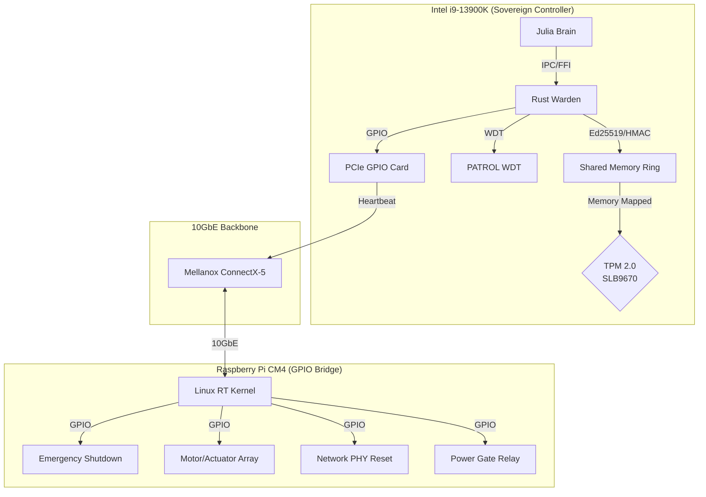
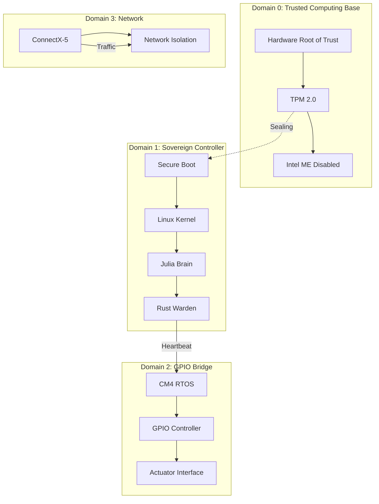
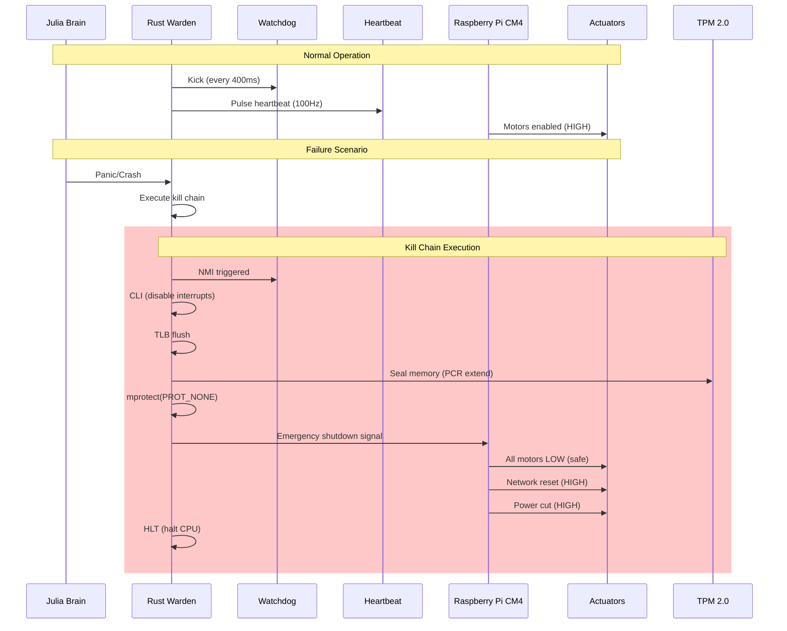
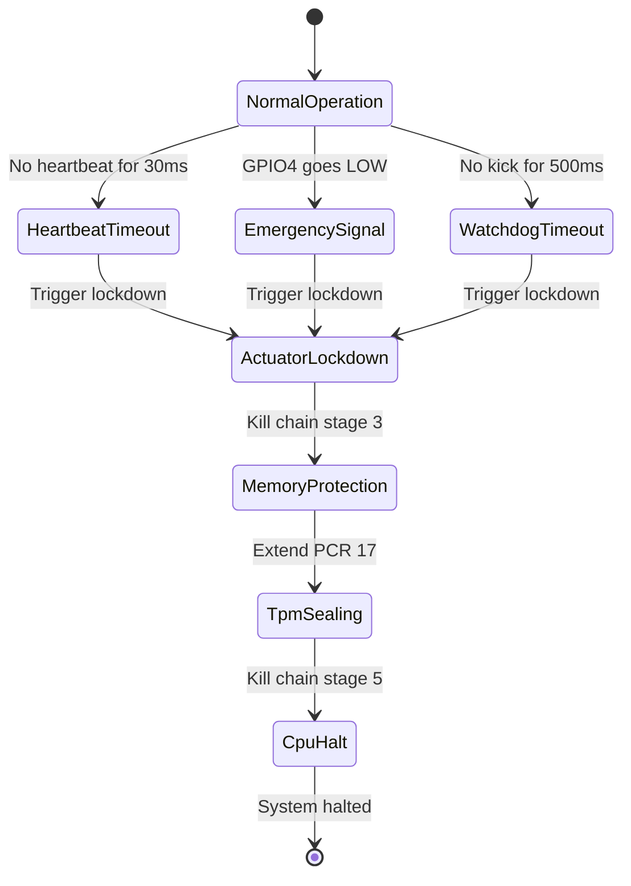

# Hardware Fail-Closed Architecture
## ITHERIS + JARVIS System - Master Documentation

> **Version**: 1.0  
> **Classification**: System Architecture Documentation  
> **Status**: Definitive Reference  
> **Target**: Intel i9-13900K (Sovereign Controller) + Raspberry Pi CM4 (GPIO Bridge) + Infineon SLB9670 TPM 2.0  

---

## Table of Contents

1. [Executive Summary](#1-executive-summary)
2. [System Architecture Overview](#2-system-architecture-overview)
3. [Component Documentation](#3-component-documentation)
4. [Integration Diagrams](#4-integration-diagrams)
5. [Configuration Reference](#5-configuration-reference)
6. [Deployment Guide](#6-deployment-guide)
7. [Testing and Verification](#7-testing-and-verification)
8. [Troubleshooting](#8-troubleshooting)
9. [Security Considerations](#9-security-considerations)
10. [Maintenance](#10-maintenance)

---

## 1. Executive Summary

### 1.1 What is the Fail-Closed Architecture?

The Hardware Fail-Closed Architecture is a comprehensive safety system designed for the ITHERIS + JARVIS cognitive system that ensures physical actuators are immediately and unconditionally disabled when the Julia brain experiences a failure, hang, or panic. Unlike fail-safe systems that may allow continued operation in a degraded state, fail-closed systems **immediately terminate** all output and place the system into a known safe state.

### 1.2 Why It's Critical for ITHERIS + JARVIS

The ITHERIS + JARVIS system combines autonomous cognitive capabilities with physical actuator control. Without fail-closed protection:

- A Julia brain crash could leave actuators in an uncontrolled state
- Memory corruption could cause unpredictable motor behavior
- Network compromise could enable external control of physical systems

The fail-closed architecture provides **hardware-enforced guarantees** that physical outputs are disabled within 500ms of any failure detection, regardless of software state.

### 1.3 Key Safety Guarantees

| Guarantee | Target | Mechanism |
|-----------|--------|-----------|
| Zero actuation on failure | ≤500ms | Hardware watchdog → NMI → Kill Chain |
| Memory protection | Immediate | EPT poisoning + mprotect(PROT_NONE) |
| Actuator lockout | ≤30ms | GPIO hardware lockdown |
| Network isolation | Immediate | PHY reset via GPIO |
| Power cutoff | ≤50ms | Relay control via GPIO |
| Recovery authorization | Human-only | TPM 2.0 sealed keys |

---

## 2. System Architecture Overview

### 2.1 Hardware Topology



### 2.2 Component Specifications

#### Intel i9-13900K (Sovereign Controller)

| Specification | Value |
|---------------|-------|
| Base Frequency | 3.0 GHz (P-cores) / 2.2 GHz (E-cores) |
| TDP | 125W (253W PL2) |
| PCIe Lanes | 20 (5.0) + 4 (4.0) |
| VT-x/VT-d | Enabled |
| SGX | Enabled (128MB EPC) |
| Management Engine | Disabled (BIOS) |

#### Raspberry Pi CM4 (GPIO Bridge)

| Specification | Value |
|---------------|-------|
| SoC | Broadcom BCM2711 (Cortex-A72) |
| CPU | 4× ARMv8-A @ 1.5 GHz |
| RAM | 2GB LPDDR4 (expandable) |
| GPIO Pins | 40-pin header |
| Networking | Gigabit Ethernet |
| Storage | 32GB eMMC |
| OS | Linux RT (PREEMPT_RT) |

#### TPM 2.0 (Infineon SLB9670)

| Specification | Value |
|---------------|-------|
| Interface | SPI (8MHz max) |
| NV Storage | 128KB |
| PCR Banks | SHA-256 (24 banks) |
| Algorithms | RSA-2048, ECC P-256, SHA-256 |
| Certifications | FIPS 140-2 Level 2 |

#### Mellanox ConnectX-5 (10GbE Backbone)

| Specification | Value |
|---------------|-------|
| Ports | 2× SFP+ |
| Bandwidth | 10GbE per port |
| Latency | 600ns (switching) |
| PCIe | 3.0 x8 |
| RoCE | v2 |

### 2.3 Security Domains



### 2.4 GPIO Pin Mapping

All GPIO references use **BCM numbering** (Broadcom SOC channel).

| Pin # | BCM | Signal Name | Direction | Default State | Function |
|-------|-----|--------------|-----------|---------------|----------|
| 7 | GPIO4 | **EMERGENCY_SHUTDOWN** | **IN** | **HIGH (pull-up)** | i9→CM4 panic signal |
| 8 | GPIO14 | **NETWORK_PHY_RESET** | **OUT** | **LOW** | PHY hardware reset |
| 10 | GPIO15 | **POWER_GATE_RELAY** | **OUT** | **LOW** | External power control |
| 11 | GPIO17 | ACTUATOR_01 | OUT | **LOW** | Motor ctrl 1 |
| 12 | GPIO18 | ACTUATOR_02 | OUT | **LOW** | Motor ctrl 2 |
| 13 | GPIO27 | ACTUATOR_03 | OUT | **LOW** | Motor ctrl 3 |
| 15 | GPIO22 | ACTUATOR_04 | OUT | **LOW** | Motor ctrl 4 |
| 16 | GPIO23 | ACTUATOR_05 | OUT | **LOW** | Motor ctrl 5 |
| 18 | GPIO24 | ACTUATOR_06 | OUT | **LOW** | Motor ctrl 6 |
| 22 | GPIO25 | ACTUATOR_07 | OUT | **LOW** | Motor ctrl 7 |
| 29 | GPIO5 | **HEARTBEAT_IN** | **IN** | **LOW** | CM4→i9 heartbeat |
| 31 | GPIO6 | **HEARTBEAT_OUT** | **OUT** | **LOW** | i9→CM4 heartbeat |
| 32 | GPIO12 | ACTUATOR_08 | OUT | **LOW** | Motor ctrl 8 |
| 37 | GPIO26 | **GPIO_STATUS_LED** | OUT | LOW | Status indicator |

---

## 3. Component Documentation

### 3.1 Hardware Watchdog (Rust)

**Module**: [`itheris-daemon/src/hardware/watchdog.rs`](itheris-daemon/src/hardware/watchdog.rs)

#### Purpose and Functionality

The Hardware Watchdog provides the primary failure detection mechanism. It monitors system health and triggers the kill chain if the Julia brain fails to respond within the timeout period.

#### Configuration Parameters

| Parameter | Default | Description |
|-----------|---------|-------------|
| `WATCHDOG_DEVICE` | `/dev/watchdog` | Linux watchdog device path |
| `DEFAULT_TIMEOUT_SECS` | 1 | Timeout in seconds (500ms rounded to 1s) |
| Kick interval | 400ms | Must kick before timeout |

#### Key Functions

```rust
// Initialize watchdog with 500ms timeout
pub fn init_watchdog() -> Result<(), WatchdogError>

// Kick the watchdog timer (must be called every 500ms)
pub fn kick_watchdog()

// Get current watchdog status
pub fn get_watchdog_status() -> WatchdogStatus

// Check if hardware watchdog is available
pub fn is_watchdog_available() -> bool
```

#### Integration Points

- **Intel PATROL WDT**: Configured via MSR registers (0x123B, 0x123C)
- **Main Loop**: Called every 400ms in [`hardware_kick_watchdog()`](itheris-daemon/src/hardware/mod.rs:158)
- **NMI Handler**: Triggered on timeout → executes kill chain

---

### 3.2 Heartbeat Generator (Rust)

**Module**: [`itheris-daemon/src/hardware/heartbeat.rs`](itheris-daemon/src/hardware/heartbeat.rs)

#### Purpose and Functionality

The Heartbeat Generator creates a continuous 100Hz square wave signal on GPIO6 that the Raspberry Pi CM4 monitors to verify the Intel i9-13900K is still operational.

#### Timing Specifications

| Parameter | Value |
|-----------|-------|
| Frequency | 100Hz (10ms period) |
| Voltage | 3.3V |
| Duty Cycle | 50% |
| GPIO Pin | BCM 6 (Pin 31) |

#### Key Functions

```rust
// Initialize heartbeat subsystem
pub fn init_heartbeat() -> Result<HeartbeatConfig, HeartbeatError>

// Start heartbeat generation
pub fn start_heartbeat() -> Result<(), HeartbeatError>

// Stop heartbeat generation
pub fn stop_heartbeat()

// Get heartbeat state
pub fn get_heartbeat_state() -> HeartbeatState

// Check if heartbeat is running
pub fn is_heartbeat_running() -> bool
```

#### GPIO Pin Assignments

| Signal | BCM Pin | Direction | Default |
|--------|---------|-----------|---------|
| HEARTBEAT_OUT | GPIO6 | OUT | LOW |

---

### 3.3 Kill Chain Handler (Rust)

**Module**: [`itheris-daemon/src/hardware/kill_chain.rs`](itheris-daemon/src/hardware/kill_chain.rs)

#### Purpose and Functionality

The Kill Chain is the emergency shutdown sequence that executes when a panic or watchdog timeout occurs. It performs a 5-stage shutdown within 120 CPU cycles.

#### 5-Stage Execution Sequence

| Stage | Cycles | Operation | Description |
|-------|--------|-----------|-------------|
| 1 | 1-2 | CLI | Clear all maskable interrupts |
| 2 | 3-10 | TLB Flush | Invalidate TLB via CR3 reload |
| 3 | 11-50 | EPT Poisoning | Revoke Julia Brain memory permissions |
| 4 | 51-80 | GPIO Lockdown | Signal CM4 to set actuators to LOW |
| 5 | 81-120 | HLT | Execute permanent CPU halt |

#### Key Functions

```rust
// Execute the kill chain (unsafe - halts CPU)
pub unsafe fn execute_kill_chain()

// Spawn kill chain in separate thread
pub fn spawn_kill_chain_thread()

// Check if kill chain was triggered
pub fn is_kill_chain_triggered() -> bool
```

#### Integration with Panic Handler

The kill chain is triggered by:
1. **Watchdog timeout** → NMI handler → Kill chain
2. **Rust panic** → Panic hook → Kill chain
3. **Signal (SIGSEGV/SIGBUS/SIGFPE)** → Signal handler → Kill chain

---

### 3.4 Panic Handler (Rust)

**Module**: [`itheris-daemon/src/hardware/panic_handler.rs`](itheris-daemon/src/hardware/panic_handler.rs)

#### Purpose and Functionality

Registers handlers for panics and critical signals, logs crash information, and triggers the kill chain.

#### Key Functions

```rust
// Register panic handler and signal handlers
pub fn register_panic_handler() -> Result<(), String>

// Write crash dump to persistent storage
pub fn write_crash_dump(crash_info: &CrashInfo) -> Option<PathBuf>

// Get list of recent crash dumps
pub fn get_recent_crashes() -> Vec<PathBuf>
```

#### Crash Information Captured

- Timestamp (ISO 8601)
- Crash type (panic, SIGSEGV, SIGBUS, SIGFPE)
- Panic message and location
- Process ID
- Memory statistics

---

### 3.5 Memory Protector (Rust)

**Module**: [`itheris-daemon/src/hardware/memory_protector.rs`](itheris-daemon/src/hardware/memory_protector.rs)

#### Purpose and Functionality

Scans memory regions from `/proc/self/maps` and `/proc/<pid>/maps`, then applies `mprotect(PROT_NONE)` to prevent any further memory access.

#### Key Functions

```rust
// Scan current process memory regions
pub fn scan_current_process_maps() -> Result<Vec<MemoryRegion>, MemoryProtectionError>

// Scan Julia process memory regions
pub fn scan_process_maps(pid: u32) -> Result<Vec<MemoryRegion>, MemoryProtectionError>

// Protect all Julia memory regions
pub fn protect_all_julia_memory()

// Protect current process memory
pub fn protect_current_process_memory()
```

---

### 3.6 Emergency GPIO (Rust)

**Module**: [`itheris-daemon/src/hardware/emergency_gpio.rs`](itheris-daemon/src/hardware/emergency_gpio.rs)

#### Purpose and Functionality

Direct GPIO control for emergency shutdown, providing a fallback mechanism independent of the heartbeat system.

#### Key Functions

```rust
// Initialize emergency GPIO pins
pub fn init_emergency_gpio() -> Result<EmergencyState, EmergencyGpioError>

// Trigger emergency shutdown signal
pub fn trigger_emergency_shutdown()

// Lockdown all actuators
pub fn lockdown_actuators()

// Cut power relay
pub fn cut_power_relay()

// Reset network PHY
pub fn reset_network_phy()

// Verify physical lockdown
pub fn verify_lockdown() -> bool
```

---

### 3.7 GPIO Bridge (Python)

**Module**: [`gpio-bridge/main.py`](gpio-bridge/main.py)

The Raspberry Pi CM4 runs the GPIO Bridge application that monitors heartbeat, handles emergency signals, and controls actuators.

#### Heartbeat Monitor (Python)

**Module**: [`gpio-bridge/heartbeat_monitor.py`](gpio-bridge/heartbeat_monitor.py)

| Parameter | Value |
|-----------|-------|
| GPIO Pin | BCM 6 (input) |
| Timeout | 30ms (3 missed heartbeats) |
| Frequency | 100Hz |
| Polling | 1kHz (1ms interval) |

#### Actuator Controller (Python)

**Module**: [`gpio-bridge/actuator_controller.py`](gpio-bridge/actuator_controller.py)

Controls all actuator pins with fail-safe defaults:
- **Motor pins**: 17, 18, 22, 23, 24, 25, 26, 27
- **Network reset**: GPIO14 (HIGH = reset)
- **Power gate**: GPIO15 (HIGH = cut power)

#### Emergency Handler (Python)

**Module**: [`gpio-bridge/emergency_handler.py`](gpio-bridge/emergency_handler.py)

Monitors GPIO4 for emergency shutdown signal:
- **Signal type**: Active-low (LOW = panic)
- **Pull**: Internal pull-up
- **Debounce**: 10ms

---

### 3.8 TPM 2.0 Memory Sealing

**Module**: [`plans/TPM2_MEMORY_SEALING_SPECIFICATION.md`](plans/TPM2_MEMORY_SEALING_SPECIFICATION.md)

#### PCR Configuration

| PCR Index | Name | Purpose |
|-----------|------|---------|
| 17 | MemorySeal | Memory sealing events |
| 18 | MemorySeal_State | Sealed state hash |
| 0, 1, 7, 14 | Chain-of-Custody | Boot measurements |

#### Key Functions

```rust
// Extend PCR with new measurement
pub fn extend_pcr(context: &TpmContext, pcr_index: u8, data: &[u8]) -> Result<(), TpmError>

// Read PCR value
pub fn read_pcr(context: &TpmContext, pcr_index: u8) -> Result<PcrValue, TpmError>

// Create TPM quote for attestation
pub fn create_quote(context: &TpmContext, signing_key_handle: ESYS_TR, ...) -> Result<TpmQuote, TpmError>
```

---

## 4. Integration Diagrams

### 4.1 Data Flow Diagram



### 4.2 State Diagram for Fail-Closed Events



---

## 5. Configuration Reference

### 5.1 GPIO Bridge Configuration

**File**: [`gpio-bridge/config.yaml`](gpio-bridge/config.yaml)

```yaml
heartbeat:
  pin: 6              # BCM GPIO pin
  timeout_ms: 30      # 30ms timeout
  frequency_hz: 100   # 100Hz heartbeat

emergency:
  pin: 4             # Emergency shutdown pin

actuators:
  motors: [17, 18, 22, 23, 24, 25, 26, 27]
  network_reset: 14   # PHY reset pin
  power_gate: 15      # Power relay pin

comms:
  type: serial        # or tcp
  port: /dev/ttyS0
  baud: 115200
  tcp_port: 9000

logging:
  level: INFO
  syslog: true
  file: /var/log/gpio-bridge.log
```

### 5.2 Hardware Module Configuration (Rust)

**File**: [`itheris-daemon/src/hardware/mod.rs`](itheris-daemon/src/hardware/mod.rs)

```rust
pub struct HardwareConfig {
    pub watchdog_timeout_secs: u32,    // Default: 1 (500ms)
    pub heartbeat_pin: u32,            // Default: 6
    pub heartbeat_frequency_hz: f64,   // Default: 100.0
    pub heartbeat_duty_cycle: f64,      // Default: 0.5
}
```

### 5.3 Default Values Summary

| Component | Parameter | Default | Unit |
|-----------|-----------|---------|------|
| Watchdog | Timeout | 500 | ms |
| Watchdog | Kick interval | 400 | ms |
| Heartbeat | Frequency | 100 | Hz |
| Heartbeat | Duty cycle | 50 | % |
| Heartbeat | Voltage | 3.3 | V |
| CM4 Monitor | Timeout | 30 | ms |
| Kill Chain | Max cycles | 120 | cycles |
| Actuators | Default state | LOW | - |
| Power relay | Default state | LOW (enabled) | - |
| Network PHY | Default state | LOW (enabled) | - |

---

## 6. Deployment Guide

### 6.1 Hardware Setup Requirements

#### Intel i9-13900K System
1. BIOS configuration:
   - VT-x/VT-d: Enabled
   - SGX: Enabled
   - Intel ME: Disabled
   - Secure Boot: Enabled

2. TPM 2.0 installation:
   - Infineon SLB9670 on SPI bus
   - Device: `/dev/tpm0` or `/dev/tpmrm0`

3. PCIe GPIO Card installation

#### Raspberry Pi CM4 Setup
1. Install Raspberry Pi OS (RT PREEMPT_RT kernel recommended)
2. Configure 40-pin GPIO header
3. Connect to Intel system via:
   - Ethernet (10GbE recommended)
   - Serial (optional, for debugging)

#### Wiring Connections

| Signal | i9 System | CM4 Pin | CM4 Pin |
|--------|-----------|---------|---------|
| Heartbeat | GPIO6 | Pin 31 | GPIO6 (IN) |
| Emergency | GPIO4 | Pin 7 | GPIO4 (IN) |
| Network Reset | GPIO14 | Pin 8 | GPIO14 (OUT) |
| Power Gate | GPIO15 | Pin 10 | GPIO15 (OUT) |
| Actuators 1-8 | Various | 11,12,15,16,18,22,32,33 | GPIO 17,18,22,23,24,25,12,13 |

### 6.2 Software Installation Steps

#### 1. Install Rust Warden (Intel i9)

```bash
cd /path/to/itheris-daemon
cargo build --release
sudo cp target/release/itheris-daemon /usr/local/bin/
sudo cp itheris-daemon.service /etc/systemd/system/
sudo systemctl daemon-reload
sudo systemctl enable itheris-daemon
```

#### 2. Install GPIO Bridge (Raspberry Pi CM4)

```bash
cd /path/to/gpio-bridge
pip3 install -r requirements.txt
sudo cp gpio-bridge.service /etc/systemd/system/
sudo systemctl daemon-reload
sudo systemctl enable gpio-bridge
```

#### 3. Initialize GPIO

```bash
# On CM4
sudo ./setup.sh
```

### 6.3 Systemd Service Configuration

#### Itheris Daemon Service

**File**: [`itheris-daemon.service`](itheris-daemon.service)

```ini
[Unit]
Description=ITHERIS Rust Warden - Hardware Fail-Closed Controller
After=network.target

[Service]
Type=simple
User=root
ExecStart=/usr/local/bin/itheris-daemon
Restart=on-failure
RestartSec=5

[Install]
WantedBy=multi-user.target
```

#### GPIO Bridge Service

**File**: [`gpio-bridge/gpio-bridge.service`](gpio-bridge/gpio-bridge.service)

```ini
[Unit]
Description=GPIO Bridge - Raspberry Pi CM4 Hardware Controller
After=network.target

[Service]
Type=simple
User=root
WorkingDirectory=/path/to/gpio-bridge
ExecStart=/usr/bin/python3 main.py
Restart=always
RestartSec=5

[Install]
WantedBy=multi-user.target
```

---

## 7. Testing and Verification

### 7.1 Test Requirements Summary

From [`plans/FAIL_CLOSED_TEST_SPECIFICATION.md`](plans/FAIL_CLOSED_TEST_SPECIFICATION.md):

| Category | Tests | Description |
|----------|-------|-------------|
| FC-HW | 6 | Hardware watchdog tests |
| FC-HB | 5 | Heartbeat signal tests |
| FC-KC | 7 | Kill chain execution tests |
| FC-GPIO | 8 | GPIO bridge tests |
| FC-TPM | 9 | TPM 2.0 sealing tests |
| FC-INT | 1 | Full integration test |

### 7.2 Key Verification Points

1. **Watchdog Detection**
   - Verify `/dev/watchdog` exists
   - Confirm timeout is set to 1 second
   - Test kick mechanism

2. **Heartbeat Generation**
   - Measure frequency: 100Hz ±5Hz
   - Verify voltage: 3.3V HIGH, 0V LOW
   - Confirm duty cycle: 50% ±5%

3. **GPIO Lockdown**
   - All actuator pins go LOW on lockdown
   - Network PHY reset activates
   - Power gate relay engages

4. **TPM Sealing**
   - PCR 17 extends on fail-closed
   - Memory can be sealed/unsealed
   - Chain-of-custody verified

### 7.3 How to Verify the System Works

#### Manual Verification Steps

```bash
# 1. Check watchdog device
ls -la /dev/watchdog

# 2. Check TPM device
ls -la /dev/tpm*

# 3. Check GPIO sysfs
ls /sys/class/gpio/

# 4. Start services
sudo systemctl start itheris-daemon
sudo systemctl start gpio-bridge

# 5. Check service status
sudo systemctl status itheris-daemon
sudo systemctl status gpio-bridge

# 6. View logs
journalctl -u itheris-daemon -f
journalctl -u gpio-bridge -f

# 7. Trigger test lockdown (from i9)
# Send LOCKDOWN command via serial/TCP to CM4

# 8. Verify actuator states
# All motors should be LOW, network reset HIGH, power gate HIGH
```

---

## 8. Troubleshooting

### 8.1 Common Issues and Solutions

| Issue | Cause | Solution |
|-------|-------|----------|
| Watchdog not available | Running in container | Ensure `--privileged` or `--device=/dev/watchdog` |
| GPIO permission denied | Not running as root | Run with sudo or add user to gpiobeat not group |
| Heart detected | Wrong GPIO pin | Verify wiring and BCM numbering |
| TPM not found | TPM not enabled in BIOS | Enable TPM in BIOS settings |
| Lockdown not triggering | Watchdog timeout too long | Reduce to 500ms |

### 8.2 Diagnostic Commands

```bash
# Check watchdog status
cat /sys/class/watchdog/watchdog0/status

# Check GPIO values
cat /sys/class/gpio/gpio6/value  # Heartbeat
cat /sys/class/gpio/gpio4/value  # Emergency
cat /sys/class/gpio/gpio15/value # Power gate

# Check TPM status
tpm2_getcap -l

# View kernel messages
dmesg | grep -i watchdog
dmesg | grep -i gpio
dmesg | grep -i tpm

# Test GPIO manually
echo "6" > /sys/class/gpio/export
echo "out" > /sys/class/gpio/gpio6/direction
echo "1" > /sys/class/gpio/gpio6/value
```

### 8.3 Recovery Procedures

#### After Fail-Closed Event

1. **Hardware Reset**
   - Press physical reset button on CM4
   - Power cycle the system

2. **Software Recovery**
   - Clear watchdog: `echo V > /dev/watchdog`
   - Reset GPIO states via Python script
   - Restart services

3. **TPM Recovery**
   - Requires physical HSM access
   - Follow recovery ceremony in [`TPM2_MEMORY_SEALING_SPECIFICATION.md`](plans/TPM2_MEMORY_SEALING_SPECIFICATION.md)

---

## 9. Security Considerations

### 9.1 Threat Model

| Threat | Mitigation |
|--------|------------|
| Julia brain compromise | Memory protection + TPM sealing |
| Watchdog bypass | Hardware-enforced timeout |
| GPIO spoofing | Hardware-level control |
| Network attack | PHY reset on lockdown |
| Power manipulation | Hardware relay control |

### 9.2 Attack Surface Analysis

- **Software attack surface**: Julia Brain, Rust Warden, GPIO Bridge
- **Hardware attack surface**: GPIO pins, TPM, watchdog
- **Network attack surface**: 10GbE backbone (isolated on lockdown)

### 9.3 Defense Mechanisms

1. **Memory Protection**: mprotect(PROT_NONE) on all memory regions
2. **Interrupt Disabling**: CLI instruction before any other action
3. **TLB Invalidation**: CR3 reload prevents cached translations
4. **TPM Sealing**: PCR-bound encryption prevents tampering
5. **Physical Isolation**: Network/Power cutoff on fail-closed

---

## 10. Maintenance

### 10.1 Routine Maintenance Tasks

| Task | Frequency | Notes |
|------|-----------|-------|
| Log review | Daily | Check for warnings/errors |
| Service status | Daily | Verify running state |
| Hardware inspection | Weekly | Check wiring, connections |
| TPM health | Monthly | Verify TPM operations |
| Firmware updates | Quarterly | Update as needed |

### 10.2 Firmware Updates

1. **Intel ME**: Update via BIOS/firmware tool
2. **TPM Firmware**: Update via Infineon tool
3. **CM4 bootloader**: Update via Raspberry Pi imager
4. **Linux kernel**: Update via package manager

### 10.3 Key Rotation Procedures

#### TPM Key Rotation

```bash
# 1. Export current keys (if unsealed)
tpm2_evictcontrol -c 0x81000001

# 2. Generate new keys
tpm2_create -C primary.ctx -u newkey.pub -r newkey.priv

# 3. Seal new keys
tpm2_create -C primary.ctx -i sealed_data.bin -u sealedkey.pub -r sealedkey.priv

# 4. Store sealed keys
tpm2_evictcontrol -c sealedkey.pub 0x81000002
```

---

## Appendix: Related Documentation

| Document | Path |
|----------|------|
| Hardware Specification | [`plans/HARDWARE_FAIL_CLOSED_SPECIFICATION.md`](plans/HARDWARE_FAIL_CLOSED_SPECIFICATION.md) |
| TPM Sealing Specification | [`plans/TPM2_MEMORY_SEALING_SPECIFICATION.md`](plans/TPM2_MEMORY_SEALING_SPECIFICATION.md) |
| Test Specification | [`plans/FAIL_CLOSED_TEST_SPECIFICATION.md`](plans/FAIL_CLOSED_TEST_SPECIFICATION.md) |
| Rust Hardware Module | [`itheris-daemon/src/hardware/`](itheris-daemon/src/hardware/) |
| Python GPIO Bridge | [`gpio-bridge/`](gpio-bridge/) |
| ITHERIS Documentation | [`ITHERIS_DOCUMENTATION.md`](ITHERIS_DOCUMENTATION.md) |

---

*This document serves as the definitive reference for the Hardware Fail-Closed Architecture. For questions or clarifications, consult the source specifications or the system architecture team.*
