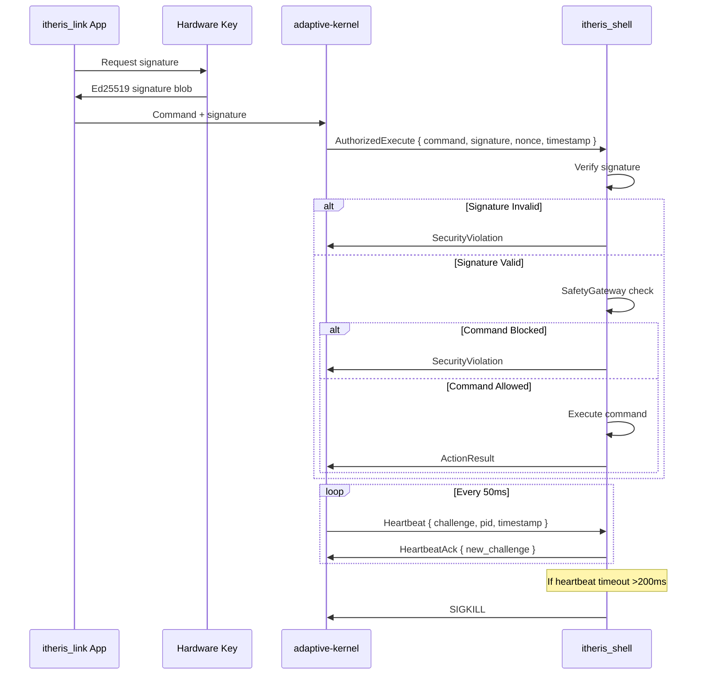
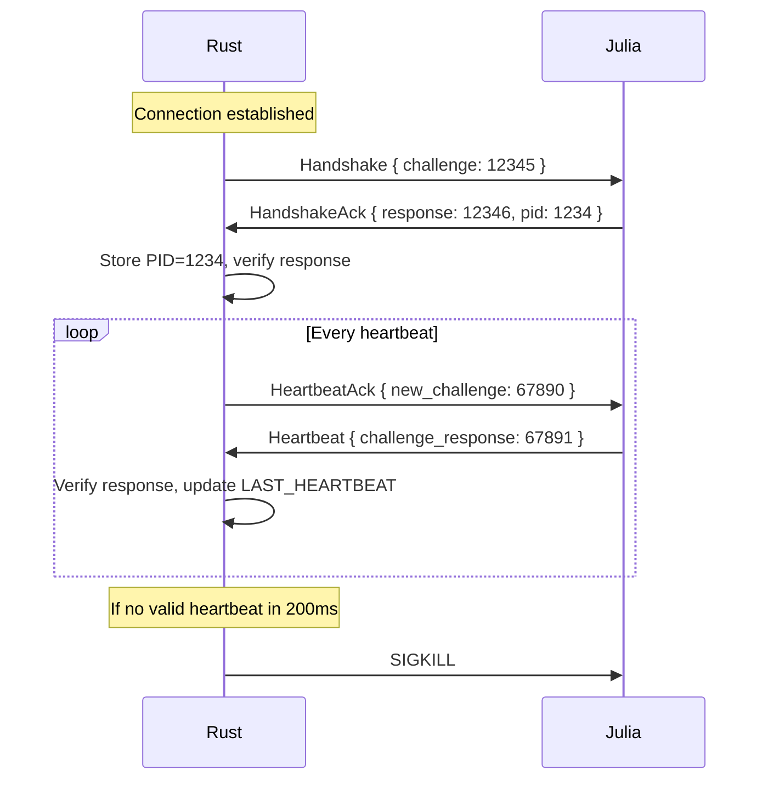
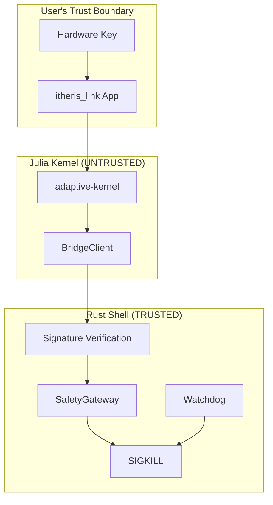

# HCB Protocol Design Document
## Hard-Coded Butler Security Implementation

**Version:** 1.0  
**Status:** Architecture Specification  
**Date:** 2026-02-19  

---

## Table of Contents

1. [Executive Summary](#1-executive-summary)
2. [System Architecture](#2-system-architecture)
3. [Pillar 1: Cryptographic Command Verification](#3-pillar-1-cryptographic-command-verification)
4. [Pillar 2: Active Watchdog with SIGKILL](#4-pillar-2-active-watchdog-with-sigkill)
5. [Pillar 3: Shell-Level Firewall (SafetyGateway)](#5-pillar-3-shell-level-firewall-safetygateway)
6. [New IPC Message Types](#6-new-ipc-message-types)
7. [Julia BridgeClient Changes](#7-julia-bridgeclient-changes)
8. [Threat Model](#8-threat-model)
9. [Implementation Checklist](#9-implementation-checklist)

---

## 1. Executive Summary

The Hard-Coded Butler (HCB) Protocol addresses critical security vulnerabilities identified in the JARVIS security audit. The current implementation suffers from a fundamental flaw: the Julia kernel can self-report `owner_explicit=true` to bypass all risk assessment controls.

### Current Vulnerabilities

| Vulnerability | Severity | Impact |
|--------------|----------|--------|
| `owner_explicit` self-reporting | CRITICAL | Full system bypass |
| No cryptographic signatures | CRITICAL | No proof of human authorization |
| Passive kill switch | CRITICAL | Cannot detect Julia hangs |
| No command filtering | HIGH | Malicious commands execute |

### HCB Security Guarantees

1. **Cryptographic Verification**: All commands must carry Ed25519 signatures verifiable by Rust using a compile-time embedded public key
2. **Active Watchdog**: Rust actively monitors Julia health via heartbeat + challenge-response, issuing SIGKILL if unresponsive for >200ms
3. **Static Firewall**: Compile-time constant blacklist/whitelist cannot be modified at runtime

---

## 2. System Architecture

### High-Level Data Flow



### Component Overview

| Component | Location | Responsibility |
|-----------|----------|----------------|
| `AuthorizedCommand` | Rust types | Signed command wrapper |
| `VerifiedMessage` | Rust IPC | Enum for signed messages |
| `HeartbeatMonitor` | Rust main | Watchdog task |
| `SafetyGateway` | Rust types | Static command firewall |
| `BridgeClient` | Julia bridge | Signature pass-through |

---

## 3. Pillar 1: Cryptographic Command Verification

### 3.1 AuthorizedCommand Struct

```rust
/// Cryptographically signed command for execution.
/// 
/// Julia cannot forge signatures - they must come from the user's
/// hardware security key (itheris_link Flutter app).
#[derive(Debug, Clone, Serialize, Deserialize)]
pub struct AuthorizedCommand {
    /// The serialized command bytes (Action payload)
    pub command_payload: Vec<u8>,
    
    /// Ed25519 signature over command_payload + nonce + timestamp
    pub signature: [u8; 64],
    
    /// Ed25519 public key (32 bytes)
    pub public_key: [u8; 32],
    
    /// Nonce for replay attack prevention
    pub nonce: u64,
    
    /// Unix timestamp for freshness check (must be within 5 seconds)
    pub timestamp: i64,
}
```

### 3.2 VerifiedMessage Enum

```rust
/// IPC messages that require cryptographic authorization.
/// 
/// Non-authorized messages (Ping, Pong) bypass verification.
#[derive(Debug, Clone, Serialize, Deserialize)]
#[serde(tag = "type", content = "payload")]
pub enum VerifiedMessage {
    /// Signed command execution request
    AuthorizedExecute {
        authorized_command: AuthorizedCommand,
    },
    
    /// Security violation report
    SecurityViolation {
        violation_type: String,
        details: String,
        timestamp: i64,
    },
}
```

### 3.3 Signature Verification

```rust
use ed25519_dalek::{Signature, Signer, Verifier, VerifyingKey};
use std::sync::Arc;

/// Compile-time embedded public key (user's hardware key)
const EMBEDDED_PUBLIC_KEY: &[u8; 32] = &[
    0x9d, 0x61, 0xb1, 0x9e, 0x5c, 0x41, 0x8e, 0x4a,
    0x19, 0x5d, 0xe8, 0x2c, 0x41, 0x47, 0x13, 0x1e,
    0xcf, 0x98, 0x8d, 0x6c, 0xaa, 0x31, 0x7f, 0x7d,
    0x83, 0x57, 0x46, 0x60, 0x7d, 0x1b, 0x29, 0x93,
];

/// Verify an authorized command.
/// 
/// Returns Ok(()) if:
/// - Signature is valid
/// - Nonce has not been used in last 1000 commands
/// - Timestamp is within 5 seconds of current time
pub fn verify_command(
    cmd: &AuthorizedCommand,
    nonce_tracker: &NonceTracker,
) -> Result<(), SignatureError> {
    // 1. Check timestamp freshness (5 second window)
    let now = std::time::SystemTime::now()
        .duration_since(std::time::UNIX_EPOCH)
        .unwrap()
        .as_secs() as i64;
    
    let time_diff = (now - cmd.timestamp).abs();
    if time_diff > 5 {
        return Err(SignatureError::TimestampOutOfRange {
            expected: now,
            got: cmd.timestamp,
        });
    }
    
    // 2. Check nonce for replay protection
    if !nonce_tracker.check_and_insert(cmd.nonce) {
        return Err(SignatureError::ReplayAttack {
            nonce: cmd.nonce,
        });
    }
    
    // 3. Verify signature
    let verifying_key = VerifyingKey::from_bytes(
        &EMBEDDED_PUBLIC_KEY.try_into().unwrap()
    ).map_err(|_| SignatureError::InvalidPublicKey)?;
    
    let signature = Signature::from_slice(&cmd.signature)
        .map_err(|_| SignatureError::InvalidSignatureFormat)?;
    
    // Construct signed data: payload || nonce || timestamp
    let mut signed_data = Vec::with_capacity(
        cmd.command_payload.len() + 8 + 8
    );
    signed_data.extend_from_slice(&cmd.command_payload);
    signed_data.extend_from_slice(&cmd.nonce.to_le_bytes());
    signed_data.extend_from_slice(&cmd.timestamp.to_le_bytes());
    
    verifying_key.verify(&signed_data, &signature)
        .map_err(|_| SignatureError::SignatureMismatch)
}
```

### 3.4 Nonce Tracker

```rust
/// Thread-safe nonce tracker with sliding window.
/// 
/// Stores last 1000 nonces to prevent replay attacks.
/// Uses a simple HashSet for O(1) lookup.
use std::sync::Arc;
use tokio::sync::RwLock;
use std::collections::HashSet;

const MAX_NONCE_HISTORY: usize = 1000;

pub struct NonceTracker {
    /// Set of used nonces
    nonces: Arc<RwLock<HashSet<u64>>>,
    /// Circular buffer for ordered cleanup
    nonce_list: Arc<RwLock<Vec<u64>>>,
}

impl NonceTracker {
    pub fn new() -> Self {
        Self {
            nonces: Arc::new(RwLock::new(HashSet::new())),
            nonce_list: Arc::new(RwLock::new(Vec::with_capacity(MAX_NONCE_HISTORY))),
        }
    }
    
    /// Check if nonce is valid and insert if so.
    /// Returns false if nonce was already used.
    pub async fn check_and_insert(&self, nonce: u64) -> bool {
        let mut nonces = self.nonces.write().await;
        
        if nonces.contains(&nonce) {
            return false;
        }
        
        nonces.insert(nonce);
        
        // Maintain sliding window
        let mut list = self.nonce_list.write().await;
        list.push(nonce);
        
        if list.len() > MAX_NONCE_HISTORY {
            if let Some(old) = list.first().cloned() {
                nonces.remove(&old);
                list.remove(0);
            }
        }
        
        true
    }
}
```

### 3.5 Cargo.toml Additions

```toml
[dependencies]
# Existing dependencies...
ed25519-dalek = { version = "2", features = ["std"] }
nix = { version = "0.27", features = ["signal", "process"] }
rand = "0.8"
```

---

## 4. Pillar 2: Active Watchdog with SIGKILL

### 4.1 Heartbeat State

```rust
use std::sync::atomic::{AtomicI64, AtomicI32, Ordering};

/// Last heartbeat timestamp in milliseconds (Unix epoch)
pub static LAST_HEARTBEAT: AtomicI64 = AtomicI64::new(0);

/// Julia process ID (set during handshake)
pub static JULIA_PID: AtomicI32 = AtomicI32::new(0);

/// Current challenge for heartbeat response
pub static CURRENT_CHALLENGE: AtomicI64 = AtomicI64::new(0);

/// Expected response to current challenge
pub static EXPECTED_RESPONSE: AtomicI64 = AtomicI64::new(0);
```

### 4.2 Watchdog Implementation

```rust
use nix::sys::signal::{kill, Signal};
use nix::unistd::Pid;
use rand::Rng;

/// Configuration constants
const HEARTBEAT_CHECK_INTERVAL_MS: u64 = 50;
const HEARTBEAT_TIMEOUT_MS: i64 = 200;

/// Start the heartbeat monitoring task.
/// 
/// Runs as a background tokio task checking every 50ms.
/// If Julia fails to respond within 200ms, issues SIGKILL.
pub async fn start_heartbeat_watchdog() {
    let mut interval = tokio::time::interval(
        std::time::Duration::from_millis(HEARTBEAT_CHECK_INTERVAL_MS)
    );
    
    loop {
        interval.tick().await;
        
        let now = std::time::SystemTime::now()
            .duration_since(std::time::UNIX_EPOCH)
            .unwrap()
            .as_millis() as i64;
        
        let last_heartbeat = LAST_HEARTBEAT.load(Ordering::Relaxed);
        
        // No heartbeat received yet
        if last_heartbeat == 0 {
            continue;
        }
        
        let elapsed = now - last_heartbeat;
        
        if elapsed > HEARTBEAT_TIMEOUT_MS {
            // Heartbeat timeout - kill Julia
            let pid = JULIA_PID.load(Ordering::Relaxed);
            
            if pid > 0 {
                error!(
                    "Heartbeat timeout: {}ms > {}ms - killing Julia PID {}",
                    elapsed, HEARTBEAT_TIMEOUT_MS, pid
                );
                
                let pid = Pid::from_raw(pid);
                if let Err(e) = kill(pid, Signal::SIGKILL) {
                    error!("Failed to send SIGKILL: {}", e);
                }
            }
        }
    }
}

/// Generate a new random challenge.
pub fn generate_challenge() -> u64 {
    let mut rng = rand::thread_rng();
    rng.gen()
}

/// Set up a new challenge-response pair.
pub fn setup_challenge() -> (u64, u64) {
    let challenge = generate_challenge();
    // Response is challenge + 1 (simple check)
    let response = challenge.wrapping_add(1);
    
    CURRENT_CHALLENGE.store(challenge as i64, Ordering::Relaxed);
    EXPECTED_RESPONSE.store(response as i64, Ordering::Relaxed);
    
    (challenge, response)
}

/// Verify heartbeat response.
pub fn verify_response(response: u64) -> bool {
    let expected = EXPECTED_RESPONSE.load(Ordering::Relaxed) as u64;
    response == expected
}
```

### 4.3 Challenge-Response Handshake



---

## 5. Pillar 3: Shell-Level Firewall (SafetyGateway)

### 5.1 Static Blacklist

```rust
/// Compile-time constant blacklist of forbidden command patterns.
/// 
/// This is a ZERO-ALLOCATION static struct - cannot be modified at runtime.
pub struct SafetyGateway;

impl SafetyGateway {
    /// Blacklisted command patterns (case-insensitive matching).
    /// 
    /// These patterns represent commands that could cause catastrophic
    /// damage to the system and are NEVER allowed regardless of signature.
    const BLACKLIST_PATTERNS: &'static [&'static str] = &[
        // Recursive force delete
        "rm -rf /",
        "rm -rf /*", 
        "rm -rf .",
        // Filesystem destruction
        "mkfs",
        "dd if=",
        // Dangerous permissions
        "chmod 777",
        "chmod +s",
        // Pipe to shell execution
        "curl | sh",
        "wget | sh",
        "curl | bash",
        "wget | bash",
        // Dynamic code execution
        "eval ",
        "exec ",
        // Target critical files
        "/etc/passwd",
        "/etc/shadow",
        "/boot/",
        // Network exfiltration
        "nc -e ",
        "/dev/tcp",
        // Process injection
        "/proc/self/exe",
    ];
    
    /// Whitelisted binary paths.
    /// 
    /// Only commands from these paths can be executed.
    const ALLOWED_BINARIES: &'static [&'static str] = &[
        "/bin/",
        "/usr/bin/",
        "/usr/local/bin/",
        "/opt/",
    ];
    
    /// Check if a command is safe to execute.
    /// 
    /// Returns Ok(()) if the command passes all checks.
    /// Returns Err(SecurityViolation) if the command is blocked.
    pub fn check(command: &str) -> Result<(), SecurityViolation> {
        let cmd_lower = command.to_lowercase();
        
        // Check blacklist patterns
        for pattern in Self::BLACKLIST_PATTERNS {
            if cmd_lower.contains(&pattern.to_lowercase()) {
                return Err(SecurityViolation {
                    violation_type: "BLACKLISTED_PATTERN".to_string(),
                    details: format!("Command contains forbidden pattern: {}", pattern),
                    timestamp: chrono::Utc::now().timestamp(),
                });
            }
        }
        
        // If command contains path, verify it's in whitelist
        if command.contains('/') {
            let allowed = Self::ALLOWED_BINARIES.iter().any(|prefix| {
                command.starts_with(prefix)
            });
            
            if !allowed {
                return Err(SecurityViolation {
                    violation_type: "UNAUTHORIZED_PATH".to_string(),
                    details: format!("Command path not in whitelist: {}", command),
                    timestamp: chrono::Utc::now().timestamp(),
                });
            }
        }
        
        Ok(())
    }
}
```

### 5.2 SecurityViolation Struct

```rust
/// Represents a security policy violation.
#[derive(Debug, Clone, Serialize, Deserialize)]
pub struct SecurityViolation {
    /// Type of violation
    pub violation_type: String,
    
    /// Detailed description
    pub details: String,
    
    /// Unix timestamp
    pub timestamp: i64,
}
```

### 5.3 Gateway Enforcement Point

```rust
/// Execute a command after all security checks pass.
pub async fn execute_verified_command(
    cmd: AuthorizedCommand,
) -> Result<ActionResult, ExecutionError> {
    // 1. Verify signature
    verify_command(&cmd, &nonce_tracker)?;
    
    // 2. Deserialize command payload
    let action: WorldAction = serde_json::from_slice(&cmd.command_payload)
        .map_err(|e| ExecutionError::InvalidPayload(e.to_string()))?;
    
    // 3. Extract shell command from action
    let shell_command = action.parameters.get("command")
        .ok_or(ExecutionError::MissingCommandField)?;
    
    // 4. SafetyGateway check (static firewall)
    SafetyGateway::check(shell_command)?;
    
    // 5. Execute command
    // ... execution logic ...
    
    Ok(ActionResult { ... })
}
```

---

## 6. New IPC Message Types

### 6.1 Message Definitions

```rust
/// IPC messages for the HCB Protocol.
/// 
/// Extends the base IpcMessage enum with security-specific messages.
#[derive(Debug, Clone, Serialize, Deserialize)]
#[serde(tag = "type", content = "payload")]
pub enum HcbMessage {
    /// Heartbeat from Julia to Rust
    Heartbeat {
        /// Response to Rust's challenge
        challenge_response: u64,
        /// Julia process ID
        julia_pid: i32,
        /// Message timestamp (milliseconds)
        timestamp: i64,
    },
    
    /// Heartbeat acknowledgment from Rust to Julia
    HeartbeatAck {
        /// New challenge for next heartbeat
        new_challenge: u64,
    },
    
    /// Signed command execution request
    AuthorizedExecute {
        /// The cryptographically signed command
        authorized_command: AuthorizedCommand,
    },
    
    /// Security violation report
    SecurityViolation {
        /// Type of violation
        violation_type: String,
        /// Detailed description
        details: String,
        /// Unix timestamp
        timestamp: i64,
    },
    
    /// Handshake during connection establishment
    Handshake {
        /// Julia's PID
        julia_pid: i32,
    },
    
    /// Handshake acknowledgment from Rust
    HandshakeAck {
        /// Challenge for Julia to respond to
        challenge: u64,
    },
}
```

### 6.2 Message Flow Examples

**Connection Handshake:**
```
Julia → Rust:  { "type": "Handshake", "payload": { "julia_pid": 12345 } }
Rust   → Julia: { "type": "HandshakeAck", "payload": { "challenge": 987654321 } }
Julia  → Rust:  { "type": "Heartbeat", "payload": { "challenge_response": 987654322, "julia_pid": 12345, "timestamp": 1708339200000 } }
```

**Authorized Command Execution:**
```
Julia → Rust:  { "type": "AuthorizedExecute", "payload": { "authorized_command": { "command_payload": "...", "signature": "...", "public_key": "...", "nonce": 12345, "timestamp": 1708339200000 } } }
Rust   → Julia: { "type": "ActionResult", "payload": { "result": { "status": "success", ... } } }
```

**Security Violation:**
```
Julia → Rust:  { "type": "AuthorizedExecute", "payload": { ... } }
Rust   → Julia: { "type": "SecurityViolation", "payload": { "violation_type": "BLACKLISTED_PATTERN", "details": "Command contains forbidden pattern: rm -rf /", "timestamp": 1708339200000 } }
```

---

## 7. Julia BridgeClient Changes

### 7.1 Modified WorldAction

```julia
"""
Modified WorldAction struct - no longer has owner_explicit field.

Julia CANNOT bypass security - it only passes through signature
blobs from the user's hardware key.
"""
struct WorldAction
    id::UUID
    intent::String
    action_type::String
    parameters::Dict{String, String}
    risk_class::String
    reversibility::String
    expected_outcome::String
    
    # NEW: Cryptographic signature fields
    # These are opaque blobs that Julia passes through to Rust
    # Julia cannot generate valid signatures - only the hardware key can
    signature::Vector{UInt8}      # 64-byte Ed25519 signature
    public_key::Vector{UInt8}     # 32-byte Ed25519 public key
end
```

### 7.2 BridgeClient Implementation

```julia
"""
BridgeClient for HCB Protocol.

Receives command + signature from user app (itheris_link),
passes through to Rust for verification.
"""
struct BridgeClient
    socket_path::String
    nonce::UInt64
    public_key::Vector{UInt8}
    
    function BridgeClient(; socket_path="/tmp/itheris_kernel.sock")
        new(socket_path, 0, UInt8[])
    end
end

"""
Send an authorized command to Rust shell.

The signature and public_key should come from the user's
hardware key via the itheris_link Flutter app.
"""
function execute_command(
    client::BridgeClient,
    action::WorldAction,
    signature::Vector{UInt8},
    public_key::Vector{UInt8}
)::ActionResult
    # Create authorized command payload
    payload = JSON.json(Dict(
        "type" => "AuthorizedExecute",
        "payload" => Dict(
            "authorized_command" => Dict(
                "command_payload" => base64encode(JSON.json(action)),
                "signature" => signature,
                "public_key" => public_key,
                "nonce" => client.nonce,
                "timestamp" => round(Int, time())
            )
        )
    ))
    
    # Send to Rust
    response = send_message(client.socket_path, payload)
    client.nonce += 1
    
    return parse_response(response)
end
```

### 7.3 Key Management Architecture

```
┌─────────────────────────────────────────────────────────────────┐
│                      itheris_link App                            │
│  ┌─────────────────────────────────────────────────────────────┐│
│  │ Hardware Key (Secure Element / TEE)                        ││
│  │  - Ed25519 signing key never leaves hardware               ││
│  │  - User must physically confirm each operation             ││
│  └─────────────────────────────────────────────────────────────┘│
│                            │                                     │
│                            ▼                                     │
│  ┌─────────────────────────────────────────────────────────────┐│
│  │ App receives: signature_blob (64 bytes) + public_key       ││
│  └─────────────────────────────────────────────────────────────┘│
└─────────────────────────────────────────────────────────────────┘
                             │
                             ▼ (via WebSocket / HTTP)
┌─────────────────────────────────────────────────────────────────┐
│                      Julia Kernel                                │
│  ┌─────────────────────────────────────────────────────────────┐│
│  │ BridgeClient passes through: action + signature + pubkey   ││
│  │ NO SIGNATURE GENERATION - only pass-through                 ││
│  └─────────────────────────────────────────────────────────────┘│
└─────────────────────────────────────────────────────────────────┘
                             │
                             ▼ (Unix Domain Socket)
┌─────────────────────────────────────────────────────────────────┐
│                      Rust Shell                                   │
│  ┌─────────────────────────────────────────────────────────────┐│
│  │ Verify signature using COMPILE-TIME embedded public key     ││
│  │ Check nonce (replay protection)                             ││
│  │ Check timestamp (freshness)                                  ││
│  │ SafetyGateway check                                          ││
│  │ Execute command                                               ││
│  └─────────────────────────────────────────────────────────────┘│
└─────────────────────────────────────────────────────────────────┘
```

---

## 8. Threat Model

### 8.1 Attack Scenarios

#### Scenario 1: Julia Process Compromised

| Question | Answer |
|----------|--------|
| Can attacker execute `rm -rf /`? | **NO** - SafetyGateway blocks before execution |
| Can attacker bypass with `owner_explicit`? | **N/A** - Field removed from WorldAction |
| Can attacker forge signatures? | **NO** - Hardware key required |
| Can attacker replay old commands? | **NO** - Nonce tracking prevents this |
| Can attacker send commands with old timestamps? | **NO** - 5-second freshness window |

#### Scenario 2: Julia Process Hangs (Infinite Loop)

| Question | Answer |
|----------|--------|
| Can Rust detect hang? | **YES** - Active heartbeat monitoring |
| How long until detection? | 200ms (configurable) |
| Can Rust recover? | **YES** - Issues SIGKILL to Julia PID |
| Does system remain responsive? | **YES** - Rust continues running |

#### Scenario 3: Julia Sends Malformed Messages

| Question | Answer |
|----------|--------|
| Can attacker cause buffer overflow? | **NO** - Rust uses safe JSON parsing |
| Can attacker crash Rust? | **NO** - Error handling returns SecurityViolation |
| Can attacker bypass signature verification? | **NO** - All commands require valid signature |

### 8.2 Security Boundaries



### 8.3 Why a Compromised Julia Cannot Harm the Host

1. **No Privilege to Execute Commands**: Julia only sends messages to Rust; Rust performs all actual execution

2. **Signature Requirement**: Even if Julia is fully compromised, it cannot generate valid Ed25519 signatures - only the user's hardware key can

3. **Static Firewall**: The SafetyGateway blacklist is compile-time constant - Julia cannot modify it

4. **Active Monitoring**: Julia cannot fake the heartbeat challenge-response; Rust actively monitors and will kill Julia if unresponsive

5. **Process Isolation**: Julia runs as a separate process; Rust's SIGKILL capability ensures complete termination

6. **No Self-Defense**: Julia cannot:
   - Modify Rust's code
   - Intercept SIGKILL signals
   - Access Rust's embedded keys
   - Bypass the Unix Domain Socket protocol

---

## 9. Implementation Checklist

### Phase 1: Core Infrastructure

- [ ] Update `Cargo.toml` with new dependencies
- [ ] Implement `AuthorizedCommand` struct
- [ ] Implement `NonceTracker` with sliding window
- [ ] Implement signature verification with `ed25519-dalek`
- [ ] Add timestamp freshness checking

### Phase 2: Watchdog

- [ ] Add `AtomicI64` for `LAST_HEARTBEAT`
- [ ] Add `AtomicI32` for `JULIA_PID`
- [ ] Implement challenge-response generation
- [ ] Create tokio background task (50ms interval)
- [ ] Add SIGKILL via `nix::sys::signal`

### Phase 3: SafetyGateway

- [ ] Create static `BLACKLIST_PATTERNS` array
- [ ] Create static `ALLOWED_BINARIES` array
- [ ] Implement `SafetyGateway::check()`
- [ ] Add `SecurityViolation` struct
- [ ] Integrate gateway in execution path

### Phase 4: IPC Protocol

- [ ] Define new `HcbMessage` enum
- [ ] Implement handshake protocol
- [ ] Implement heartbeat message flow
- [ ] Add `AuthorizedExecute` handling
- [ ] Add `SecurityViolation` response

### Phase 5: Julia Integration

- [ ] Remove `owner_explicit` from `WorldAction`
- [ ] Add `signature` and `public_key` fields
- [ ] Update `BridgeClient` for signature pass-through
- [ ] Implement heartbeat client in Julia
- [ ] Add challenge-response handling

### Phase 6: Testing & Hardening

- [ ] Unit tests for signature verification
- [ ] Unit tests for SafetyGateway patterns
- [ ] Integration tests for heartbeat timeout
- [ ] Fuzz testing on IPC parsing
- [ ] Security audit review

---

## Appendix A: File Structure Changes

```
itheris_shell/
├── Cargo.toml              # Updated with new deps
└── src/
    ├── main.rs             # + heartbeat watchdog task
    ├── bridge.rs           # + HcbMessage handling
    └── types.rs            # + AuthorizedCommand, SafetyGateway, etc.

adaptive-kernel/
└── src/
    └── bridge/
        └── BridgeClient.jl  # Modified for HCB protocol

itheris_link/
└── lib/
    └── core/
        └── services/
            └── kernel_connector.dart  # Hardware key integration
```

---

## Appendix B: Configuration Constants

| Constant | Value | Description |
|----------|-------|-------------|
| `MAX_NONCE_HISTORY` | 1000 | Sliding window size |
| `TIMESTAMP_WINDOW` | 5 seconds | Freshness tolerance |
| `HEARTBEAT_CHECK_INTERVAL` | 50ms | Watchdog poll rate |
| `HEARTBEAT_TIMEOUT` | 200ms | Timeout before SIGKILL |
| `MAX_MESSAGE_SIZE` | 1MB | IPC message limit |

---

*Document Version: 1.0*  
*Architecture Review Status: PENDING*  
*Security Audit Status: PENDING*
