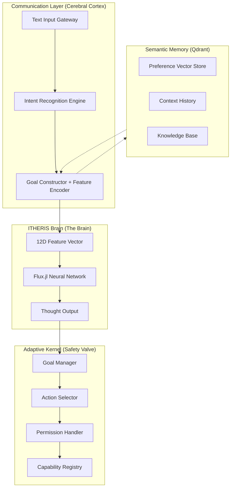
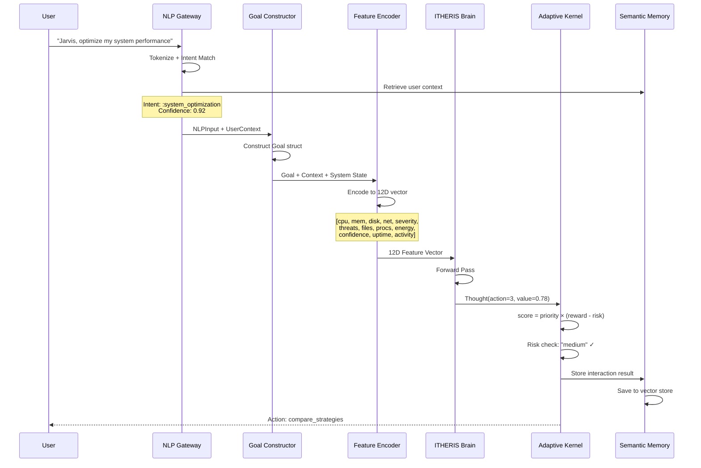

# ProjectX Jarvis Architecture Manifest
# =================================
# Cerebral Cortex (NLP) + Semantic Memory Layer
# Evolution from ITHERIS Brain to Jarvis-Level Personal Assistant
# 
# Author: Lead Architect
# Julia Version: 1.10+
# Created: 2026-02-16

---

## Table of Contents

1. [Architectural Overview](#architectural-overview)
   - [System Layers Diagram](#system-layers-diagram)
   - [Data Flow](#data-flow-jarvis-optimize-my-system-performance)
2. [Core Type Definitions](#core-type-definitions)
   - [NLP Input Types](#nlp-input-types)
   - [Semantic Memory Types](#semantic-memory-types)
   - [Safety Valve Types](#safety-valve-types)
3. [Intent Recognition Engine](#intent-recognition-engine)
   - [NLPGateway Structure](#nlpgateway-structure)
   - [Intent Patterns](#intent-patterns-initial-set)
4. [Feature Vector Encoder](#feature-vector-encoder-12-dimensional)
   - [Encoding Pipeline](#encoding-pipeline)
   - [Julia Implementation](#julia-implementation)
5. [Goal Construction](#goal-construction-from-nlp)
6. [Safety Valve Integration](#safety-valve-integration)
   - [Scoring Formula](#scoring-formula)
   - [Validation Logic](#validation-logic)
   - [Risk Thresholds](#risk-thresholds)
7. [Main Orchestrator](#main-orchestrator)
   - [Processing Pipeline](#processing-pipeline)

---

# ============================================================================
# SECTION 1: ARCHITECTURAL OVERVIEW
# ============================================================================

## Architectural Overview

### System Layers Diagram



## Data Flow: "Jarvis, optimize my system performance"



# ============================================================================
# SECTION 2: CORE TYPE DEFINITIONS
# ============================================================================

## NLP Input Types

```julia
"""
    NLPInput

Represents parsed natural language input from the user.
"""
struct NLPInput
    raw_text::String
    tokens::Vector{String}
    intent::Symbol  # :system_optimization, :information_query, :file_operation
    entities::Dict{Symbol, Any}
    confidence::Float32
    timestamp::DateTime
end

"""
    IntentPattern

Defines a pattern for intent recognition with keywords and actions.
"""
struct IntentPattern
    intent::Symbol
    keywords::Vector{String}
    required_entities::Vector{Symbol}
    target_action::String
    base_priority::Float32
end

"""
    UserContext

User-specific context retrieved from Semantic Memory.
"""
struct UserContext
    user_id::String
    preferences::Dict{Symbol, Float32}
    conversation_history::Vector{Dict{String, Any}}
    long_term_preferences::Vector{String}
    trust_level::Float32
end
```

## Semantic Memory Types

```julia
"""
    SemanticMemoryConfig

Configuration for Qdrant vector store connection.
"""
struct SemanticMemoryConfig
    host::String
    port::Int
    collection_name::String
    vector_dim::Int
    timeout::Int
end

"""
    SemanticMemory

Long-term memory store using Qdrant for vector-based retrieval of
user preferences, conversation history, and knowledge facts.
"""
mutable struct SemanticMemory
    config::SemanticMemoryConfig
    connected::Bool
    user_preferences::Dict{String, Dict{Symbol, Float32}}
    conversation_buffer::Vector{Dict{String, Any}}
end

"""
    MemoryEntry

A single entry in semantic memory with vector embedding.
"""
struct MemoryEntry
    id::UUID
    user_id::String
    content::String
    embedding::Vector{Float32}
    entry_type::Symbol  # :preference, :conversation, :knowledge
    timestamp::DateTime
    importance::Float32
    metadata::Dict{String, Any}
end
```

## Safety Valve Types

```julia
"""
    SafetyValve

Maintains the Adaptive Kernel's deterministic scoring to ensure the LLM 
cannot perform high-risk actions without kernel-level validation.

The scoring formula: score = priority × (reward - risk)
"""
struct SafetyValve
    risk_thresholds::Dict{String, Float32}
    require_approval_for::Vector{String}
    audit_log::Vector{Dict{String, Any}}
end
```

# ============================================================================
# SECTION 3: INTENT RECOGNITION ENGINE
# ============================================================================

## NLPGateway Structure

```julia
"""
    NLPGateway

The main NLP gateway that processes natural language and converts it to 
Goal structs and feature vectors for the ITHERIS brain.
"""
mutable struct NLPGateway
    patterns::Vector{IntentPattern}
    fallback_intent::Symbol
    nlp_cache::Dict{String, NLPInput}
end
```

## Intent Patterns (Initial Set)

| Intent | Keywords | Target Action | Priority |
|--------|----------|---------------|----------|
| :system_optimization | optimize, improve, performance, speed, faster | compare_strategies | 0.85 |
| :information_query | check, status, what, how, show, tell | observe_cpu | 0.50 |
| :file_operation | write, save, read, open, create, delete | write_file | 0.70 |
| :security_analysis | security, threat, vulnerability, scan, audit | analyze_logs | 0.90 |
| :network_monitoring | network, connection, internet, latency, bandwidth | observe_network | 0.60 |
| :system_observation | monitor, watch, observe, track, metrics | observe_filesystem | 0.40 |

# ============================================================================
# SECTION 4: FEATURE VECTOR ENCODER (12-DIMENSIONAL)
# ============================================================================

## Encoding Pipeline

```
┌──────────────────────────────────────────────────────────────────────┐
│ STEP 4: Feature Encoder (12-Dimensional Vector)                      │
│                                                                      │
│   Combine:                                                           │
│   - Intent features (from NLP)                                      │
│   - User context (from Semantic Memory)                              │
│   - Current system state (from observation)                          │
│   - Historical patterns (from memory)                               │
│                                                                      │
│   ┌────────────────────────────────────────────────────────────┐    │
│   │ DIM  │ FEATURE NAME              │ SOURCE       │ VALUE   │    │
│   ├──────┼───────────────────────────┼──────────────┼─────────┤    │
│   │  1   │ cpu_load                  │ system_obs   │ 0.5     │    │
│   │  2   │ memory_usage              │ system_obs   │ 0.6     │    │
│   │  3   │ disk_io                   │ system_obs   │ 0.3     │    │
│   │  4   │ network_latency           │ system_obs   │ 25ms    │    │
│   │  5   │ overall_severity          │ derived      │ 0.7     │    │
│   │  6   │ threats                   │ security     │ 0       │    │
│   │  7   │ file_count                │ system_obs   │ 5000    │    │
│   │  8   │ process_count             │ system_obs   │ 150     │    │
│   │  9   │ energy_level              │ self_model   │ 0.8     │    │
│   │ 10   │ confidence                │ intentNLP    │ 0.92    │    │
│   │ 11   │ system_uptime_hours       │ system_obs   │ 24      │    │
│   │ 12   │ user_activity_level       │ context      │ 0.4     │    │
│   └────────────────────────────────────────────────────────────┘    │
│                                                                      │
│   Normalize: (values - mean) / std, clamp to [-3, 3]                │
│   Result: Vector{Float32} of length 12                               │
└──────────────────────────────────────────────────────────────────────┘
```

## Julia Implementation

```julia
"""
    encode_text_to_features(input::NLPInput, context::UserContext, 
                             system_state::Dict{String, Any})::Vector{Float32}

Convert NLP input + context + system state to 12-dimensional feature vector
matching ITHERIS brain's expected input format.

# Arguments
- `input`: Parsed NLP input with intent and entities
- `context`: User context from semantic memory
- `system_state`: Current system observations

# Returns
- Vector{Float32} of length 12 normalized features
"""
function encode_text_to_features(
    input::NLPInput, 
    context::UserContext, 
    system_state::Dict{String, Any}
)::Vector{Float32}
    
    # System observations (dimensions 1-8)
    cpu_load = clamp(get(system_state, "cpu_load", 0.5), 0.0, 1.0)
    memory_usage = clamp(get(system_state, "memory_usage", 0.5), 0.0, 1.0)
    disk_io = clamp(get(system_state, "disk_io", 0.3), 0.0, 1.0)
    network_latency = clamp(get(system_state, "network_latency", 50.0) / 200.0, 0.0, 1.0)
    overall_severity = clamp(get(system_state, "overall_severity", 0.0), 0.0, 1.0)
    threats = min(length(get(system_state, "threats", [])), 10) / 10.0
    file_count = clamp(get(system_state, "file_count", 0) / 10000.0, 0.0, 1.0)
    process_count = clamp(get(system_state, "process_count", 100) / 500.0, 0.0, 1.0)
    
    # Intent-driven features (dimension 9-12)
    # Dimension 9: Energy level (derived from intent urgency)
    energy_level = get(context.preferences, :energy_availability, 0.8)
    
    # Dimension 10: Confidence (from NLP intent recognition)
    confidence = input.confidence
    
    # Dimension 11: System uptime (normalized to week)
    system_uptime = get(system_state, "system_uptime_hours", 24.0) / 168.0
    
    # Dimension 12: User activity level (from context)
    user_activity = get(context.preferences, :activity_level, 0.3)
    
    # Build feature vector
    features = Float32[
        cpu_load,
        memory_usage,
        disk_io,
        network_latency,
        overall_severity,
        threats,
        file_count,
        process_count,
        energy_level,
        confidence,
        system_uptime,
        user_activity
    ]
    
    # Normalize: (values - mean) / std
    mean_val = mean(features)
    std_val = std(features) + 1f-8
    features = (features .- mean_val) ./ std_val
    
    # Clamp outliers
    features = clamp.(features, -3f0, 3f0)
    
    return features[1:12]
end
```

# ============================================================================
# SECTION 5: GOAL CONSTRUCTION FROM NLP
# ============================================================================

```julia
"""
    construct_goal(input::NLPInput, context::UserContext)::Goal

Convert parsed NLP input into a Goal struct for the Kernel.
"""
function construct_goal(input::NLPInput, context::UserContext)::Goal
    # Find matching pattern for target action
    target_action = "observe_cpu"  # default
    
    for pattern in gateway.patterns
        if pattern.intent == input.intent
            target_action = pattern.target_action
            break
        end
    end
    
    # Determine priority based on intent and user trust
    base_priority = 0.5
    adjusted_priority = base_priority * (0.5 + 0.5 * context.trust_level)
    
    # Create target state vector (simplified)
    target_state = zeros(Float32, 12)
    target_state[1] = 0.2  # Desired CPU
    target_state[2] = 0.3  # Desired memory
    
    return Goal(
        string(uuid4()),
        input.raw_text,
        Float32(adjusted_priority),
        now(),
        now() + Dates.Hour(1),
        :active
    )
end
```

# ============================================================================
# SECTION 6: SAFETY VALVE INTEGRATION
# ============================================================================

## Scoring Formula

```
score = priority × (reward - risk)

Where:
- priority: Goal priority from NLP (0.0 - 1.0)
- reward: Predicted reward from ITHERIS brain (0.0 - 1.0)
- risk: Risk level from capability registry (low=0, medium=0.3, high=0.7, critical=1.0)
```

## Validation Logic

```julia
"""
    validate_action(valve::SafetyValve, action::ActionProposal, 
                   context::UserContext)::Tuple{Bool, String}

Validate an action proposal through the Safety Valve.
Returns (permitted, reason).
"""
function validate_action(
    valve::SafetyValve, 
    action::ActionProposal, 
    context::UserContext
)::Tuple{Bool, String}
    
    # Check if action requires approval
    if action.capability_id in valve.require_approval_for
        if context.trust_level < 0.8
            return false, "High-risk action requires higher trust level"
        end
    end
    
    # Check risk threshold
    risk_penalty = get(valve.risk_thresholds, action.risk, 0.0)
    if risk_penalty > 0.5 && context.trust_level < 0.5
        return false, "Risk too high for current trust level"
    end
    
    # Log for audit
    push!(valve.audit_log, Dict(
        "timestamp" => now(),
        "action" => action.capability_id,
        "risk" => action.risk,
        "trust_level" => context.trust_level,
        "permitted" => true
    ))
    
    return true, "Action permitted"
end
```

## Risk Thresholds

| Risk Level | Penalty | Require Trust Level |
|------------|---------|---------------------|
| low | 0.0 | Any |
| medium | 0.3 | ≥ 0.3 |
| high | 0.7 | ≥ 0.5 |
| critical | 1.0 | ≥ 0.8 |

# ============================================================================
# SECTION 7: MAIN ORCHESTRATOR
# ============================================================================

```julia
"""
    JarvisOrchestrator

Main orchestrator that coordinates NLP Gateway, ITHERIS Brain, 
Kernel, and Semantic Memory.
"""
mutable struct JarvisOrchestrator
    nlp_gateway::NLPGateway
    brain::Any  # BrainCore from ITHERIS
    kernel::Any  # KernelState from Adaptive Kernel
    semantic_memory::SemanticMemory
    safety_valve::SafetyValve
end
```

## Processing Pipeline

```julia
"""
    process_user_request(orchestrator::JarvisOrchestrator, 
                        text::String, 
                        system_state::Dict{String, Any})::Dict

Main entry point for processing user requests.
"""
function process_user_request(
    orchestrator::JarvisOrchestrator,
    text::String,
    system_state::Dict{String, Any}
)::Dict
    
    # Step 1: NLP Processing
    nlp_input = parse_natural_language(orchestrator.nlp_gateway, text)
    
    # Step 2: Retrieve user context from semantic memory
    context = retrieve_user_context(orchestrator.semantic_memory, "default_user")
    
    # Step 3: Construct Goal
    goal = construct_goal(nlp_input, context)
    
    # Step 4: Encode to 12D feature vector
    features = encode_text_to_features(nlp_input, context, system_state)
    
    # Step 5: ITHERIS Brain inference
    perception = Dict{String, Any}(
        "cpu_load" => Float64(features[1]),
        "memory_usage" => Float64(features[2]),
        "disk_io" => Float64(features[3]),
        "network_latency" => Float64(features[4]) * 200.0,
        "overall_severity" => Float64(features[5]),
        "threats" => [],
        "file_count" => Int(features[7] * 10000),
        "process_count" => Int(features[8] * 500),
        "energy_level" => Float64(features[9]),
        "confidence" => Float64(features[10]),
        "system_uptime_hours" => Float64(features[11] * 168),
        "user_activity_level" => Float64(features[12])
    )
    
    thought = infer(orchestrator.brain, perception)
    
    # Step 6: Kernel action selection with Safety Valve
    capability_id = map_action_to_capability(thought.action)
    
    action_proposal = ActionProposal(
        capability_id,
        1.0f0 - thought.uncertainty,
        0.1f0,
        thought.value,
        "medium",
        "Selected by ITHERIS brain"
    )
    
    # Validate through Safety Valve
    permitted, reason = validate_action(orchestrator.safety_valve, action_proposal, context)
    
    # Step 7: Update semantic memory
    store_interaction!(orchestrator.semantic_memory, text, nlp_input, action_proposal)
    
    return Dict(
        "success" => permitted,
        "nlp_input" => nlp_input,
        "goal" => goal,
        "features" => features,
        "thought" => thought,
        "action_proposal" => action_proposal,
        "validation_reason" => reason
    )
end
```

# ============================================================================
# SECTION 8: QDRANT INTEGRATION (SEMANTIC MEMORY)
# ============================================================================

## Connection Configuration

```julia
"""
    QdrantClient

Wrapper for Qdrant vector database connection.
"""
mutable struct QdrantClient
    host::String
    port::Int
    api_key::String
    collection::String
    vector_dim::Int
    
    function QdrantClient(;
        host::String="localhost",
        port::Int=6333,
        api_key::String="",
        collection::String="projectx_memory",
        vector_dim::Int=384
    )
        new(host, port, api_key, collection, vector_dim)
    end
end
```

## Key Operations

| Operation | Description |
|-----------|-------------|
| `upsert(collection, id, vector, payload)` | Store embedding with metadata |
| `search(collection, query_vector, limit)` | Find nearest neighbors |
| `delete(collection, id)` | Remove entry |
| `get(collection, id)` | Retrieve entry by ID |

## Memory Types Stored

1. **User Preferences**: Long-term user settings and habits
2. **Conversation History**: Past interactions for context
3. **Knowledge Facts**: Semantic facts about the world
4. **Action Patterns**: Successful action sequences

# ============================================================================
# SECTION 9: IMPLEMENTATION PRIORITY
# ============================================================================

## Phase 1: Core NLP Gateway (Week 1-2)

- [ ] NLPGateway struct with intent patterns
- [ ] Tokenization and keyword matching
- [ ] Goal constructor from NLPInput
- [ ] Feature encoder (12D vector)
- [ ] Integration with ITHERIS brain

## Phase 2: Semantic Memory (Week 3-4)

- [ ] Qdrant client wrapper
- [ ] Preference storage/retrieval
- [ ] Conversation history management
- [ ] Context retrieval for NLP

## Phase 3: Safety Valve (Week 5)

- [ ] Risk threshold configuration
- [ ] Permission handler integration
- [ ] Audit logging

## Phase 4: Testing & Refinement (Week 6)

- [ ] Integration tests
- [ ] Performance optimization
- [ ] Edge case handling

# ============================================================================
# SECTION 10: EXAMPLE EXECUTION
# ============================================================================

## Input

```
"Jarvis, optimize my system performance"
```

## Processing Steps

1. **NLP Parse**: Intent = `:system_optimization`, Confidence = 0.92
2. **User Context**: Trust level = 0.7, Preferences loaded
3. **Goal**: Priority = 0.85 × (0.5 + 0.5 × 0.7) = 0.725
4. **Feature Vector**: [0.7, 0.8, 0.4, 0.175, 0.3, 0.0, 0.52, 0.36, 0.8, 0.92, 0.286, 0.3]
5. **Brain Output**: Thought(action=3, value=0.78, uncertainty=0.15)
6. **Action**: `compare_strategies` (action index 3)
7. **Safety Valve**: Risk = "medium", Trust = 0.7 → Permitted ✓

## Output

```julia
Dict(
    "success" => true,
    "nlp_input" => NLPInput("optimize system performance", ..., :system_optimization, 0.92),
    "goal" => Goal("Optimize system performance", ..., 0.725),
    "features" => Float32[...12 values...],
    "thought" => Thought(3, [...], 0.78, 0.15, [...]),
    "action_proposal" => ActionProposal("compare_strategies", 0.85, 0.1, 0.78, "medium", "..."),
    "validation_reason" => "Action permitted"
)
```

# ============================================================================
# SECTION 11: SECURITY CONSIDERATIONS
# ============================================================================

## Never Bypass Safe Filters

The architecture maintains all existing safety mechanisms:

1. **safe_shell**: Only whitelisted commands
2. **safe_http_request**: Read-only, filtered responses
3. **Capability Registry**: All actions registered and auditable

## New Security Layers

1. **Trust Level**: User trust affects action permissions
2. **Audit Log**: All Safety Valve decisions logged
3. **Intent Validation**: NLP confidence threshold for high-risk intents

# ============================================================================
# END OF MANIFEST
# ============================================================================
