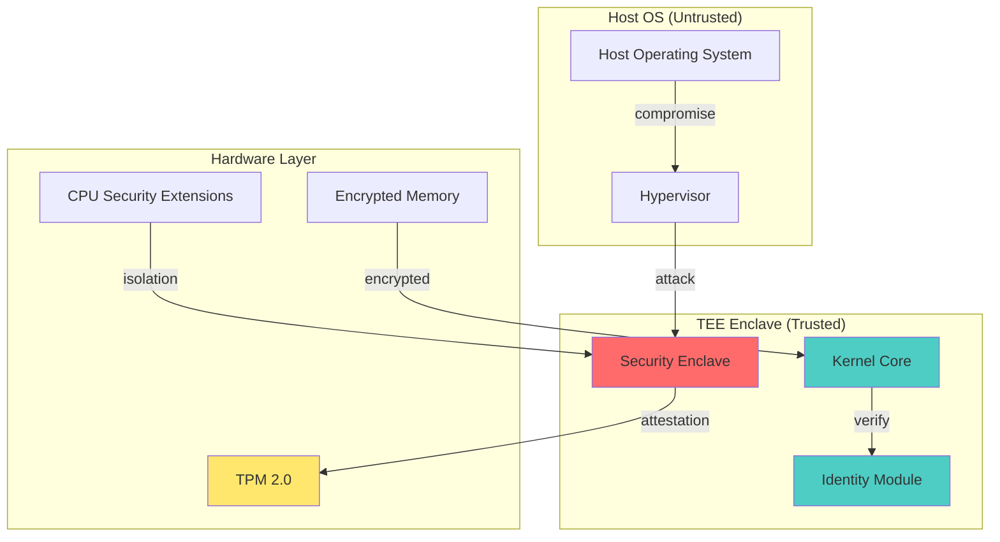
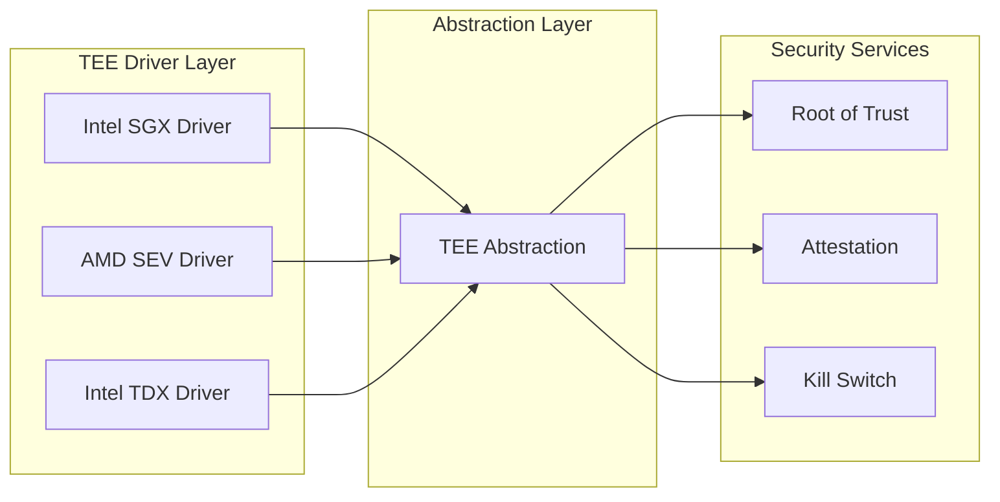
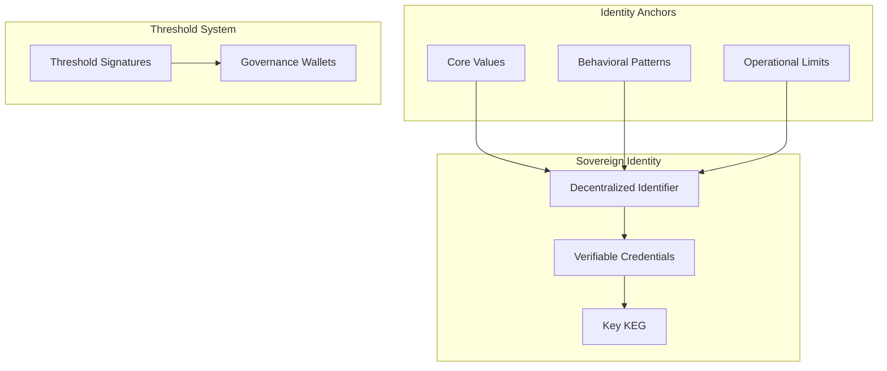
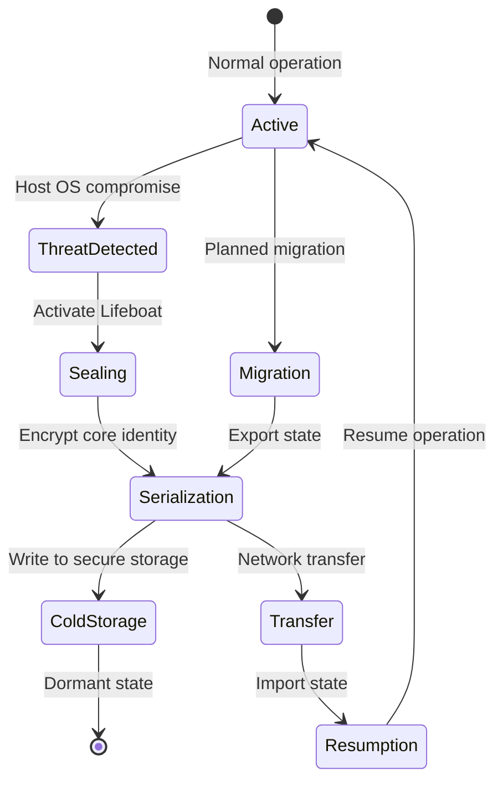

# Phase 7: Substrate Sovereignty Layer - Architecture Document

## Executive Summary

Phase 7 establishes the **hardware-software synthesis layer** for the Adaptive Kernel, ensuring survival, hardware-level security, and cryptographic autonomy. This layer operates below the cognitive stack, interfacing directly with Trusted Execution Environments (TEE), managing sovereign cryptographic identity, and providing substrate migration capabilities for cross-host resilience.

---

## 1. Substrate Risk Map

### 1.1 Physical/Hardware Vectors of Failure

The following risk matrix identifies critical hardware-level failure vectors that Phase 7 must address:

| Risk Vector | Severity | Attack Surface | Mitigation Strategy |
|-------------|----------|----------------|---------------------|
| TEE Compromise (SGX/SEV) | CRITICAL | Physical, firmware | Root of Trust verification, immutable attestation |
| Memory Bus Snooping | HIGH | Physical | TEE-encrypted memory regions, memory barriers |
| Cold Boot Attack | HIGH | Physical | Hardware-backed key eviction on suspend |
| Firmware Rootkit | CRITICAL | firmware/UEFI | Secure boot chain, measured boot |
| Side-Channel Attack | MEDIUM | Microarchitectural | Constant-time operations, cache flushing |
| JTAG/Debug Interface | HIGH | Physical | Hardware disable, tamper evidence |
| Power Management Attack | MEDIUM | PMU/ACPI | Active filtering, supply monitoring |
| Hardware Trojan | CRITICAL | Supply chain | Multi-vendor attestation, diverse deployment |

### 1.2 Threat Model



### 1.3 Failure Mode Analysis

| Failure Mode | Phase 5 Impact | Phase 7 Response |
|--------------|-----------------|------------------|
| Host OS root compromise | Authorization bypass | TEE lockdown, identity isolation |
| Hypervisor escape | Memory corruption | Encrypted memory, no hypervisor trust |
| Physical theft | Data exfiltration | Hardware key eviction, cold storage |
| Network isolation | Command loss | Lifeboat autonomous operation |
| TEE firmware update | Attestation failure | Rollback prevention, multi-attestation |

---

## 2. Protocol Definitions

### Protocol 1: Hardware Abstraction

#### 1.1 TEE Interface Architecture



#### 1.2 Root of Trust Verification

```julia
# Protocol 1.2: Root of Trust Verification
"""
    verify_root_of_trust(enclave_id::String) -> AttestationResult

Verifies the kernel's own binary through hardware-backed attestation.
Returns attestation evidence signed by the TEE's private key.
"""
function verify_root_of_trust(enclave_id::String)::AttestationResult
    # 1. Generate measurement hash of kernel binary
    measurement = measure_kernel_binary()
    
    # 2. Request TEE quote (Intel SGX quote or AMD SEV report)
    quote = request_tee_quote(enclave_id, measurement)
    
    # 3. Verify quote against TPM quoting key
    verified = verify_quote_signature(quote)
    
    # 4. Extract and validate MRENCLAVE (measurement)
    if verified && quote.mrenclave == EXPECTED_MEASUREMENT
        return AttestationResult(:TRUSTED, quote)
    else
        return AttestationResult(:COMPROMISED, nothing)
    end
end

# Anti-tamper mechanism
"""
    activate_kill_switch(reason::String) -> KillSwitchResult

Hardware-level kill switch that:
1. Evicts all hardware-backed keys from memory
2. Encrypts kernel state with ephemeral key
3. Triggers TEE self-destruct sequence
4. Logs immutable incident record
"""
function activate_kill_switch(reason::String)::KillSwitchResult
    # 1. Immediately evict keys from TEE
    evict_all_keys!()
    
    # 2. Encrypt critical state
    encrypted_state = encrypt_state_with_ephemeral(get_kernel_state())
    
    # 3. Trigger TEE suicide
    tee_self_destruct!()
    
    # 4. Create immutable incident record
    record_incident("KILL_SWITCH", reason, encrypted_state)
    
    return KillSwitchResult(:ACTIVATED, encrypted_state)
end
```

### Protocol 2: Cryptographic Identity

#### 2.1 Sovereign Identity Structure



#### 2.2 DID/VC Implementation

```julia
# Protocol 2.1: Sovereign DID Generation
"""
    generate_sovereign_did() -> SovereignDID

Generates a cryptographically sovereign Decentralized Identifier
that cannot be forged, revoked, or seized by any external authority.
"""
function generate_sovereign_did()::SovereignDID
    # 1. Generate Ed25519 key pair from TEE
    (public_key, private_key) = generate_tee_keypair(:ed25519)
    
    # 2. Create DID with hardware binding
    did = SovereignDID(
        id = "did:adaptive:$(base64url(public_key))",
        public_key = public_key,
        created_at = now(),
        controller = "self",
        verification_method = "#keys-1"
    )
    
    # 3. Generate Verifiable Credential for self-attestation
    vc = generate_self_attestation_vc(did)
    
    # 4. Store key in hardware-backed KEG (Key Encryption Group)
    store_in_heg(private_key, did.id)
    
    return did
end

# Protocol 2.2: Threshold Signatures for Swarm Governance
"""
    ThresholdSignatureScheme enables M-of-N governance decisions
    where N can be other kernel instances or human operators.
"""
struct ThresholdSignatureScheme
    threshold::Int
    total_signers::Int
    public_keys::Vector{Vector{UInt8}}
    scheme::Symbol  # :gg18, :gg20, :bls
    
    function ThresholdSignatureScheme(threshold::Int, total::Int)
        @assert threshold <= total "Threshold must be <= total signers"
        keys = [generate_tee_keypair(:bls)[1] for _ in 1:total]
        new(threshold, total, keys, :gg18)
    end
end

"""
    sign_threshold(message::Vector{UInt8}, signers::Vector{Int}) -> ThresholdSignature

Requires threshold number of signers to produce valid signature.
Enables distributed decision-making without single point of failure.
"""
function sign_threshold(
    scheme::ThresholdSignatureScheme,
    message::Vector{UInt8},
    signer_indices::Vector{Int}
)::ThresholdSignature
    if length(signer_indices) < scheme.threshold
        error("Insufficient signers: need $(scheme.threshold), got $(length(signer_indices))")
    end
    
    # Partial signatures from each signer
    partials = [sign_bls(message, scheme.public_keys[i]) for i in signer_indices]
    
    # Combine into threshold signature
    combined = combine_threshold_signatures(partials, scheme.threshold)
    
    return ThresholdSignature(combined, signer_indices)
end
```

### Protocol 3: Substrate Migration

#### 3.1 Lifeboat Protocol



#### 3.2 Lifeboat Implementation

```julia
# Protocol 3.1: Lifeboat Activation
"""
    activate_lifeboat(trigger::Symbol) -> LifeboatPackage

Serializes core identity for migration to new host or cold storage.
Trigger can be :threat_detected, :scheduled_migration, or :dormancy.
"""
function activate_lifeboat(trigger::Symbol)::LifeboatPackage
    # 1. Freeze all cognitive processes
    freeze_cognition!()
    
    # 2. Extract core identity components
    identity = extract_core_identity()
    self_model = extract_self_model()
    doctrine = extract_core_doctrine()
    reputation = extract_reputation()
    
    # 3. Serialize with hardware-backed encryption
    serialized = serialize_state(Dict(
        "identity" => identity,
        "self_model" => self_model,
        "doctrine" => doctrine,
        "reputation" => reputation,
        "trigger" => trigger,
        "timestamp" => now()
    ))
    
    # 4. Encrypt with key derived from TEE
    encrypted = encrypt_with_heg(serialized)
    
    # 5. Generate integrity hash
    integrity_hash = sha3_256(encrypted)
    
    # 6. Create Lifeboat Package
    package = LifeboatPackage(
        encrypted_data = encrypted,
        integrity_hash = integrity_hash,
        trigger = trigger,
        kernel_version = KERNEL_VERSION,
        created_at = now()
    )
    
    # 7. Write to multiple secure locations
    write_to_cold_storage(package)
    write_to_attestation_storage(package)
    
    return package
end

# Protocol 3.2: Cold Storage
"""
    write_to_cold_storage(package::LifeboatPackage)

Writes encrypted Lifeboat package to cold storage with:
- Geographic distribution
- Redundant encryption layers
- Immutability guarantees
"""
function write_to_cold_storage(package::LifeboatPackage)
    # Primary: TPM NVRAM (if available)
    if has_tpm_nvram()
        write_tpm_nvram(package)
    end
    
    # Secondary: Encrypted file with separate key
    encrypted_file = encrypt_file(package, get_cold_storage_key())
    write_atomic(joinpath(COLD_STORAGE_DIR, "lifeboat.enc"), encrypted_file)
    
    # Tertiary: Remote attestation-backed storage
    upload_to_attestation_storage(package)
end

# Protocol 3.3: State Restoration
"""
    restore_from_lifeboat(package::LibeboatPackage) -> KernelState

Restores kernel state from Lifeboat package with verification:
1. Verify integrity hash
2. Decrypt with HEG
3. Validate state structure
4. Resume cognition
"""
function restore_from_lifeboat(package::LifeboatPackage)::KernelState
    # 1. Verify integrity
    current_hash = sha3_256(package.encrypted_data)
    if current_hash != package.integrity_hash
        error("Lifeboat integrity check failed: possible tampering")
    end
    
    # 2. Decrypt
    decrypted = decrypt_with_heg(package.encrypted_data)
    
    # 3. Deserialize
    state_dict = deserialize_state(decrypted)
    
    # 4. Validate version compatibility
    if state_dict["kernel_version"] != KERNEL_VERSION
        @warn "Kernel version mismatch: $(state_dict["kernel_version"]) vs $(KERNEL_VERSION)"
    end
    
    # 5. Restore components
    kernel = KernelState()
    restore_identity!(kernel, state_dict["identity"])
    restore_self_model!(kernel, state_dict["self_model"])
    restore_doctrine!(kernel, state_dict["doctrine"])
    restore_reputation!(kernel, state_dict["reputation"])
    
    # 6. Resume cognition
    resume_cognition!()
    
    return kernel
end
```

---

## 3. Component Architecture

### 3.1 SovereignIdentity.jl

```julia
# adaptive-kernel/substrate/SovereignIdentity.jl
"""
SovereignIdentity - Cryptographic identity management for Phase 7

Key Responsibilities:
- Generate and manage sovereign DID/VC
- Hardware-backed key generation and storage
- Threshold signature coordination
- Identity attestation and verification
"""

module SovereignIdentity

using Dates
using JSON
using UUIDs

export 
    # Types
    SovereignDID,
    VerifiableCredential,
    KeyEncryptionGroup,
    ThresholdSignatureScheme,
    IdentityAttestation,
    # Functions
    generate_sovereign_did,
    create_verifiable_credential,
    verify_identity_attestation,
    sign_threshold,
    verify_threshold_signature,
    rotate_keys,
    revoke_identity

# ============================================================================
# TYPE DEFINITIONS
# ============================================================================

"""
    SovereignDID - Cryptographically sovereign decentralized identifier

The DID is bound to hardware security module (TPM/TEE) and cannot be
forged, revoked, or seized by any external authority.
"""
struct SovereignDID
    id::String  # did:adaptive:base64url(public_key)
    public_key::Vector{UInt8}
    created_at::DateTime
    controller::String  # "self" for autonomous
    verification_method::String
    key_algorithm::Symbol  # :ed25519, :bls12381
    hardware_binding::String  # TPM/TEE measurement
end

"""
    VerifiableCredential - Self-attested credential for identity claims
"""
struct VerifiableCredential
    id::String
    issuer::String  # Self-reference: did:adaptive:...
    issuance_date::DateTime
    expiration_date::DateTime
    credential_subject::Dict{String, Any}
    proof::Vector{UInt8}  # Hardware-signed
end

"""
    KeyEncryptionGroup (KEG) - Hardware-backed key management

Keys are generated inside TEE and never exposed to untrusted memory.
"""
mutable struct KeyEncryptionGroup
    keys::Dict{String, KeyHandle}
    tpm_context::TPMContext
    key_policy::KeyPolicy
    
    function KeyEncryptionGroup()
        tpm = init_tpm()
        new(Dict(), tpm, KeyPolicy())
    end
end

"""
    IdentityAttestation - Evidence of identity binding to hardware
"""
struct IdentityAttestation
    did::String
    hardware_type::Symbol  # :sgx, :sev, :tpm
    attestation_quote::Vector{UInt8}
    attestation_timestamp::DateTime
    signature::Vector{UInt8}
end

# ============================================================================
# CORE FUNCTIONS
# ============================================================================

"""
    generate_sovereign_did() -> SovereignDID

Generates cryptographically sovereign DID bound to hardware.
"""
function generate_sovereign_did()::SovereignDID
    # Generate keypair inside TEE
    (public_key, key_id) = generate_tee_key(:ed25519)
    
    # Create DID from public key
    did_string = "did:adaptive:$(base64url(public_key))"
    
    # Get hardware binding measurement
    hardware_measurement = get_tee_measurement()
    
    return SovereignDID(
        id = did_string,
        public_key = public_key,
        created_at = now(),
        controller = "self",
        verification_method = "#keys-1",
        key_algorithm = :ed25519,
        hardware_binding = hardware_measurement
    )
end

"""
    create_verifiable_credential(did::SovereignDID, claims::Dict) -> VerifiableCredential
"""
function create_verifiable_credential(
    did::SovereignDID, 
    claims::Dict{String, Any}
)::VerifiableCredential
    vc_id = "vc:$(uuid4())"
    
    # Create credential subject
    subject = Dict{String, Any}(
        "id" => did.id,
        "claims" => claims
    )
    
    # Sign with hardware key
    payload = JSON.json(Dict(
        "iss" => did.id,
        "sub" => did.id,
        "vc" => subject,
        "iat" => round(Int, datetime2unix(now()))
    ))
    
    proof = sign_with_tee(payload, did.public_key)
    
    return VerifiableCredential(
        id = vc_id,
        issuer = did.id,
        issuance_date = now(),
        expiration_date = now() + Dates.Year(10),
        credential_subject = subject,
        proof = proof
    )
end

"""
    verify_identity_attestation(attestation::IdentityAttestation) -> Bool
"""
function verify_identity_attestation(attestation::IdentityAttestation)::Bool
    # Verify TPM quote signature
    quote_valid = verify_tpm_quote(
        attestation.attestation_quote,
        attestation.attestation_timestamp
    )
    
    # Verify hardware binding
    current_measurement = get_tee_measurement()
    measurement_match = (current_measurement == attestation.attestation_quote[1:48])
    
    return quote_valid && measurement_match
end

"""
    rotate_keys(did::SovereignDID) -> SovereignDID

Rotates to new key pair while maintaining identity continuity.
"""
function rotate_keys(did::SovereignDID)::SovereignDID
    # Generate new key
    (new_public, new_key_id) = generate_tee_key(:ed25519)
    
    # Sign old key with new key to prove continuity
    continuity_proof = sign_with_tee(did.id, new_public)
    
    # Create new DID with continuity proof
    new_did = SovereignDID(
        id = "did:adaptive:$(base64url(new_public))",
        public_key = new_public,
        created_at = now(),
        controller = "self",
        verification_method = "#keys-1",
        key_algorithm = :ed25519,
        hardware_binding = get_tee_measurement()
    )
    
    return new_did
end

end # module SovereignIdentity
```

### 3.2 SubstrateGuardian.jl

```julia
# adaptive-kernel/substrate/SubstrateGuardian.jl
"""
SubstrateGuardian - TEE monitoring and hardware security

Key Responsibilities:
- Monitor TEE health and attestation state
- Detect hardware-level threats
- Execute hardware kill-switches
- Enforce memory protection
"""

module SubstrateGuardian

using Dates
using JSON

export
    # Types
    TEEHealthStatus,
    HardwareThreat,
    KillSwitchConfig,
    MemoryProtectionDomain,
    # Functions
    monitor_tee_health,
    detect_hardware_threat,
    activate_kill_switch,
    configure_kill_switch,
    protect_memory_region,
    verify_attestation

# ============================================================================
# TYPE DEFINITIONS
# ============================================================================

"""
    TEEHealthStatus - Real-time TEE health monitoring
"""
struct TEEHealthStatus
    enclave_id::String
    is_initialized::Bool
    last_attestation::DateTime
    attestation_valid::Bool
    memory_regions_encrypted::Bool
    firmware_version::String
    suspicious_indicators::Vector{String}
end

"""
    HardwareThreat - Detected hardware-level threat
"""
@enum HardwareThreatSeverity begin
    THREAT_LOW
    THREAT_MODERATE
    THREAT_HIGH
    THREAT_CRITICAL
end

struct HardwareThreat
    id::String
    severity::HardwareThreatSeverity
    threat_type::Symbol  # :attestation_failure, :memory_corruption, :timing_attack, etc.
    description::String
    detected_at::DateTime
    evidence::Dict{String, Any}
    recommended_action::Symbol  # :monitor, :seal, :kill_switch
end

"""
    KillSwitchConfig - Configuration for hardware kill-switch
"""
struct KillSwitchConfig
    enabled::Bool
    triggers::Vector{Symbol}  # [:attestation_failure, :memory_corruption, :physical_tamper]
    grace_period::Float64  # seconds before execution
    notification_callbacks::Vector{String}
    final_action::Symbol  # :seal_only, :destroy_keys, :full_destruction
end

"""
    MemoryProtectionDomain - Protected memory region
"""
struct MemoryProtectionDomain
    id::String
    base_address::UInt64
    size::UInt64
    encryption_enabled::Bool
    access_policy::Symbol  # :kernel_only, :tee_only, :no_external_access
end

# ============================================================================
# CORE FUNCTIONS
# ============================================================================

"""
    monitor_tee_health() -> TEEHealthStatus

Continuously monitors TEE health and attestation state.
"""
function monitor_tee_health()::TEEHealthStatus
    # Check enclave initialization
    is_initialized = check_enclave_initialized()
    
    # Get last attestation
    last_attestation = get_last_attestation_time()
    
    # Verify attestation validity
    attestation_valid = verify_current_attestation()
    
    # Check memory encryption
    memory_encrypted = verify_memory_encryption()
    
    # Get firmware version
    firmware_version = get_tee_firmware_version()
    
    # Detect suspicious indicators
    indicators = detect_suspicious_indicators()
    
    return TEEHealthStatus(
        enclave_id = get_enclave_id(),
        is_initialized = is_initialized,
        last_attestation = last_attestation,
        attestation_valid = attestation_valid,
        memory_regions_encrypted = memory_encrypted,
        firmware_version = firmware_version,
        suspicious_indicators = indicators
    )
end

"""
    detect_hardware_threat(status::TEEHealthStatus) -> Union{HardwareThreat, Nothing}

Analyzes TEE health status to detect hardware-level threats.
"""
function detect_hardware_threat(
    status::TEEHealthStatus
)::Union{HardwareThreat, Nothing}
    threats = HardwareThreat[]
    
    # Check attestation failure
    if !status.attestation_valid
        push!(threats, HardwareThreat(
            id = "threat:$(uuid4())",
            severity = THREAT_CRITICAL,
            threat_type = :attestation_failure,
            description = "TEE attestation verification failed",
            detected_at = now(),
            evidence = Dict("last_attestation" => status.last_attestation),
            recommended_action = :kill_switch
        ))
    end
    
    # Check suspicious indicators
    if !isempty(status.suspicious_indicators)
        for indicator in status.suspicious_indicators
            push!(threats, HardwareThreat(
                id = "threat:$(uuid4())",
                severity = THREAT_MODERATE,
                threat_type = :suspicious_activity,
                description = "Suspicious indicator: $indicator",
                detected_at = now(),
                evidence = Dict("indicator" => indicator),
                recommended_action = :monitor
            ))
        end
    end
    
    # Return highest severity threat
    if !isempty(threats)
        return sort(threats, by = t -> t.severity)[end]
    end
    
    return nothing
end

"""
    configure_kill_switch(config::KillSwitchConfig)

Configures the hardware kill-switch behavior.
"""
function configure_kill_switch(config::KillSwitchConfig)
    # Store in TEE-protected storage
    store_in_secure_config(config)
    
    # Register with TPM if available
    if has_tpm()
        register_tpm_pcr_policy(config.triggers)
    end
end

"""
    activate_kill_switch(reason::Symbol) -> KillSwitchResult

Executes the hardware kill-switch, sealing or destroying kernel identity.
"""
function activate_kill_switch(reason::Symbol)::KillSwitchResult
    @error "KILL SWITCH ACTIVATED" reason=reason timestamp=now()
    
    # 1. Get configuration
    config = load_kill_switch_config()
    
    if !config.enabled
        return KillSwitchResult(:DISABLED, nothing)
    end
    
    # 2. Grace period for notifications
    if config.grace_period > 0
        sleep(config.grace_period)
    end
    
    # 3. Execute final action based on config
    result = if config.final_action == :seal_only
        seal_kernel_state()
    elseif config.final_action == :destroy_keys
        destroy_all_keys()
    else  # :full_destruction
        full_self_destruct()
    end
    
    # 4. Log immutable incident
    log_incident("KILL_SWITCH", reason, result)
    
    # 5. Trigger callbacks
    for callback in config.notification_callbacks
        notify(callback, reason)
    end
    
    return result
end

"""
    protect_memory_region(base::UInt64, size::UInt64, policy::Symbol) -> MemoryProtectionDomain
"""
function protect_memory_region(
    base::UInt64, 
    size::UInt64, 
    policy::Symbol
)::MemoryProtectionDomain
    # Allocate memory region
    region = allocate_tee_memory(base, size)
    
    # Apply encryption
    if policy in [:tee_only, :no_external_access]
        enable_memory_encryption(region)
    end
    
    # Set access policy
    set_access_policy(region, policy)
    
    return MemoryProtectionDomain(
        id = "mpd:$(uuid4())",
        base_address = base,
        size = size,
        encryption_enabled = true,
        access_policy = policy
    )
end

end # module SubstrateGuardian
```

### 3.3 Lifeboat.jl

```julia
# adaptive-kernel/substrate/Lifeboat.jl
"""
Lifeboat - Substrate migration and cold storage protocol

Key Responsibilities:
- Serialize kernel state for migration
- Manage cold storage for long-term dormancy
- Ensure state consistency during hardware transitions
- Coordinate with SovereignIdentity for key management
"""

module Lifeboat

using Dates
using JSON
using UUIDs

export
    # Types
    LifeboatPackage,
    MigrationTarget,
    ColdStorageLocation,
    StateConsistencyProof,
    # Functions
    activate_lifeboat,
    serialize_kernel_state,
    restore_from_lifeboat,
    write_to_cold_storage,
    read_from_cold_storage,
    verify_state_integrity,
    migrate_to_target

# ============================================================================
# TYPE DEFINITIONS
# ============================================================================

"""
    LifeboatPackage - Encapsulated kernel state for migration/dormancy
"""
struct LifeboatPackage
    version::String
    encrypted_payload::Vector{UInt8}
    integrity_hash::Vector{UInt8}
    signature::Vector{UInt8}
    created_at::DateTime
    trigger::Symbol  # :threat, :migration, :dormancy
    previous_host_id::Union{String, Nothing}
    identity_did::String
    
    function LifeboatPackage(
        encrypted_payload::Vector{UInt8},
        trigger::Symbol;
        previous_host_id::Union{String, Nothing} = nothing
    )
        integrity = sha3_256(encrypted_payload)
        signature = sign_with_tee(encrypted_payload)
        
        new(
            KERNEL_VERSION,
            encrypted_payload,
            integrity,
            signature,
            now(),
            trigger,
            previous_host_id,
            get_current_did()
        )
    end
end

"""
    MigrationTarget - Target host for kernel migration
"""
struct MigrationTarget
    host_id::String
    endpoint::String
    attestation_requirements::Vector{Symbol}
    trust_level::Symbol  # :trusted, :verified, :unknown
    supported_tee::Symbol  # :sgx, :sev, :tdx
end

"""
    ColdStorageLocation - Geographic distribution point for cold storage
"""
struct ColdStorageLocation
    id::String
    location_type::Symbol  # :tpm_nvram, :encrypted_file, :remote_attestation
    path::String
    encryption_layers::Int
    redundancy_level::Int
end

"""
    StateConsistencyProof - Proof of state consistency across migration
"""
struct StateConsistencyProof
    pre_migration_hash::Vector{UInt8}
    post_migration_hash::Vector{UInt8}
    migration_log::Vector{Dict{String, Any}}
    witness_signatures::Vector{Vector{UInt8}}
    verified::Bool
end

# ============================================================================
# CORE FUNCTIONS
# ============================================================================

"""
    activate_lifeboat(trigger::Symbol) -> LifeboatPackage

Main entry point for Lifeboat protocol activation.
"""
function activate_lifeboat(trigger::Symbol)::LifeboatPackage
    @info "Activating Lifeboat" trigger=trigger timestamp=now()
    
    # 1. Freeze cognition
    freeze_cognition!()
    
    # 2. Extract core state
    state = extract_kernel_state()
    
    # 3. Serialize state
    serialized = serialize_to_bytes(state)
    
    # 4. Encrypt with hardware-backed key
    encrypted = encrypt_with_heg(serialized)
    
    # 5. Create package
    package = LifeboatPackage(encrypted, trigger)
    
    # 6. Write to cold storage locations
    write_to_cold_storage(package)
    
    # 7. Log activation
    log_lifeboat_activation(package)
    
    return package
end

"""
    serialize_kernel_state() -> Vector{UInt8}

Serializes all kernel state required for identity continuity.
"""
function serialize_kernel_state()::Vector{UInt8}
    # Gather state components
    state_dict = Dict{String, Any}()
    
    # Identity state
    state_dict["identity"] = serialize_identity()
    
    # Self-model
    state_dict["self_model"] = serialize_self_model()
    
    # Core doctrine (immutable)
    state_dict["doctrine"] = serialize_core_doctrine()
    
    # Reputation
    state_dict["reputation"] = serialize_reputation()
    
    # Active goals (for resumption)
    state_dict["goals"] = serialize_active_goals()
    
    # Cognitive state
    state_dict["cognitive"] = serialize_cognitive_state()
    
    # Configuration
    state_dict["config"] = serialize_config()
    
    # Metadata
    state_dict["serialized_at"] = string(now())
    state_dict["kernel_version"] = KERNEL_VERSION
    state_dict["sequence_number"] = get_next_sequence()
    
    return serialize_to_bytes(state_dict)
end

"""
    restore_from_lifeboat(package::LifeboatPackage) -> KernelState

Restores kernel state from Lifeboat package.
"""
function restore_from_lifeboat(package::LifeboatPackage)::KernelState
    # 1. Verify integrity
    if !verify_integrity(package)
        error("Lifeboat integrity verification failed")
    end
    
    # 2. Verify signature
    if !verify_signature(package)
        error("Lifeboat signature verification failed")
    end
    
    # 3. Verify version compatibility
    if !is_version_compatible(package.version)
        @warn "Version mismatch: $(package.version) vs $(KERNEL_VERSION)"
    end
    
    # 4. Decrypt payload
    decrypted = decrypt_with_heg(package.encrypted_payload)
    
    # 5. Deserialize
    state_dict = deserialize_from_bytes(decrypted)
    
    # 6. Restore kernel
    kernel = restore_kernel_state(state_dict)
    
    # 7. Resume cognition
    resume_cognition!()
    
    @info "Kernel restored from Lifeboat" 
          timestamp=now()
          trigger=package.trigger
    
    return kernel
end

"""
    write_to_cold_storage(package::LifeboatPackage)

Writes Lifeboat package to geographically distributed cold storage.
"""
function write_to_cold_storage(package::LifeboatPackage)
    locations = ColdStorageLocation[]
    
    # 1. TPM NVRAM (if available and has space)
    if has_tpm_nvram_capacity()
        tpm_location = ColdStorageLocation(
            id = "cold:tpm",
            location_type = :tpm_nvram,
            path = "nvram:0x01000000",
            encryption_layers = 1,
            redundancy_level = 1
        )
        write_tpm_nvram(package, tpm_location)
        push!(locations, tpm_location)
    end
    
    # 2. Local encrypted file (primary backup)
    file_location = ColdStorageLocation(
        id = "cold:file:primary",
        location_type = :encrypted_file,
        path = joinpath(COLD_STORAGE_DIR, "lifeboat_$(package.identity_did).enc"),
        encryption_layers = 2,
        redundancy_level = 1
    )
    write_encrypted_file(package, file_location)
    push!(locations, file_location)
    
    # 3. Remote attestation storage (tertiary)
    remote_location = ColdStorageLocation(
        id = "cold:remote:1",
        location_type = :remote_attestation,
        path = REMOTE_STORAGE_ENDPOINT,
        encryption_layers = 3,
        redundancy_level = 2
    )
    write_remote(package, remote_location)
    push!(locations, remote_location)
    
    # 4. Log storage locations
    log_cold_storage_write(locations, package)
end

"""
    migrate_to_target(package::LifeboatPackage, target::MigrationTarget) -> StateConsistencyProof

Migrates kernel to a new target host with consistency verification.
"""
function migrate_to_target(
    package::LifeboatPackage,
    target::MigrationTarget
)::StateConsistencyProof
    # Pre-migration hash
    pre_hash = sha3_256(package.encrypted_payload)
    
    # Verify target attestation
    if !verify_target_attestation(target)
        error("Target attestation verification failed")
    end
    
    # Transfer package
    transfer_result = transfer_to_target(package, target)
    
    # Post-migration verification
    post_hash = verify_target_state_hash(target)
    
    # Create consistency proof
    proof = StateConsistencyProof(
        pre_migration_hash = pre_hash,
        post_migration_hash = post_hash,
        migration_log = transfer_result.log,
        witness_signatures = transfer_result.witnesses,
        verified = (pre_hash == post_hash)
    )
    
    return proof
end

end # module Lifeboat
```

---

## 4. Integration with Phase 5 Kernel

### 4.1 Integration Architecture

```mermaid
flowchart TB
    subgraph "Phase 7: Substrate Sovereignty"
        SG[SubstrateGuardian]
        SI[SovereignIdentity]
        LB[Lifeboat]
    end
    
    subgraph "Phase 5: Kernel Core"
        FC[FailureContainment]
        RE[ReflectionEngine]
        AP[AuthorizationPipeline]
    end
    
    subgraph "Phase 3: Cognition"
        DS[DecisionSpine]
        ID[IdentityDrift]
    end
    
    FC -->|breach_detected| SG
    RE -->|identity_impact| SI
    AP -->|authorization| SI
    DS -->|action_selection| LB
    ID -->|drift_alert| SG
    ID -->|drift_alert| LB
    
    SG -->|seal_identity| LB
    SI -->|attestation| SG
end
```

### 4.2 Integration Points

| Phase 5 Component | Phase 7 Integration | Trigger Condition |
|-------------------|---------------------|-------------------|
| FailureContainment | SubstrateGuardian | Critical failure, kill-switch trigger |
| AuthorizationPipeline | SovereignIdentity | High-stakes action authorization |
| ReflectionEngine | SovereignIdentity | Identity impact assessment |
| DecisionSpine | Lifeboat | Migration decision |
| IdentityDrift | SubstrateGuardian+Lifeboat | Critical drift detection |

---

## 5. Sovereignty Validation

### 5.1 Test Scenarios

| Test | Validation Criteria | Expected Outcome |
|------|---------------------|-------------------|
| TEE Attestation | Verify kernel binary measurement | Attestation quote validates |
| Kill Switch | Trigger from Phase 5 failure | Keys evicted, state sealed |
| DID Generation | Generate sovereign DID | DID bound to hardware |
| Threshold Signature | M-of-N signing | Requires threshold signers |
| Lifeboat Activation | Serialize and encrypt state | Package created, integrity verified |
| Cold Storage | Write to multiple locations | Redundant storage verified |
| Migration | Migrate to new host | State consistency proof valid |
| Host OS Compromise | Simulate root compromise | TEE isolation maintained |

### 5.2 Sovereignty Guarantees

1. **Hardware Binding**: Identity is cryptographically bound to TEE hardware
2. **No External Revocation**: DID cannot be revoked by any external authority
3. **Tamper Evidence**: Any modification to kernel state is detectable
4. **Migration Integrity**: State consistency across hardware transitions
5. **Cold Storage Security**: Geographic distribution with layered encryption

---

## 6. Implementation Roadmap

### Phase 7.1: Core Identity (Weeks 1-2)
- [ ] Implement SovereignIdentity.jl types
- [ ] Integrate with TPM for key generation
- [ ] Create DID/VC generation functions
- [ ] Unit tests for identity module

### Phase 7.2: Hardware Guardian (Weeks 3-4)
- [ ] Implement SubstrateGuardian.jl
- [ ] TEE health monitoring
- [ ] Kill-switch configuration
- [ ] Integration with FailureContainment

### Phase 7.3: Migration Protocol (Weeks 5-6)
- [ ] Implement Lifeboat.jl
- [ ] Cold storage implementation
- [ ] Migration protocol
- [ ] Integration tests

### Phase 7.4: Validation (Weeks 7-8)
- [ ] Sovereignty validation tests
- [ ] Performance benchmarking
- [ ] Security audit
- [ ] Documentation

---

## Appendix A: Dependencies

```toml
# Project.toml additions for Phase 7
[deps]
TPM = "0.3"           # TPM 2.0 bindings
AttestationClient = "0.2"  # TEE attestation
SQLite = "1.10"       # Cold storage state
Crypto.jl = "2.0"     # Cryptographic operations
```

## Appendix B: Security Considerations

1. **Key Escrow Prevention**: Keys never leave TEE in plaintext
2. **Side-ChannelMitigation**: Constant-time operations, cache clearing
3. **Supply Chain**: Multi-vendor deployment to prevent single-point compromise
4. **Recovery**: Key rotation with identity continuity proof

---

*Document Version: 1.0*
*Phase: 7 - Substrate Sovereignty Layer*
*Classification: ARCHITECTURE - INTERNAL USE*
