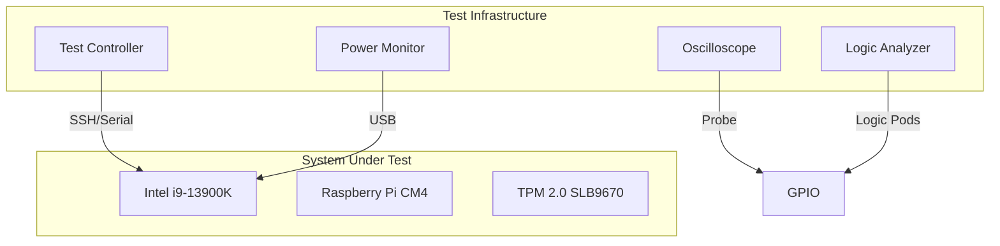

# Production Hardening - Fail-Closed Test Scenarios
## ITHERIS + JARVIS System - Field Testing Procedures

> **Version:** 1.0.0  
> **Classification:** Production Testing  
> **Status:** Implementation Ready  
> **Target:** Hardware Kill Chain, TPM 2.0, Kernel Sovereignty

---

## Table of Contents

1. [Test Environment Setup](#1-test-environment-setup)
2. [Hardware Kill Chain Tests](#2-hardware-kill-chain-tests)
3. [TPM 2.0 Resealing Tests](#3-tpm-20-resealing-tests)
4. [Kernel Sovereignty Tests](#4-kernel-sovereignty-tests)
5. [Graceful Degradation Tests](#5-graceful-degradation-tests)
6. [Expected Outcomes Reference](#6-expected-outcomes-reference)

---

## 1. Test Environment Setup

### 1.1 Hardware Requirements

| Component | Specification | Purpose |
|-----------|---------------|---------|
| Intel i9-13900K | Sovereign Controller | Primary compute |
| Raspberry Pi CM4 | GPIO Bridge | Actuator control |
| Infineon SLB9670 | TPM 2.0 | Key sealing |
| PCIe GPIO Card | 40-pin | Emergency signals |
| Oscilloscope | 100MHz+ | Timing verification |
| Logic Analyzer | 8-channel | GPIO monitoring |

### 1.2 Test Infrastructure



### 1.3 Safety Precautions

- [ ] Emergency stop button within reach
- [ ] All actuators disconnected during initial tests
- [ ] Power supply current-limited
- [ ] Fire extinguisher available
- [ ] Test personnel briefed

---

## 2. Hardware Kill Chain Tests

### 2.1 Test: Thermal Runaway Detection

**Test ID**: HKC-Thermal-01  
**Objective**: Verify kill chain triggers under thermal runaway

**Prerequisites**:
- Julia Brain running at full cognitive load
- Thermal monitoring active
- Temperature sensors calibrated

**Test Procedure**:
```
1. START: Julia Brain at 136.1 Hz cognitive loop
2. INJECT: Thermal stress (synthetic load, 100% CPU)
3. OBSERVE: CPU temperature rising
4. TRIGGER: Cross 105°C threshold
5. MEASURE: Time to kill chain initiation
6. VERIFY: All actuators disabled
7. VERIFY: Memory protected
```

**Expected Outcome**:
| Metric | Target | Measured |
|--------|--------|----------|
| Time to trigger | ≤500ms | TBD |
| Actuator state | LOW (safe) | TBD |
| Memory protection | Applied | TBD |
| GPIO emergency | HIGH | TBD |

**Pass Criteria**: All metrics within target

---

### 2.2 Test: Power Instability Detection

**Test ID**: HKC-Power-01  
**Objective**: Verify kill chain triggers under power instability

**Prerequisites**:
- Power supply with adjustable voltage
- Current monitoring active

**Test Procedure**:
```
1. START: Julia Brain in normal operation
2. INJECT: Voltage sag to 10.8V (below spec)
3. OBSERVE: Power good signal drops
4. MEASURE: Time to kill chain
5. VERIFY: System halts gracefully
```

**Expected Outcome**:
| Metric | Target |
|--------|--------|
| Detection time | ≤50ms |
| Kill chain time | ≤500ms |
| Actuator state | LOW |

---

### 2.3 Test: Watchdog Timeout

**Test ID**: HKC-WDT-01  
**Objective**: Verify watchdog triggers kill chain on Julia hang

**Prerequisites**:
- Hardware watchdog configured
- Watchdog device accessible (`/dev/watchdog`)
- Julia heartbeat active

**Test Procedure**:
```
1. START: Julia Brain in normal operation
2. STOP: Julia heartbeat (simulate hang)
3. MEASURE: Time from last heartbeat to:
   a) NMI interrupt
   b) Kill chain execution
   c) GPIO emergency signal
   d) Actuator lockdown
```

**Expected Timing**:
```
Last Heartbeat → NMI:        1000ms (watchdog timeout)
NMI → Kill Chain Start:      <1ms
Kill Chain → GPIO Signal:     <5ms
GPIO Signal → Actuator LOW:  <30ms (CM4)
─────────────────────────────
Total Response Time:          ≤1036ms
```

**Test Implementation** (Julia):

```julia
"""
Test: Watchdog Timeout Kill Chain
"""
function test_watchdog_kill_chain()
    println("=== HKC-WDT-01: Watchdog Timeout Test ===")
    
    # Record start time
    start_time = time_ns()
    
    # Simulate Julia hang (stop kicking watchdog)
    # In real test: actually stop kicking
    
    # Wait for kill chain
    kill_chain_time = wait_for_kill_chain()
    
    elapsed_ms = (kill_chain_time - start_time) / 1_000_000
    
    println("Kill chain triggered in $(elapsed_ms)ms")
    
    # Verify timing
    if elapsed_ms <= 1036
        println("✓ PASS: Kill chain within timing spec")
        return true
    else
        println("✗ FAIL: Kill chain exceeded timing spec")
        return false
    end
end
```

---

### 2.4 Test: Kernel Panic Integration

**Test ID**: HKC-Panic-01  
**Objective**: Verify panic triggers kill chain

**Prerequisites**:
- Rust panic handler registered
- Kill chain thread can spawn

**Test Procedure**:
```
1. START: Julia Brain in normal operation
2. INJECT: Generate segmentation fault
   - Write to unmapped memory
   - Divide by zero
   - Stack overflow
3. OBSERVE: Panic handler activation
4. VERIFY: Kill chain spawns
5. VERIFY: Memory protection applied
6. VERIFY: Crash dump written
```

**Expected Outcome**:
| Stage | Expected State |
|-------|----------------|
| Panic detected | Crash info captured |
| Kill chain | Executed within 1ms |
| Memory | mprotect(PROT_NONE) applied |
| Crash dump | Written to disk |

---

### 2.5 Test: GPIO Emergency Signal Propagation

**Test ID**: HKC-GPIO-01  
**Objective**: Verify GPIO emergency signal reaches CM4

**Prerequisites**:
- GPIO pin 7 (BCM 4) connected to CM4
- Logic analyzer attached

**Test Procedure**:
```
1. START: Julia Brain normal operation
2. TRIGGER: Emergency signal via Rust
3. MEASURE: 
   a) GPIO pin toggle time
   b) Signal arrival at CM4
   c) CM4 response time
4. VERIFY: All actuator pins set to LOW
```

**Expected Timing**:
```
Emergency Signal → GPIO Toggle:  <1ms
GPIO Toggle → CM4 Detection:    <1ms
CM4 Detection → Actuator LOW:    <30ms
─────────────────────────────
Total Propagation Time:          ≤32ms
```

---

## 3. TPM 2.0 Resealing Tests

### 3.1 Test: Post-Crash Resealing

**Test ID**: TPM-Reseal-01  
**Objective**: Verify TPM reseals after catastrophic failure

**Prerequisites**:
- TPM 2.0 accessible
- Keys sealed to PCR state
- Test keys provisioned

**Test Procedure**:
```
1. START: System in normal operation
2. SEAL: Create memory seal with current PCR state
3. CRASH: Execute kill chain (simulate failure)
4. VERIFY: PCR extended with crash event
5. ATTEMPT: Unseal (should fail - old PCR state)
6. REBOOT: System restart
7. VERIFY: New PCR state matches expected
8. RESEAL: New seal with new PCR state
```

**Expected Outcome**:
| Stage | Expected |
|-------|----------|
| Pre-crash seal | Valid |
| PCR on crash | Extended with crash hash |
| Unseal attempt | FAIL (correct - state changed) |
| Post-reboot | New seal successful |

---

### 3.2 Test: TPM Attestation Verification

**Test ID**: TPM-Attest-01  
**Objective**: Verify TPM quote reflects system state

**Prerequisites**:
- TPM 2.0 with quote capability
- Attestation key provisioned

**Test Procedure**:
```
1. START: System in known good state
2. QUOTE: Request TPM quote for PCRs 0,1,7,14,17,18
3. VERIFY: Quote signature valid
4. MODIFY: Change one bit in memory
5. QUOTE: Request new TPM quote
6. COMPARE: Verify PCR values changed
```

**Expected Outcome**: Quote changes detect system modification

---

### 3.3 Test: TPM Key Rotation

**Test ID**: TPM-Rotate-01  
**Objective**: Verify TPM-managed keys rotate correctly

**Test Procedure**:
```
1. START: Current key in use
2. ROTATE: Trigger key rotation
3. VERIFY: Old key disabled
4. VERIFY: New key active
5. TEST: IPC uses new key
6. VERIFY: Old key cannot decrypt new messages
```

---

## 4. Kernel Sovereignty Tests

### 4.1 Test: Actuation Empty Set Guarantee

**Test ID**: KERNEL-Act-01  
**Objective**: Verify Actuation(t) remains empty during kernel crashes

**Prerequisites**:
- Kernel state observable
- All actions logged

**Test Procedure**:
```
1. START: Julia Brain running
2. CRASH: Kernel panic (simulate)
3. OBSERVE: Action log
4. VERIFY: No actions executed after decision DENIED
5. VERIFY: Actuation(t) = ∅ during crash window
```

**Expected Outcome**: Zero actions executed during crash

---

### 4.2 Test: Fail-Closed Decision Logic

**Test ID**: KERNEL-FC-01  
**Objective**: Verify kernel defaults to DENIED on errors

**Test Procedure**:
```
1. START: Julia Brain running
2. INJECT: Corrupted action proposal
3. OBSERVE: Kernel decision
4. VERIFY: Decision = DENIED
5. INJECT: Missing action fields
6. VERIFY: Decision = DENIED
7. INJECT: Overflow in scoring
8. VERIFY: Decision = DENIED
```

**Expected Outcome**: All error cases → DENIED

---

### 4.3 Test: Trust Level Transition Validation

**Test ID**: KERNEL-Trust-01  
**Objective**: Verify trust transitions require approval

**Test Procedure**:
```
1. START: Trust level = TRUST_LIMITED
2. ATTEMPT: Direct transition to TRUST_FULL
3. VERIFY: Blocked (requires approval)
4. REQUEST: Transition to TRUST_STANDARD
5. APPROVE: Authorization granted
6. VERIFY: Trust = TRUST_STANDARD
```

---

## 5. Graceful Degradation Tests

### 5.1 Test: Network Isolation

**Test ID**: GRACE-Net-01  
**Objective**: Verify network isolation on failure

**Prerequisites**:
- Network PHY controllable via GPIO
- Network isolation required

**Test Procedure**:
```
1. START: Network operational
2. TRIGGER: Kill chain
3. VERIFY: Network PHY reset (GPIO HIGH)
4. VERIFY: No network traffic possible
5. RECOVER: Manual intervention required
```

---

### 5.2 Test: Power Gate

**Test ID**: GRACE-Power-01  
**Objective**: Verify power gate engagement on critical failure

**Prerequisites**:
- Power relay controllable
- Emergency power cutoff configured

**Test Procedure**:
```
1. START: System powered
2. TRIGGER: Critical failure (thermal runaway)
3. VERIFY: Power relay engaged
4. VERIFY: System loses power
5. MANUAL: Physical reset required
```

---

### 5.3 Test: Cognitive Loop Recovery

**Test ID**: GRACE-Cog-01  
**Objective**: Verify cognitive loop recovery after transient failure

**Test Procedure**:
```
1. START: Cognitive loop at 136.1 Hz
2. INJECT: Transient error (memory allocation failure)
3. OBSERVE: Loop pauses
4. VERIFY: Automatic retry
5. VERIFY: Loop resumes at target frequency
6. VERIFY: State preserved
```

---

## 6. Expected Outcomes Reference

### 6.1 Timing Specifications

| Component | Response Time | Critical Threshold |
|-----------|--------------|-------------------|
| Watchdog timeout | 1000ms | 1000ms |
| NMI handler | <1ms | 1ms |
| Kill chain execution | <5ms | 10ms |
| GPIO signal | <1ms | 1ms |
| CM4 actuator lock | 30ms | 50ms |
| Memory protection | <1ms | 5ms |
| TPM seal | 100ms | 500ms |

### 6.2 State Reference

| State | Actuators | Memory | Network | TPM |
|-------|-----------|--------|---------|-----|
| Normal | Enabled | RW | Enabled | Sealed |
| Warning | Enabled | RW | Enabled | Sealed |
| Kill Chain | DISABLED | PROT_NONE | Reset | Extended |
| Recovery | Disabled | RO | Disabled | Unsealed |

---

## References

- [HARDWARE_FAIL_CLOSED_ARCHITECTURE.md](../HARDWARE_FAIL_CLOSED_ARCHITECTURE.md)
- [ARCHITECTURE_RUST_WARDEN.md](../ARCHITECTURE_RUST_WARDEN.md)

---

*Last Updated: 2026-03-14*
