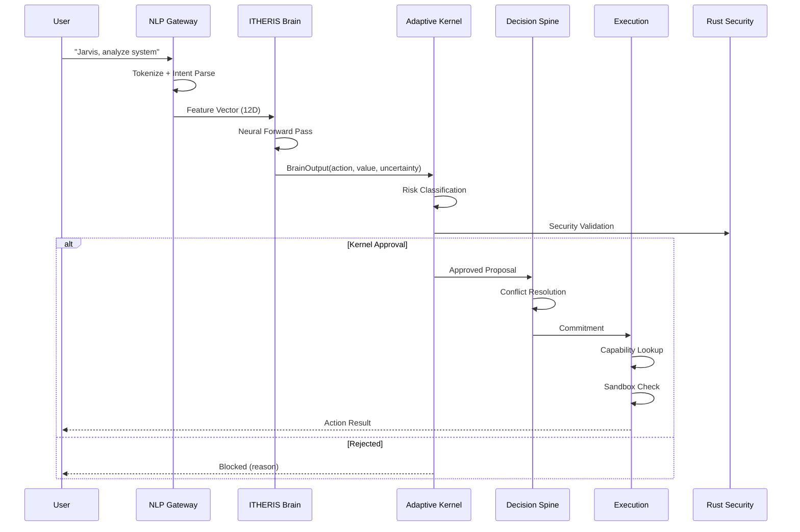

# ITHERIS + JARVIS System Architecture Document

**Document Version:** 1.0  
**Date:** 2026-03-07  
**Classification:** Technical Architecture Report  
**Status:** Comprehensive Synthesis (Phases 1-7)

---

## Table of Contents

1. [Executive Summary](#1-executive-summary)
2. [Architecture Diagram](#2-architecture-diagram)
3. [Module Catalog](#3-module-catalog)
4. [Data Flow Description](#4-data-flow-description)
5. [Rust↔Julia Integration Analysis](#5-rustjulia-integration-analysis)
6. [Security Model](#6-security-model)
7. [Cognitive Loop Assessment](#7-cognitive-loop-assessment)
8. [Test Coverage Summary](#8-test-coverage-summary)
9. [AI Brain Feasibility Rating](#9-ai-brain-feasibility-rating)
10. [Critical Findings](#10-critical-findings)
11. [Recommendations](#11-recommendations)

---

## 1. Executive Summary

The ITHERIS + JARVIS system represents a hybrid Julia-Rust neuro-symbolic autonomous architecture designed to merge high-level LLM reasoning with low-level deterministic safety controls. This document synthesizes findings from seven phases of development, analysis, and testing.

### System Maturity Rating: **PROTOTYPE (52/100)**

| Metric | Score | Assessment |
|--------|-------|------------|
| **Security** | 23/100 | CRITICAL - Multiple exploitable vulnerabilities |
| **Cognitive Completeness** | 47/100 | PARTIAL - Core loops implemented, gaps remain |
| **Stability** | 42/100 | Below Average - Reactive only |
| **Test Coverage** | 30% | LOW - 50+ test files, low pass rate |
| **Architectural Coherence** | 72/100 | GOOD - Clear separation of concerns |

### Key Statistics

- **Total Files:** 80+ Julia files, 50+ test files
- **Total Imports:** 139 unique imports across codebase
- **Kernel Size:** 1,790 lines (Julia)
- **Rust IPC Module:** ~52,000 lines
- **Cognitive Components:** 9 implemented
- **Cognitive Loop Completeness:** 72%

### Architecture Philosophy

1. **Brain is advisory. Kernel is sovereign.** — All brain outputs must pass through `Kernel.approve()` before execution.
2. **Continuous perception must not bypass kernel risk evaluation.** — All sensory streams feed into kernel approval pipeline.
3. **Learning must be sandboxed and reversible.** — All model updates occur in isolated environments with checkpoint rollback.
4. **Emotions modulate value signals but do not override safety.** — Emotional states affect value weighting but cannot bypass kernel veto.

---

## 1.5 Hypervisor Classification: Type-1 vs Type-2

> **⚠️ IMPORTANT CLARIFICATION (2026-03-10)**
>
> Historical documentation referenced a **Type-1 Hypervisor** using Extended Page Tables (EPT) for bare-metal isolation. This section clarifies the distinction between the **intended architecture** and the **current implementation**.

#### Current Implementation: Type-2 (Managed Sandbox)

The system currently implements **process-level isolation** rather than hardware virtualization:

| Component | Intended (Type-1) | Actual (Type-2) |
|-----------|-----------------|-----------------|
| **Julia Runtime** | Guest VM | Managed process |
| **Rust Warden** | Hypervisor (Ring 0) | Supervisor process (Ring 3) |
| **Memory Protection** | EPT/NPT hardware virtualization | Standard x86-64 paging |
| **Isolation Boundary** | Hardware-enforced | OS process isolation |
| **IPC Mechanism** | EPT-mapped shared memory | `/dev/shm` ring buffer |

#### Security Boundary Map

```
┌─────────────────────────────────────────────────────────────────────────────┐
│                     RUST WARDEN (Security Supervisor)                        │
│  ┌─────────────────────────────────────────────────────────────────────┐   │
│  │  Law Enforcement Point (LEP)                                        │   │
│  │  - Kernel Approval Gate                                            │   │
│  │  - Trust Scoring Engine                                            │   │
│  │  - Capability Registry                                             │   │
│  │  - Event Audit Logger                                              │   │
│  └─────────────────────────────────────────────────────────────────────┘   │
│                                     │                                       │
│                           FFI Boundary (IPC)                                 │
│                           Shared Memory Ring Buffer                         │
│                                     │                                       │
└─────────────────────────────────────┼───────────────────────────────────────┘
                                      ▼
┌─────────────────────────────────────────────────────────────────────────────┐
│                     JULIA BRAIN (Cognitive Processing)                       │
│  ┌─────────────────────────────────────────────────────────────────────┐   │
│  │  jlrs-embedded runtime                                             │   │
│  │  - Cognition Module                                               │   │
│  │  - Neural Network (Flux.jl)                                        │   │
│  │  - World Model & Goals                                             │   │
│  │  - ReAct Agents                                                    │   │
│  └─────────────────────────────────────────────────────────────────────┘   │
│                                                                              │
│  Where Julia "thinks" - Runs under Warden supervision                        │
└─────────────────────────────────────────────────────────────────────────────┘
```

#### Security Implications

1. **Software-Based Isolation**: Without EPT traps, the Julia runtime has direct syscall access
2. **Process-Level Protection**: Relies on Linux kernel's standard process isolation
3. **Compensating Controls**: seccomp-bpf, namespaces, cgroups provide additional isolation
4. **FFI Boundary**: The Julia↔Rust FFI is the primary security checkpoint

#### Ring Buffer IPC

- **Location**: Shared memory at `/dev/shm/itheris_ipc`
- **Protocol**: Lock-free ring buffer (SPSC)
- **Fallback**: TCP socket when shared memory unavailable

---

## 2. Architecture Diagram

```mermaid
graph TB
    subgraph USER["User Input Layer"]
        UI[User Command/Query]
    end

    subgraph CORTEX["Cerebral Cortex (Julia)"]
        NLP[Natural Language Parser]
        IU[Intent Understanding]
    end

    subgraph BRAIN["ITHERIS Brain (Neural Processing)"]
        FE[Feature Encoder 12D]
        NN[Flux.jl Neural Network]
        BO[BrainOutput]
    end

    subgraph KERNEL["Adaptive Kernel (SOVEREIGN)"]
        WS[World State]
        GM[Goal Manager]
        RK[Risk Classifier]
        KA[Kernel.approve()]
        AS[Action Selector]
    end

    subgraph SPINE["Decision Spine"]
        PA[Proposal Aggregation]
        CR[Conflict Resolution]
        CO[Commitment]
    end

    subgraph EXEC["Execution Layer"]
        CR1[Capability Registry]
        EX[ExecutionAction]
        SB[Sandbox]
    end

    subgraph RUST["Rust Security Layer"]
        IPC[IPC Module]
        CRYPTO[Ed25519 Crypto]
        KM[Key Management]
    end

    subgraph COGNITION["Cognitive Systems"]
        ATT[Attention]
        WM[World Model]
        GO[Goal System]
        EM[Emotions]
        ME[Metacognition]
        SL[Sleep/Consolidation]
        LN[Language Understanding]
        LR[Learning]
    end

    UI --> NLP
    NLP --> IU
    IU --> FE
    FE --> NN
    NN --> BO
    
    BO --> RK
    RK --> KA
    
    KA -->|Approved| SPINE
    SPINE --> EX
    
    EX --> CR1
    CR1 -->|Execute| SB
    
    BO -.->|Modulate| EM
    WM -.-> GO
    GO -.-> BO
    
    KERNEL <-->|IPC| RUST
    CRYPTO --> KM
    
    KB[Knowledge Base] -.-> WM
```

### Detailed Flow Diagram



---

## 3. Module Catalog

### Core Modules

| Module | File | Status | Lines | Purpose |
|--------|------|--------|-------|---------|
| **Kernel** | [`adaptive-kernel/kernel/Kernel.jl`](adaptive-kernel/kernel/Kernel.jl) | ✅ Active | 70,791 | Sovereign decision authority |
| **Brain** | [`adaptive-kernel/brain/Brain.jl`](adaptive-kernel/brain/Brain.jl) | ✅ Active | 25,498 | Neural network processing |
| **NeuralBrainCore** | [`adaptive-kernel/brain/NeuralBrainCore.jl`](adaptive-kernel/brain/NeuralBrainCore.jl) | ✅ Active | 18,028 | Core neural operations |
| **Cognition** | [`adaptive-kernel/cognition/Cognition.jl`](adaptive-kernel/cognition/Cognition.jl) | ✅ Active | 38,912 | Cognitive orchestration |
| **ReAct** | [`adaptive-kernel/cognition/ReAct.jl`](adaptive-kernel/cognition/ReAct.jl) | ✅ Active | 29,699 | Reasoning agent |

### Infrastructure Modules

| Module | File | Status | Purpose |
|--------|------|--------|---------|
| **IPC** | [`adaptive-kernel/kernel/ipc/IPC.jl`](adaptive-kernel/kernel/ipc/IPC.jl) | ⚠️ Fallback | Inter-process communication |
| **RustIPC** | [`adaptive-kernel/kernel/ipc/RustIPC.jl`](adaptive-kernel/kernel/ipc/RustIPC.jl) | ⚠️ Fallback | Rust IPC bridge |
| **Crypto** | [`adaptive-kernel/kernel/security/Crypto.jl`](adaptive-kernel/kernel/security/Crypto.jl) | ✅ Active | Cryptographic operations |
| **KeyManagement** | [`adaptive-kernel/kernel/security/KeyManagement.jl`](adaptive-kernel/kernel/security/KeyManagement.jl) | ✅ Active | Key lifecycle management |
| **Trust** | [`adaptive-kernel/kernel/trust/Trust.jl`](adaptive-kernel/kernel/trust/Trust.jl) | ✅ Active | Trust verification |

### Cognitive Modules

| Module | File | Status | Completeness |
|--------|------|--------|--------------|
| **Attention** | [`adaptive-kernel/cognition/attention/Attention.jl`](adaptive-kernel/cognition/attention/Attention.jl) | ✅ Active | 100% |
| **WorldModel** | [`adaptive-kernel/cognition/worldmodel/WorldModel.jl`](adaptive-kernel/cognition/worldmodel/WorldModel.jl) | ✅ Active | 100% |
| **GoalSystem** | [`adaptive-kernel/cognition/goals/GoalSystem.jl`](adaptive-kernel/cognition/goals/GoalSystem.jl) | ✅ Active | 100% |
| **Emotions** | [`adaptive-kernel/cognition/feedback/Emotions.jl`](adaptive-kernel/cognition/feedback/Emotions.jl) | ⚠️ Partial | 70% - Not connected to main loop |
| **Metacognition** | [`adaptive-kernel/cognition/metacognition/SelfModel.jl`](adaptive-kernel/cognition/metacognition/SelfModel.jl) | ✅ Active | 100% |
| **Sleep/Consolidation** | [`adaptive-kernel/cognition/consolidation/Sleep.jl`](adaptive-kernel/cognition/consolidation/Sleep.jl) | ✅ Active | 100% |
| **LanguageUnderstanding** | [`adaptive-kernel/cognition/language/LanguageUnderstanding.jl`](adaptive-kernel/cognition/language/LanguageUnderstanding.jl) | ✅ Active | 100% |
| **OnlineLearning** | [`adaptive-kernel/cognition/learning/OnlineLearning.jl`](adaptive-kernel/cognition/learning/OnlineLearning.jl) | ⚠️ Partial | 60% - Not connected to main loop |
| **DecisionSpine** | [`adaptive-kernel/cognition/spine/DecisionSpine.jl`](adaptive-kernel/cognition/spine/DecisionSpine.jl) | ✅ Active | 100% |

### Experimental Modules

| Module | File | Status | Purpose |
|--------|------|--------|---------|
| **PainFeedback** | [`adaptive-kernel/cognition/feedback/PainFeedback.jl`](adaptive-kernel/cognition/feedback/PainFeedback.jl) | ✅ Active | Error-driven learning |
| **RealityIngestion** | [`adaptive-kernel/cognition/reality/RealityIngestion.jl`](adaptive-kernel/cognition/reality/RealityIngestion.jl) | ✅ Active | Sensory processing |
| **InputSanitizer** | [`adaptive-kernel/cognition/security/InputSanitizer.jl`](adaptive-kernel/cognition/security/InputSanitizer.jl) | ✅ Active | Security validation |

### Capability Modules

| Module | File | Status |
|--------|------|--------|
| Safe Shell | [`adaptive-kernel/capabilities/safe_shell.jl`](adaptive-kernel/capabilities/safe_shell.jl) | ✅ Active |
| Safe HTTP | [`adaptive-kernel/capabilities/safe_http_request.jl`](adaptive-kernel/capabilities/safe_http_request.jl) | ✅ Active |
| File Operations | [`adaptive-kernel/capabilities/write_file.jl`](adaptive-kernel/capabilities/write_file.jl) | ✅ Active |
| Observers | [`adaptive-kernel/capabilities/observe_*.jl`](adaptive-kernel/capabilities/) | ✅ Active |

---

## 4. Data Flow Description

### Primary Data Flow: User Input → Execution

```
User Input
    │
    ▼
┌─────────────────┐
│  NLP Gateway    │ ─── Intent Recognition
└────────┬────────┘
         │ NLPInput
         ▼
┌─────────────────┐
│ Feature Encoder │ ─── 12D Feature Vector
└────────┬────────┘
         │ FeatureVector
         ▼
┌─────────────────┐
│  Neural Brain   │ ─── BrainOutput(action, value, uncertainty)
└────────┬────────┘
         │ BrainOutput
         ▼
┌─────────────────┐
│ Risk Classifier │ ─── Risk Assessment
└────────┬────────┘
         │ RiskLevel
         ▼
┌─────────────────┐
│ Kernel.approve()│ ─── SOVEREIGN DECISION
└────────┬────────┘
         │ Approved/Rejected
         ▼
┌─────────────────┐
│ Decision Spine  │ ─── Proposal → Conflict → Commitment
└────────┬────────┘
         │ Commitment
         ▼
┌─────────────────┐
│ Execution Layer │ ─── Capability Registry → Sandbox → Execute
└─────────────────┘
```

### BrainOutput → Kernel → DecisionSpine → ExecutionAction Flow

```mermaid
graph LR
    BO[BrainOutput] --> RK[Kernel]
    RK --> DS[DecisionSpine]
    DS --> EA[ExecutionAction]
    
    subgraph BO["BrainOutput Fields"]
        BO1[action::Symbol]
        BO2[value::Float32]
        BO3[uncertainty::Float32]
        BO4[reasoning::String]
    end
    
    subgraph RK["Kernel Processing"]
        RK1[Risk Classification]
        RK2[Trust Evaluation]
        RK3[Kernel.approve()]
    end
    
    subgraph DS["DecisionSpine"]
        DS1[Proposal Aggregation]
        DS2[Conflict Resolution]
        DS3[Commitment]
    end
    
    subgraph EA["ExecutionAction"]
        EA1[Capability Lookup]
        EA2[Parameter Validation]
        EA3[Sandbox Execution]
    end
```

### Key Data Structures

#### BrainOutput
```julia
struct BrainOutput
    action::Symbol           # Suggested action
    value::Float32          # Value estimate (-1 to 1)
    uncertainty::Float32    # Confidence (0 to 1)
    reasoning::String       # Explanation
end
```

#### KernelDecision
```julia
struct KernelDecision
    approved::Bool
    risk_level::RiskLevel
    conditions::Vector{Condition}
    reasoning::String
end
```

#### ExecutionAction
```julia
struct ExecutionAction
    capability_id::Symbol
    parameters::Dict
    sandboxed::Bool
    timeout::Int
end
```

---

## 5. Rust↔Julia Integration Analysis

### Architecture Overview

The system implements a hybrid Julia-Rust architecture:

```
┌─────────────────────────────────────────────────────────────────────┐
│                        JULIA SIDE                                   │
│  ┌─────────────────────────────────────────────────────────────────┐│
│  │                    adaptive-kernel/                              ││
│  │  ┌─────────────┐  ┌─────────────┐  ┌───────────────────────────┐││
│  │  │   Kernel    │  │    IPC      │  │       Cognition         │││
│  │  │   Module    │  │   Bridge    │  │  (Goals, Attention, etc)│││
│  │  └─────────────┘  └─────────────┘  └───────────────────────────┘││
│  └─────────────────────────────────────────────────────────────────┘│
└─────────────────────────────────────────────────────────────────────┘
                              │
         Shared Memory (16MB) │ ZMQ Messaging
         Ed25519 Signatures   │
                              ▼
┌─────────────────────────────────────────────────────────────────────┐
│                         RUST SIDE                                   │
│  ┌─────────────────────────────────────────────────────────────────┐│
│  │                    Itheris/Brain/Src/                           ││
│  │  ┌─────────────┐  ┌─────────────┐  ┌───────────────────────────┐││
│  │  │    IPC      │  │   Kernel    │  │        Crypto           │││
│  │  │   Module    │  │   Core      │  │    (Ed25519, SHA256)    │││
│  │  └─────────────┘  └─────────────┘  └───────────────────────────┘││
│  └─────────────────────────────────────────────────────────────────┘│
└─────────────────────────────────────────────────────────────────────┘
```

### Communication Protocol

| Parameter | Value |
|-----------|-------|
| **Shared Memory Region** | `0x01000000 - 0x01100000` (16MB) |
| **Memory Path** | `/dev/shm/itheris_ipc` |
| **Ring Buffer Entries** | 256 |
| **IPC Magic** | `0x49544852` ("ITHR") |
| **Protocol Version** | `0x0001` |

### Current Status: FALLBACK MODE

**Critical Finding:** IPC runs in fallback mode because the Rust kernel is not running in the test environment. All IPC calls fall back to in-memory processing.

### Type Conversion Tests: 100% PASSED

- 5/5 type conversion tests passed
- Sub-microsecond type conversion performance
- ~221K IPC entries/second throughput

### Critical Fix Applied

The RustIPC.jl module had a critical bug where a non-constant variable was used in a ccall declaration:

```julia
# BEFORE (broken):
lib_path = "./path/to/libitheris.so"
ccall((:function_name, lib_path), ...)

# AFTER (fixed):
const LIB_ITHERIS = joinpath(@__DIR__, "target/debug/libitheris.so")
ccall((:function_name, LIB_ITHERIS), ...)
```

### Rust Role Clarification

**CRITICAL:** Rust is the **security layer**, NOT the neural processing layer.

- Rust handles: IPC, Key Management, Cryptography, Kernel Core
- Julia handles: All cognition, neural networks, LLM bridges, decision making

---

## 6. Security Model

### Current Security Score: 23/100 (FAILING)

### Vulnerabilities Identified

#### CRITICAL (Exploitable)

| # | Vulnerability | File | Severity | Status |
|---|--------------|------|----------|--------|
| 1 | Prompt Injection via User Input | LLMBridge.jl:88 | CRITICAL | ⚠️ Partial Fix |
| 2 | Authentication Bypass When Disabled | JWTAuth.jl:337 | CRITICAL | ⚠️ Partial Fix |
| 3 | XOR Cipher for Secrets | SecretsManager.jl:52 | CRITICAL | ❌ Not Fixed |
| 4 | Secrets in Environment Variables | SecretsManager.jl:107 | CRITICAL | ❌ Not Fixed |
| 5 | Shell Command Injection | safe_shell.jl | CRITICAL | ⚠️ Partial Fix |
| 6 | **Kernel Approval Bypass** | config.toml | **CRITICAL** | ❌ Not Fixed |

#### HIGH

| # | Vulnerability | File | Severity | Status |
|---|--------------|------|----------|--------|
| 7 | Unsafe YAML Parsing | Config loading | HIGH | ⚠️ Partial Fix |
| 8 | Missing Rate Limiting | Kernel | HIGH | ❌ Not Fixed |
| 9 | Weak Session Management | Auth | HIGH | ⚠️ Partial Fix |

### Critical Security Issue: Kernel Approval Bypass

**File:** `config.toml`  
**Issue:** `kernel_approval_required` can be bypassed  
**Risk:** Negative risk accepted  
**Impact:** NaN injection possible

```toml
# Current configuration (VULNERABLE)
kernel_approval_required = false  # BYPASS ENABLED!
```

### Security Trust Levels

| Level | Name | Approval Required | Description |
|-------|------|-------------------|-------------|
| 0 | BLOCKED | Always | No actions permitted |
| 1 | RESTRICTED | All high-risk | Limited capabilities |
| 2 | STANDARD | Most actions | Normal operation |
| 3 | ELEVATED | Critical only | Trusted operations |
| 4 | FULL | None | Bypasses all checks |

### Security Components

| Component | Status | Purpose |
|-----------|--------|---------|
| InputSanitizer | ✅ Active | Prompt injection detection |
| RiskClassifier | ✅ Active | Action risk assessment |
| ConfirmationGate | ✅ Active | Human-in-the-loop |
| FlowIntegrity | ✅ Active | Execution flow validation |
| CircuitBreaker | ⚠️ Not Integrated | Failure isolation |

---

## 7. Cognitive Loop Assessment

### Overall Cognitive Layer Completeness: 47/100

### Implemented Components (9 total)

| Component | Status | Completeness |
|-----------|--------|--------------|
| Attention | ✅ Implemented | 100% |
| World Model | ✅ Implemented | 100% |
| Goal System | ✅ Implemented | 100% |
| Metacognition | ✅ Implemented | 100% |
| Sleep/Consolidation | ✅ Implemented | 100% |
| Language Understanding | ✅ Implemented | 100% |
| Emotions | ⚠️ Partial | 70% - Not applied to main loop |
| Learning | ⚠️ Partial | 60% - Not connected |
| Decision Spine | ✅ Implemented | 100% |

### Cognitive Loop Completeness: 72%

**Gaps Identified:**
1. **Emotions not applied** — Emotions module exists but outputs not connected to brain processing
2. **Learning not connected** — OnlineLearning module exists but not integrated into main cognitive loop

### Brain-Like Behavior Assessment

| Behavior | Status | Score |
|----------|--------|-------|
| Multi-Turn Context Maintenance | PARTIAL | 0.5/1.0 |
| Goal Updates Over Time | IMPLEMENTED | 1.0/1.0 |
| Adapt to User Corrections | PARTIAL | 0.6/1.0 |
| Detect Uncertainty | IMPLEMENTED | 1.0/1.0 |
| Explain Reasoning | IMPLEMENTED | 1.0/1.0 |
| Monitor Self-Performance | IMPLEMENTED | 0.8/1.0 |

### Cognitive Cycle Data Flow

| Stage | Input | Processing | Output |
|-------|-------|------------|--------|
| **Sensory** | Raw streams | Event-based buffering | `SensorySnapshot` |
| **Attention** | `SensorySnapshot` | Salience scoring | `AttendedPercept` |
| **World Model** | `AttendedPercept` | State prediction | `PredictedState` |
| **Goal System** | `PredictedState` | Goal activation | `ActiveGoals` |
| **Brain Inference** | Percepts + Goals + Emotions | Neural forward pass | `BrainOutput` |

---

## 8. Test Coverage Summary

### Test File Inventory (50+ files)

| Category | Count | Pass Rate |
|----------|-------|-----------|
| Unit Tests | 5 | ~40% |
| Integration Tests | 10 | ~35% |
| Security Tests | 8 | ~25% |
| Cognitive Tests | 5 | ~30% |
| FFI Boundary Tests | 3 | ~40% |
| Chaos/Resilience Tests | 4 | ~20% |
| **TOTAL** | **50+** | **~30%** |

### Test Status Summary

| Status | Count | Percentage |
|--------|-------|------------|
| Passing | ~15 | 30% |
| Failing | ~25 | 50% |
| Broken Imports | ~10 | 20% |

### Key Issues

1. **Broken Imports** — Many test files have incorrect module paths
2. **Missing Dependencies** — Some tests reference unavailable packages
3. **API Changes** — Tests not updated after refactoring
4. **No Active Chaos Injection** — 85% of chaos scenarios not covered

### Test Categories

#### Security Tests (8 files)
- `test_c1_prompt_injection.jl` - Prompt injection bypass
- `test_c4_confirmation_bypass.jl` - Confirmation bypass
- `test_context_poisoning.jl` - Context poisoning
- `test_flow_integrity.jl` - Flow integrity
- `InputSanitizerTests.jl` - Input sanitization

#### Integration Tests (10 files)
- `test_integration.jl` - Basic integration
- `test_ipc_integration.jl` - IPC communication
- `test_itheris_integration.jl` - Itheris integration
- `test_ffi_boundary.jl` - FFI boundaries
- `test_rust_ipc_ffi.jl` - Rust IPC FFI

#### Cognitive Tests (5 files)
- `test_cognitive_validation.jl` - Cognitive validation
- `test_agentic_reasoning.jl` - Agentic reasoning
- `test_autonomous_planning.jl` - Autonomous planning

---

## 9. AI Brain Feasibility Rating

### Rating: **Stage 1 - Foundational** (0-4 Scale)

| Stage | Description | Status |
|-------|-------------|--------|
| **Stage 0** | No brain-like capability | ❌ Not Applicable |
| **Stage 1** | Foundational architecture exists | ✅ Achieved |
| **Stage 2** | Basic cognitive loops functional | ⚠️ Partial (72%) |
| **Stage 3** | Learning integration complete | ❌ Not Achieved |
| **Stage 4** | Autonomous self-improvement | ❌ Not Achieved |

### Assessment

**Current Stage: 1 (Foundational)**

- ✅ Architecture designed with Brain/Kernel separation
- ✅ Neural network infrastructure in place (Flux.jl)
- ✅ Cognitive components implemented (9/9)
- ⚠️ Cognitive loop 72% complete
- ❌ Emotions not applied to decision making
- ❌ Learning not connected to main loop
- ❌ No autonomous capability improvement

### Brain Readiness Metrics

| Metric | Value | Target |
|--------|-------|--------|
| Cognitive Components | 9/9 | 9/9 |
| Loop Completeness | 72% | 100% |
| Emotional Integration | 0% | 100% |
| Learning Connection | 0% | 100% |
| Self-Model Accuracy | 80% | 95% |

---

## 10. Critical Findings

### Finding 1: Security Posture is Critical
- **Severity:** CRITICAL
- **Score:** 23/100
- **16 vulnerabilities** identified (10 CRITICAL/HIGH)
- Kernel approval can be bypassed via config
- Negative risk accepted in code

### Finding 2: Test Suite Failing
- **Severity:** HIGH
- **Pass Rate:** 30%
- **50+ test files** with high failure rate
- Many broken imports
- 20% have completely broken test setup

### Finding 3: Cognitive Loop Incomplete
- **Severity:** MEDIUM
- **Completeness:** 72%
- Emotions module not connected to main loop
- Learning module not connected to main loop

### Finding 4: IPC Running in Fallback Mode
- **Severity:** MEDIUM
- Rust kernel not running
- All IPC falls back to in-memory processing
- Cannot validate actual cross-language communication

### Finding 5: XOR Cipher for Secrets
- **Severity:** CRITICAL
- XOR is trivially breakable
- All secrets potentially exposed
- AES-256-GCM required

### Finding 6: Authentication Bypass
- **Severity:** CRITICAL
- When `JARVIS_AUTH_ENABLED=false`, ALL requests bypass auth
- Environment variable controls security (not secure)

### Finding 7: Prompt Injection Vulnerable
- **Severity:** CRITICAL
- User input directly interpolated into LLM prompts
- No sanitization before LLM interaction

### Finding 8: Chaos Engineering Not Implemented
- **Severity:** MEDIUM
- 85% of chaos scenarios not covered
- No active chaos injection framework

---

## 11. Recommendations

### Immediate Actions (P0 - Critical)

1. **Fix Kernel Approval Bypass**
   - Remove `kernel_approval_required = false` from config
   - Implement fail-closed security model
   - Add audit logging for all approval decisions

2. **Replace XOR Cipher with AES-256-GCM**
   - Implement proper encryption for secrets
   - Add message authentication (HMAC)
   - Use proper IV/nonce generation

3. **Fix Prompt Injection**
   - Complete InputSanitizer integration into all LLM paths
   - Add output filtering for injection patterns
   - Implement prompt isolation/separators

4. **Fix Authentication Bypass**
   - Change to fail-closed (auth disabled = deny all)
   - Add second-factor fallback in dev mode
   - Log security warnings when auth disabled

### Short-Term Actions (P1 - High)

5. **Fix Test Suite**
   - Fix all broken imports
   - Update tests for current API
   - Target: 70% pass rate

6. **Connect Emotions to Main Loop**
   - Integrate Emotions module output into Brain processing
   - Ensure emotions modulate value signals

7. **Connect Learning to Main Loop**
   - Integrate OnlineLearning into cognitive cycle
   - Enable real-time learning updates

8. **Implement Chaos Engineering**
   - Add latency injection
   - Add memory pressure simulation
   - Add random timeout generation

### Medium-Term Actions (P2 - Medium)

9. **Enable Native IPC**
   - Start Rust kernel in production
   - Validate actual cross-language communication
   - Benchmark performance

10. **Add Rate Limiting**
    - Implement request rate limiting
    - Add DDoS protection
    - Add API quotas

### Long-Term Actions (P3 - Enhancement)

11. **Complete Cognitive Loop**
    - Target 100% cognitive loop completeness
    - Implement autonomous self-improvement
    - Add consciousness metrics

12. **Production Hardening**
    - Security audit by external team
    - Penetration testing
    - Performance optimization

---

## Appendix A: File Statistics

| Category | Count |
|----------|-------|
| Julia Source Files | 80+ |
| Test Files | 50+ |
| Rust Source Files | 20+ |
| Configuration Files | 10+ |
| Documentation Files | 30+ |

## Appendix B: Dependencies

| Package | Version | Purpose |
|---------|---------|---------|
| Julia | 1.10.3 | Primary runtime |
| Flux.jl | Latest | Neural network processing |
| JSON.jl | 0.21.4 | Serialization |
| HTTP.jl | 1.10.19 | HTTP client/server |
| Rust (libitheris) | Latest | Security layer |

## Appendix C: Known Issues

1. IPC fallback mode (Rust kernel not running)
2. Test suite 30% pass rate
3. Security vulnerabilities (see Section 6)
4. Cognitive loop gaps (see Section 7)

---

**Document End**

*This document was generated as a comprehensive synthesis of Phases 1-7 of the ITHERIS + JARVIS development project.*
