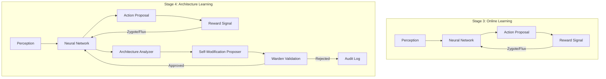
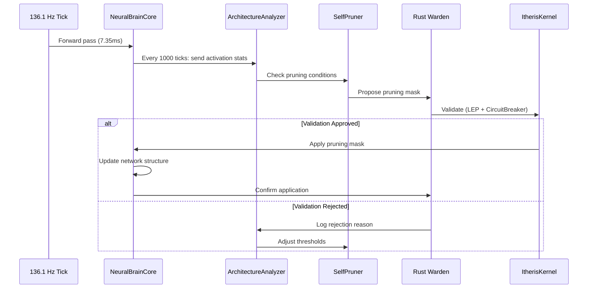
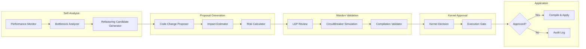
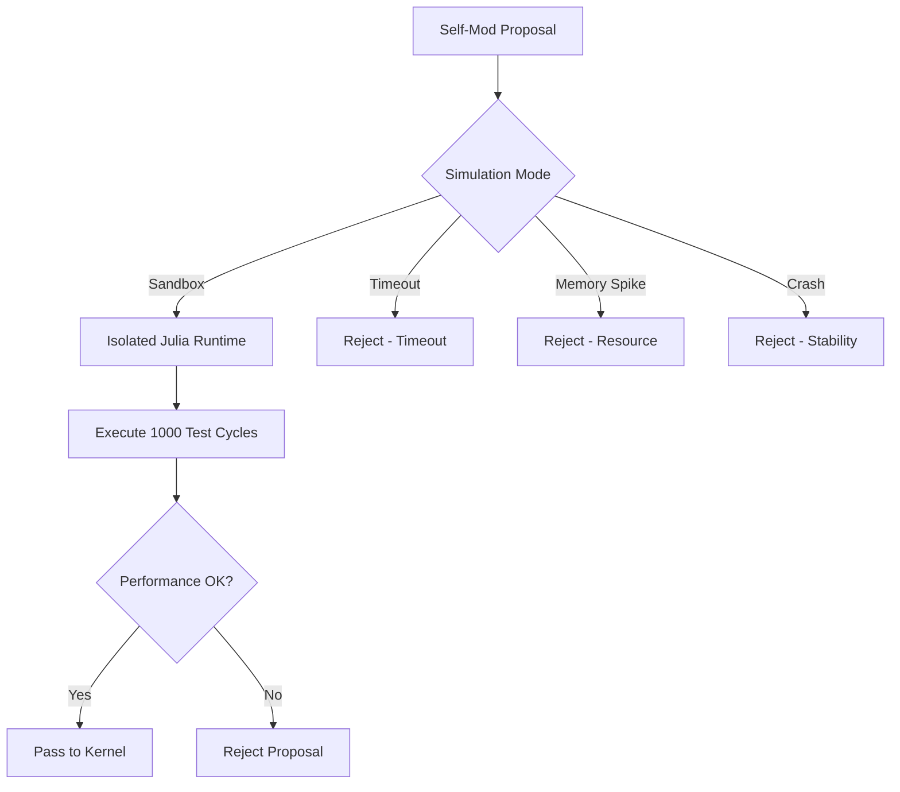
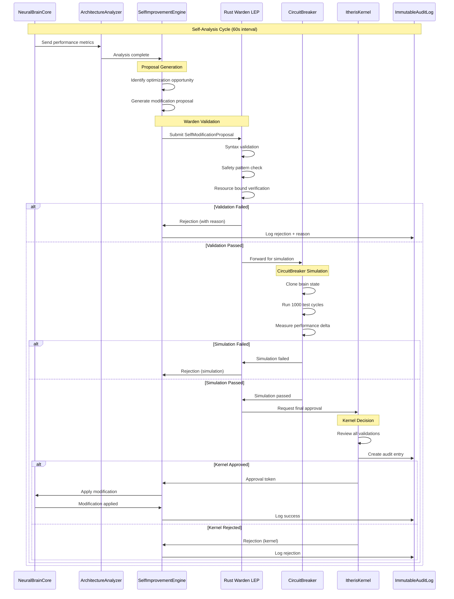
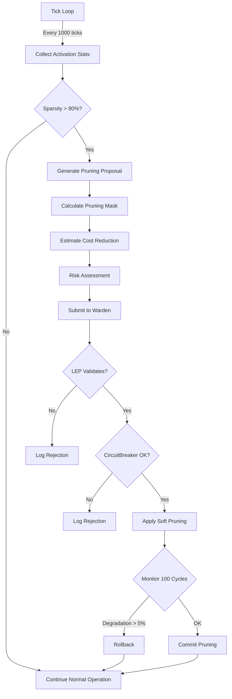
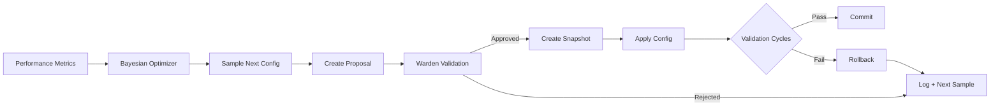
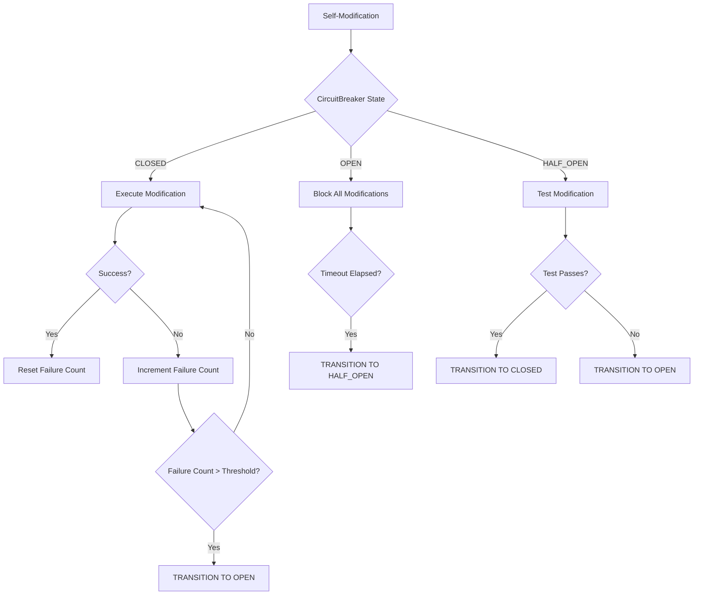

# Stage 4: Autonomous Self-Improvement Architecture

## ITHERIS + JARVIS System Technical Design Document

**Version:** 1.0  
**Stage:** 4 - Autonomous Self-Improvement  
**Current Readiness Score:** 4.2/5.0  
**Target:** AI Brain Feasibility Scale - Pinnacle Level  
**Date:** 2026-03-14

---

## Table of Contents

1. [Executive Summary](#1-executive-summary)
2. [Architectural Evolution](#2-architectural-evolution)
3. [Warden-Supervised Coding](#3-warden-supervised-coding)
4. [System Components](#4-system-components)
5. [Data Flows](#5-data-flows)
6. [Integration Points](#6-integration-points)
7. [Risk Assessment](#7-risk-assessment)
8. [Implementation Roadmap](#8-implementation-roadmap)

---

## 1. Executive Summary

### 1.1 Stage 4 Vision

Stage 4 enables the ITHERIS + JARVIS system to transition from **adaptive learning within fixed architecture** to **autonomous architectural self-optimization**. This represents the pinnacle of the AI Brain Feasibility scale, where the system can:

1. **Analyze its own cognitive performance** and identify structural inefficiencies
2. **Propose neural architecture modifications** (pruning, layer changes, connectivity patterns)
3. **Auto-tune hyperparameters** to optimize metabolic efficiency
4. **Refactor its own Julia modules** through Warden-supervised coding
5. **Validate all self-modifications** through multi-layered safety checks before compilation

### 1.2 Current State Analysis

| Component | Current Status | Stage 4 Enhancement |
|-----------|---------------|---------------------|
| Cognitive Loop | 136.1 Hz (~7.35ms/cycle) | Add self-analysis sub-cycles |
| Neural Learning | Flux.jl/Zygote weight updates | Structural optimization |
| Decision Spine | Commitment handling | Self-modification proposals |
| Rust Warden | LEP + CircuitBreaker | Code validation pipeline |
| Metabolic Controller | Energy management | Architecture cost modeling |

### 1.3 Key Architectural Principles

1. **Advisory-Only Self-Modification**: The brain proposes, Warden validates, Kernel approves
2. **Fail-Closed Safety**: Any validation failure triggers immediate rejection and logging
3. **Metabolic Awareness**: Self-optimization must reduce INFERENCE_COST, not increase it
4. **Temporal Isolation**: Self-improvement operates on separate timescale (seconds) from cognitive loop (milliseconds)
5. **Immutable Audit Trail**: All self-modifications logged with full provenance

---

## 2. Architectural Evolution

### 2.1 From Weight Learning to Architecture Learning



### 2.2 Autonomous Network Pruning Mechanism

#### 2.2.1 Pruning Trigger Conditions

| Condition | Threshold | Analysis Frequency |
|-----------|-----------|-------------------|
| Activation Sparsity | >80% zero activations | Per epoch |
| Gradient Magnitude | <0.001 mean magnitude | Per batch |
| Weight Magnitude | <0.0001 mean magnitude | Weekly |
| Metabolic Cost | >20% of budget | Per tick |
| Latency Contribution | >5ms in pipeline | Per 100 cycles |

#### 2.2.2 Pruning Strategy: Magnitude + Activation Hybrid

```
SelfPruningAlgorithm:
  1. MEASURE phase (every N cognitive cycles):
     - Record activation patterns for all neurons
     - Compute gradient flow statistics
     - Calculate connection importance scores
  
  2. PROPOSE phase (triggered by thresholds):
     - Identify candidate connections for pruning
     - Estimate impact on inference cost
     - Generate pruning mask proposal
  
  3. VALIDATE phase (Warden-supervised):
     - Pass proposal to LEP for safety review
     - Run CircuitBreaker simulation
     - Verify no critical pathways affected
  
  4. APPLY phase (if approved):
     - Apply soft pruning (multiply by mask)
     - Monitor performance delta
     - Commit or rollback based on results
```

#### 2.2.3 Integration with 136.1 Hz Tick Loop



### 2.3 Hyperparameter Auto-Tuning System

#### 2.3.1 Tunable Parameters

| Parameter | Range | Current Setting | Optimization Target |
|-----------|-------|-----------------|-------------------|
| Learning Rate | 0.0001 - 0.1 | 0.001 | Convergence speed |
| Batch Size | 8 - 128 | 32 | Memory/throughput |
| Dropout Rate | 0.0 - 0.5 | 0.1 | Generalization |
| Entropy Coefficient | 0.0 - 0.1 | 0.01 | Exploration |
| Hidden Dimensions | 64 - 512 | 128 | Capacity/cost |

#### 2.3.2 Metabolic Efficiency Optimization

The hyperparameter tuner operates under a **metabolic constraint**:

```
OptimizationObjective:
    minimize: INFERENCE_COST * latency_factor
    subject to: accuracy_delta >= -0.05
                confidence >= 0.8
                energy_consumption <= ENERGY_SUSTAINED
```

#### 2.3.3 Bayesian Optimization with Safety Bounds

```julia
# Self-Tuning Algorithm
function auto_tune_hyperparameters(brain::NeuralBrain, metrics::PerformanceMetrics)
    # 1. Sample hyperparameter configurations
    config = bayesian_optimize(
        objective = metabolic_efficiency,
        bounds = safety_bounds,
        n_initial = 10,
        n_iterations = 50
    )
    
    # 2. Propose to Warden
    proposal = HyperparameterProposal(
        config = config,
        expected_improvement = predict_improvement(config),
        risk_assessment = assess_modification_risk(config)
    )
    
    # 3. Validate through CircuitBreaker
    if Warden.validate(proposal)
        # 4. Apply with rollback capability
        snapshot = create_state_snapshot(brain)
        apply_hyperparameters(brain, config)
        
        if validate_performance(brain) >= baseline
            commit_configuration(config)
        else
            rollback_to_snapshot(brain, snapshot)
        end
    end
end
```

---

## 3. Warden-Supervised Coding

### 3.1 Agentic Engineering Framework

Stage 4 introduces the capability for the brain to refactor its own Julia-based modules through a **Warden-Supervised Coding** pipeline. This is distinct from traditional autoML in that it operates on the **source code level**, not just parameters.

#### 3.1.1 Code Refactoring Triggers

| Trigger | Source | Target Modules |
|---------|--------|---------------|
| High INFERENCE_COST | MetabolicController | Brain.jl, NeuralBrainCore.jl |
| Memory Pressure | GoalMemory | WorkingMemory.jl |
| Latency Spike | CognitiveLoop | DecisionSpine.jl |
| Module Coupling | SelfModel | All cognition modules |

#### 3.1.2 Refactoring Categories

1. **Computational Optimization**
   - Replace loops with vectorized operations
   - Add memoization for repeated calculations
   - Simplify conditional logic

2. **Memory Optimization**
   - Reduce intermediate allocations
   - Use in-place operations where safe
   - Implement lazy evaluation patterns

3. **Architecture Optimization**
   - Modularize monolithic functions
   - Extract common patterns into utilities
   - Improve type stability

### 3.2 Self-Modification Pipeline



### 3.3 LEP (Law Enforcement Point) Integration

The LEP serves as the primary gatekeeper for all self-modification proposals:

```rust
// Warden LEP Interface for Self-Modification
impl WardenService for SelfModificationLEP {
    fn validate_self_modification(
        &self,
        proposal: &SelfModificationProposal
    ) -> ValidationResult {
        // 1. Syntax validation
        if !validate_julia_syntax(&proposed_code) {
            return ValidationResult::Reject("Invalid Julia syntax".into());
        }
        
        // 2. Safety pattern check
        if contains_dangerous_patterns(&proposed_code) {
            return ValidationResult::Reject("Dangerous patterns detected".into());
        }
        
        // 3. Resource bound verification
        if exceeds_resource_bounds(&proposed_code) {
            return ValidationResult::Reject("Resource bounds exceeded".into());
        }
        
        // 4. Behavioral invariants check
        if violates_invariants(&proposed_code) {
            return ValidationResult::Reject("Behavioral invariants violated".into());
        }
        
        // 5. Audit trail creation
        self.create_audit_entry(proposal, ValidationResult::Approve);
        
        ValidationResult::Approve
    }
}
```

### 3.4 CircuitBreaker for Self-Modification

The CircuitBreaker provides simulation-based validation:



---

## 4. System Components

### 4.1 New Module: SelfImprovementEngine

```julia
# adaptive-kernel/autonomy/SelfImprovementEngine.jl
module SelfImprovementEngine

using Dates
using UUIDs
using Statistics

# ============================================================================
# EXPORTS
# ============================================================================

export
    SelfImprovementConfig,
    SelfImprovementState,
    ArchitectureMetrics,
    SelfModificationProposal,
    create_self_improvement_engine,
    analyze_architecture,
    propose_modification,
    validate_with_warden,
    apply_modification,
    rollback_modification

# ============================================================================
# CONFIGURATION
# ============================================================================

@with_kw struct SelfImprovementConfig
    # Timing
    analysis_interval_seconds::Float64 = 60.0      # How often to analyze
    cooldown_between_modifications::Float64 = 300.0 # Minimum time between changes
    
    # Thresholds
    min_performance_delta_for_change::Float64 = 0.02
    max_inference_cost_increase::Float64 = 0.05
    pruning_trigger_sparsity::Float64 = 0.80
    
    # Safety
    require_warden_approval::Bool = true
    allow_structural_changes::Bool = false  # Initially false
    allow_code_refactoring::Bool = true
    max_modifications_per_hour::Int = 10
    
    # Validation
    simulation_cycles::Int = 1000
    rollback_on_failure::Bool = true
end

# ============================================================================
# STATE
# ============================================================================

mutable struct SelfImprovementState
    enabled::Bool
    last_analysis_time::DateTime
    modifications_pending::Vector{UUID}
    modifications_applied::Vector{UUID}
    modifications_rejected::Vector{UUID}
    consecutive_failures::Int
    
    function SelfImprovementState()
        new(false, now(), UUID[], UUID[], UUID[], 0)
    end
end

# ============================================================================
# ARCHITECTURE METRICS
# ============================================================================

struct ArchitectureMetrics
    timestamp::DateTime
    total_parameters::Int
    active_parameters::Int
    sparsity_ratio::Float64
    inference_cost_estimate::Float32
    memory_footprint_mb::Float32
    latency_p50_ms::Float32
    latency_p99_ms::Float32
    accuracy_estimate::Float32
    gradient_health::Float32
end

# ============================================================================
# SELF-MODIFICATION PROPOSAL
# ============================================================================

@enum ModificationType HyperparameterTuning NetworkPruning CodeRefactoring

struct SelfModificationProposal
    id::UUID
    timestamp::DateTime
    modification_type::ModificationType
    target_module::String
    description::String
    proposed_changes::Dict{String, Any}
    expected_benefit::Dict{String, Float64}
    risk_assessment::Dict{String, Float64}
    validation_token::Union{UUID, Nothing}
    status::Symbol  # :proposed, :validating, :approved, :rejected, :applied, :rolled_back
end

# ============================================================================
# CORE FUNCTIONS
# ============================================================================

"""
    analyze_architecture(brain::NeuralBrain, state::SelfImprovementState) -> ArchitectureMetrics

Collect comprehensive metrics about the current neural architecture.
"""
function analyze_architecture(brain::NeuralBrain, state::SelfImprovementState)::ArchitectureMetrics
    # Collect performance metrics
    metrics = ArchitectureMetrics(
        timestamp = now(),
        total_parameters = count_parameters(brain),
        active_parameters = count_active_parameters(brain),
        sparsity_ratio = calculate_sparsity(brain),
        inference_cost_estimate = estimate_inference_cost(brain),
        memory_footprint_mb = estimate_memory(brain),
        latency_p50_ms = get_p50_latency(brain),
        latency_p99_ms = get_p99_latency(brain),
        accuracy_estimate = estimate_accuracy(brain),
        gradient_health = assess_gradient_health(brain)
    )
    
    return metrics
end

"""
    propose_modification(metrics::ArchitectureMetrics, config::SelfImprovementConfig) -> Vector{SelfModificationProposal}

Generate modification proposals based on current architecture metrics.
"""
function propose_modification(
    metrics::ArchitectureMetrics,
    config::SelfImprovementConfig
)::Vector{SelfModificationProposal}
    proposals = SelfModificationProposal[]
    
    # 1. Check for pruning opportunities
    if metrics.sparsity_ratio < config.pruning_trigger_sparsity
        push!(proposals, SelfModificationProposal(
            id = uuid4(),
            timestamp = now(),
            modification_type = NetworkPruning,
            target_module = "NeuralBrainCore.jl",
            description = "Prune inactive connections to improve efficiency",
            proposed_changes = Dict("pruning_ratio" => 0.2),
            expected_benefit = Dict("inference_cost_reduction" => 0.15),
            risk_assessment = Dict("stability_risk" => 0.1),
            validation_token = nothing,
            status = :proposed
        ))
    end
    
    # 2. Check for hyperparameter optimization
    if metrics.latency_p99_ms > 10.0
        push!(proposals, SelfModificationProposal(
            id = uuid4(),
            timestamp = now(),
            modification_type = HyperparameterTuning,
            target_module = "OnlineLearning.jl",
            description = "Adjust learning parameters for better throughput",
            proposed_changes = Dict("learning_rate" => 0.003),
            expected_benefit = Dict("latency_reduction" => 0.1),
            risk_assessment = Dict("convergence_risk" => 0.05),
            validation_token = nothing,
            status = :proposed
        ))
    end
    
    return proposals
end

"""
    validate_with_warden(proposal::SelfModificationProposal) -> Bool

Submit proposal to Rust Warden for validation.
"""
function validate_with_warden(proposal::SelfModificationProposal)::Bool
    # IPC call to Warden LEP
    response = call_warden_lep(proposal)
    
    if response.approved
        proposal.validation_token = response.token
        proposal.status = :approved
        return true
    else
        proposal.status = :rejected
        log_rejection(proposal, response.reason)
        return false
    end
end

"""
    apply_modification(proposal::SelfModificationProposal, brain::NeuralBrain) -> Bool

Apply an approved modification to the neural brain.
"""
function apply_modification(
    proposal::SelfModificationProposal,
    brain::NeuralBrain
)::Bool
    # Create rollback snapshot
    snapshot = create_snapshot(brain)
    
    try
        # Apply based on modification type
        if proposal.modification_type == NetworkPruning
            apply_pruning(brain, proposal.proposed_changes)
        elseif proposal.modification_type == HyperparameterTuning
            apply_hyperparameters(brain, proposal.proposed_changes)
        elseif proposal.modification_type == CodeRefactoring
            apply_code_refactoring(proposal.target_module, proposal.proposed_changes)
        end
        
        # Validate post-modification
        if validate_post_modification(brain)
            proposal.status = :applied
            return true
        else
            rollback_to_snapshot(brain, snapshot)
            proposal.status = :rolled_back
            return false
        end
    catch e
        rollback_to_snapshot(brain, snapshot)
        proposal.status = :rolled_back
        log_error("Modification failed: $(string(e))")
        return false
    end
end

end  # module
```

### 4.2 New Module: WardenBridge

```julia
# adaptive-kernel/autonomy/WardenBridge.jl
module WardenBridge

using JSON3
using UUIDs

# ============================================================================
# RUST WARDEN INTERFACE
# ============================================================================

export
    WardenClient,
    ValidationRequest,
    ValidationResponse,
    CircuitBreakerState,
    create_warden_client,
    submit_proposal_for_validation,
    check_circuit_breaker_status,
    request_compilation_approval

"""
    WardenClient - Julia-side interface to Rust Warden
"""
mutable struct WardenClient
    ipc_channel::String
    connected::Bool
    circuit_breaker_state::CircuitBreakerState
    
    function WardenClient(ipc_channel::String = "/dev/shm/itheris-warden")
        new(ipc_channel, false, CircuitBreakerState(:closed, 0, now()))
    end
end

"""
    ValidationRequest - Request sent to Warden LEP
"""
struct ValidationRequest
    proposal_id::UUID
    proposal_type::Symbol
    target_module::String
    changes_json::String
    expected_impact::Dict{String, Float64}
    risk_assessment::Dict{String, Float64}
    requester::String  # "SelfImprovementEngine"
end

"""
    ValidationResponse - Response from Warden LEP
"""
struct ValidationResponse
    approved::Bool
    token::Union{UUID, Nothing}
    reason::String
    conditions::Vector{String}
    circuit_breaker_status::Symbol
end

"""
    CircuitBreakerState - Current state of CircuitBreaker
"""
struct CircuitBreakerState
    status::Symbol  # :closed, :open, :half_open
    failure_count::Int
    last_failure_time::DateTime
end

"""
    submit_proposal_for_validation - Send self-modification proposal to Warden
"""
function submit_proposal_for_validation(
    client::WardenClient,
    request::ValidationRequest
)::ValidationResponse
    # Write request to IPC channel
    request_json = JSON3.write(request)
    write_ipc_message(client.ipc_channel, "validate", request_json)
    
    # Wait for response (with timeout)
    response_json = read_ipc_response(client.ipc_channel, timeout_ms=5000)
    
    if response_json === nothing
        return ValidationResponse(
            approved = false,
            token = nothing,
            reason = "Warden timeout",
            conditions = String[],
            circuit_breaker_status = :timeout
        )
    end
    
    response = JSON3.read(response_json, Dict)
    
    return ValidationResponse(
        approved = get(response, :approved, false),
        token = haskey(response, :token) ? UUID(response[:token]) : nothing,
        reason = get(response, :reason, ""),
        conditions = get(response, :conditions, String[]),
        circuit_breaker_status = Symbol(get(response, :circuit_breaker_status, :unknown))
    )
end

"""
    request_compilation_approval - Request approval to compile modified code
"""
function request_compilation_approval(
    client::WardenClient,
    code_hash::String,
    compilation_plan::Dict{String, Any}
)::Bool
    request = Dict(
        "action" => "compile_approval",
        "code_hash" => code_hash,
        "compilation_plan" => compilation_plan,
        "safety_checks" => [
            "syntax_validation",
            "sandbox_execution",
            "resource_bound_check",
            "dependency_verification"
        ]
    )
    
    response = submit_request(client, request)
    return get(response, :approved, false)
end

end  # module
```

### 4.3 New Module: CodeRefactoringEngine

```julia
# adaptive-kernel/autonomy/CodeRefactoringEngine.jl
module CodeRefactoringEngine

using UUIDs

# ============================================================================
# CODE REFACTORING FOR SELF-IMPROVEMENT
# ============================================================================

export
    RefactoringRule,
    RefactoringProposal,
    analyze_code_for_refactoring,
    generate_refactoring_proposals,
    validate_refactoring_safety

# ============================================================================
# REFACTORING RULES
# ============================================================================

"""
    Predefined refactoring rules for Julia code optimization
"""
const REFACTORING_RULES = [
    # Performance rules
    RefactoringRule(
        id = "loop_vectorization",
        pattern = r"for i in .*\$",
        replacement = "@. vectorized version",
        risk = 0.1,
        expected_benefit = 0.2
    ),
    RefactoringRule(
        id = "memoization",
        pattern = r"function \w+\(.*\).*end",
        replacement = "add @memoize",
        risk = 0.05,
        expected_benefit = 0.3
    ),
    # Memory rules
    RefactoringRule(
        id = "inplace_operation",
        pattern = r"x = .*clone\(\)",
        replacement = "copyto! for in-place",
        risk = 0.15,
        expected_benefit = 0.25
    ),
    RefactoringRule(
        id = "type_stability",
        pattern = r"Any\[",
        replacement = "concrete type annotation",
        risk = 0.2,
        expected_benefit = 0.4
    )
]

struct RefactoringRule
    id::String
    pattern::Regex
    replacement::String
    risk::Float64
    expected_benefit::Float64
end

"""
    RefactoringProposal - Proposed code change
"""
struct RefactoringProposal
    id::UUID
    target_file::String
    target_line::Int
    rule_id::String
    original_code::String
    proposed_code::String
    risk::Float64
    expected_improvement::Dict{String, Float64}
    safety_checks_passed::Vector{Bool}
end

"""
    analyze_code_for_refactoring - Scan module for refactoring opportunities
"""
function analyze_code_for_refactoring(target_file::String)::Vector{RefactoringProposal}
    proposals = RefactoringProposal[]
    
    # Read source code
    source_code = read_file(target_file)
    
    # Apply each rule
    for rule in REFACTORING_RULES
        matches = findall(rule.pattern, source_code)
        for match in matches
            # Skip if already applied
            if !is_applied(match, target_file)
                proposal = RefactoringProposal(
                    id = uuid4(),
                    target_file = target_file,
                    target_line = line_number(match),
                    rule_id = rule.id,
                    original_code = extract_match(match),
                    proposed_code = apply_rule(rule, match),
                    risk = rule.risk,
                    expected_improvement = Dict("speedup" => rule.expected_benefit),
                    safety_checks_passed = []
                )
                push!(proposals, proposal)
            end
        end
    end
    
    return proposals
end

"""
    validate_refactoring_safety - Pre-compilation safety checks
"""
function validate_refactoring_safety(proposal::RefactoringProposal)::Vector{Bool}
    checks = Bool[]
    
    # 1. Type stability check
    push!(checks, check_type_stability(proposal.proposed_code))
    
    # 2. Resource bound check
    push!(checks, check_resource_bounds(proposal.proposed_code))
    
    # 3. No side effect regression
    push!(checks, check_no_side_effects(proposal.original_code, proposal.proposed_code))
    
    # 4. Module interface preserved
    push!(checks, check_interface_preserved(proposal.target_file))
    
    return checks
end

end  # module
```

---

## 5. Data Flows

### 5.1 Self-Modification Proposal Flow



### 5.2 Network Pruning Flow



### 5.3 Hyperparameter Tuning Flow



---

## 6. Integration Points

### 6.1 Cognitive Loop Integration

The SelfImprovementEngine integrates with the 136.1 Hz cognitive loop through a **slow-path mechanism**:

```julia
# In CognitiveLoop.jl - Modified tick handler
function cognitive_tick!(state::CognitiveState)
    # Fast path: Normal cognitive processing (7.35ms)
    perceive!(state)
    update_world_model!(state)
    access_memory!(state)
    filter_attention!(state)
    decide!(state)
    propose_actions!(state)
    
    # Slow path: Self-improvement analysis (every N ticks)
    if state.tick_count % SLOW_PATH_INTERVAL == 0
        # Triggered every ~73.5 seconds at 136.1 Hz
        trigger_self_analysis(state)
    end
end

const SLOW_PATH_INTERVAL = 10000  # ~73.5 seconds
```

### 6.2 Rust Warden IPC Integration

```rust
// In itheris-daemon/src/warden/self_modification.rs

/// Handle self-modification proposals from Julia brain
pub fn handle_self_modification_proposal(
    &self,
    proposal: JuliaSelfModificationProposal
) -> Result<ValidationResponse, WardenError> {
    // 1. Parse and validate proposal structure
    self.validate_proposal_structure(&proposal)?;
    
    // 2. Run LEP safety checks
    let lep_result = self.lep.validate(&proposal)?;
    if !lep_result.approved {
        return Ok(lep_result);
    }
    
    // 3. Run CircuitBreaker simulation
    let circuit_result = self.circuit_breaker.simulate(&proposal)?;
    if !circuit_result.safe {
        return Ok(ValidationResponse {
            approved: false,
            reason: format!("CircuitBreaker: {}", circuit_result.reason),
            ..Default::default()
        });
    }
    
    // 4. Create approval token
    let token = self.create_approval_token(&proposal);
    
    Ok(ValidationResponse {
        approved: true,
        token: Some(token),
        conditions: circuit_result.monitoring_conditions,
        ..Default::default()
    })
}
```

### 6.3 Decision Spine Integration

The Decision Spine is extended to handle self-modification proposals:

```julia
# In DecisionSpine.jl - Extended for self-modification
function run_cognitive_cycle(
    perception::PerceivedState,
    config::SpineConfig,
    self_improvement_enabled::Bool = true
)::CommittedDecision
    # Normal decision flow
    proposals = generate_agent_proposals(perception)
    
    # Self-improvement proposals (if enabled)
    if self_improvement_enabled && should_analyze_architecture()
        self_mod_proposals = generate_self_modification_proposals()
        proposals = vcat(proposals, self_mod_proposals)
    end
    
    # Conflict resolution
    resolved = resolve_conflicts(proposals, config)
    
    # Commitment
    decision = commit(resolved)
    
    return decision
end
```

### 6.4 Metabolic Controller Integration

```julia
# In MetabolicController.jl - Extended for architecture cost
function calculate_inference_cost(brain::NeuralBrain)::Float32
    base_cost = COST_BRAIN_INFERENCE
    
    # Adjust for architecture
    param_count = count_parameters(brain)
    sparsity = calculate_sparsity(brain)
    
    # More parameters = higher cost
    # Higher sparsity = lower cost (fewer active computations)
    adjusted_cost = base_cost * (param_count / BASE_PARAM_COUNT) * (1.0 - sparsity * SPARSITY_BENEFIT)
    
    return adjusted_cost
end

# Self-improvement must reduce this cost
function validate_modification_cost_impact(
    proposed::SelfModificationProposal,
    current_cost::Float32
)::Bool
    expected_cost = proposed.expected_benefit["inference_cost_reduction"]
    return expected_cost < current_cost * MAX_COST_INCREASE
end
```

---

## 7. Risk Assessment

### 7.1 Risk Categories

| Category | Risk | Mitigation | Severity |
|----------|------|------------|----------|
| Stability | Catastrophic failure during self-modification | Rollback mechanism + snapshot | CRITICAL |
| Safety | Self-modification bypasses Warden | Mandatory LEP validation | CRITICAL |
| Performance | Degradation after modification | Simulation + monitoring | HIGH |
| Resource | Excessive modification frequency | Rate limiting + cooldown | MEDIUM |
| Loop | Infinite modification loop | Convergence detection | MEDIUM |

### 7.2 Fail-Safe Mechanisms

#### 7.2.1 Immutable Snapshot System

```
Before Any Modification:
1. Create full brain state snapshot
2. Store in isolated memory region
3. Generate snapshot checksum
4. Register with Warden

On Modification Failure:
1. Detect failure (crash, performance drop, error)
2. Request rollback from Warden
3. Restore from snapshot
4. Verify checksum matches
5. Log incident
```

#### 7.2.2 Circuit Breaker Integration



#### 7.2.3 Rate Limiting

| Limit Type | Value | Window |
|------------|-------|--------|
| Modifications per hour | 10 | Sliding window |
| Pruning operations per day | 50 | Calendar day |
| Hyperparameter changes per day | 100 | Calendar day |
| Code refactorings per week | 5 | Calendar week |

### 7.3 Security Considerations

1. **Isolation**: Self-modification runs in isolated memory region
2. **No Network**: Self-modification cannot make network requests
3. **Audit Trail**: All modifications logged with full provenance
4. **Human-in-Loop**: Critical modifications can require human approval
5. **Reversibility**: All modifications must be reversible

---

## 8. Implementation Roadmap

### Phase 1: Foundation (Weeks 1-2)

| Task | Description | Dependencies |
|------|-------------|--------------|
| 1.1 | Create SelfImprovementEngine module skeleton | None |
| 1.2 | Implement ArchitectureMetrics collection | NeuralBrainCore |
| 1.3 | Create WardenBridge IPC interface | IsolationLayer |
| 1.4 | Implement basic proposal generation | SelfImprovementEngine |
| 1.5 | Add slow-path integration to CognitiveLoop | CognitiveLoop |

**Deliverable**: Engine can analyze architecture but not modify

### Phase 2: Warden Integration (Weeks 3-4)

| Task | Description | Dependencies |
|------|-------------|--------------|
| 2.1 | Implement LEP validation in Rust | Warden |
| 2.2 | Implement CircuitBreaker simulation | Warden |
| 2.3 | Add proposal submission from Julia | WardenBridge |
| 2.4 | Implement approval token handling | Kernel |
| 2.5 | Add audit logging | All |

**Deliverable**: Proposals flow through Warden validation

### Phase 3: Network Pruning (Weeks 5-6)

| Task | Description | Dependencies |
|------|-------------|--------------|
| 3.1 | Implement activation tracking | NeuralBrainCore |
| 3.2 | Implement pruning mask generation | SelfImprovementEngine |
| 3.3 | Add soft pruning application | NeuralBrainCore |
| 3.4 | Implement rollback mechanism | SelfImprovementEngine |
| 3.5 | Add performance monitoring | All |

**Deliverable**: System can autonomously prune neural connections

### Phase 4: Hyperparameter Tuning (Weeks 7-8)

| Task | Description | Dependencies |
|------|-------------|--------------|
| 4.1 | Implement Bayesian optimizer | Statistics.jl |
| 4.2 | Add hyperparameter proposal generation | SelfImprovementEngine |
| 4.3 | Implement config snapshot/rollback | SelfImprovementEngine |
| 4.4 | Add convergence detection | SelfImprovementEngine |
| 4.5 | Integrate with MetabolicController | All |

**Deliverable**: System can auto-tune hyperparameters

### Phase 5: Code Refactoring (Weeks 9-10)

| Task | Description | Dependencies |
|------|-------------|--------------|
| 5.1 | Create CodeRefactoringEngine module | None |
| 5.2 | Implement refactoring rule definitions | CodeRefactoringEngine |
| 5.3 | Add code analysis for opportunities | CodeRefactoringEngine |
| 5.4 | Implement safety validation | WardenBridge |
| 5.5 | Add compilation approval workflow | Warden |

**Deliverable**: System can refactor its own Julia code

### Phase 6: Hardening & Testing (Weeks 11-12)

| Task | Description | Dependencies |
|------|-------------|--------------|
| 6.1 | Chaos engineering - inject failures | All |
| 6.2 | Performance regression testing | All |
| 6.3 | Security audit | All |
| 6.4 | Documentation | All |
| 6.5 | Production deployment | All |

**Deliverable**: Production-ready Stage 4 system

---

## Appendix A: Configuration

```toml
[self_improvement]
enabled = true
analysis_interval_seconds = 60.0
cooldown_between_modifications = 300.0
allow_structural_changes = false
allow_code_refactoring = true

[self_improvement.limits]
max_modifications_per_hour = 10
max_pruning_per_day = 50
max_hyperparameter_changes_per_day = 100

[self_improvement.thresholds]
min_performance_delta = 0.02
max_inference_cost_increase = 0.05
pruning_trigger_sparsity = 0.80

[self_improvement.warden]
require_approval = true
simulation_cycles = 1000
circuit_breaker_threshold = 5

[self_improvement.safety]
rollback_on_failure = true
enable_audit_logging = true
allow_human_override = true
```

---

## Appendix B: Success Metrics

| Metric | Target | Measurement |
|--------|--------|-------------|
| Self-improvement cycle time | < 5 minutes | Wall clock |
| Modification success rate | > 90% | Approved / Proposed |
| Inference cost reduction | > 10% | Before vs after |
| Performance regression | < 2% | Benchmark suite |
| Warden validation time | < 1 second | IPC latency |
| Rollback success rate | 100% | Rollbacks / Failures |
| Zero safety incidents | 0 | Audit log |

---

## Document Control

| Version | Date | Author | Changes |
|---------|------|--------|---------|
| 1.0 | 2026-03-14 | Architect | Initial Stage 4 design |

**Status**: Ready for implementation  
**Next Review**: After Phase 1 completion
