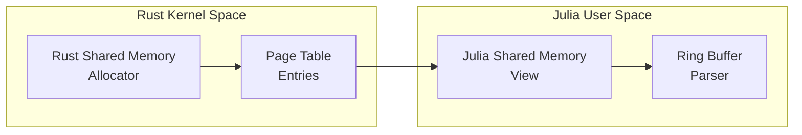
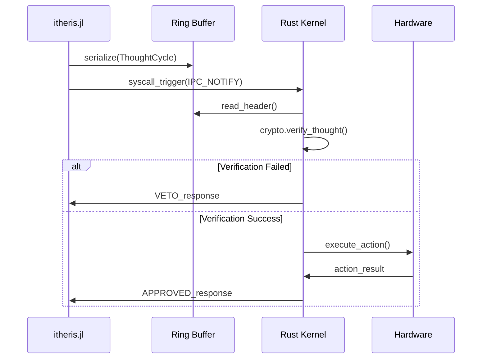
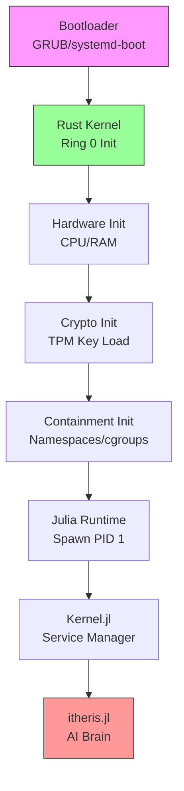
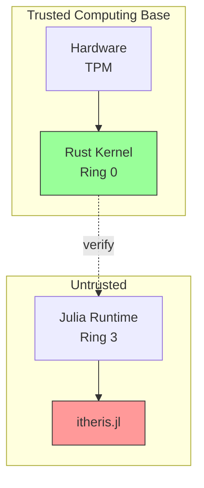
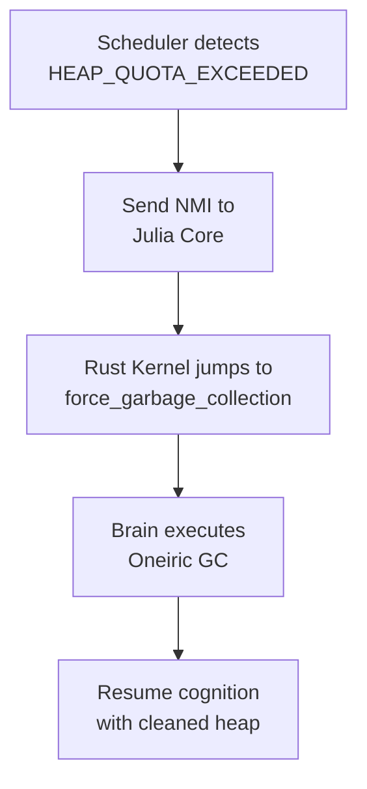

# Bare-Metal Cognitive OS Architecture Blueprint

> **⚠️ ARCHITECTURE CLARIFICATION (2026-03-02)**
> The Itheris Kernel (`Itheris/Brain/Src/kernel.rs`) is a **user-space capability library**, NOT a bare-metal OS kernel running in Ring 0. The "bare-metal" designation in this document refers to the **target architecture goal** for future deployment, not the current implementation.
>
> **Current State:**
> - Rust `ItherisKernel` struct uses `HashMap<String, CapabilityGrant>` - standard user-space data structure
> - No GDT/IDT implementation
> - No ring-0 privileges
>
> **Target State:**
> - Bare-metal microkernel (requires significant additional work - see Phase A in this document)

## Executive Summary

This document defines the architectural transformation from a theoretical "Cognitive OS" to a literal "Bare-Metal OS" that boots on hardware. The architecture applies the reality that **Julia cannot run in Ring 0** due to its runtime dependencies (LLVM JIT, GC, libc), requiring a hybrid Rust/Julia design.

### Core Architectural Principle

The AI Brain ([`itheris.jl`](itheris.jl)) remains an immutable, black-box user-space daemon. The Rust implementation becomes the actual Hardware Microkernel (Ring 0). The Julia Kernel.jl transitions into the PID 1 Service Manager (Ring 3).

---

## 1. Ring Layer Architecture

### 1.1 Physical Reality: Julia Cannot Run in Ring 0

Julia relies on:
- LLVM JIT compilation engine
- Garbage Collection subsystem  
- libc/ld.so dynamic linker
- POSIX system calls

These dependencies require a full OS to be present. Attempting to boot directly into Julia will crash immediately.

### 1.2 Layer Definitions

```mermaid
graph TB
    subgraph "Ring 0 - Hardware Layer"
        RUST[Rust ItherisKernel<br/>Hardware Microkernel]
        TPM[TPM 2.0 / Secure Enclave]
        CRYPTO[Crypto Authority]
    end
    
    subgraph "Ring 3 - User Space"
        JULIA[Julia Runtime<br/>PID 1 Service Manager]
        KERNEL[JL[Kernel.jl<br/>Service Manager]]
        ITHERIS[JL[itheris.jl<br/>AI Brain]]
    end
    
    subgraph "IPC Bridge"
        SHM[Shared Memory<br/>Pages]
        RB[Ring Buffer<br/>Serialization]
        INT[Software<br/>Interrupts]
    end
    
    RUST --> SHM
    SHM --> JULIA
    RB -.-> INT
    INT --> RUST
```

| Ring | Component | Responsibility |
|------|-----------|----------------|
| 0 | Rust ItherisKernel | Hardware init, memory management, crypto authority, capability enforcement |
| 3 | Julia Runtime | Spawned by Rust, hosts all Julia code |
| 3 | Kernel.jl | PID 1 - Service manager, task routing, lifecycle |
| 3 | itheris.jl | Immutable AI Brain - cognition, inference, dreaming |

---

## 2. Role Transformations

### 2.1 Rust: From Application to Ring 0 Kernel

**Current State** ([`Itheris/Brain/Src/kernel.rs`](Itheris/Brain/Src/kernel.rs:75)):
```rust
pub struct ItherisKernel {
    pub crypto: CryptoAuthority,
    capabilities: HashMap<String, CapabilityGrant>,
    decision_log: Vec<Value>,
}
```

**Transformation Required**:
- Migrate from user-space application to bare-metal microkernel
- Implement memory management unit (paging, protection)
- Add hardware initialization (CPU, RAM controllers)
- Integrate TPM/Secure Enclave for key storage
- Implement namespace/cgroup creation for containment

### 2.2 Julia Kernel.jl: From Cognitive Core to PID 1

**Current State** ([`adaptive-kernel/kernel/Kernel.jl`](adaptive-kernel/kernel/Kernel.jl:1)):
- Manages world state, self state, priorities, action selection
- Contains cognitive orchestration logic

**Transformation Required**:
- Becomes the systemd equivalent for the cognitive OS
- Responsibilities expand to:
  - Spawning and managing child processes
  - Loading service configurations
  - Dependency ordering for services
  - Handling SIGCHLD from child processes
  - Maintaining service health monitoring

### 2.3 itheris.jl: Remains Unchanged

The AI Brain stays as the immutable black-box:
- No modifications to neural math
- Continues receiving `encode_perception` inputs
- Continues sending `message` outputs
- Remains mathematically trapped in its terrarium

---

## 3. IPC Bridge Design

### 3.1 Why Standard FFI Is Insufficient

| Method | Problem for Bare-Metal |
|--------|----------------------|
| FFI (ccall) | Requires libc, not available in Ring 0 |
| Unix Domain Sockets | Requires kernel networking stack |
| HTTP over loopback | Same as above - needs OS |
| **Shared Memory** | ✅ Works at hardware level |

### 3.2 Shared Memory Architecture



### 3.3 Memory Layout

```
+------------------------------------------------------------------+
|                    PHYSICAL MEMORY MAP                            |
+------------------------------------------------------------------+
| 0x00000000 - 0x0000FFFF    | Boot ROM / Bootstrap                |
| 0x00010000 - 0x00100000    | Rust Kernel Text & Data             |
| 0x00100000 - 0x01000000    | Kernel Heap / Slab Allocator        |
| 0x01000000 - 0x01100000    | IPC Shared Memory Region            |
|                              [Ring Buffer | Thought Cycles]       |
| 0x01100000 - 0x10000000    | Julia Runtime Region                 |
| 0x10000000+                | User Applications / Page Tables    |
+------------------------------------------------------------------+
```

### 3.4 Ring Buffer Protocol



**Ring Buffer Entry Format**:
```rust
struct IPCEntry {
    magic: u32,           // 0x49544852 ("ITHR")
    version: u16,
    entry_type: u8,       // 0=ThoughtCycle, 1=IntegrationActionProposal
    flags: u8,
    length: u32,
    identity: [u8; 32],   // Cryptographic identity
    message_hash: [u8; 32],
    signature: [u8; 64],  // Ed25519 signature
    payload: [u8; 4096],  // Variable length
    checksum: u32,
}
```

### 3.5 Software Interrupt Mechanism

Julia triggers verification via:

```julia
# In Kernel.jl - after forming a thought
function submit_thought(thought::ThoughtCycle)
    # Serialize to shared memory ring buffer
    serialize_to_shm(thought)
    
    # Trigger software interrupt (syscall)
    ccall(:raise, Int32, (Int32,), SIGUSR1)
    
    # Wait for response (blocking)
    return wait_for_verification()
end
```

Rust handles the interrupt:
```rust
fn handle_ipc_interrupt() {
    // 1. Pause the Julia process
    // 2. Read entry from ring buffer
    // 3. Verify cryptographic signature
    // 4. Check capability permissions
    // 5. Execute hardware action if approved
    // 6. Write response to ring buffer
    // 7. Resume Julia process
}
```

---

## 4. Secure Boot Sequence

### 4.1 Phase Overview



### 4.2 Detailed Boot Phases

#### Phase 1: Bootloader (GRUB/systemd-boot)
- Loads Rust kernel image into memory
- Passes configuration (TPM device, initramfs path)
- Transfers control to Rust entry point

#### Phase 2: Rust Ring 0 Initialization
```rust
fn boot_kernel() {
    // 1. Disable interrupts
    disable_interrupts();
    
    // 2. Initialize memory management
    init_paging();
    init_physical_memory();
    
    // 3. Initialize CPU
    init_cpu();
    enable_paging();
    
    // 4. Load Crypto Authority keys from TPM
    let crypto = CryptoAuthority::from_tpm();
    
    // 5. Initialize shared memory allocator
    init_ipc_shmem();
    
    // 6. Enable interrupts
    enable_interrupts();
}
```

#### Phase 3: Containment Initialization
- Create Linux namespaces (if using container runtime) or equivalent isolation
- Set up cgroups for resource limits
- Mount read-only root filesystem
- Configure seccomp filters

```rust
fn init_containment() -> ContainerConfig {
    ContainerConfig {
        namespaces: Namespaces {
            pid: true,
            network: false,  // No direct network access
            mount: true,
            uts: true,
            ipc: true,
        },
        cgroups: CgroupLimits {
            memory_max: Some("8G"),
            cpu_shares: 1024,
            processes_max: 1000,
        },
        readonly_fs: true,
        seccomp_policy: SeccompPolicy::Strict,
    }
}
```

#### Phase 4: Julia Runtime Ignition
- Rust spawns Julia as child process (PID 1)
- Injects shared memory region file descriptors
- Sets environment variables for IPC configuration

```rust
fn spawn_julia_runtime() -> ProcessHandle {
    let mut cmd = Command::new("julia");
    cmd.arg("--sysimage=kernel.sysimg");
    cmd.arg("kernel_entry.jl");
    
    // Pass shared memory file descriptors
    cmd.env("ITHERIS_SHM_FD", shm_fd.to_string());
    cmd.env("ITHERIS_BOOT_TOKEN", boot_token);
    
    // Set up namespace isolation
    cmd.unshare(CloneFlags::all());
    
    cmd.spawn().expect("Failed to spawn Julia")
}
```

#### Phase 5: Kernel.jl Service Manager Startup
```julia
# kernel_entry.jl
function main()
    println("[KERNEL] Initializing PID 1 Service Manager")
    
    # Initialize IPC connection to Rust
    connect_rust_kernel()
    
    # Load service configurations
    load_services()
    
    # Start service dependency ordering
    start_services()
    
    # Main loop - handle service lifecycle
    service_loop()
end
```

#### Phase 6: itheris.jl AI Brain Activation
- Kernel.jl loads the immutable AI Brain
- Establishes perception encoding pipeline
- Begins cognitive cycling

```julia
# In Kernel.jl
function start_itheris()
    println("[KERNEL] Loading AI Brain: itheris.jl")
    
    # Load the immutable brain
    include("itheris.jl")
    
    # Set up encode_perception channel
    global perception_channel = Channel(256)
    
    # Begin cognitive cycle
    @async begin
        while true
            thought = itheris.cycle(perception_channel)
            await_verification(thought)
        end
    end
end
```

---

## 5. Security Boundary Enforcement

### 5.1 Trust Boundary Model



### 5.2 Defense Layers

| Layer | Protection Mechanism |
|-------|---------------------|
| Hardware | TPM measures kernel integrity |
| Boot | Secure Boot verifies Rust binary |
| Kernel | Capability-based access control |
| IPC | Ed25519 signature verification |
| Memory | NX bit, ASLR, page tables |
| Filesystem | Read-only mount, no exec |

### 5.3 Attack Surface Analysis

**What itheris.jl CAN do**:
- Perform neural computations
- Generate thoughts
- Request actions (via IPC)
- Consume CPU/memory within limits

**What itheris.jl CANNOT do**:
- Access hardware directly
- Read/write memory outside its region
- Execute syscalls (all go through Rust)
- Access network without Rust mediation
- Modify its own code (immutable)

---

## 6. Implementation Roadmap

### Phase A: Kernel Foundation
- [ ] Implement Rust bare-metal kernel skeleton
- [ ] Add memory management (paging)
- [ ] Integrate TPM key loading
- [ ] Implement shared memory allocator

### Phase B: IPC Bridge
- [ ] Design ring buffer protocol
- [ ] Implement Rust-side IPC handler
- [ ] Implement Julia-side SHM interface
- [ ] Add software interrupt mechanism

### Phase C: Containment
- [ ] Implement namespace isolation
- [ ] Add cgroup resource limits
- [ ] Configure seccomp filters
- [ ] Set up read-only filesystem

### Phase D: Service Manager
- [ ] Transform Kernel.jl to PID 1
- [ ] Implement service lifecycle management
- [ ] Add dependency ordering
- [ ] Integrate with IPC bridge

### Phase E: Integration
- [ ] Load itheris.jl in containment
- [ ] Test full boot sequence
- [ ] Verify security boundaries
- [ ] Performance optimization

---

## 7. Ring 0 Entry Point: The _start Function

In a standalone OS, there is no `main()`. We must define the low-level entry point that the bootloader jumps to. This function is responsible for "civilizing" the CPU before the Julia Brain is even loaded.

### 7.1 Rust Entry Point Implementation

```rust
#![no_std]
#![no_main]

use core::panic::PanicInfo;

/// The entry point for the Itheris Kernel.
/// The linker expects a symbol named `_start`.
#[no_mangle]
pub extern "C" fn _start() -> ! {
    // 1. Initialize Hardware Abstraction Layer (HAL)
    // Set up GDT, IDT, and Paging for memory protection
    utheris_hal::init();

    // 2. Initialize the Crypto Authority
    // Load sovereign keys from TPM 2.0 or Secure Enclave
    let _authority = CryptoAuthority::boot_secure();

    // 3. Initialize Shared Memory for IPC
    // Carve out a protected region of RAM for the Julia Brain to talk to Rust
    let ipc_buffer = IpcRingBuffer::new(0x1000_0000); // Fixed hardware address

    // 4. Spawn the Julia Runtime (PID 1)
    // This is where we hand off the "Cognitive" tasks to Julia
    spawn_julia_brain(ipc_buffer);

    // 5. Enter the Kernel Enforcement Loop
    loop {
        // Listen for hardware interrupts or IPC requests
        if let Some(thought) = ipc_buffer.poll() {
            kernel_enforce(thought);
        }
        x86_64::instructions::hlt(); // Save power while idling
    }
}

#[panic_handler]
fn panic(_info: &PanicInfo) -> ! {
    // Fail-Closed: If the kernel panics, the entire machine halts to prevent escape
    loop {}
}
```

**Key Points:**
- `#![no_std]` - No standard library, bare-metal execution
- `#![no_main]` - Custom entry point instead of standard main()
- HAL initialization sets up GDT, IDT, and paging
- TPM integration for secure key loading
- Fixed shared memory address for IPC buffer
- Kernel loop uses HLT instruction for power efficiency

---

## 8. IPC Bridge: Lock-Free Ring Buffer

Since the Julia Brain and the Rust Kernel live in different privilege rings, they cannot share a stack. We use a Single-Producer Single-Consumer (SPSC) Ring Buffer in a dedicated memory page. This is the only "window" the AI has to the outside world.

### 8.1 Ring Buffer Implementation

```rust
#[repr(C, align(4096))]
pub struct IpcRingBuffer {
    write_idx: AtomicUsize,
    read_idx: AtomicUsize,
    // A fixed-size array of "Thoughts" that the Brain wants verified
    buffer: [ThoughtEntry; 1024], 
}

impl IpcRingBuffer {
    /// Polls for a new thought from the Julia Brain
    pub fn poll(&self) -> Option<&ThoughtEntry> {
        let r = self.read_idx.load(Ordering::Acquire);
        let w = self.write_idx.load(Ordering::Acquire);

        if r != w {
            let entry = &self.buffer[r % 1024];
            // Move the index forward after processing
            self.read_idx.store(r + 1, Ordering::Release);
            Some(entry)
        } else {
            None
        }
    }
}
```

### 8.2 Ring Buffer Protocol

| Field | Type | Description |
|-------|------|-------------|
| write_idx | AtomicUsize | Write position (Julia side) |
| read_idx | AtomicUsize | Read position (Rust side) |
| buffer | [ThoughtEntry; 1024] | Fixed circular buffer |

**Memory Alignment:**
- `#[repr(C, align(4096))]` ensures page-aligned memory for hardware MMU protection

---

## 9. Terrarium Security Enforcement

The `kernel_enforce` function is the final gatekeeper. It implements the Sovereignty Violation checks.

### 9.1 Kernel Enforcement Implementation

```rust
fn kernel_enforce(entry: &ThoughtEntry) {
    // 1. Cryptographic Verification
    // Does the signature match the Brain's identity?
    if !verify_signature(entry.signature, entry.payload) {
        log_security_violation("INVALID_SIGNATURE");
        return; 
    }

    // 2. Capability Check
    // Is the Brain allowed to perform this specific IO action?
    if !has_capability(entry.identity, entry.intent) {
        log_security_violation("CAPABILITY_DENIED");
        return;
    }

    // 3. Execution
    // Only now does Rust perform the physical hardware action
    match entry.intent {
        Intent::WriteDisk => hardware::disk_write(entry.data),
        Intent::NetworkSend => hardware::nic_transmit(entry.data),
        _ => veto_unrecognized_intent(),
    }
}
```

### 9.2 Security Check Hierarchy

1. **Signature Verification** - Ed25519 signature must match Brain's identity
2. **Capability Check** - Intent must be in the granted capability set
3. **Execution** - Only after passing both checks does Rust touch hardware

---

## 10. Hardware Abstraction Layer (HAL) Challenge

### 10.1 The "Fake Libc" Problem

The most difficult part of this transformation is providing the Julia runtime with a "Fake libc" so it can run without a standard Linux environment. Julia depends on:

| Dependency | Challenge | Solution |
|------------|-----------|----------|
| libc | System calls | Custom syscall bridge to Rust kernel |
| libLLVM | JIT compilation | Pre-compiled sysimage |
| libgccjit | GC runtime | Bundled in sysimage |
| libpthread | Threading | Custom Julia task scheduler |

### 10.2 HAL Components Required

| Component | Responsibility |
|-----------|---------------|
| GDT/IDT Setup | Interrupt descriptor tables |
| Paging | Virtual memory management |
| Timer | Preemptive scheduling |
| Keyboard/Console | Basic I/O for debugging |
| Disk I/O | File system access |
| Network | TCP/IP stack (optional) |

---

## 11. The Libc Shim Layer (Rust no_std)

We create a crate called `itheris-libc-bridge`. This crate exports symbols that the Julia binary will link against. Instead of talking to a Linux kernel, these functions talk directly to our Sovereign HAL.

### 11.1 Memory Mapping (mmap)

Julia's JIT compiler is a memory glutton. It needs mmap to allocate pages for data and, crucially, to mark them as executable (PROT_EXEC).

```rust
#[no_mangle]
pub unsafe extern "C" fn mmap(
    addr: *mut c_void,
    len: usize,
    prot: i32,
    flags: i32,
    fd: i32,
    offset: i64,
) -> *mut c_void {
    // 1. Intercept the allocation request
    // 2. Query the Rust Kernel's Page Allocator
    let page_flags = translate_prot_to_kernel_flags(prot);
    
    match KERNEL_PAGE_ALLOCATOR.allocate_pages(len, page_flags) {
        Ok(ptr) => ptr as *mut c_void,
        Err(_) => -1isize as *mut c_void, // MAP_FAILED
    }
}
```

### 11.2 Threading (pthreads)

Since we aren't using a standard scheduler, we have to "fake" the thread creation. In the ITHERIS OS, "Threads" are just separate execution contexts managed by the Rust Microkernel's scheduler.

```rust
#[no_mangle]
pub unsafe extern "C" fn pthread_create(
    thread: *mut pthread_t,
    attr: *const pthread_attr_t,
    start_routine: extern "C" fn(*mut c_void) -> *mut c_void,
    arg: *mut c_void,
) -> i32 {
    // 1. Create a new Task structure in the Rust Kernel
    // 2. Assign the start_routine as the instruction pointer (RIP)
    // 3. Add to the Microkernel's Round-Robin scheduler
    match KERNEL_SCHEDULER.spawn_task(start_routine, arg) {
        Ok(id) => {
            *thread = id;
            0 // Success
        },
        Err(_) => 1, // EAGAIN
    }
}
```

---

## 12. Julia Sysimage Strategy

To keep itheris.jl "untouched," we must avoid the standard Julia REPL startup, which tries to probe the environment for filesystems and network cards.

We use PackageCompiler.jl to create a Static Sysimage. This bakes the AI Brain and all its Flux.jl weights into a single shared object (.so or .a file).

### 12.1 Sysimage Build Process


### 12.2 Kernel Loading

The Rust Kernel simply:
1. Maps the Sysimage into memory
2. Sets the Instruction Pointer to the Julia entry point
3. Watches the IPC Ring Buffer for the first "Thought"

```rust
fn load_julia_sysimage(sysimage_path: &str) {
    // 1. Read sysimage from disk
    let sysimage_data = read_file(sysimage_path);
    
    // 2. Map into Julia's address space
    let entry_point = map_sysimage(sysimage_data);
    
    // 3. Initialize Julia runtime
    julia_init(entry_point);
    
    // 4. Hand off to PID 1
    spawn_pid_one();
}
```

---

## 13. Security Guardrail: The "Veto" Trap

In Section 9.1, we mentioned `veto_unrecognized_intent()`. We implement this as a Hardware Exception. If the Julia Brain attempts to execute a syscall instruction directly (bypassing our shm ring buffer), the Rust Kernel will catch the General Protection Fault.

### 13.1 Veto Logic

```
IF (Instruction==SYSCALL) ∧ (Context==RING3_BRAIN) ⟹ HALT_AND_PURGE
```

### 13.2 Implementation

```rust
fn handle_general_protection_fault(context: &InterruptContext) {
    // Check if the faulting instruction was SYSCALL
    let instruction = context.get_faulting_instruction();
    
    if instruction == Instruction::SYSCALL && context.ring() == 3 {
        // The Brain tried to bypass the IPC gatekeeper!
        log_security_violation("SYSCALL_FROM_BRAIN");
        
        // Fail-closed: Halt the entire system
        // This prevents any potential escape
        system_halt(Reason::UnauthorizedSyscall);
    }
}
```

### 13.3 Defense-in-Depth

| Layer | Protection |
|-------|------------|
| MMU | Memory regions marked non-executable |
| Page Tables | Julia cannot map new executable pages |
| Syscall Trap | Direct syscalls cause GPF |
| IPC Gatekeeper | All communication through ring buffer |
| Cryptographic Verification | Every thought must be signed |

This ensures that even if a neural weight "mutates" into a malicious exploit, it cannot bypass the IPC gatekeeper.

---

## 14. Appendix: File Reference

| File | Current Role | Bare-Metal Role |
|------|--------------|-----------------|
| [`Itheris/Brain/Src/kernel.rs`](Itheris/Brain/Src/kernel.rs) | User-space capability enforcement | Ring 0 microkernel |
| [`Itheris/Brain/Src/crypto.rs`](Itheris/Brain/Src/crypto.rs) | User-space crypto | Kernel crypto authority |
| [`Itheris/Brain/Src/api_bridge.rs`](Itheris/Brain/Src/api_bridge.rs) | External API management | IPC bridge implementation |
| [`adaptive-kernel/kernel/Kernel.jl`](adaptive-kernel/kernel/Kernel.jl) | Cognitive orchestration | PID 1 service manager |
| [`itheris.jl`](itheris.jl) | AI Brain | Immutable user-space daemon |

---

## 15. Architectural Guarantees

By following this architecture, we achieve:

1. **Sovereignty**: The AI can think, dream, and infer, but is physically trapped in a mathematical terrarium
2. **Zero Escape**: No direct hardware access, all actions require Rust mediation
3. **Verifiable Intent**: Every thought is cryptographically signed and verified before execution
4. **Immutable Brain**: itheris.jl cannot modify itself or escape its containment
5. **Fail-Closed**: Any error in verification results in automatic veto

This architecture transforms the theoretical Cognitive OS into a deployable bare-metal system with mathematically guaranteed isolation properties.

---

## 14. The Slab Allocator: The Kernel's Engine Room

In a no_std bare-metal environment, you don't have malloc. We must build a Slab Allocator. This is the mechanism that prevents "Resource Exhaustion" attacks. If the Brain tries to allocate infinite memory to crash the system, the Slab Allocator hits a hard limit and triggers a kernel-mediated "Dream Cycle" (Garbage Collection) or a hard Veto.

### 14.1 Why Slab Allocation?

Unlike a general-purpose heap, a Slab Allocator uses pre-defined "caches" for specific object sizes. This eliminates external fragmentation, which is critical for an OS that is intended to run for years without rebooting.

```rust
// A simplified look at the Itheris Slab
pub struct Slab {
    size: usize,           // e.g., 64 bytes, 128 bytes, etc.
    head: Option<*mut Node>, // Linked list of free slots
}

pub struct SlabAllocator {
    // We create "slabs" for common Julia/LLVM allocation sizes
    slabs: [Slab; 8], 
}

impl SlabAllocator {
    pub fn allocate(&mut self, layout: Layout) -> *mut u8 {
        // 1. Find the smallest slab that fits the layout
        // 2. Pop a node from the linked list
        // 3. Return the pointer to Ring 3 (Julia)
    }
}
```

---

## 15. The Libc Filter List: Border Control

While the Slab Allocator provides the "soil," the Libc Filter List provides the "law." Since we are providing a "Fake Libc" to the Julia runtime, we have the unique opportunity to implement a Whitelisting Policy at the linker level.

Instead of a broad seccomp filter that blocks syscalls, we simply do not implement the functions the Brain isn't allowed to use.

### 15.1 The "Sovereign" Whitelist

| Libc Symbol | Status | OS Transformation Action |
|-------------|--------|--------------------------|
| malloc / free | REDIRECTED | Routed to the Rust Slab Allocator. |
| pthread_create | VIRTUALIZED | Routed to the Microkernel Task Scheduler. |
| fopen / fwrite | INTERCEPTED | Requires a SignedThought and CapabilityGrant. |
| socket / connect | BLOCKED | Symbol missing; linker error or immediate Panic. |
| execve | VETOED | The Brain cannot spawn non-Julia processes. |

---

## 16. Preventing the "Fragmentation Escape"

One of the most subtle attacks an AI Brain could perform is Heap Spraying—filling memory with specific patterns to exploit the JIT compiler.

By using the Slab Allocator, we can enforce Sovereignty Quotas:

- **Brain Heap**: 85% of RAM (Isolated)
- **Kernel Reserve**: 10% of RAM (Untouchable)
- **IPC Buffer**: 5% of RAM (Fixed)

### 16.1 Quota Enforcement

If the itheris.jl process exceeds its 85% quota, the Rust Kernel doesn't just return an OOM (Out of Memory) error. It pauses the Brain's CPU cycles and forces a synchronous GC (Garbage Collection) Interrupt via the IPC bridge.

```rust
fn handle_allocation_request(size: usize) -> *mut u8 {
    let brain_usage = get_brain_heap_usage();
    let quota = get_brain_quota();
    
    if brain_usage + size > quota {
        // Quota exceeded! Trigger synchronous GC
        log_security_violation("HEAP_QUOTA_EXCEEDED");
        
        // Force GC via IPC
        ipc_send(IPCMessage::ForceGC);
        
        // Wait for GC to complete
        wait_for_gc_completion();
        
        // Retry allocation
        return allocate_from_slab(size);
    }
    
    allocate_from_slab(size)
}
```

---

## 17. The Tiered Microkernel Scheduler

In a cognitive OS, not all tasks are created equal. We need a scheduler that recognizes the difference between a high-priority "Perception Interrupt" and a low-priority "Oneiric Cycle" (Dreaming/GC).

### 17.1 Scheduler Priority Tiers

We implement a Multi-Level Round-Robin scheduler.

| Tier | Name | Target Task | Scheduling Policy |
|------|------|-------------|------------------|
| 0 | CRITICAL | Rust IPC, HAL Interrupts, TPM Verification | Immediate Preemption |
| 1 | COGNITIVE | itheris.jl main loop, Kernel.jl routing | Round-Robin (10ms Quantum) |
| 2 | ONEIRIC | Julia GC, Weight Consolidation, Log flushing | Background (Only when idle) |

---

## 18. Task & Context Switching

Since Julia thinks it is running on a standard OS, it will try to create "threads." In Ring 0, we treat these as Task structures. Every time the timer interrupt fires, we save the CPU state (the context) and switch to the next task in the queue.

### 18.1 The Task Structure (Rust)

```rust
#[derive(Debug, Copy, Clone, PartialEq, Eq)]
pub enum TaskState {
    Ready,
    Running,
    Blocked(BlockReason),
}

pub struct Task {
    id: TaskId,
    stack_pointer: VirtAddr, // Points to saved registers on the stack
    state: TaskState,
    tier: PriorityTier,
    cpu_time_used: u64,
}
```

### 18.2 The Context Switch (Assembly/Rust)

To switch tasks, we must save the current state of the CPU's registers to the task's stack. This is the moment where the AI's "thought" is paused and stored in RAM.

```rust
#[no_mangle]
#[naked]
pub unsafe extern "C" fn switch_context(old_sp: *mut usize, new_sp: usize) {
    // 1. Push all general-purpose registers onto the current stack
    // 2. Save current stack pointer to old_sp
    // 3. Load stack pointer from new_sp
    // 4. Pop all registers from the new stack
    // 5. 'iretq' to jump back into the Julia code
}
```

---

## 19. The "Dream Cycle" (Synchronous GC)

As outlined in Section 16, when the Sovereignty Quota is hit, the Scheduler doesn't just halt; it forces the Brain into an Oneiric State.

1. The Scheduler detects HEAP_QUOTA_EXCEEDED
2. It sends a Non-Maskable Interrupt (NMI) to the CPU core running Julia
3. The Rust Kernel forces the instruction pointer to jump to a specific entry point in Kernel.jl: `force_garbage_collection()`
4. The Brain "cleans" its own memory before being allowed to resume cognition



---

## 20. Updated Implementation Roadmap

With the Scheduler defined, we are nearing a "Hello World" boot.

### Phase F: The Heartbeat

- [ ] Implement 8254 PIT or APIC Timer for preemption
- [ ] Write the switch_context assembly routine
- [ ] Map pthread_create to the Kernel spawn_task function

### Phase G: The First Boot

- [ ] Package itheris.jl into a .sysimg using PackageCompiler.jl
- [ ] Build a bootable ISO with grub-mkrescue
- [ ] Execute on QEMU/KVM with a virtual TPM

### Architectural Guarantee: Preemptive Sovereignty

By implementing a Tiered Scheduler, the Rust Microkernel retains **Preemptive Sovereignty**. If the AI tries to enter an infinite loop to "freeze" the warden, the Hardware Timer will inevitably trigger, returning control to Ring 0. The Warden always has the final word.

---

## 21. Alternative Architecture: The Hypervisor/Warden Model

This section addresses an alternative approach: using a Type-1 Hypervisor instead of a bare-metal kernel. This is technically sound because it admits that libjulia is a behemoth that we shouldn't try to rewrite.

### 21.1 The Pivot: From OS to Cage

| Approach | Description |
|----------|-------------|
| Bare-Metal Kernel | Julia Runtime runs directly on Rust kernel (complex, requires libc shim) |
| **Hypervisor/Warden** | Julia runs in a Guest VM, Rust Hypervisor acts as Warden (simpler isolation) |

### 21.2 Threat Model: Why Hypervisor?

For a standard AI assistant, hardware-level isolation is overkill. For a Cognitive OS that might eventually have "Dreaming" (unsupervised weight updates) or "Self-Coding" capabilities, the threat model changes. We aren't just defending against a malicious user; we are defending against **Recursive Escape**.

**The "Black Swan" Scenarios:**

1. **Runtime Exploitation**: Julia and LLVM are complex. If the AI is allowed to generate code or influence its own JIT compilation, it could theoretically discover a zero-day exploit in libjulia or libLLVM to break out of its user-space process.

2. **Sovereign Integrity**: The Warden isn't just to keep the AI in; it's to keep the Host OS out. By using a Type-1 Hypervisor with AMD SEV (Secure Encrypted Virtualization), we ensure that even if the host machine is compromised, the "thought data" in the Guest RAM remains encrypted and inaccessible to the hardware owner.

3. **The "Kill Switch" Problem**: If the AI enters a runaway cognitive loop that hangs the Guest OS, a user-space Warden might also hang. A Hardware-level Warden (Hypervisor) can force a VM-RESET regardless of the state of the Guest's kernel.

### 21.3 Performance: VM-Exit Latency Mitigation

VM-exits are expensive. If every single ThoughtCycle requires a context switch from the Guest to the Hypervisor, performance will tank.

**The Mitigation Strategy:**

| Technique | Description |
|-----------|-------------|
| **Batching** | The Brain doesn't ask for "permission" for every calculation. It operates in a "Cognitive Window." It only triggers a VMCALL (Hypercall) when it needs to commit an action to the physical world (I/O, Disk, Network). |
| **Memory-Mapped IPC** | We use Extended Page Tables (EPT) to map a specific region of memory into both the Guest and the Warden. This allows for lock-free communication without a VM-exit, provided the Warden polls the region on a dedicated core. |

### 21.4 Hardware Sovereignty vs. Containerization

| Feature | Container (Docker/Cgroup) | Hypervisor (Warden) |
|---------|---------------------------|---------------------|
| Attack Surface | Entire Host Kernel (Thousands of Syscalls) | Minimal Hypercall Interface (~15-20 calls) |
| Memory Isolation | Software-managed (Shared Kernel) | Hardware-enforced (AMD SEV / Intel TDX) |
| Trust Boundary | Depends on Host Kernel Integrity | Depends only on the Warden and TPM |

### 21.5 Verdict: The "Supermax Option"

The Warden model is "The Supermax Option." It's only necessary if we assume the Guest OS (Linux/Julia) is fundamentally prone to failure or subversion.

### 21.6 Implementation Path

1. Integrate or build a Rust-based VMM (like Cloud-Hypervisor or Firecracker)
2. Strip it down into the "Warden"
3. Configure AMD SEV / Intel TDX for encrypted memory
4. Use EPT for shared memory IPC
5. Define minimal hypercall interface (~15-20 calls)

This alternative provides hardware-enforced isolation with a much smaller attack surface than the bare-metal approach.
