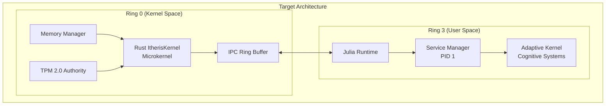

# Bare-Metal OS Architecture Implementation Plan

## Executive Summary

This document outlines a comprehensive implementation plan to transform the existing user-space Rust kernel (`Itheris/Brain/Src/`) and Julia cognitive system (`adaptive-kernel/kernel/Kernel.jl`) into a proper Ring 0/Ring 3 hybrid OS architecture.

**Current State Analysis:**
- **Rust Kernel**: User-space application with capability-based security (`ItherisKernel`, `CapabilityGrant`, `CryptoAuthority`)
- **Julia Kernel**: Cognitive orchestration system with sovereignty gates and HMAC-based auth tokens
- **Entry Point**: Standard `fn main()` in user-space
- **IPC**: ZMQ/Tokio based (not bare-metal compatible)

**Target State:**
- Rust kernel runs in Ring 0 (bare-metal microkernel)
- Julia runtime runs in Ring 3 (user space)
- Shared memory IPC with lock-free ring buffers
- TPM 2.0 integration for secure boot
- PID 1 service manager in Julia

---

## Architecture Overview



---

## Phase A: Kernel Foundation (Rust Ring 0)

### A1: Dependencies Update (Cargo.toml)

**File:** [`Itheris/Brain/Cargo.toml`](Itheris/Brain/Cargo.toml)

Add bare-metal dependencies:

```toml
[target.'cfg(not(feature = "bare-metal"))'.dependencies]
# Existing user-space deps

[target.'cfg(feature = "bare-metal")'.dependencies]
# Bare-metal specific
rustix = "0.38"                    # Raw system calls
x86_64 = "0.15"                    # CPU architecture
bitflags = "2.6"                   # Flag management
lockfree = "0.6"                  # Lock-free IPC
buddy_system_allocator = "0.10"   # Kernel heap
tss-esapi = "19"                  # TPM 2.0

[features]
default = ["api_client", "database"]
bare-metal = []
```

### A2: Boot Module Creation

**New Files Required:**

```
Itheris/Brain/Src/
├── boot/
│   ├── mod.rs          # Boot configuration
│   ├── gdt.rs          # Global Descriptor Table
│   ├── idt.rs          # Interrupt Descriptor Table  
│   └── paging.rs       # Page table management
```

#### A2.1: GDT Implementation ([`boot/gdt.rs`](Itheris/Brain/Src/boot/gdt.rs))

```rust
/// Global Descriptor Table - defines memory segments for Ring 0/3
pub struct GDT {
    entries: [u64; 16],
    limit: u16,
}

impl GDT {
    pub fn new() -> Self {
        // Kernel code segment (Ring 0)
        // Kernel data segment (Ring 0)
        // User code segment (Ring 3)
        // User data segment (Ring 3)
        // TSS segment for task switching
    }
    
    pub fn load(&self) {
        // Load GDT via lgdt instruction
    }
}
```

#### A2.2: IDT Implementation ([`boot/idt.rs`](Itheris/Brain/Src/boot/idt.rs))

```rust
/// Interrupt Descriptor Table - handles hardware/software interrupts
pub struct IDT {
    entries: [IdtEntry; 256],
}

impl IDT {
    pub fn new() -> Self {
        // Set up exception handlers (0-31)
        // Set up IRQ handlers (32-255)
    }
    
    pub fn load(&self) {
        // Load IDT via lidt instruction
    }
}
```

#### A2.3: Paging Implementation ([`boot/paging.rs`](Itheris/Brain/Src/boot/paging.rs))

```rust
/// Page table management for virtual memory
pub struct PageTable {
    pml4: *mut u64,
}

impl PageTable {
    pub fn new() -> Self {
        // Allocate and initialize PML4
        // Identity map first 1GB
        // Set up higher-half kernel mapping
    }
    
    pub fn enable(&self) {
        // Set CR3, set PAE bit in CR4, set NX bit in EFER
    }
}
```

### A3: Memory Manager

**New Files:**

```
Itheris/Brain/Src/
├── memory/
│   ├── mod.rs          # Physical memory manager
│   ├── allocator.rs    # Slab allocator
│   └── layout.rs       # Memory layout definitions
```

#### A3.1: Physical Memory Manager ([`memory/mod.rs`](Itheris/Brain/Src/memory/mod.rs))

```rust
use buddy_system_allocator::LockedHeap;

pub struct MemoryManager {
    /// Buddy system for page allocation
    allocator: LockedHeap<32>,
    /// Physical memory limit
    limit: usize,
}

impl MemoryManager {
    pub fn init() -> Self {
        // Detect memory size from E820 map
        // Initialize buddy allocator
    }
    
    pub fn allocate_pages(&mut self, order: usize) -> Option<*mut u8> {
        self.allocator.alloc(order)
    }
}
```

### A4: TPM Integration

**New File:** [`tpm/mod.rs`](Itheris/Brain/Src/tpm/mod.rs)

```rust
use tss_esapi::{Tcti, Session, handles::PcrHandle};

pub struct TPMAuthority {
    session: Session,
}

impl TPMAuthority {
    pub fn boot_secure() -> Self {
        // Initialize TPM 2.0 via TCTI
        // Create platform hierarchy session
        // Load or generate endorsement key
    }
    
    pub fn sign(&self, data: &[u8]) -> Vec<u8> {
        // Sign data with TPM-bound key
    }
    
    pub fn verify(&self, data: &[u8], signature: &[u8]) -> bool {
        // Verify TPM-signed data
    }
}
```

---

## Phase B: IPC Bridge Implementation

### B1: Ring Buffer Protocol Design

**Architecture Specification (per task):**
- Memory region: `0x01000000 - 0x01100000` (1MB shared memory)
- Magic: `0x49544852` ("ITHR")
- Entry format:

```rust
// New file: ipc/ring_buffer.rs

#[repr(C, packed)]
pub struct IPCEntry {
    pub magic: u32,           // 0x49544852 ("ITHR")
    pub version: u16,
    pub entry_type: u8,       // 0=ThoughtCycle, 1=IntegrationActionProposal
    pub flags: u8,
    pub length: u32,
    pub identity: [u8; 32],    // Cryptographic identity
    pub message_hash: [u8; 32],
    pub signature: [u8; 64],  // Ed25519 signature
    pub payload: [u8; 4096],  // Variable length
    pub checksum: u32,
}

impl IPCEntry {
    pub const MAGIC: u32 = 0x49544852;
    pub const VERSION: u16 = 1;
}
```

### B2: Rust IPC Implementation

**New Files:**

```
Itheris/Brain/Src/
├── ipc/
│   ├── mod.rs          # IPC subsystem
│   ├── ring_buffer.rs  # Ring buffer protocol
│   └── shm.rs          # Shared memory allocator
```

#### B2.1: Ring Buffer ([`ipc/ring_buffer.rs`](Itheris/Brain/Src/ipc/ring_buffer.rs))

```rust
use lockfree::ring_buffer::RingBuffer;

pub struct IpcRingBuffer {
    buffer: RingBuffer<IPCEntry>,
    read_pos: usize,
    write_pos: usize,
}

impl IpcRingBuffer {
    pub fn new() -> Self {
        // Initialize lock-free ring buffer
        // Map to fixed physical address 0x01000000
    }
    
    pub fn push(&self, entry: &IPCEntry) -> Result<(), IPCError> {
        // Write entry to ring buffer
        // Memory fence for ordering
    }
    
    pub fn pop(&self) -> Option<IPCEntry> {
        // Read entry from ring buffer
    }
}
```

#### B2.2: Shared Memory ([`ipc/shm.rs`](Itheris/Brain/Src/ipc/shm.rs))

```rust
pub struct SharedMemory {
    ptr: *mut u8,
    size: usize,
}

impl SharedMemory {
    pub fn map(address: u64, size: usize) -> Self {
        // Map physical memory at specified address
        // Set up page tables for shared access
    }
    
    pub fn unmap(&self) {
        // Release shared memory mapping
    }
}
```

### B3: Julia IPC Wrapper

**New File:** `adaptive-kernel/kernel/ipc/RustIPC.jl`

```julia
# adaptive-kernel/kernel/ipc/RustIPC.jl

"""
    IPC connection to Rust Ring 0 kernel
"""
module RustIPC

const SHM_PATH = "/dev/shm/itheris_ipc"
const RING_BUFFER_SIZE = 1024 * 1024  # 1MB

"""
    Connect to Rust kernel shared memory
"""
function connect_kernel()
    # Memory map the shared memory region
    # Set up ring buffer parser
end

"""
    Submit thought cycle for verification
"""
function submit_thought(thought::ThoughtCycle)::AuthToken
    # Serialize to shared memory
    # Trigger software interrupt
    # Wait for verification response
end

"""
    Receive verified action from kernel
"""
function receive_action()::Union{IntegrationActionProposal, Nothing}
    # Poll ring buffer
    # Deserialize and verify signature
end

end
```

---

## Phase C: Julia Service Manager Transformation

### C1: Analyze Kernel.jl

The existing [`Kernel.jl`](adaptive-kernel/kernel/Kernel.jl:1) contains:
- `SovereigntyViolation` exception type
- `AuthToken` struct with HMAC signatures
- Cognitive orchestration logic
- World state management

**Transformation Required:**
- Extract cognitive logic to separate modules
- Add service lifecycle management
- Implement PID 1 responsibilities

### C2: ServiceManager.jl Implementation

**New File:** [`adaptive-kernel/kernel/ServiceManager.jl`](adaptive-kernel/kernel/ServiceManager.jl)

```julia
"""
    Service Manager - PID 1 equivalent for the cognitive OS
    Transforms Kernel.jl from cognitive orchestration to service lifecycle management
"""
module ServiceManager

using JSON
using YAML
using Pkg

"""
    Service configuration structure
"""
struct ServiceConfig
    name::String
    command::Vector{String}
    dependencies::Vector{String}
    restart_policy::Symbol  # :always, :on_failure, :never
    health_check::Union{Function, Nothing}
end

"""
    Start the service manager - becomes PID 1
"""
function start_service_manager()
    println("[KERNEL] Initializing PID 1 Service Manager")
    
    # Load service configurations
    services = load_service_configs()
    
    # Build dependency graph
    dag = build_dependency_dag(services)
    
    # Start services in dependency order
    for service in topological_sort(dag)
        start_service(service)
    end
    
    # Main loop - handle service lifecycle
    service_loop()
end

"""
    Handle SIGCHLD from child processes
"""
function handle_child_exit(pid::Int, status::Int)
    # Reap zombie process
    # Check restart policy
    # Restart if necessary
end

end
```

### C3: Service Lifecycle Integration

**Add to existing Kernel.jl:**
- SIGCHLD signal handler
- Service dependency resolution
- Health check monitoring
- Automatic restart on failure

---

## Phase D: Containment Implementation

### D1: Namespace Isolation

**New File:** [`container/mod.rs`](Itheris/Brain/Src/container/mod.rs)

```rust
use nix::unistd::{CloneFlag, unshare};

pub struct ContainerConfig {
    pub namespaces: Namespaces,
    pub cgroups: CgroupLimits,
    pub readonly_fs: bool,
    pub seccomp_policy: SeccompPolicy,
}

pub fn init_containment() -> ContainerConfig {
    // Create namespace isolation
    unshare(CloneFlags::CLONE_NEWNS | CloneFlags::CLONE_NEWUTS | 
            CloneFlags::CLONE_NEWPID | CloneFlags::CLONE_NEWIPC)
        .expect("Failed to create namespaces");
    
    ContainerConfig {
        namespaces: Namespaces::strict(),
        cgroups: CgroupLimits::confined(),
        readonly_fs: true,
        seccomp_policy: SeccompPolicy::Strict,
    }
}
```

### D2: Cgroup Containment

**Add to ContainerConfig:**
- Memory limits (cgroup v2)
- CPU quota
- IO bandwidth limits
- Process number restrictions

---

## Phase E: Integration & Boot Sequence

### E1: Ring 0 Entry Point

**New File:** [`boot.rs`](Itheris/Brain/Src/boot.rs)

```rust
/// The entry point for the Itheris Kernel (Ring 0)
/// This replaces main() for bare-metal deployment
#[no_mangle]
pub extern "C" fn _start() -> ! {
    // 1. Initialize Hardware Abstraction Layer
    utheris_hal::init();

    // 2. Initialize GDT, IDT, and paging
    gdt::init();
    idt::init();
    paging::init();

    // 3. Initialize Crypto Authority with TPM
    let authority = CryptoAuthority::boot_secure();

    // 4. Initialize IPC Shared Memory
    let ipc_buffer = IpcRingBuffer::new(0x01000000);

    // 5. Spawn Julia Runtime (via multiboot or direct spawn)
    spawn_julia_brain(ipc_buffer);

    // 6. Enter enforcement loop
    loop {
        if let Some(thought) = ipc_buffer.poll() {
            kernel_enforce(thought);
        }
        x86_64::instructions::hlt();
    }
}
```

### E2: Boot Sequence Orchestration


### E3: User-Space Fallback Mode

Keep existing `main.rs` as fallback for development/testing:

```rust
// main.rs
#[cfg(not(feature = "bare-metal"))]
fn main() {
    // Existing user-space initialization
    println!("Running in user-space fallback mode");
}
```

---

## Directory Structure After Implementation

```
/home/user/projectx/
├── Itheris/
│   └── Brain/
│       ├── Cargo.toml                    # Updated with bare-metal deps
│       └── Src/
│           ├── lib.rs                    # Library interface
│           ├── main.rs                   # User-space fallback entry
│           ├── boot.rs                   # NEW: Ring 0 entry point
│           ├── kernel.rs                 # Existing: Enhanced
│           ├── crypto.rs                 # Existing: TPM-enhanced
│           ├── boot/                     # NEW: Boot components
│           │   ├── mod.rs
│           │   ├── gdt.rs
│           │   ├── idt.rs
│           │   └── paging.rs
│           ├── memory/                   # NEW: Memory management
│           │   ├── mod.rs
│           │   ├── allocator.rs
│           │   └── layout.rs
│           ├── ipc/                      # NEW: IPC bridge
│           │   ├── mod.rs
│           │   ├── ring_buffer.rs
│           │   └── shm.rs
│           ├── tpm/                      # NEW: TPM integration
│           │   └── mod.rs
│           └── container/                # NEW: Containment
│               └── mod.rs
│
├── adaptive-kernel/
│   ├── kernel/
│   │   ├── Kernel.jl                     # Existing: Transformed
│   │   ├── ServiceManager.jl             # NEW: PID 1 service manager
│   │   └── ipc/
│   │       └── RustIPC.jl                # NEW: IPC Julia side
│   └── ... (existing modules)
│
└── plans/
    └── BAREMETAL_OS_IMPLEMENTATION_PLAN.md
```

---

## Dependencies Summary

### Rust (Cargo.toml additions)

| Dependency | Version | Purpose |
|------------|---------|---------|
| `x86_64` | 0.15 | CPU architecture support |
| `rustix` | 0.38 | Raw system calls |
| `tss-esapi` | 19 | TPM 2.0 integration |
| `buddy_system_allocator` | 0.10 | Kernel heap allocation |
| `lockfree` | 0.6 | Lock-free IPC structures |
| `nix` | 0.27 | Unix system calls (for container) |

### Julia (Project.toml additions)

| Package | Purpose |
|---------|---------|
| `MemoryMaps` | Shared memory interface |
| `Libc` | Low-level FFI for interrupts |

---

## Implementation Dependencies


---

## Verification Checklist

### Phase A: Kernel Foundation
- [ ] Rust compiles for `x86_64-unknown-none` target
- [ ] GDT loads correctly with proper ring privileges
- [ ] IDT handles exceptions (page fault, divide error, etc.)
- [ ] Paging enabled with identity mapping
- [ ] Physical memory allocator returns valid pages

### Phase B: IPC Bridge
- [ ] Ring buffer accepts writes from Rust
- [ ] Julia can read from shared memory
- [ ] Magic number validation works
- [ ] Ed25519 signatures verified cross-language
- [ ] No data corruption under concurrent access

### Phase C: Service Manager
- [ ] ServiceManager starts as PID 1 equivalent
- [ ] Dependencies resolve in correct order
- [ ] SIGCHLD reaps zombie processes
- [ ] Services restart on failure (when policy allows)

### Phase D: Containment
- [ ] Namespaces isolate process tree
- [ ] Cgroups limit memory and CPU
- [ ] Seccomp filters block unauthorized syscalls

### Phase E: Integration
- [ ] Kernel boots to shell prompt
- [ ] Julia spawns as user process
- [ ] IPC communication works end-to-end
- [ ] Fallback mode works for development

---

## Risk Analysis

| Risk | Impact | Mitigation |
|------|--------|------------|
| Julia in Ring 0 impossible | Architecture blocker | Confirmed - hybrid design is correct approach |
| TPM integration complexity | Delays | Use software TPM emulator during development |
| Cross-compilation difficulty | Testing slow | Extensive QEMU testing before bare-metal |
| IPC latency | Performance | Use lock-free ring buffer, batch processing |

---

## Next Steps

1. **Immediate**: Add bare-metal dependencies to Cargo.toml
2. **Week 1-2**: Implement boot module (GDT, IDT, paging)
3. **Week 3-4**: Create IPC ring buffer protocol
4. **Week 5-6**: Implement Julia IPC wrapper
5. **Week 7-8**: Transform Kernel.jl to ServiceManager
6. **Week 9-10**: Add container namespace isolation
7. **Week 11-12**: Integration testing in QEMU
8. **Week 13+**: Bare-metal testing and refinement
