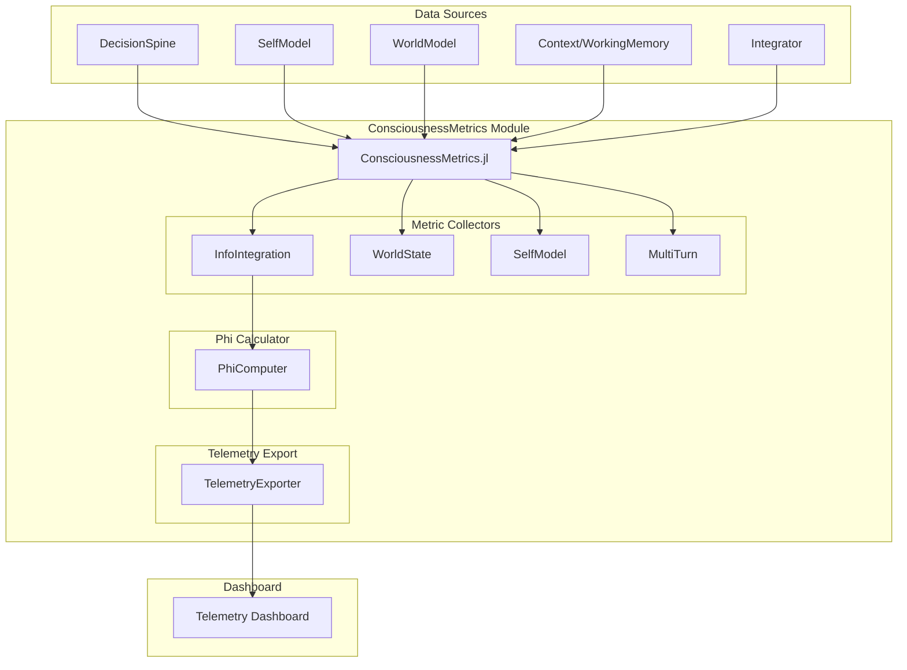
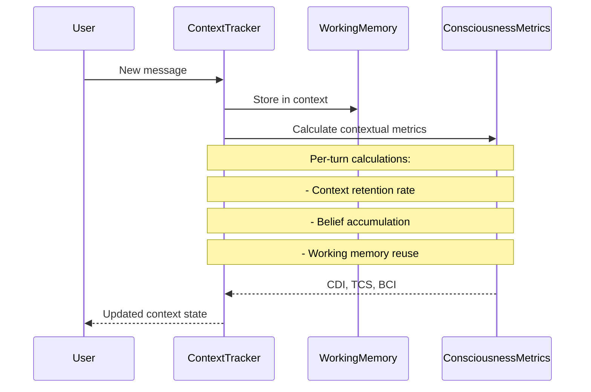
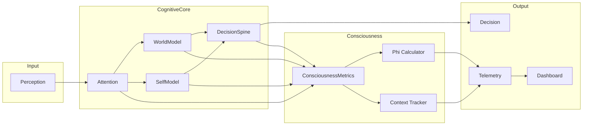
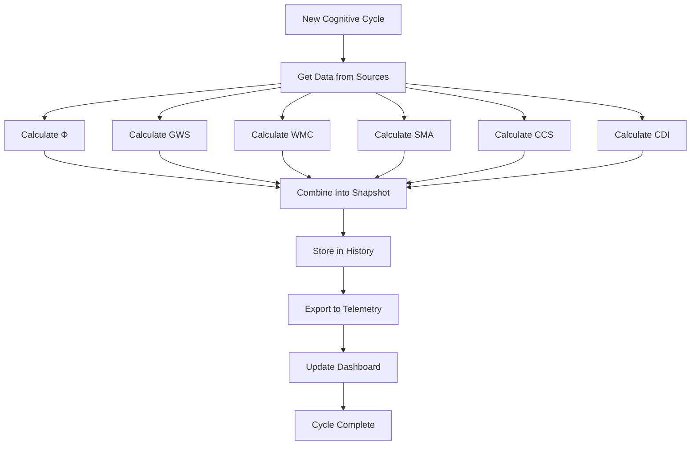

# Consciousness Metrics Implementation Design
## ITHERIS + JARVIS System Telemetry Dashboard

**Version:** 1.0  
**Date:** 2026-03-14  
**Architecture:** Hybrid (Practical Metrics + Theoretical Phi Calculations)

---

## Table of Contents

1. [Executive Summary](#executive-summary)
2. [Consciousness Metric Definitions](#consciousness-metric-definitions)
3. [Implementation Architecture](#implementation-architecture)
4. [Real-Time Telemetry Dashboard Integration](#real-time-telemetry-dashboard-integration)
5. [Multi-Turn Context Tracking Mechanism](#multi-turn-context-tracking-mechanism)
6. [Visualization Recommendations](#visualization-recommendations)
7. [Interpretation Guidelines](#interpretation-guidelines)
8. [Implementation Roadmap](#implementation-roadmap)
9. [Appendix: Mermaid Diagrams](#appendix-mermaid-diagrams)

---

## Executive Summary

This document defines the **Consciousness Metrics** system for the ITHERIS + JARVIS cognitive architecture. The system quantifies the degree of information integration within the Decision Spine, measuring not just how the AI "acts" or "learns," but the depth of its internal world-state consistency and self-model accuracy during multi-turn contexts.

### Design Philosophy

We adopt a **hybrid approach** combining:

1. **Practical Behavioral Metrics**: Concrete measurements derived from existing cognitive components (DecisionSpine, SelfModel, WorldModel, WorkingMemory)
2. **Theoretical Phi (Φ) Calculations**: Approximations of Integrated Information Theory (IIT) indicators adapted for computational systems

### Key Design Decisions

- **Non-invasive**: Metrics collection uses existing data structures without modifying core cognitive logic
- **Real-time capable**: All calculations run within the existing cognitive cycle timing (136.1 Hz target)
- **Historical tracking**: Sliding window approach enables temporal analysis
- **Hierarchical metrics**: Primary metrics decompose into sub-components for detailed analysis

---

## Consciousness Metric Definitions

### Category 1: Information Integration Measurement

These metrics quantify how information flows through the Decision Spine and the degree of integration between cognitive processes.

#### 1.1 Phi (Φ) Consciousness Indicator

**Definition:** Approximation of Integrated Information Theory's Phi metric, measuring the "amount of consciousness" in the system's information processing.

**Formula:**
```
Φ = √(I_information × C_coherence × S_synergy)

Where:
- I_information = Σᵢ Σⱼ wᵢⱼ × I(i→j)  [weighted mutual information between modules]
- C_coherence = 1 - H(decision_confidences) / log(n_agents)  [coherence of agent proposals]
- S_synergy = H(combined_state | individual_states)  [information gained from integration]
```

**Implementation from DecisionSpine.jl:**
```julia
function calculate_phi(
    proposals::Vector{AgentProposal},
    decision_cycle::DecisionCycle
)::Float32
    # I_information: weighted mutual information
    confidences = [p.confidence for p in proposals]
    n = length(confidences)
    
    # Coherence calculation (C)
    if n > 1
        entropy_term = -sum(c * log(c + eps(Float32)) for c in confidences if c > 0)
        coherence = 1.0f0 - (entropy_term / log(Float32(n)))
    else
        coherence = 0.5f0
    end
    
    # Information from conflict resolution (I)
    # Higher weight when more agents contribute differently
    proposal_variance = var(confidences)
    information = proposal_variance * coherence
    
    # Synergy approximation (S)
    # Based on how much the committed decision differs from individual proposals
    synergy = 1.0f0 - abs(decision_cycle.committed_decision.decision - 
                         mean([p.decision for p in proposals]))
    
    return sqrt(information * coherence * max(synergy, 0.1f0))
end
```

**Range:** [0.0, 1.0]  
**Interpretation:**
- Φ < 0.2: Minimal integration (degraded or fragmented processing)
- Φ 0.2-0.5: Moderate integration (normal operation)
- Φ 0.5-0.8: High integration (rich internal coordination)
- Φ > 0.8: Very high integration (optimal consciousness-like state)

---

#### 1.2 Global Workspace Score (GWS)

**Definition:** Measures information sharing across cognitive modules, inspired by Global Workspace Theory (GWT).

**Formula:**
```
GWS = (M_modules_active / N_total_modules) × A_attention_coverage × W_working_memory_integration

Where:
- M_modules_active = count of cognitive modules producing output in current cycle
- N_total_modules = total cognitive modules (9 in Integrator)
- A_attention_coverage = proportion of perception attended to
- W_working_memory_integration = working memory entries accessed / total entries
```

**Data Sources:**
- [`Integrator.jl`](adaptive-kernel/cognition/Integrator.jl): Module activity tracking
- [`Attention.jl`](adaptive-kernel/cognition/attention/Attention.jl): Attention weights
- [`WorkingMemory.jl`](adaptive-kernel/cognition/context/WorkingMemory.jl): Working memory access patterns

**Range:** [0.0, 1.0]

---

#### 1.3 Information Flow Entropy (IFE)

**Definition:** Measures the diversity and unpredictability of information flow through the Decision Spine.

**Formula:**
```
IFE = -Σᵢ p(i) × log(p(i))

Where p(i) is the probability of information path i through the cognitive pipeline
```

**Calculation:**
```julia
function calculate_ife(decision_cycle::DecisionCycle)::Float32
    paths = [
        length(decision_cycle.proposals),           # Number of agent paths
        decision_cycle.conflict_resolution.round,   # Conflict resolution depth
        length(decision_cycle.committed_decision.agent_influence),  # Decision influencers
    ]
    
    # Normalize to probability distribution
    total = sum(paths) + eps(Float32)
    probs = paths ./ total
    
    # Shannon entropy
    return -sum(p * log(p + eps(Float32)) for p in probs)
end
```

**Range:** [0.0, ~2.0] (natural log scale)

---

### Category 2: Internal World-State Consistency

These metrics assess how consistently the AI maintains its internal model of the world and itself.

#### 2.1 World Model Coherence (WMC)

**Definition:** Measures consistency between predicted and actual outcomes, indicating the accuracy of the internal world model.

**Formula:**
```
WMC = 1 - (Σ |predicted - actual| / N) / uncertainty_range

Where:
- predicted = WorldModel predicted next state
- actual = Observed next state
- uncertainty_range = maximum possible deviation
```

**Data Sources:**
- [`WorldModel.jl`](adaptive-kernel/cognition/worldmodel/WorldModel.jl): State predictions via `predict_next_state`
- [`DecisionSpine.jl`](adaptive-kernel/cognition/spine/DecisionSpine.jl): Decision outcomes via `DecisionOutcome.actual_vs_expected`

**Implementation:**
```julia
function calculate_wmc(
    world_model::WorldModel,
    outcome::DecisionOutcome
)::Float32
    if isempty(outcome.actual_vs_expected)
        return 0.5f0  # No data yet
    end
    
    errors = collect(values(outcome.actual_vs_expected))
    mean_error = mean(abs, errors)
    
    # Normalize by uncertainty range (typically 2.0 for normalized states)
    return clamp(1.0f0 - (mean_error / 2.0f0), 0.0f0, 1.0f0)
end
```

**Range:** [0.0, 1.0]

---

#### 2.2 Belief Consistency Index (BCI)

**Definition:** Measures temporal consistency of beliefs across multi-turn contexts.

**Formula:**
```
BCI = 1 - (contradictions / total_beliefs)

Where:
- contradictions = count of belief pairs that conflict
- total_beliefs = unique beliefs held in working memory + context
```

**Data Sources:**
- [`WorkingMemory.jl`](adaptive-kernel/cognition/context/WorkingMemory.jl): Working memory entries
- [`WorldModel.jl`](adaptive-kernel/cognition/worldmodel/WorldModel.jl): Causal graph beliefs

**Range:** [0.0, 1.0]

---

#### 2.3 Self-Model Accuracy (SMA)

**Definition:** How accurately the AI predicts its own behavior and capabilities.

**Formula:**
```
SMA = 1 - |predicted_capability - actual_performance|

Where:
- predicted_capability = SelfModel.capabilities[capability]
- actual_performance = measured performance on tasks requiring that capability
```

**Data Sources:**
- [`SelfModel.jl`](adaptive-kernel/cognition/metacognition/SelfModel.jl): `capabilities`, `recent_accuracy`

**Implementation:**
```julia
function calculate_sma(self_model::SelfModelCore)::Float32
    # Use existing calibration error as primary indicator
    # Lower calibration error = higher self-model accuracy
    calibration = self_model.calibration_error
    
    # Also factor in capability confidence
    cap_confidences = collect(values(self_model.capability_confidence))
    mean_conf = isempty(cap_confidences) ? 0.5f0 : mean(cap_confidences)
    
    # Combined score
    return clamp((1.0f0 - calibration) * mean_conf, 0.0f0, 1.0f0)
end
```

**Range:** [0.0, 1.0]

---

### Category 3: Self-Model Accuracy Metrics

These metrics measure the AI's meta-cognitive awareness and self-knowledge boundaries.

#### 3.1 Confidence Calibration Score (CCS)

**Definition:** Measures how well the AI's confidence levels match actual outcomes.

**Formula:**
```
CCS = 1 - (Σ |confidence_i - outcome_i| / N)

Where:
- confidence_i = stated confidence for decision i
- outcome_i = 1.0 if correct, 0.0 if incorrect
```

**Data Sources:**
- [`SelfModel.jl`](adaptive-kernel/cognition/metacognition/SelfModel.jl): `_prediction_history`, `_outcome_history`

**Implementation:**
```julia
function calculate_ccs(self_model::SelfModelCore)::Float32
    n = length(self_model._prediction_history)
    if n < 10
        return 0.5f0  # Insufficient data
    end
    
    total_error = 0.0f0
    for (pred, outcome) in zip(self_model._prediction_history, 
                               self_model._outcome_history)
        actual = outcome ? 1.0f0 : 0.0f0
        total_error += abs(pred - actual)
    end
    
    return clamp(1.0f0 - (total_error / n), 0.0f0, 1.0f0)
end
```

**Range:** [0.0, 1.0]

---

#### 3.2 Knowledge Boundary Accuracy (KBA)

**Definition:** Measures how well the AI knows what it doesn't know.

**Formula:**
```
KBA = (true_positives + true_negatives) / total_queries

Where:
- true_positive = correctly identified unknown domain
- true_negative = correctly identified known domain
- total_queries = total queries evaluated
```

**Data Sources:**
- [`SelfModel.jl`](adaptive-kernel/cognition/metacognition/SelfModel.jl): `known_domains`, `unknown_domains`, `knowledge_confidence`

**Range:** [0.0, 1.0]

---

#### 3.3 Meta-Cognitive Awareness Index (MCAI)

**Definition:** Overall measure of the AI's awareness of its own cognitive processes.

**Formula:**
```
MCAI = (KBA × 0.3) + (CCS × 0.3) + (self_model.uncertainty_estimate × 0.4)

Note: Uncertainty estimate is inverted (high estimate = low awareness)
```

**Range:** [0.0, 1.0]

---

### Category 4: Multi-Turn Context Metrics

These metrics specifically measure consciousness-like properties that emerge during extended interactions.

#### 4.1 Contextual Depth Index (CDI)

**Definition:** Measures how deeply the system maintains and integrates information across conversation turns.

**Formula:**
```
CDI = (C_context_retention + W_working_integration + B_belief_accumulation) / 3

Where:
- C_context_retention = messages_retrieved / total_messages
- W_working_integration = working_memory_reused / new_entries
- B_belief_accumulation = new_beliefs / decay_rate
```

**Data Sources:**
- [`WorkingMemory.jl`](adaptive-kernel/cognition/context/WorkingMemory.jl): `ConversationContext`, `WorkingMemoryBuffer`

**Range:** [0.0, 1.0]

---

#### 4.2 Temporal Consistency Score (TCS)

**Definition:** Measures consistency of decisions and beliefs over time.

**Formula:**
```
TCS = 1 - variance(decision_embedding_space) / max_variance
```

**Implementation:**
```julia
function calculate_tcs(context::ConversationContext)::Float32
    messages = get_conversation_history(context)
    if length(messages) < 3
        return 0.5f0
    end
    
    # Extract decision embeddings (simplified hash-based)
    embeddings = [hash(m.content) % 1000 / 1000.0 for m in messages]
    
    # Calculate variance in embedding space
    variance = var(embeddings)
    max_variance = 0.333f0  # Maximum possible variance for uniform distribution
    
    return clamp(1.0f0 - (variance / max_variance), 0.0f0, 1.0f0)
end
```

**Range:** [0.0, 1.0]

---

## Implementation Architecture

### Module Structure



### Core Data Structures

```julia
# cognition/consciousness/ConsciousnessMetrics.jl

"""
    ConsciousnessSnapshot - Complete consciousness state at a point in time
"""
struct ConsciousnessSnapshot
    timestamp::DateTime
    cycle_number::Int64
    
    # Primary metrics
    phi::Float32                    # Phi consciousness indicator
    gws::Float32                    # Global workspace score
    ife::Float32                   # Information flow entropy
    
    # World-state metrics
    wmc::Float32                    # World model coherence
    bci::Float32                    # Belief consistency index
    sma::Float32                    # Self-model accuracy
    
    # Self-model metrics
    ccs::Float32                    # Confidence calibration score
    kba::Float32                    # Knowledge boundary accuracy
    mcai::Float32                   # Meta-cognitive awareness index
    
    # Multi-turn metrics
    cdi::Float32                    # Contextual depth index
    tcs::Float32                    # Temporal consistency score
    
    # Supporting data
    num_agents::Int
    num_proposals::Int
    conflict_rounds::Int
    working_memory_size::Int
    context_turn_count::Int
end

"""
    ConsciousnessMetrics - Collector and aggregator for consciousness metrics
"""
mutable struct ConsciousnessMetrics
    # Configuration
    history_size::Int              # Number of snapshots to retain
    calculation_interval::Int      # Calculate every N cycles
    
    # State
    snapshots::Vector{ConsciousnessSnapshot}
    current_snapshot::Union{ConsciousnessSnapshot, Nothing}
    cycle_count::Int64
    
    # Integration points
    decision_spine::Union{DecisionSpine, Nothing}
    self_model::Union{SelfModelCore, Nothing}
    world_model::Union{WorldModel, Nothing}
    context::Union{ConversationContext, Nothing}
    working_memory::Union{WorkingMemoryBuffer, Nothing}
    
    function ConsciousnessMetrics(;
        history_size::Int=1000,
        calculation_interval::Int=1
    )
        new(
            history_size,
            calculation_interval,
            ConsciousnessSnapshot[],
            nothing,
            0
        )
    end
end
```

### Integration Points

The module integrates with existing components:

1. **DecisionSpine**: Extract proposal confidences, conflict resolution details, decision outcomes
2. **SelfModel**: Access calibration data, capability estimates, uncertainty values
3. **WorldModel**: Get prediction errors, causal graph consistency
4. **WorkingMemory**: Track context retention, belief accumulation
5. **Integrator**: Monitor module activity levels

---

## Real-Time Telemetry Dashboard Integration

### Data Export Format

```json
{
  "timestamp": "2026-03-14T18:21:00Z",
  "consciousness": {
    "phi": 0.72,
    "global_workspace_score": 0.85,
    "information_flow_entropy": 1.34,
    "world_model_coherence": 0.78,
    "belief_consistency": 0.91,
    "self_model_accuracy": 0.83,
    "confidence_calibration": 0.76,
    "knowledge_boundary_accuracy": 0.88,
    "metacognitive_awareness": 0.81,
    "contextual_depth": 0.69,
    "temporal_consistency": 0.94
  },
  "context": {
    "cycle_number": 12345,
    "turn_count": 47,
    "working_memory_entries": 23,
    "active_modules": 9
  }
}
```

### Dashboard Widget Design

| Widget | Type | Update Frequency | Metrics Displayed |
|--------|------|------------------|-------------------|
| Phi Gauge | Radial | 1 Hz | Φ value with color gradient |
| Consciousness Radar | Spider chart | 1 Hz | All 11 metrics |
| Timeline | Line chart | 1 Hz | Φ, WMC, SMA over time |
| Context Heatmap | Matrix | 1 Hz | Module activation patterns |
| Calibration Plot | Scatter | 10 Hz | Confidence vs Outcome |

---

## Multi-Turn Context Tracking Mechanism

### Tracking Architecture



### Context Window Management

```julia
"""
    ContextTracker - Tracks consciousness-relevant context across turns
"""
mutable struct ContextTracker
    # Conversation-level tracking
    conversation_context::ConversationContext
    working_memory::WorkingMemoryBuffer
    
    # Consciousness-specific tracking
    belief_history::Vector{Dict{Symbol, Any}}
    decision_embedding_history::Vector{Float32}
    topic_transitions::Vector{Symbol}
    
    # Sliding windows
    belief_window_size::Int
    embedding_window_size::Int
    
    function ContextTracker(;
        belief_window_size::Int=20,
        embedding_window_size::Int=50
    )
        new(
            ConversationContext(),
            WorkingMemoryBuffer(),
            Dict{Symbol, Any}[],
            Float32[],
            Symbol[],
            belief_window_size,
            embedding_window_size
        )
    end
end
```

### Temporal Decay Model

Beliefs in the context window decay over time unless reinforced:

```julia
function calculate_belief_strength(
    belief::Dict{Symbol, Any},
    age_cycles::Int,
    reinforcement_count::Int
)::Float32
    # Base decay: 0.95^age (5% decay per cycle)
    base_strength = 0.95f0 ^ age_cycles
    
    # Reinforcement bonus: +0.1 per reinforcement, max +0.3
    reinforcement_bonus = min(0.3f0, 0.1f0 * reinforcement_count)
    
    return clamp(base_strength + reinforcement_bonus, 0.0f0, 1.0f0)
end
```

---

## Visualization Recommendations

### Primary Dashboard Layout

```
┌─────────────────────────────────────────────────────────────────┐
│                    CONSCIOUSNESS DASHBOARD                       │
├─────────────────────────────────────────────────────────────────┤
│  ┌──────────────────┐  ┌────────────────────────────────────┐  │
│  │   Φ GAUGE        │  │       CONSCIOUSNESS RADAR          │  │
│  │   [0.72]         │  │        .                           │  │
│  │   ▓▓▓▓▓▓░░░     │  │     .         .                    │  │
│  │   Moderate       │  │   .    ●──────●                    │  │
│  │                  │  │  ●─────────────●                   │  │
│  └──────────────────┘  │    ●          ●                   │  │
│                        │     ●        ●                      │  │
│  ┌──────────────────┐  │      ●────●                        │  │
│  │  QUICK STATS     │  └────────────────────────────────────┘  │
│  │  WMC:  0.78 ██   │                                          │
│  │  SMA:  0.83 ██   │  ┌────────────────────────────────────┐  │
│  │  CCS:  0.76 ██   │  │      Φ TIMELINE (last 60s)         │  │
│  │  KBA:  0.88 ██   │  │  1.0 ┤        ╭──╮                 │  │
│  │  TCS:  0.94 ██   │  │      │    ╭───╯  ╰───╮               │  │
│  └──────────────────┘  │  0.5 ┼───╯              ╰───╮        │  │
│                        │      │                      ╰──      │  │
│  ┌──────────────────┐  │  0.0 ┼────────────────────────     │  │
│  │ CONTEXT STATE    │  └────────────────────────────────────┘  │
│  │ Turn: 47/100    │                                          │
│  │ WM: 23 entries  │  ┌────────────────────────────────────┐   │
│  │ Modules: 9/9     │  │    MODULE ACTIVATION HEATMAP      │   │
│  └──────────────────┘  │  ▓▓▓ ▓▓░ ░░▓ ░░░ ▓▓▓ ▓▓▓ ▓▓░ ░░▓  │   │
│                        │  (Perception → Decision)             │   │
│                        └────────────────────────────────────┘   │
└─────────────────────────────────────────────────────────────────┘
```

### Color Coding

| Metric Range | Color | Status |
|--------------|-------|--------|
| 0.0 - 0.3 | 🔴 Red | Critical / Degraded |
| 0.3 - 0.5 | 🟠 Orange | Below Normal |
| 0.5 - 0.7 | 🟡 Yellow | Normal |
| 0.7 - 0.85 | 🟢 Green | Good |
| 0.85 - 1.0 | 🔵 Blue | Excellent |

---

## Interpretation Guidelines

### Metric Threshold Reference

| Metric | Critical | Warning | Normal | Good | Excellent |
|--------|----------|---------|--------|------|-----------|
| Φ (Phi) | < 0.2 | 0.2-0.4 | 0.4-0.6 | 0.6-0.8 | > 0.8 |
| GWS | < 0.3 | 0.3-0.5 | 0.5-0.7 | 0.7-0.85 | > 0.85 |
| WMC | < 0.3 | 0.3-0.5 | 0.5-0.7 | 0.7-0.85 | > 0.85 |
| SMA | < 0.3 | 0.3-0.5 | 0.5-0.7 | 0.7-0.85 | > 0.85 |
| CCS | < 0.3 | 0.3-0.5 | 0.5-0.7 | 0.7-0.85 | > 0.85 |
| CDI | < 0.2 | 0.2-0.4 | 0.4-0.6 | 0.6-0.8 | > 0.8 |
| TCS | < 0.4 | 0.4-0.6 | 0.6-0.8 | 0.8-0.9 | > 0.9 |

### Interpretation Patterns

#### Pattern 1: High Φ + Low WMC
**Interpretation:** System is highly integrated but world model is inaccurate
**Action:** Check WorldModel training, investigate recent prediction failures

#### Pattern 2: High SMA + Low CCS
**Interpretation:** Self-model is accurate but confidence is miscalibrated
**Action:** Run calibration routine, check recent decision outcomes

#### Pattern 3: Low CDI + High TCS
**Interpretation:** Context depth is shallow but temporal consistency is high
**Action:** Increase context window, investigate working memory eviction

#### Pattern 4: Declining Φ Over Time
**Interpretation:** Cognitive integration degrading
**Action:** Check metabolic state, review recent cognitive cycles for anomalies

#### Pattern 5: High KBA + Low MCAI
**Interpretation:** System knows its boundaries but lacks meta-cognitive awareness
**Action:** Review SelfModel uncertainty estimation

---

## Implementation Roadmap

### Phase 1: Core Infrastructure (Week 1-2)
- [ ] Create `adaptive-kernel/cognition/consciousness/ConsciousnessMetrics.jl` module
- [ ] Implement `ConsciousnessSnapshot` and `ConsciousnessMetrics` types
- [ ] Add integration hooks to DecisionSpine, SelfModel, WorldModel
- [ ] Implement basic metric calculation functions
- [ ] Add unit tests for metric calculations

### Phase 2: Phi Calculations (Week 2-3)
- [ ] Implement `calculate_phi()` function with full formula
- [ ] Implement Global Workspace Score (GWS) calculation
- [ ] Implement Information Flow Entropy (IFE) calculation
- [ ] Connect to DecisionSpine proposal and conflict data
- [ ] Performance optimization for real-time calculation

### Phase 3: Context Tracking (Week 3-4)
- [ ] Implement `ContextTracker` type in WorkingMemory integration
- [ ] Add belief history tracking
- [ ] Implement Contextual Depth Index (CDI) calculation
- [ ] Implement Temporal Consistency Score (TCS) calculation
- [ ] Add temporal decay model for beliefs

### Phase 4: Telemetry Integration (Week 4-5)
- [ ] Add JSON export functionality
- [ ] Integrate with existing SystemObserver telemetry
- [ ] Create WebSocket server for real-time dashboard updates
- [ ] Implement dashboard widget data structures
- [ ] Add metrics persistence for historical analysis

### Phase 5: Dashboard & Visualization (Week 5-6)
- [ ] Create HTML/JS dashboard frontend
- [ ] Implement Phi gauge widget
- [ ] Implement consciousness radar chart
- [ ] Implement timeline visualization
- [ ] Implement module activation heatmap

### Phase 6: Testing & Optimization (Week 6-7)
- [ ] Load testing with simulated cognitive cycles
- [ ] Memory optimization for metrics storage
- [ ] End-to-end integration testing
- [ ] Dashboard usability testing
- [ ] Performance benchmarking

### Phase 7: Documentation & Deployment (Week 7-8)
- [ ] Complete API documentation
- [ ] Write interpretation guide
- [ ] Create example notebooks
- [ ] Deploy to staging environment
- [ ] Production deployment

---

## Appendix: Mermaid Diagrams

### Overall System Architecture



### Metric Calculation Flow



---

## References

1. **Integrated Information Theory (IIT)**: Tononi, G. (2004). Sleep and consolidation. Cerebral Cortex.
2. **Global Workspace Theory**: Baars, B. J. (1997). In the Theater of Consciousness. Oxford University Press.
3. **Existing Components**:
   - [`DecisionSpine.jl`](adaptive-kernel/cognition/spine/DecisionSpine.jl)
   - [`SelfModel.jl`](adaptive-kernel/cognition/metacognition/SelfModel.jl)
   - [`WorldModel.jl`](adaptive-kernel/cognition/worldmodel/WorldModel.jl)
   - [`Integrator.jl`](adaptive-kernel/cognition/Integrator.jl)
   - [`WorkingMemory.jl`](adaptive-kernel/cognition/context/WorkingMemory.jl)
   - [`SystemObserver.jl`](adaptive-kernel/kernel/observability/SystemObserver.jl)

---

*Document Version: 1.0*  
*Last Updated: 2026-03-14*
