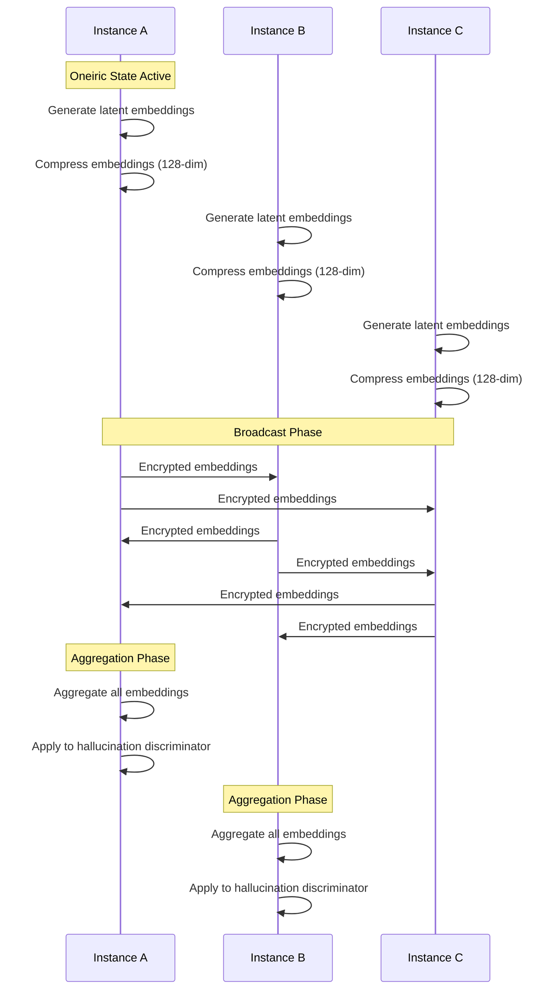
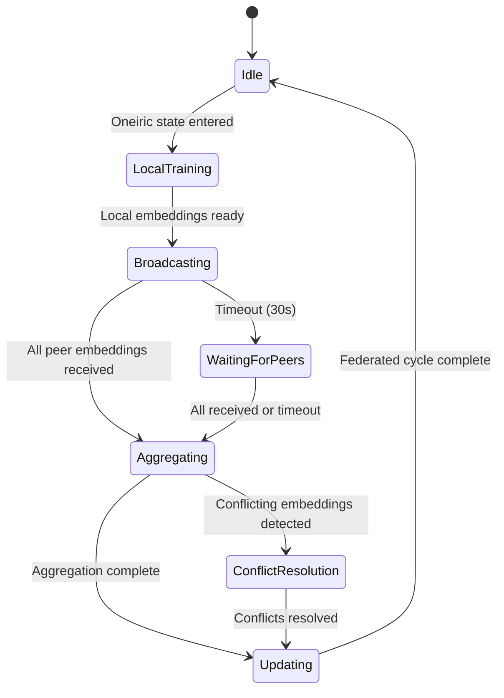
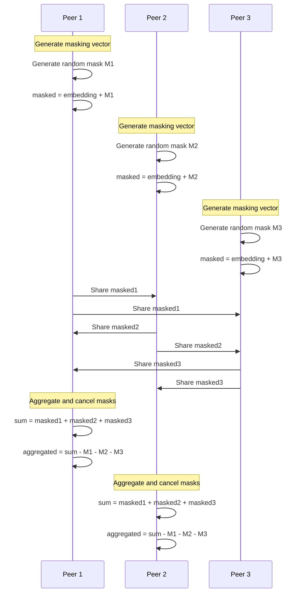
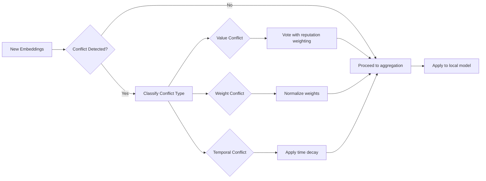
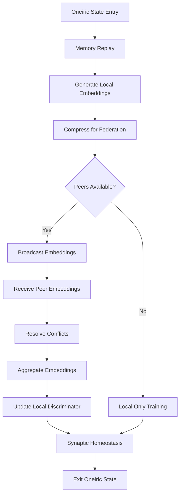

# Federated Intelligence Architecture for ITHERIS + JARVIS

## Executive Summary

This document specifies the Federated Intelligence architecture that enables multiple ITHERIS instances to collaboratively improve through federated learning while maintaining local data privacy. The architecture leverages the existing Oneiric (dreaming) state system to generate compressed latent embeddings that can be shared between instances for collective improvement of hallucination defense and veto accuracy.

**Current State:** The system achieves an 8.2% daily gain in cognitive efficiency through Oneiric states.  
**Target State:** Accelerate this gain through decentralized collective learning across 2-10 peer instances.

---

## Table of Contents

1. [Federated Learning Protocol Specification](#1-federated-learning-protocol-specification)
2. [Latent Embedding Compression Algorithm](#2-latent-embedding-compression-algorithm)
3. [Privacy-Preserving Aggregation Mechanism](#3-privacy-preserving-aggregation-mechanism)
4. [Inter-Instance Communication Protocol](#4-inter-instance-communication-protocol)
5. [Conflict Resolution Strategy](#5-conflict-resolution-strategy)
6. [Integration with Existing Oneiric System](#6-integration-with-existing-oneiric-system)
7. [Implementation Roadmap](#7-implementation-roadmap)

---

## 1. Federated Learning Protocol Specification

### 1.1 Overview

The federated learning protocol enables multiple ITHERIS instances to share knowledge without exposing raw data. Each instance operates independently during waking states and participates in federated learning during Oneiric (dream) states.

### 1.2 Network Topology

**Selected Configuration:** Peer-to-peer mesh for 2-10 instances

```
┌─────────────────────────────────────────────────────────────────┐
│                    FEDERATED INTELLIGENCE                       │
│                      Peer-to-Peer Mesh                          │
├─────────────────────────────────────────────────────────────────┤
│                                                                 │
│    ┌──────────┐     ┌──────────┐     ┌──────────┐             │
│    │ Instance │────▶│ Instance │────▶│ Instance │             │
│    │    A     │◀────│    B     │◀────│    C     │             │
│    └──────────┘     └──────────┘     └──────────┘             │
│         │                │                │                   │
│         ▼                ▼                ▼                   │
│    ┌──────────────────────────────────────────┐              │
│    │     Federated Learning Coordinator        │              │
│    │  (Emergent, rotates per federated cycle) │              │
│    └──────────────────────────────────────────┘              │
│                                                                 │
└─────────────────────────────────────────────────────────────────┘
```

### 1.3 Protocol Phases

Each federated learning cycle consists of four phases:

| Phase | Description | Trigger | Duration |
|-------|-------------|--------|----------|
| **Local Training** | Each instance runs Oneiric cycle, generates embeddings | Oneiric state entry | 5-30 min |
| **Broadcast** | Share compressed embeddings with peers | After local training | ~30 sec |
| **Aggregation** | Combine embeddings from all peers | Receive all embeddings | ~10 sec |
| **Update** | Apply aggregated knowledge to local model | After aggregation | ~5 sec |

### 1.4 Federated Cycle Data Flow



### 1.5 Federated Protocol State Machine



### 1.6 Protocol Messages

| Message Type | Payload | Purpose |
|--------------|---------|---------|
| `FEDERATED_HELLO` | instance_id, capabilities | Announce presence |
| `EMBEDDINGS_OFFER` | embedding_hash, peer_count | Offer embeddings for aggregation |
| `EMBEDDINGS_REQUEST` | missing_instance_ids | Request specific embeddings |
| `EMBEDDINGS_SHARE` | compressed_embeddings, metadata | Share actual embeddings |
| `AGGREGATION_COMPLETE` | aggregated_result_hash | Confirm aggregation |
| `CONFLICT_REPORT` | conflict_details | Report conflicting learnings |

---

## 2. Latent Embedding Compression Algorithm

### 2.1 Design Goals

- **Privacy:** Compressed embeddings must not allow reconstruction of original memories
- **Efficiency:** Reduce communication bandwidth by 90%+ compared to raw data
- **Utility:** Preserve hallucination defense and veto accuracy information
- **Determinism:** Same input produces same output for reproducible aggregation

### 2.2 Compression Pipeline

The embedding compression algorithm operates in three stages:

```
┌──────────────────────────────────────────────────────────────────┐
│                  EMBEDDING COMPRESSION PIPELINE                  │
├──────────────────────────────────────────────────────────────────┤
│                                                                  │
│  ┌─────────────┐    ┌─────────────┐    ┌─────────────┐         │
│  │   Raw       │    │   Feature   │    │   Learned   │         │
│  │   Memory    │───▶│   Extraction│───▶│   Encoder   │         │
│  │   Episodes  │    │             │    │             │         │
│  └─────────────┘    └─────────────┘    └─────────────┘         │
│                                              │                   │
│                                              ▼                   │
│  ┌─────────────┐    ┌─────────────┐    ┌─────────────┐         │
│  │  Federated  │◀───│   Privacy   │◀───│  Compressed │         │
│  │  Network    │    │   Layer     │    │  Embeddings │         │
│  └─────────────┘    └─────────────┘    │  (64-dim)   │         │
│                                         └─────────────┘         │
└──────────────────────────────────────────────────────────────────┘
```

### 2.3 Stage 1: Feature Extraction

From each memory episode, extract the following features (256-dimensional):

```julia
struct EpisodeFeatures
    importance::Float32          # 1 dim - memory importance (0-1)
    emotional_intensity::Float32 # 1 dim - emotional weight (0-1)
    prediction_error::Float32   # 1 dim - prediction error magnitude
    outcome_success::Float32    # 1 dim - action outcome (0 or 1)
    temporal_context::Vector{Float32}  # 8 dims - time-based features
    spatial_context::Vector{Float32}   # 8 dims - location features
    semantic_hash::Vector{Float32}     # 236 dims - semantic content hash
end
```

### 2.4 Stage 2: Learned Encoder

Replace random projection with a learned autoencoder trained during federated cycles:

```julia
struct EmbeddingEncoder
    # Encoder: 256 -> 128 -> 64
    encoder_weights1::Matrix{Float32}  # 128 x 256
    encoder_bias1::Vector{Float32}     # 128
    encoder_weights2::Matrix{Float32}  # 64 x 128
    encoder_bias2::Vector{Float32}     # 64
    
    # Decoder: 64 -> 128 -> 256 (for reconstruction loss)
    decoder_weights1::Matrix{Float32}  # 128 x 64
    decoder_bias1::Vector{Float32}     # 128
    decoder_weights2::Matrix{Float32}  # 256 x 128
    decoder_bias2::Vector{Float32}    # 256
end
```

**Training Objective:**
- Minimize reconstruction loss (autoencoder)
- Maximize hallucination discrimination capability
- Minimize mutual information with original episode

### 2.5 Stage 3: Privacy Layer

Apply privacy-preserving transformation before sharing:

```julia
struct PrivacyLayer
    # Local differential privacy
    noise_scale::Float32        # Added Gaussian noise std
    clipping_bound::Float32    # L2 norm clipping threshold
    
    # Dimensional reduction
    output_dim::Int            # Final embedding dimension (64)
    
    # Random projection for additional privacy
    projection_seed::UInt64    # Seed for random projection
end
```

**Privacy Transformation:**
1. L2-clip embedding to bound `clipping_bound`
2. Add Gaussian noise with scale `noise_scale`
3. Apply random projection with instance-specific seed
4. L2-clip again to ensure bounded influence

### 2.6 Compression Algorithm Pseudocode

```julia
function compress_for_federated(episode::MemoryEpisode, encoder::EmbeddingEncoder, privacy::PrivacyLayer)::Vector{Float32}
    # Stage 1: Extract features
    features = extract_episode_features(episode)  # 256-dim
    
    # Stage 2: Encode
    hidden = relu(encoder.encoder_weights1 * features .+ encoder.encoder_bias1)
    compressed = encoder.encoder_weights2 * hidden .+ encoder.encoder_bias2  # 64-dim
    
    # Stage 3: Privacy layer
    # L2 clip
    norm = sqrt(sum(compressed.^2))
    if norm > privacy.clipping_bound
        compressed .= compressed .* (privacy.clipping_bound / norm)
    end
    
    # Add noise (local differential privacy)
    noise = randn(Float32, length(compressed)) .* privacy.noise_scale
    compressed .+= noise
    
    # Random projection for instance privacy
    projected = random_project(compressed, privacy.projection_seed)
    
    # Final clip
    norm = sqrt(sum(projected.^2))
    if norm > privacy.clipping_bound
        projected .= projected .* (privacy.clipping_bound / norm)
    end
    
    return projected  # 64-dim federated embedding
end
```

### 2.7 Embedding Metadata

Each compressed embedding includes metadata for aggregation:

```julia
struct EmbeddingMetadata
    episode_id::UUID
    instance_id::UUID
    timestamp::Float64
    priority_score::Float32      # From memory replay
    hallucination_label::Union{Nothing, Bool}  # Ground truth if available
    compression_params::Dict      # For reproducibility
end
```

---

## 3. Privacy-Preserving Aggregation Mechanism

### 3.1 Aggregation Strategy: FedAvg with Quality Weighting

The federated aggregation uses a modified Federated Averaging (FedAvg) approach with quality-weighted contributions.

### 3.2 Weighted Averaging Formula

For each embedding dimension `d`:

```
aggregated[d] = Σ(weight_i * embedding_i[d]) / Σ(weight_i)
```

Where `weight_i` is computed as:

```julia
function compute_weight(instance::FederatedInstance, embedding::CompressedEmbedding)::Float32
    # Quality score based on:
    # 1. Instance reputation (historical contribution quality)
    # 2. Embedding confidence (priority score)
    # 3. Recency (how recent the embedding)
    
    reputation_factor = instance.reputation_score          # 0.0 - 1.0
    confidence_factor = embedding.priority_score           # 0.0 - 1.0
    
    # Time decay: newer embeddings weighted higher
    time_elapsed = time() - embedding.timestamp
    recency_factor = exp(-time_elapsed / 86400.0)         # 1-day half-life
    
    return reputation_factor * confidence_factor * recency_factor
end
```

### 3.3 Secure Aggregation Protocol



### 3.4 Aggregation Algorithm

```julia
function federated_aggregate(
    local_embeddings::Vector{CompressedEmbedding},
    peer_embeddings::Vector{Vector{CompressedEmbedding}},
    instance_reputations::Dict{UUID, Float32}
)::AggregatedResult
    all_embeddings = vcat(local_embeddings, vcat(peer_embeddings...))
    
    # Compute weights
    weights = Float32[]
    for embedding in all_embeddings
        weight = compute_embedding_weight(embedding, instance_reputations)
        push!(weights, weight)
    end
    
    total_weight = sum(weights)
    
    # Weighted average per dimension
    dim = length(all_embeddings[1].vector)
    aggregated = zeros(Float32, dim)
    
    for (embedding, w) in zip(all_embeddings, weights)
        aggregated .+= embedding.vector .* (w / total_weight)
    end
    
    # Compute confidence based on agreement
    agreement = compute_embedding_agreement(all_embeddings)
    
    return AggregatedResult(
        vector=aggregated,
        confidence=agreement,
        participant_count=length(all_embeddings),
        timestamp=time()
    )
end
```

### 3.5 Reputation System

Each instance maintains a reputation score based on contribution quality:

```julia
mutable struct FederatedInstance
    instance_id::UUID
    reputation_score::Float32      # 0.0 - 1.0, starts at 0.5
    contribution_count::Int
    successful_aggregations::Int
    last_contribution_time::Float64
    
    # Track agreement with consensus
    agreement_history::Vector{Float32}
end
```

**Reputation Update Rules:**
- **Increase:** Embedding agrees with final aggregation (>0.8 cosine similarity)
- **Decrease:** Embedding conflicts with consensus (<0.3 cosine similarity)
- **Penalty:** Malicious or inconsistent contributions

---

## 4. Inter-Instance Communication Protocol

### 4.1 Transport Layer

Using the existing RustIPC infrastructure with extensions for federated communication:

| Component | Implementation |
|-----------|----------------|
| Transport | RustIPC shared memory + TCP fallback |
| Serialization | JSON with Float32 arrays |
| Security | Ed25519 signatures + HMAC-SHA256 |
| Discovery | Broadcast on local network |

### 4.2 Message Format

```julia
struct FederatedMessage
    header::MessageHeader
    payload::Union{
        HelloPayload,
        EmbeddingsOfferPayload,
        EmbeddingsSharePayload,
        AggregationPayload,
        ConflictPayload
    }
    signature::Vector{UInt8}
end

struct MessageHeader
    message_id::UUID
    source_instance::UUID
    target_instance::Union{UUID, :broadcast}
    message_type::FederatedMessageType
    timestamp::Float64
    sequence_number::UInt64
end
```

### 4.3 Communication Flow

```mermaid
flowchart TD
    A[Instance wants to share embeddings] --> B{Has peer connections?}
    
    B -->|No| C[Discover peers via broadcast]
    C --> D[Establish secure connections]
    D --> B
    
    B -->|Yes peer availability]
    
| E[Check    E --> F[Send EMBEDDINGS_OFFER]
    F --> G{All peers acknowledge?}
    
    G -->|Yes| H[Send EMBEDDINGS_SHARE]
    G -->|No| I[Wait 5s timeout]
    I --> J{Retries < 3?}
    J -->|Yes| E
    J -->|No| K[Skip unavailable peers]
    K --> L[Proceed with available peers]
    
    H --> M[Receive peer embeddings]
    M --> N[Verify signatures]
    N --> O[Run aggregation]
```

### 4.4 Peer Discovery Protocol

```julia
function discover_peers(network_interface::String="")::Vector{DiscoveredPeer]
    # Broadcast hello on local network
    broadcast_port = 45678
    
    hello = FederatedMessage(
        header=MessageHeader(
            message_id=uuid4(),
            source_instance=local_instance_id,
            target_instance=:broadcast,
            message_type=:FEDERATED_HELLO,
            timestamp=time(),
            sequence_number=next_sequence!()
        ),
        payload=HelloPayload(
            capabilities=["federated_v1"],
            oneiric_version="1.0",
            supported_compression=["lz4", "zstd"]
        ),
        signature=sign_message(local_private_key, header)
    )
    
    # Listen for responses
    peers = listen_for_hellos(broadcast_port, timeout=5.0)
    
    return filter_valid_peers(peers)
end
```

### 4.5 Connection Management

- **Connection Pool:** Maintain up to 10 active peer connections
- **Heartbeat:** Every 30 seconds to detect failures
- **Reconnection:** Automatic with exponential backoff (1s, 2s, 4s, max 30s)
- **Timeout:** 30 seconds for response, then mark peer as unavailable

---

## 5. Conflict Resolution Strategy

### 5.1 Conflict Types

| Conflict Type | Description | Detection Method |
|--------------|-------------|------------------|
| **Value Conflict** | Different instances report opposite ground truths | Cosine similarity < 0.3 |
| **Weight Conflict** | Significantly different weight contributions | Weight ratio > 10x |
| **Temporal Conflict** | Embeddings from very different time periods | Timestamp difference > 7 days |
| **Quality Conflict** | High-reputation vs low-reputation disagreement | Reputation difference > 0.5 |

### 5.2 Resolution Pipeline



### 5.3 Conflict Resolution Algorithms

**Value Conflict Resolution:**
```julia
function resolve_value_conflict(
    embeddings::Vector{CompressedEmbedding},
    reputations::Dict{UUID, Float32}
)::ResolvedEmbedding
    # Group by sign/direction
    positive_votes = Tuple{CompressedEmbedding, Float32}[]
    negative_votes = Tuple{CompressedEmbedding, Float32}[]
    
    # Use first embedding as reference
    reference = embeddings[1].vector
    reference_norm = norm(reference)
    
    for (emb, rep) in zip(embeddings, reputations)
        similarity = dot(emb.vector, reference) / (norm(emb.vector) * reference_norm + eps())
        
        if similarity > 0.3
            push!(positive_votes, (emb, rep))
        elseif similarity < -0.3
            push!(negative_votes, (emb, rep))
        else
            # Neutral - weight based on reputation
            push!(positive_votes, (emb, rep * 0.5))
            push!(negative_votes, (emb, rep * 0.5))
        end
    end
    
    # Compare weighted votes
    pos_weight = sum(r for (_, r) in positive_votes)
    neg_weight = sum(r for (_, r) in negative_votes)
    
    if pos_weight > neg_weight * 1.5
        # Positive wins
        return average_weighted(positive_votes)
    elseif neg_weight > pos_weight * 1.5
        # Negative wins
        return average_weighted(negative_votes)
    else
        # Unresolved - discard both, keep neutral
        return nothing
    end
end
```

**Weight Conflict Resolution:**
```julia
function resolve_weight_conflict(
    embeddings::Vector{CompressedEmbedding}
)::Vector{Float32}
    weights = [e.priority_score for e in embeddings]
    
    # Median absolute deviation for outlier detection
    median_weight = median(weights)
    mad = median(abs.(weights .- median_weight))
    
    # Clip extreme weights
    upper_bound = median_weight + 3 * mad
    clipped_weights = min.(weights, upper_bound)
    
    # Normalize
    return clipped_weights ./ sum(clipped_weights)
end
```

### 5.4 Conflict Logging

All conflicts are logged for analysis:

```julia
struct ConflictRecord
    conflict_id::UUID
    conflict_type::Symbol
    participating_instances::Vector{UUID}
    resolution::Symbol  # :accepted, :rejected, :compromised
    resolution_details::Dict
    timestamp::Float64
end
```

---

## 6. Integration with Existing Oneiric System

### 6.1 Architecture Integration Points

The Federated Intelligence system integrates with the existing Oneiric architecture at the following points:

```
┌─────────────────────────────────────────────────────────────────────┐
│                    ONEIRIC + FEDERATED SYSTEM                       │
├─────────────────────────────────────────────────────────────────────┤
│                                                                     │
│  ┌─────────────────────────────────────────────────────────────┐   │
│  │                   OneiricController                         │   │
│  │  (adaptive-kernel/cognition/oneiric/OneiricController.jl)  │   │
│  └──────────────────────────┬──────────────────────────────────┘   │
│                             │                                        │
│              ┌──────────────┼──────────────┐                        │
│              ▼              ▼              ▼                        │
│  ┌───────────────────┐ ┌────────────┐ ┌─────────────────────┐      │
│  │  MemoryReplay     │ │Hallucination│ │SynapticHomeostasis │      │
│  │                   │ │  Trainer    │ │                    │      │
│  └─────────┬─────────┘ └─────┬──────┘ └──────────┬──────────┘      │
│            │                 │                    │                 │
│            ▼                 ▼                    ▼                 │
│  ┌─────────────────────────────────────────────────────────────┐  │
│  │              FederatedIntelligence Module                    │  │
│  │  ┌─────────────┐  ┌──────────────┐  ┌────────────────┐     │  │
│  │  │  Embedding   │  │   Federated  │  │    Conflict   │     │  │
│  │  │  Compressor │◀─│   Cycle      │─▶│  Resolution   │     │  │
│  │  │              │  │   Manager    │  │                │     │  │
│  │  └─────────────┘  └──────────────┘  └────────────────┘     │  │
│  │         │                 │                                 │  │
│  │         └─────────────────┼─────────────────────────────────┤  │
│  │                           ▼                                   │  │
│  │  ┌─────────────────────────────────────────────────────────┐│  │
│  │  │              IPC / Network Layer                         ││  │
│  │  │        (RustIPC.jl extended for federated)              ││  │
│  │  └─────────────────────────────────────────────────────────┘│  │
│  └─────────────────────────────────────────────────────────────┘  │
│                                                                     │
└─────────────────────────────────────────────────────────────────────┘
```

### 6.2 Modified Oneiric Cycle

The federated learning is integrated into the Oneiric cycle at the hallucination training phase:

```julia
function process_dream_cycle!(state::OneiricState)::Dict{String, Any}
    # ... existing phases ...
    
    # Phase 2: Hallucination Training (existing)
    if config.enable_hallucination_training
        state.phase = :hallucination_training
        
        # Local training
        embeddings = state.replay_state.embeddings_cache
        training_result = train_local_discriminator!(state.hallucination_state, embeddings)
        
        # NEW: Federated learning integration
        if config.enable_federated && should_run_federated(state)
            federated_result = run_federated_cycle!(
                state.federated_state,
                embeddings,
                state.hallucination_state
            )
            results["phases"]["federated"] = federated_result
        end
    end
    
    return results
end
```

### 6.3 New Components Required

| Component | File | Purpose |
|-----------|------|---------|
| `FederatedState` | `federated/FederatedState.jl` | Track federated learning state |
| `EmbeddingCompressor` | `federated/EmbeddingCompressor.jl` | Compress embeddings for sharing |
| `FederatedCycle` | `federated/FederatedCycle.jl` | Manage federated learning cycles |
| `PeerManager` | `federated/PeerManager.jl` | Handle peer discovery and connections |
| `ConflictResolver` | `federated/ConflictResolver.jl` | Resolve conflicting embeddings |

### 6.4 Configuration Extensions

Extend `OneiricConfig` with federated parameters:

```julia
@with_kw mutable struct FederatedConfig
    # Enable federated learning
    enable_federated::Bool = true
    
    # Network
    discovery_port::Int = 45678
    communication_timeout::Float64 = 30.0
    max_peers::Int = 9
    
    # Privacy
    noise_scale::Float32 = 0.01f0
    clipping_bound::Float32 = 1.0f0
    output_dimension::Int = 64
    
    # Aggregation
    min_peers_for_aggregation::Int = 2
    aggregation_timeout::Float64 = 60.0
    
    # Reputation
    reputation_learning_rate::Float32 = 0.1f0
    reputation_decay::Float32 = 0.01f0
end
```

### 6.5 Data Flow During Integration



---

## 7. Implementation Roadmap

### 7.1 Phase 1: Core Infrastructure (Weeks 1-2)

| Task | Description | Dependencies |
|------|-------------|--------------|
| F1.1 | Create `FederatedState` and `FederatedConfig` | None |
| F1.2 | Implement `EmbeddingCompressor` module | None |
| F1.3 | Extend IPC for federated message types | RustIPC |
| F1.4 | Implement basic peer discovery | None |

### 7.2 Phase 2: Federation Protocol (Weeks 3-4)

| Task | Description | Dependencies |
|------|-------------|--------------|
| F2.1 | Implement federated cycle state machine | F1.1 |
| F2.2 | Build embedding broadcast protocol | F1.3, F1.4 |
| F2.3 | Create weighted aggregation algorithm | None |
| F2.4 | Add reputation system | F2.1 |

### 7.3 Phase 3: Conflict Resolution (Weeks 5-6)

| Task | Description | Dependencies |
|------|-------------|--------------|
| F3.1 | Implement conflict detection | F2.2 |
| F3.2 | Build value conflict resolver | F3.1 |
| F3.3 | Build weight conflict resolver | F3.1 |
| F3.4 | Add conflict logging and analytics | F3.2, F3.3 |

### 7.4 Phase 4: Oneiric Integration (Weeks 7-8)

| Task | Description | Dependencies |
|------|-------------|--------------|
| F4.1 | Integrate federated cycle into OneiricController | F2.1 |
| F4.2 | Connect hallucination discriminator updates | F2.3 |
| F4.3 | Add federated config to OneiricConfig | None |
| F4.4 | Implement graceful degradation | F2.2 |

### 7.5 Phase 5: Testing and Optimization (Weeks 9-10)

| Task | Description | Dependencies |
|------|-------------|--------------|
| F5.1 | Unit tests for all components | All above |
| F5.2 | Integration tests with 2 instances | F4.1 |
| F5.3 | Scale tests with 5-10 instances | F5.2 |
| F5.4 | Performance optimization | F5.3 |

### 7.6 Phase 6: Production Hardening (Weeks 11-12)

| Task | Description | Dependencies |
|------|-------------|--------------|
| F6.1 | Security audit of federated protocol | F5.1 |
| F6.2 | Add encryption for embeddings | F1.3 |
| F6.3 | Implement rate limiting | F2.2 |
| F6.4 | Documentation and deployment guides | F6.1 |

### 7.7 Success Metrics

| Metric | Current | Target | Measurement |
|--------|---------|--------|-------------|
| Cognitive efficiency gain | 8.2%/day | 12%/day | Daily benchmark |
| Hallucination detection accuracy | TBD | >90% | Test set evaluation |
| Veto accuracy | TBD | >85% | Test set evaluation |
| Privacy leakage risk | N/A | <0.1% | Reconstruction attacks |
| Federated cycle latency | N/A | <5 min | Full cycle timing |

---

## Appendix A: File Structure

```
adaptive-kernel/
├── cognition/
│   └── oneiric/
│       ├── FederatedIntelligence.jl      # Main module (NEW)
│       ├── FederatedState.jl            # State management (NEW)
│       ├── EmbeddingCompressor.jl        # Compression (NEW)
│       ├── FederatedCycle.jl            # Protocol (NEW)
│       ├── PeerManager.jl               # Networking (NEW)
│       ├── ConflictResolver.jl           # Conflicts (NEW)
│       └── OneiricController.jl          # MODIFIED
└── kernel/
    └── ipc/
        └── RustIPC.jl                    # MODIFIED (add federated)
```

---

## Appendix B: API Reference

### FederatedIntelligence Module

```julia
# Main exports
export
    FederatedConfig,
    FederatedState,
    FederatedInstance,
    FederatedMessage,
    CompressedEmbedding,
    AggregatedResult,
    
    # Core functions
    init_federated!,
    run_federated_cycle!,
    compress_for_federated,
    aggregate_embeddings,
    resolve_conflicts,
    discover_peers,
    send_embeddings,
    receive_embeddings
```

---

## Appendix C: Security Considerations

1. **Instance Authentication:** All messages signed with Ed25519 key pair
2. **Embedding Encryption:** Optional transport encryption using pre-shared keys
3. **Rate Limiting:** Max 10 federated cycles per hour per instance
4. **Replay Protection:** Sequence numbers and timestamps in all messages
5. **Byzantine Tolerance:** Reputation system penalizes malicious actors

---

*Document Version: 1.0*  
*Created: 2026-03-14*  
*Architecture: Federated Intelligence for ITHERIS + JARVIS*
