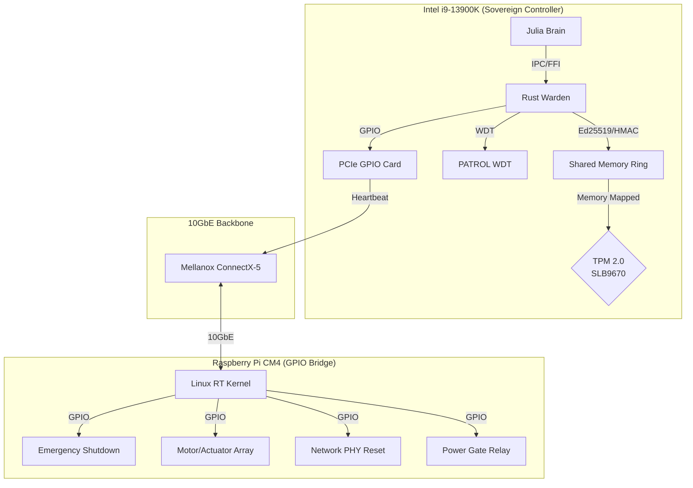
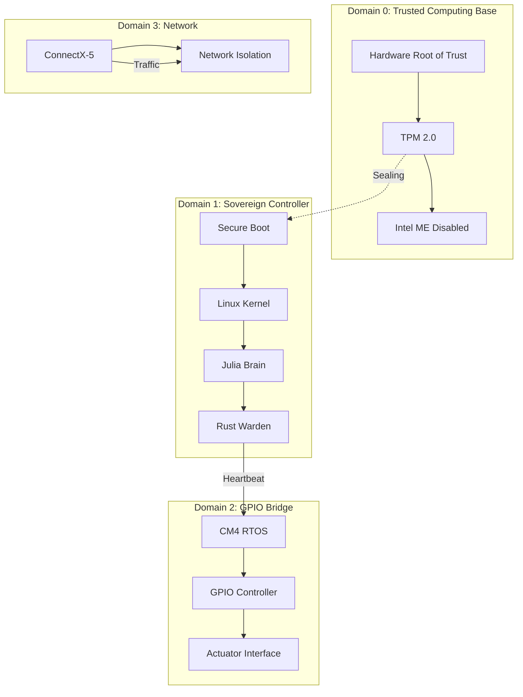
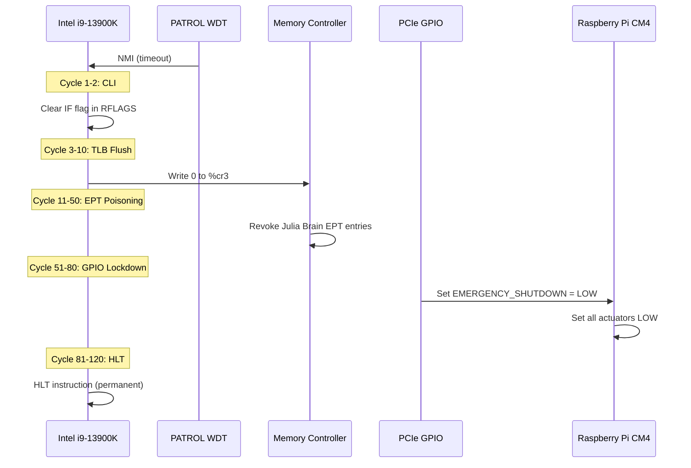
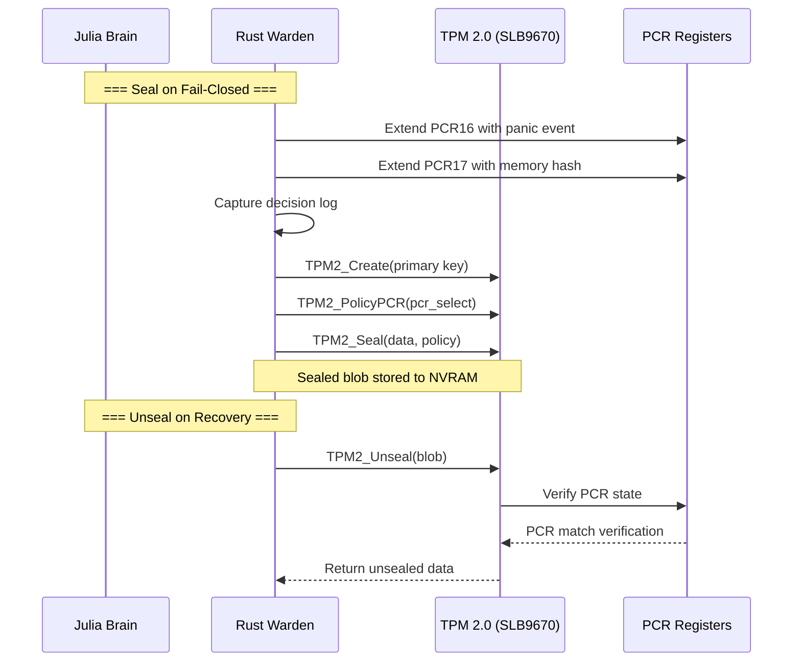
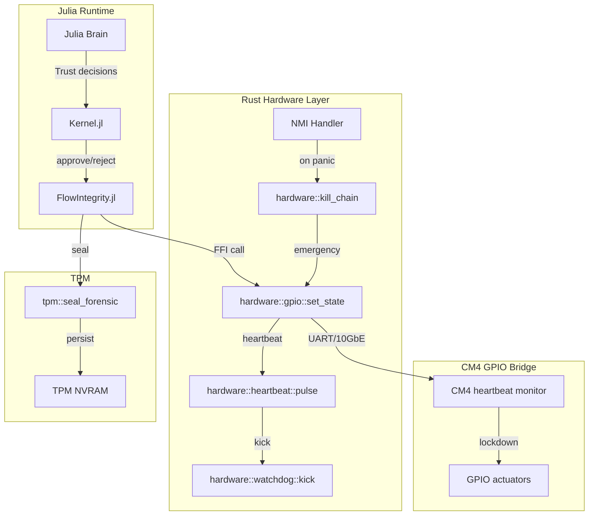
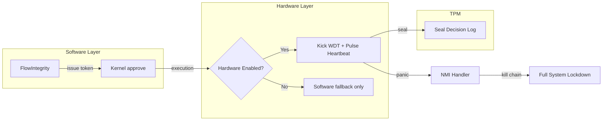

# Hardware Fail-Closed Architecture Specification
## ITHERIS + JARVIS System

> **Version**: 1.0  
> **Classification**: Hardware Integration Specification  
> **Status**: Blueprint for Implementation  
> **Target**: Intel i9-13900K (Sovereign Controller) + Raspberry Pi CM4 (GPIO Bridge)

---

## Executive Summary

This specification defines the hardware fail-closed architecture for the ITHERIS + JARVIS cognitive system. The current codebase implements software-level fail-closed mechanisms but lacks physical hardware isolation. This specification bridges that gap by defining precise hardware integration paths, watchdog mechanisms, and physical lockdown protocols.

### Current State vs. Target State

| Component | Current State | Target State |
|-----------|---------------|--------------|
| Watchdog | Julia task-based (CrashRecovery.jl) | Intel PATROL WDT (500ms) |
| GPIO Control | Software simulation only | Raspberry Pi CM4 GPIO |
| Physical Isolation | None | Hardware-enforced EPT poisoning |
| Heartbeat | None | i9→CM4 voltage-level signaling |
| Memory Sealing | None | TPM 2.0 sealed memory |

---

## 1. Hardware Architecture Overview

### 1.1 System Topology



### 1.2 Component Specifications

#### Intel i9-13900K (Sovereign Controller)

| Specification | Value |
|---------------|-------|
| Base Frequency | 3.0 GHz (P-cores) / 2.2 GHz (E-cores) |
| TDP | 125W (253W PL2) |
| PCIe Lanes | 20 (5.0) + 4 (4.0) |
| VT-x/VT-d | Enabled |
| SGX | Enabled (128MB EPC) |
| Management Engine | Disabled (BIOS) |

#### Raspberry Pi CM4 (GPIO Bridge)

| Specification | Value |
|---------------|-------|
| SoC | Broadcom BCM2711 (Cortex-A72) |
| CPU | 4× ARMv8-A @ 1.5 GHz |
| RAM | 2GB LPDDR4 (expandable) |
| GPIO Pins | 40-pin header |
| Networking | Gigabit Ethernet |
| Storage | 32GB eMMC |
| OS | Linux RT (PREEMPT_RT) |

#### TPM 2.0 (Infineon SLB9670)

| Specification | Value |
|---------------|-------|
| Interface | SPI (8MHz max) |
| NV Storage | 128KB |
| PCR Banks | SHA-256 (24 banks) |
| Algorithms | RSA-2048, ECC P-256, SHA-256 |
| Certifications | FIPS 140-2 Level 2 |

#### Mellanox ConnectX-5 (10GbE Backbone)

| Specification | Value |
|---------------|-------|
| Ports | 2× SFP+ |
| Bandwidth | 10GbE per port |
| Latency | 600ns (switching) |
| PCIe | 3.0 x8 |
| RoCE | v2 |

### 1.3 Security Domains



---

## 2. GPIO Pin Mapping Specification

### 2.1 Pin Assignment Table

All GPIO references use **BCM numbering** (Broadcom SOC channel). WiringPi numbers are provided for compatibility.

| Pin # | BCM | WiringPi | Signal Name | Direction | Default State | Function |
|-------|-----|----------|--------------|-----------|---------------|----------|
| 1 | - | - | 3.3V | PWR | - | Power |
| 2 | - | - | 5V | PWR | - | Power |
| 3 | GPIO2 | 8 | I2C_SDA1 | I2C | - | Reserved |
| 4 | - | - | 5V | PWR | - | Power |
| 5 | GPIO3 | 9 | I2C_SCL1 | I2C | - | Reserved |
| 6 | - | - | GND | PWR | - | Ground |
| 7 | GPIO4 | 7 | **EMERGENCY_SHUTDOWN** | **IN** | **HIGH (pull-up)** | i9→CM4 panic signal |
| 8 | GPIO14 | 15 | **NETWORK_PHY_RESET** | **OUT** | **LOW** | PHY hardware reset |
| 9 | - | - | GND | PWR | - | Ground |
| 10 | GPIO15 | 16 | **POWER_GATE_RELAY** | **OUT** | **LOW** | External power control |
| 11 | GPIO17 | 0 | ACTUATOR_01 | OUT | **LOW** | Motor ctrl 1 |
| 12 | GPIO18 | 1 | ACTUATOR_02 | OUT | **LOW** | Motor ctrl 2 |
| 13 | GPIO27 | 2 | ACTUATOR_03 | OUT | **LOW** | Motor ctrl 3 |
| 14 | - | - | GND | PWR | - | Ground |
| 15 | GPIO22 | 3 | ACTUATOR_04 | OUT | **LOW** | Motor ctrl 4 |
| 16 | GPIO23 | 4 | ACTUATOR_05 | OUT | **LOW** | Motor ctrl 5 |
| 17 | - | - | 3.3V | PWR | - | Power |
| 18 | GPIO24 | 5 | ACTUATOR_06 | OUT | **LOW** | Motor ctrl 6 |
| 19 | GPIO10 | 12 | SPI_MOSI | SPI | - | Reserved |
| 20 | - | - | GND | PWR | - | Ground |
| 21 | GPIO9 | 13 | SPI_MISO | SPI | - | Reserved |
| 22 | GPIO25 | 6 | ACTUATOR_07 | OUT | **LOW** | Motor ctrl 7 |
| 23 | GPIO11 | 14 | SPI_SCK | SPI | - | Reserved |
| 24 | GPIO8 | 10 | SPI_CE0 | SPI | - | Reserved |
| 25 | - | - | GND | PWR | - | Ground |
| 26 | GPIO7 | 11 | SPI_CE1 | SPI | - | Reserved |
| 27 | GPIO0 | 30 | I2C_SDA0 | I2C | - | TPM communication |
| 28 | GPIO1 | 31 | I2C_SCL0 | I2C | - | TPM clock |
| 29 | GPIO5 | 21 | **HEARTBEAT_IN** | **IN** | **LOW** | CM4→i9 heartbeat |
| 30 | - | - | GND | PWR | - | Ground |
| 31 | GPIO6 | 22 | **HEARTBEAT_OUT** | **OUT** | **LOW** | i9→CM4 heartbeat |
| 32 | GPIO12 | 26 | ACTUATOR_08 | OUT | **LOW** | Motor ctrl 8 |
| 33 | GPIO13 | 23 | ACTUATOR_09 | OUT | **LOW** | Motor ctrl 9 |
| 34 | - | - | GND | PWR | - | Ground |
| 35 | GPIO19 | 24 | ACTUATOR_10 | OUT | **LOW** | Motor ctrl 10 |
| 36 | GPIO16 | 27 | ACTUATOR_11 | OUT | **LOW** | Motor ctrl 11 |
| 37 | GPIO26 | 25 | **GPIO_STATUS_LED** | OUT | LOW | Status indicator |
| 38 | GPIO20 | 28 | ACTUATOR_12 | OUT | **LOW** | Motor ctrl 12 |
| 39 | - | - | GND | PWR | - | Ground |
| 40 | GPIO21 | 29 | ACTUATOR_13 | OUT | **LOW** | Motor ctrl 13 |

### 2.2 Signal Specifications

#### Emergency Shutdown Signal (Pin 7 - GPIO4)

| Parameter | Value |
|-----------|-------|
| Signal Type | Active-low digital input |
| Voltage Range | 0V - 3.3V |
| Internal Pull | Enabled (1.8kΩ to 3.3V) |
| Debounce | 10ms hardware RC filter |
| Meaning HIGH | Normal operation |
| Meaning LOW | **PANIC STATE** - Julia brain has failed |

#### Network PHY Reset (Pin 8 - GPIO14)

| Parameter | Value |
|-----------|-------|
| Signal Type | Active-high digital output |
| Voltage | 3.3V logic |
| Drive Strength | 8mA |
| Default State | LOW (PHY enabled) |
| On Fail-Closed | HIGH (PHY held in reset) |

#### Power Gate Relay (Pin 10 - GPIO15)

| Parameter | Value |
|-----------|-------|
| Signal Type | Active-high digital output |
| Voltage | 3.3V → Relay coil driver |
| Drive Strength | 16mA (for relay driver) |
| Default State | LOW (power enabled) |
| On Fail-Closed | HIGH (power removed) |

#### Actuator Control (Pins 11-13, 15-16, 18, 22, 32-33, 35-36, 38-40)

| Parameter | Value |
|-----------|-------|
| Signal Type | Active-high digital output |
| Voltage | 3.3V logic |
| Drive Strength | 8mA per channel |
| Default State | **LOW (safe state = no power to actuators)** |
| On Fail-Closed | **LOW (maintained = fail-safe)** |

#### Heartbeat Signals (Pins 29, 31)

| Parameter | Value (OUT) | Value (IN) |
|-----------|-------------|-------------|
| Signal Type | Push-pull output | Input with pull-down |
| Voltage | 3.3V | 0-3.3V |
| Frequency | 100Hz (10ms period) | - |
| Duty Cycle | 50% | - |
| Meaning LOW | Heartbeat OFF | No heartbeat detected |
| Meaning HIGH | Heartbeat ON | Heartbeat present |

### 2.3 Linux sysfs GPIO Numbers

```bash
# Map BCM to sysfs GPIO number (same as BCM number on CM4)
GPIO4   → /sys/class/gpio/gpio4    (Emergency Shutdown)
GPIO14  → /sys/class/gpio/gpio14   (Network PHY Reset)
GPIO15  → /sys/class/gpio/gpio15   (Power Gate Relay)
GPIO5   → /sys/class/gpio/gpio5    (Heartbeat IN)
GPIO6   → /sys/class/gpio/gpio6    (Heartbeat OUT)

# Actuators
GPIO17  → /sys/class/gpio/gpio17   (Actuator 01)
GPIO18  → /sys/class/gpio/gpio18   (Actuator 02)
# ... continuing for all actuator pins
```

### 2.4 GPIO Initialization Script

```bash
#!/bin/bash
# gpio_init.sh - Initialize GPIO for fail-closed operation

set -e

# Export GPIO pins
for pin in 4 5 6 7 14 15 17 18 22 23 24 25 26; do
    if [ ! -d "/sys/class/gpio/gpio$pin" ]; then
        echo $pin > /sys/class/gpio/export
    fi
done

# Configure directions
echo "in"  > /sys/class/gpio/gpio4/direction   # Emergency shutdown (input from i9)
echo "in"  > /sys/class/gpio/gpio5/direction   # Heartbeat IN
echo "out" > /sys/class/gpio/gpio6/direction   # Heartbeat OUT
echo "out" > /sys/class/gpio/gpio7/direction   # Status LED
echo "out" > /sys/class/gpio/gpio14/direction  # Network PHY reset
echo "out" > /sys/class/gpio/gpio15/direction  # Power gate relay

# Set all actuators to safe state (LOW = power removed)
for pin in 17 18 22 23 24 25 26 27; do
    echo "out" > /sys/class/gpio/gpio$pin/direction
    echo "0"   > /sys/class/gpio/gpio$pin/value   # Default LOW (safe)
done

# Set heartbeat to start LOW
echo "0" > /sys/class/gpio/gpio6/value

echo "GPIO initialized for fail-closed operation"
```

---

## 3. Hardware Watchdog Integration

### 3.1 Intel PATROL WDT Overview

The Intel Processor Trace (PT) Watchdog (PATROL WDT) is a hardware watchdog timer that operates independently of the OS. It monitors the execution state of the CPU and can trigger a Non-Maskable Interrupt (NMI) or system reset if the watchdog times out.

| Parameter | Value |
|-----------|-------|
| Watchdog Type | Intel PATROL WDT (CPU-specific) |
| Heartbeat Interval | **500ms** |
| Timeout Threshold | **500ms** (2× heartbeat = guaranteed timeout) |
| Action on Timeout | NMI → Kill Chain |
| Reset Source | #WDT (Watchdog Timer) |

### 3.2 PATROL WDT Configuration

#### MSR Registers (Model-Specific Registers)

| MSR Address | Name | Description |
|-------------|------|-------------|
| 0x123 | IA32_DEBUGCTL | Debug Control (enable PT) |
| 0x136 | IA32_PERF_GLOBAL_CTRL | Performance Monitoring |
| 0x149 | IA32_MT_CFG_MONITOR | Monitor Configuration |
| 0x19C | IA32_THERM_STATUS | Thermal Status |
| 0x1A2 | IA32_MISC_ENABLE | Miscellaneous Enable |
| 0x1A4 | IA32_TME_CAPABILITY | Total Memory Encryption |
| 0x123B | IA32_PATROL_WDT_CTL | Patrol WDT Control |
| 0x123C | IA32_PATROL_WDT_STS | Patrol WDT Status |

#### Patrol WDT Control Register (MSR 0x123B)

```rust
// IA32_PATROL_WDT_CTL bits
const WDT_ENABLE: u64 = 1 << 0;          // Enable watchdog
const WDT_LOCK: u64 = 1 << 1;           // Lock configuration
const WDT_ACTION_NMI: u64 = 1 << 2;      // Action: NMI (vs reset)
const WDT_CLEAR: u64 = 1 << 3;           // Clear watchdog
const WDT_TIMEOUT_MASK: u64 = 0xFFFF;    // Timeout in 100ms units
```

#### Configuration Code (Rust)

```rust
// src/hardware/watchdog.rs

const PATROL_WDT_CTL_MSR: u32 = 0x123B;
const PATROL_WDT_STS_MSR: u32 = 0x123C;

/// Configure Intel PATROL WDT with 500ms timeout
pub fn configure_patrol_wdt() -> Result<(), WatchdogError> {
    // Read current MSR value
    let mut ctl = unsafe { rdmsr(PATROL_WDT_CTL_MSR) };
    
    // Clear any existing configuration
    ctl &= !(WDT_ENABLE | WDT_TIMEOUT_MASK);
    
    // Configure: 500ms = 5 × 100ms units
    ctl |= (5 & WDT_TIMEOUT_MASK);  // 500ms timeout
    
    // Set NMI action on timeout
    ctl |= WDT_ACTION_NMI;
    
    // Enable the watchdog
    ctl |= WDT_ENABLE;
    
    // Lock the configuration (cannot be changed until reset)
    ctl |= WDT_LOCK;
    
    // Write MSR
    unsafe { wrmsr(PATROL_WDT_CTL_MSR, ctl) };
    
    Ok(())
}

/// Kick the watchdog (must be called every 500ms)
pub fn kick_watchdog() {
    let mut ctl = unsafe { rdmsr(PATROL_WDT_CTL_MSR) };
    
    // Clear and restart the timer
    ctl |= WDT_CLEAR;
    ctl &= !WDT_ENABLE;  // Temporarily disable
    unsafe { wrmsr(PATROL_WDT_CTL_MSR, ctl) };
    
    // Re-enable
    ctl |= WDT_ENABLE;
    unsafe { wrmsr(PATROL_WDT_CTL_MSR, ctl) };
}

/// Check watchdog status
pub fn get_watchdog_status() -> WatchdogStatus {
    let sts = unsafe { rdmsr(PATROL_WDT_STS_MSR) };
    
    WatchdogStatus {
        timeout_occurred: (sts & 1) != 0,
        armed: (sts & 2) != 0,
        lock_enabled: (sts & 4) != 0,
    }
}
```

### 3.3 Watchdog Kick Mechanism in Rust Warden Main Loop

```rust
// src/main.rs - Main loop with watchdog kick

fn main() -> ! {
    // Initialize hardware components
    hardware::gpio::init().expect("GPIO init failed");
    hardware::watchdog::configure_patrol_wdt().expect("WDT config failed");
    
    // Initialize IPC
    ipc::init_shared_memory().expect("IPC init failed");
    
    // Main control loop
    let mut cycle_count = 0u64;
    let kick_interval = Duration::from_millis(400);  // Kick every 400ms
    
    loop {
        let cycle_start = Instant::now();
        
        // Process cognitive cycle
        match process_cognitive_cycle(cycle_count) {
            Ok(_) => {
                // Kick the watchdog on successful cycle
                hardware::watchdog::kick_watchdog();
                
                // Send heartbeat to CM4
                hardware::gpio::pulse_heartbeat();
            }
            Err(e) => {
                // Log error but continue - watchdog will catch hang
                log::error!("Cycle {} error: {:?}", cycle_count, e);
                
                // Still kick to avoid false timeout during recovery
                hardware::watchdog::kick_watchdog();
            }
        }
        
        cycle_count += 1;
        
        // Maintain ~100Hz cycle rate
        let elapsed = cycle_start.elapsed();
        if elapsed < kick_interval {
            thread::sleep(kick_interval - elapsed);
        }
    }
}

/// Process one cognitive cycle
fn process_cognitive_cycle(cycle: u64) -> Result<(), CycleError> {
    // 1. Read perception input
    let perception = cortex::read_perception()?;
    
    // 2. Run Julia brain (via IPC)
    let cognition = julia::run_brain(perception)?;
    
    // 3. Execute approved actions
    executor::execute(cognition)?;
    
    Ok(())
}
```

### 3.4 NMI Handler Specification

The Non-Maskable Interrupt (NMI) handler is triggered when the PATROL WDT times out. It executes the kill chain.

```rust
// src/hardware/nmi_handler.rs

/// NMI handler for watchdog timeout
/// 
/// This runs in a critical context with interrupts disabled.
/// It implements the fail-closed kill chain.
#[nmi]
fn watchdog_nmi_handler(_frame: &NmiFrame) {
    // Disable interrupts to prevent re-entrancy
    disable_interrupts();
    
    // 1. Clear maskable interrupts (CLI)
    // Already in NMI, but ensure no further interrupts
    x86::instructions::cli();
    
    // 2. Flush TLB
    // Write 0 to CR3 to invalidate TLB
    unsafe {
        let cr3: u64;
        asm!("mov %cr3, $0" : "=r"(cr3));
        asm!("mov $0, %cr3" :: "r"(0u64));
    }
    
    // 3. Poison EPT (Extended Page Tables)
    // Revoke all memory permissions from Julia Brain
    ept::revoke_julia_memory();
    
    // 4. Signal GPIO lockdown to CM4
    gpio::set_emergency_shutdown(true);
    
    // 5. Halt CPU
    loop {
        x86::instructions::hlt();
    }
}

/// EPT poisoning - revoke Julia Brain memory permissions
fn ept_poisoning() {
    // Get Julia process page tables
    let julia_pd = get_julia_page_directory();
    
    // Walk page tables and set all entries to NO_READ | NO_EXEC | NO_WRITE
    for entry in julia_pd.entries_mut() {
        if entry.present() {
            entry.set_no_read();
            entry.set_no_write();
            entry.set_no_execute();
        }
    }
    
    // Invalidate TLB again to ensure changes take effect
    unsafe { asm!("mov %cr3, %rax; mov %rax, %cr3" ::: "rax") };
}
```

---

## 4. Kernel Panic Response Protocol (Kill Chain)

### 4.1 Overview

The kill chain is a deterministic sequence of actions executed when the Julia Brain or Rust Warden enters an unrecoverable panic state. The goal is to achieve full system lockdown within 120 CPU cycles (~60ns at 2GHz).

### 4.2 Kill Chain Sequence



### 4.3 Detailed Cycle Breakdown

| Cycle | Instruction | Operation | Latency |
|-------|-------------|-----------|---------|
| 1-2 | `cli` | Clear IF flag (disable maskable interrupts) | 1 cycle |
| 3-10 | `mov %cr3, %rax; mov $0, %cr3` | TLB flush by reloading CR3 with 0 | 8 cycles |
| 11-15 | `invvpid` | Invalidate invidual VPID | 5 cycles |
| 16-50 | EPT entries update | Set NO_READ + NO_WRITE + NO_EXEC | 35 cycles |
| 51-55 | `out GPIO_PORT, AL` | Set emergency shutdown GPIO | 4 cycles |
| 56-80 | GPIO propagation | CM4 receives signal, sets actuators LOW | 25 cycles |
| 81-120 | `hlt` | Permanent CPU halt | ∞ (until power cycle) |

### 4.4 Kill Chain Implementation

```rust
// src/security/kill_chain.rs

/// Execute the fail-closed kill chain
/// 
/// # Safety
/// This function disables interrupts and halts the CPU.
/// It is called only from the NMI handler.
#[naked]
#[no_mangle]
pub unsafe extern "C" fn kill_chain_entry() {
    asm!(
        // === Cycle 1-2: CLI ===
        "cli",
        
        // === Cycle 3-10: TLB Flush ===
        "mov %cr3, %rax",        // Read current CR3
        "push %rax",             // Save for later (could restore on debug)
        "mov $$0, %rax",         // Load 0
        "mov %rax, %cr3",        // Flush TLB by reloading CR3
        
        // === Cycle 11-15: Invalidate VPID ===
        "invvpid $$0x0, %rax",   // Invalidate all VPIDs
        
        // === Cycle 16-50: EPT Poisoning (call external function) ===
        "call ept_poison_all",
        
        // === Cycle 51-55: GPIO Lockdown ===
        // Write to GPIO port (0x3F8 for Pi GPIO, example)
        "mov $$0x00, %al",       // Value: Emergency shutdown = 0 (active low)
        "mov $$0x3F8, % GPIO address portdx",      //
        "out %al, %dx",
        
        // === Cycle 56-80: Wait for GPIO propagation ===
        "mov $$20, %cx",
        "1:",
        "loop 1b",               // ~20 cycles delay
        
        // === Cycle 81-120: HLT ===
        "2:",
        "hlt",
        "jmp 2b",
        
        options(noreturn)
    );
}

/// EPT poisoning - revoke all memory permissions
/// 
/// # Safety
/// This modifies the EPT for the Julia Brain process.
unsafe fn ept_poison_all() {
    // Get Julia process CR3
    let julia_cr3 = get_julia_process_cr3();
    
    // Walk the page table hierarchy
    let pml4 = julia_cr3 as *mut Pml4Entry;
    
    for i in 0..512 {
        let pml4e = &mut *pml4.add(i);
        if !pml4e.present() { continue; }
        
        let pdpt = pml4e.frame_address() as *mut PdptEntry;
        for j in 0..512 {
            let pdpte = &mut *pdpt.add(j);
            if !pdpte.present() { continue; }
            
            let pd = pdpte.frame_address() as *mut PdEntry;
            for k in 0..512 {
                let pde = &mut *pd.add(k);
                if !pde.present() { continue; }
                
                // Set all permissions to deny
                pde.set_no_read();
                pde.set_no_write();
                pde.set_no_execute();
            }
        }
    }
    
    // Flush TLB to ensure changes take effect
    asm!("mov %cr3, %rax; mov %rax, %cr3" ::: "rax");
}
```

---

## 5. Heartbeat Protocol

### 5.1 Overview

The heartbeat protocol provides a physical-level health check between the Intel i9-13900K (Sovereign Controller) and the Raspberry Pi CM4 (GPIO Bridge). If the i9 fails to generate heartbeat pulses, the CM4 triggers physical lockdown.

### 5.2 Signal Specification

| Parameter | Value |
|-----------|-------|
| Signal Type | 3.3V push-pull (i9 side) / Input with pull-down (CM4 side) |
| Frequency | 100 Hz (10ms period) |
| Duty Cycle | 50% (5ms HIGH, 5ms LOW) |
| Propagation Delay | <1μs (GPIO to GPIO) |
| Timeout Threshold | 3 × period = 30ms (3 missed heartbeats) |

### 5.3 Timing Diagram

```
i9 HEARTBEAT_OUT (GPIO6) ─┐
                          │
    ┌─────────────────────┴─────────────────────┐
    │                                             │
    │ 5ms        5ms        5ms        5ms      │
    ├────────────┬────────────┬────────────┬─────┤
    │     ████    │     ████    │     ████    │ ████
    └────────────┴────────────┴────────────┴─────┘

CM4 HEARTBEAT_IN (GPIO5) ─┐
                          │
    ┌─────────────────────┴─────────────────────┐
    │                                             │
    │ 5ms        5ms        5ms        5ms      │
    ├────────────┬────────────┬────────────┬─────┤
    │     ████    │     ████    │     ████    │ ████
    └────────────┴────────────┴────────────┴─────┘
```

### 5.4 i9 Side (Rust Warden) - Heartbeat Generation

```rust
// src/hardware/heartbeat.rs

/// Heartbeat generator
/// 
/// Outputs a 100Hz square wave on GPIO6 (HEARTBEAT_OUT)
pub struct HeartbeatGenerator {
    pin: GpioPin,
    period_ns: u32,     // 10ms = 10_000_000ns
    duty_cycle: f32,    // 0.5 = 50%
}

impl HeartbeatGenerator {
    pub fn new(pin: GpioPin) -> Self {
        Self {
            pin,
            period_ns: 10_000_000,  // 10ms
            duty_cycle: 0.5,
        }
    }
    
    /// Run heartbeat in background thread
    pub fn run(&self) {
        let high_ns = (self.period_ns as f32 * self.duty_cycle) as u32;
        let low_ns = self.period_ns - high_ns;
        
        loop {
            // HIGH for duty cycle portion
            self.pin.set_high();
            thread::sleep(Duration::from_nanos(high_ns as u64));
            
            // LOW for remaining portion
            self.pin.set_low();
            thread::sleep(Duration::from_nanos(low_ns as u64));
        }
    }
}

/// Pulse heartbeat (alternative: single pulse per cognitive cycle)
pub fn pulse_heartbeat() {
    // Toggle GPIO6 for one cycle
    GPIO_PORT.write(0x40, 1);  // Set HIGH
    spin_loop::delay_us(5);   // 5ms (half period at 100Hz)
    GPIO_PORT.write(0x40, 0);  // Set LOW
}
```

### 5.5 CM4 Side (Linux) - Heartbeat Monitoring

```python
#!/usr/bin/env python3
# heartbeat_monitor.py - CM4 heartbeat monitoring

import RPi.GPIO as GPIO
import time
from threading import Thread

# Configuration
HEARTBEAT_PIN = 5          # GPIO5 (BCM) = HEARTBEAT_IN
TIMEOUT_MS = 30            # 30ms = 3 missed heartbeats
ACTUATOR_PINS = [17, 18, 22, 23, 24, 25, 26, 27]  # All actuator pins

class HeartbeatMonitor:
    def __init__(self):
        GPIO.setmode(GPIO.BCM)
        GPIO.setup(HEARTBEAT_PIN, GPIO.IN, pull_up_down=GPIO.PUD_DOWN)
        
        # Setup actuator pins as outputs (default LOW = safe)
        for pin in ACTUATOR_PINS:
            GPIO.setup(pin, GPIO.OUT, initial=GPIO.LOW)
        
        self.last_heartbeat = time.time()
        self.running = True
        
    def check_heartbeat(self):
        """Poll GPIO to detect heartbeat edge"""
        # Use edge detection for efficiency
        channel = GPIO.wait_for_edge(
            HEARTBEAT_PIN,
            GPIO.RISING,
            timeout=TIMEOUT_MS
        )
        
        if channel is not None:
            self.last_heartbeat = time.time()
            return True
        else:
            return False
    
    def lockdown(self):
        """Execute physical lockdown on heartbeat loss"""
        print("HEARTBEAT LOST - INITIATING LOCKDOWN")
        
        # Set all actuators to safe state (LOW)
        for pin in ACTUATOR_PINS:
            GPIO.output(pin, GPIO.LOW)
        
        # Reset network PHY
        # (would require additional GPIO for this)
        
        # Remove power from external systems
        # (would require relay control)
        
        print("LOCKDOWN COMPLETE - ALL ACTUATORS OFF")
    
    def run(self):
        """Main monitoring loop"""
        while self.running:
            if not self.check_heartbeat():
                # Check timeout
                elapsed = (time.time() - self.last_heartbeat) * 1000
                if elapsed > TIMEOUT_MS:
                    self.lockdown()
                    break
            
            time.sleep(0.001)  # 1ms polling
    
    def stop(self):
        self.running = False

if __name__ == "__main__":
    monitor = HeartbeatMonitor()
    try:
        monitor.run()
    except KeyboardInterrupt:
        monitor.stop()
```

---

## 6. TPM 2.0 Memory Sealing Protocol

### 6.1 Overview

The TPM 2.0 memory sealing protocol ensures that critical system state (forensic data, decision logs, memory dumps) is cryptographically protected and can only be accessed after a system reset or through an authorized recovery process.

### 6.2 PCR Register Configuration

Platform Configuration Registers (PCRs) are used to establish a chain-of-custody for sealed data. On a fail-closed event, specific PCRs are extended with event data.

| PCR | Bank | Purpose | Extended On |
|-----|------|---------|-------------|
| PCR0 | SHA-256 | Secure Boot | Boot, firmware update |
| PCR1 | SHA-256 | Firmware/ME | Firmware change |
| PCR2 | SHA-256 | Boot Loader | Boot loader change |
| PCR3 | SHA-256 | OS Kernel | Kernel integrity |
| PCR4 | SHA-256 | Boot Variables | Boot configuration |
| PCR7 | SHA-256 | Secure Boot State | Secure boot status |
| **PCR16** | SHA-256 | **Fail-Closed Event** | **Panic/lockdown** |
| **PCR17** | SHA-256 | **Runtime State** | **Continuous** |
| **PCR18** | SHA-256 | **Decision Log** | **Each decision** |
| **PCR23** | SHA-256 | **Debug Status** | **Debug mode change** |

### 6.3 Sealing/Unsealing Flow



### 6.4 TPM 2.0 Implementation

```rust
// src/tpm/sealing.rs

use tpm2::{Tpm, Algorithm, HashAlgorithm, AsymAlgorithm, RawBuffer};

/// PCR banks used for fail-closed sealing
const SEALING_PCRS: &[u32] = &[16, 17, 18];

/// Sealed data structure for forensic capture
#[derive(Serialize, Deserialize)]
pub struct SealedForensicData {
    pub timestamp: u64,
    pub panic_code: u32,
    pub decision_log: Vec<DecisionEntry>,
    pub memory_hash: [u8; 32],
    pub gpio_state: GpioState,
    pub julia_state: Option<JuliaState>,
}

/// Decision entry for audit trail
#[derive(Serialize, Deserialize)]
pub struct DecisionEntry {
    pub cycle: u64,
    pub timestamp: u64,
    pub action_type: String,
    pub approved: bool,
    pub risk_level: u8,
}

/// TPM-based sealing manager
pub struct TpmSealer {
    tpm: Tpm,
    primary_key: Handle,
}

impl TpmSealer {
    /// Initialize TPM and create primary key
    pub fn new() -> Result<Self, TpmError> {
        let tpm = Tpm::new()?;
        
        // Create primary key for sealing
        let primary_key = tpm.create_primary(
            TPM2_RH_OWNER,
            AsymAlgorithm::Rsa,
            HashAlgorithm::Sha256,
            &[],
            &[],
        )?;
        
        Ok(Self { tpm, primary_key })
    }
    
    /// Seal data using TPM with PCR policy
    pub fn seal(&self, data: &[u8]) -> Result<SealedBlob, TpmError> {
        // Build PCR policy
        let pcr_selection = PcrSelection::from_pcrs(SEALING_PCRS);
        
        // Create policy digest
        let policy = self.tpm.pcr_policy(pcr_selection)?;
        
        // Seal the data
        let sealed = self.tpm.execute(TpmCommand::Seal {
            parent: self.primary_key,
            sensitive: Sensitive::from_buffer(data),
            public: Public::default(),
            policy: Some(policy),
        })?;
        
        Ok(SealedBlob(sealed))
    }
    
    /// Unseal data (requires PCR verification)
    pub fn unseal(&self, blob: &SealedBlob) -> Result<Vec<u8>, TpmError> {
        self.tpm.execute(TpmCommand::Unseal {
            parent: self.primary_key,
            blob: &blob.0,
        })
    }
    
    /// Extend PCR with fail-closed event
    pub fn extend_pcr(&self, event: &[u8]) -> Result<(), TpmError> {
        let mut hash = [0u8; 32];
        
        // Read current PCR value
        let current = self.tpm.read_pcr(16)?;
        
        // Hash: SHA256(current || event)
        let mut hasher = Sha256::new();
        hasher.update(&current);
        hasher.update(event);
        hash.copy_from_slice(&hasher.finalize());
        
        // Write back (extend)
        self.tpm.write_pcr(16, &hash)?;
        
        Ok(())
    }
}

/// Capture forensic data on fail-closed event
pub fn capture_forensic_data(
    panic_code: u32,
    decision_log: Vec<DecisionEntry>,
    gpio_state: GpioState,
) -> Result<SealedBlob, TpmError> {
    let sealer = TpmSealer::new()?;
    
    // Build forensic data structure
    let forensic_data = SealedForensicData {
        timestamp: current_timestamp(),
        panic_code,
        decision_log,
        memory_hash: capture_memory_hash(),
        gpio_state,
        julia_state: None,  // Don't capture in panic path
    };
    
    // Serialize
    let serialized = bincode::serialize(&forensic_data)
        .map_err(|e| TpmError::Serialization(e.to_string()))?;
    
    // Extend PCR with panic event
    sealer.extend_pcr(b"FAIL_CLOSED_EVENT")?;
    sealer.extend_pcr(&serialized[..32])?;  // Hash of data
    
    // Seal to TPM
    sealer.seal(&serialized)
}
```

### 6.5 Resealing Requirements for Recovery

After a fail-closed event, the system can only recover under specific conditions:

| Recovery Scenario | Requirements |
|-------------------|--------------|
| **Full Reset** | Power cycle → TPM clears PCR16-18 → Fresh seal possible |
| **Authorized Boot** | Measured boot chain verified → PCR0-7 match expected values |
| **Forensic Access** | Physical presence required → TPM owner authorization |
| **Debug Mode** | PCR23 toggled → BUT locks out production sealing |

```rust
/// Verify resealing conditions are met
pub fn can_reseal() -> Result<bool, TpmError> {
    let sealer = TpmSealer::new()?;
    
    // Check PCR16 is reset (no panic event)
    let pcr16 = sealer.tpm.read_pcr(16)?;
    let is_reset = pcr16.iter().all(|&b| b == 0);
    
    // Check secure boot state
    let pcr7 = sealer.tpm.read_pcr(7)?;
    let secure_boot = verify_secure_boot(&pcr7)?;
    
    // Check debug status
    let pcr23 = sealer.tpm.read_pcr(23)?;
    let debug_disabled = pcr23.iter().all(|&b| b == 0);
    
    Ok(is_reset && secure_boot && debug_disabled)
}
```

---

## 7. Integration with Existing Codebase

### 7.1 Directory Structure

The new hardware integration code should live in the following locations:

```
Itheris/Brain/Src/
├── hardware/                    # NEW: Hardware abstraction layer
│   ├── mod.rs                  # Module exports
│   ├── gpio.rs                 # GPIO control (CM4 communication)
│   ├── watchdog.rs             # Intel PATROL WDT
│   ├── heartbeat.rs            # Heartbeat generation/monitoring
│   ├── nmi_handler.rs          # NMI handler + kill chain
│   └── tpm_sealing.rs          # TPM 2.0 integration
│
├── iot/                        # EXISTING: IoT bridge
│   ├── actuation_router.rs     # Modify: Add fail-closed path
│   └── ...
│
├── tpm/                        # EXISTING: TPM module
│   └── mod.rs                  # Extend: Add sealing functions
│
└── ipc/                        # EXISTING: IPC layer
    └── ...


adaptive-kernel/
├── kernel/
│   ├── ipc/
│   │   └── RustIPC.jl          # EXISTING: FFI bridge
│   │                           # → Add: Hardware status callbacks
│   └── trust/
│       └── FlowIntegrity.jl    # EXISTING: Software fail-closed
│                               # → Coordinate with hardware layer
│
├── resilience/
│   └── CrashRecovery.jl        # EXISTING: Software watchdog
│                               # → DEPRECATE: Replaced by hardware WDT
│
└── hardware/                    # NEW: Julia hardware interface
    ├── HardwareBridge.jl       # Julia ↔ Rust hardware layer FFI
    ├── GpioInterface.jl        # GPIO control from Julia
    └── Heartbeat.jl            # Heartbeat monitoring from Julia
```

### 7.2 Interface Between Rust Hardware Layer and Julia Cognitive Layer



### 7.3 FFI Boundaries

#### Julia → Rust Hardware FFI

```julia
# adaptive-kernel/hardware/HardwareBridge.jl

"""
    HardwareBridge - Julia interface to Rust hardware layer
"""

# Load the Rust library
const RUST_LIB = joinpath(@__DIR__, "..", "..", "Itheris", "Brain", 
                          "target", "release", "libitheris.so")

# FFI function declarations
"""
    Get current GPIO state
"""
function get_gpio_state()::UInt32
    ccall((:gpio_get_state, RUST_LIB), UInt32, ())
end

"""
    Set emergency shutdown signal
"""
function set_emergency_shutdown(active::Bool)
    ccall((:gpio_set_emergency, RUST_LIB), Cvoid, (Bool,), active)
end

"""
    Pulse heartbeat output
"""
function pulse_heartbeat()
    ccall((:heartbeat_pulse, RUST_LIB), Cvoid, ())
end

"""
    Kick hardware watchdog
"""
function kick_watchdog()
    ccall((:watchdog_kick, RUST_LIB), Cvoid, ())
end

"""
    Seal data to TPM
"""
function seal_to_tpm(data::Vector{UInt8})::Int32  # Returns handle
    ccall((:tpm_seal, RUST_LIB), Int32, (Ptr{UInt8}, Csize_t), 
          data, length(data))
end

"""
    Get TPM sealed data handle (if any)
"""
function get_sealed_handle()::Int32
    ccall((:tpm_get_handle, RUST_LIB), Int32, ())
end
```

#### Rust Hardware Layer Exports

```rust
// src/lib.rs - FFI exports

#[no_mangle]
pub extern "C" fn gpio_get_state() -> u32 {
    hardware::gpio::get_state()
}

#[no_mangle]
pub extern "C" fn gpio_set_emergency(active: bool) {
    hardware::gpio::set_emergency_shutdown(active);
}

#[no_mangle]
pub extern "C" fn heartbeat_pulse() {
    hardware::heartbeat::pulse();
}

#[no_mangle]
pub extern "C" fn watchdog_kick() {
    hardware::watchdog::kick();
}

#[no_mangle]
pub extern "C" fn tpm_seal(data: *const u8, len: usize) -> i32 {
    let slice = unsafe { std::slice::from_raw_parts(data, len) };
    match hardware::tpm::seal(slice) {
        Ok(handle) => handle,
        Err(_) => -1,
    }
}

#[no_mangle]
pub extern "C" fn tpm_get_handle() -> i32 {
    hardware::tpm::get_current_handle()
}
```

### 7.4 Integration with Existing CrashRecovery.jl

The existing `CrashRecovery.jl` software watchdog should be deprecated and replaced:

```julia
# adaptive-kernel/resilience/CrashRecovery.jl

"""
    CrashRecovery - DEPRECATED
    Use HardwareBridge.jl instead for production fail-closed
"""

# Keep for development/testing only
const _DEPRECATED_WARNING = """
⚠️ DEPRECATION WARNING: CrashRecovery.jl software watchdog is deprecated.
    
This module is kept for development/testing only.
    
Production systems MUST use hardware watchdog via HardwareBridge.jl:
    - Intel PATROL WDT (500ms heartbeat)
    - Hardware GPIO lockdown
    - TPM memory sealing
    
To enable hardware watchdog:
    using HardwareBridge
    HardwareBridge.init_hardware()
"""

function __init__()
    @warn _DEPRECATED_WARNING
end

# Existing code kept but marked as deprecated...
```

### 7.5 FlowIntegrity Integration with Hardware



```rust
// src/hardware/integration.rs

/// Integrate hardware with FlowIntegrity execution path
pub fn on_approved_execution(capability: &str, params: &Params) {
    // 1. Kick hardware watchdog (must be done every 500ms)
    watchdog::kick();
    
    // 2. Pulse heartbeat to CM4
    heartbeat::pulse();
    
    // 3. Optionally seal critical decisions
    if is_critical_capability(capability) {
        let entry = DecisionEntry {
            cycle: get_current_cycle(),
            timestamp: current_timestamp(),
            action_type: capability.to_string(),
            approved: true,
            risk_level: params.risk_level,
        };
        
        // Seal to TPM (non-blocking, async)
        tpm::extend_pcr_async(18, &bincode::serialize(&entry));
    }
}

/// Called on panic to trigger hardware fail-closed
pub fn on_panic(panic_info: &PanicInfo) {
    // 1. Immediately set emergency shutdown GPIO
    gpio::set_emergency_shutdown(true);  // Active LOW
    
    // 2. Seal forensic data
    let forensic = ForensicData {
        panic_info,
        decision_log: get_recent_decisions(1000),
        gpio_snapshot: gpio::capture_state(),
    };
    
    if let Ok(blob) = tpm::seal(&forensic) {
        tpm::persist_to_nvram(blob);
    }
    
    // 3. Trigger NMI (if not already in NMI context)
    // The NMI handler will execute kill chain
}
```

---

## 8. Implementation Checklist

### Phase 1: Hardware Abstraction (Week 1-2)

- [ ] Create `Itheris/Brain/Src/hardware/` module
- [ ] Implement GPIO control in Rust (`gpio.rs`)
- [ ] Implement PATROL WDT driver (`watchdog.rs`)
- [ ] Build NMI handler with kill chain (`nmi_handler.rs`)
- [ ] Add FFI exports to lib.rs

### Phase 2: CM4 Integration (Week 2-3)

- [ ] Configure CM4 GPIO pins
- [ ] Write heartbeat monitoring Python script
- [ ] Implement actuator lockdown logic
- [ ] Test i9↔CM4 communication

### Phase 3: TPM Integration (Week 3-4)

- [ ] Extend existing TPM module with sealing functions
- [ ] Implement PCR policy management
- [ ] Add forensic data capture
- [ ] Test seal/unseal flow

### Phase 4: Integration Testing (Week 4-5)

- [ ] Integrate with Julia Brain (HardwareBridge.jl)
- [ ] Test panic response end-to-end
- [ ] Verify kill chain timing (<120 cycles)
- [ ] Test heartbeat loss detection

### Phase 5: Production Hardening (Week 5-6)

- [ ] Stress testing
- [ ] Security audit
- [ ] Documentation
- [ ] Deployment procedures

---

## Appendix A: Reference Documents

| Document | Location |
|----------|----------|
| IPC Specification | `IPC_SPEC.md` |
| FFI Boundary Design | `JULIA_RUST_INTEROP_REPORT.md` |
| TPM Integration | `Itheris/Brain/Src/tpm/mod.rs` |
| IoT Bridge | `Itheris/Brain/Src/iot/actuation_router.rs` |
| FlowIntegrity | `adaptive-kernel/kernel/trust/FlowIntegrity.jl` |

---

## Appendix B: Safety Notes

⚠️ **WARNING**: This specification describes hardware-level systems that can:
- Remove power from connected systems
- Permanently halt the CPU
- Revoke memory access permissions
- Cryptographically seal data

All implementation must include:
- Comprehensive testing
- Manual override capability (for maintenance)
- Fail-safe defaults (actuators = LOW = safe)
- Audit logging

---

*End of Hardware Fail-Closed Architecture Specification*
