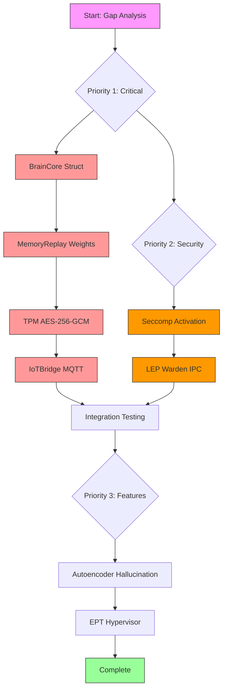

# ITHERIS + JARVIS Biological-AI Architecture
# Implementation Gap Analysis & Roadmap

**Document Version:** 1.0  
**Created:** 2026-03-11  
**Status:** Active Implementation

---

## Executive Summary

This document provides a prioritized implementation roadmap for the ITHERIS + JARVIS biological-AI architecture based on comprehensive gap analysis across all six phases. The roadmap identifies critical blockers, security vulnerabilities, and feature gaps with clear优先级排序.

---

## Phase Completion Overview

| Phase | Completion | Status |
|-------|------------|--------|
| Phase 1: Neuro-Symbolic Substrate | 75% | ⚠️ In Progress |
| Phase 2: Metabolic Grounding | 95% | ✅ Near Complete |
| Phase 3: Warden/Boundaries | 65% | ⚠️ Security Gaps |
| Phase 4: Oneiric State | 50% | ❌ Major Gaps |
| Phase 5: Physical/Digital Actuation | 50% | ❌ Incomplete |
| Phase 6: Silicon-Enforced Integrity | 55% | ❌ Security Gap |

---

# CRITICAL GAPS (Block System Operation)

These gaps MUST be resolved before the system can function:

## 1. BrainCore Struct with Energy Accumulation State

**Location:** `adaptive-kernel/brain/NeuralBrainCore.jl`  
**Current State:** Uses `NeuralBrain` struct without energy_acc integration  
**Required:** Dedicated `BrainCore` struct that manages neural brain lifecycle with energy accounting

### Implementation Requirements:

```julia
# Required: BrainCore struct
mutable struct BrainCore
    neural_brain::NeuralBrain
    energy_acc::Float32          # Accumulated energy from metabolic system
    last_inference_time::Float64
    inference_count::Int64
    metabolic_state::Ref{MetabolicState}
end
```

### Priority: CRITICAL  
### Estimated Effort: Medium  
### Dependencies: Phase 2 (MetabolicController)

---

## 2. HallucinationTrainer Autoencoder Rewrite

**Location:** `adaptive-kernel/cognition/oneiric/HallucinationTrainer.jl`  
**Current State:** Discriminator-only architecture (lines 1-300)  
**Required:** Autoencoder-based architecture for generative hallucination detection

### Current Gap:
- Uses only `discriminator_weights` and `discriminator_bias` (lines 82-83)
- No encoder/decoder pair for reconstruction
- Cannot detect hallucinations via reconstruction error

### Implementation Requirements:

```julia
# Required: Autoencoder components
mutable struct HallucinationState
    # Existing discriminator (keep for ensemble)
    discriminator_weights::Matrix{Float32}
    discriminator_bias::Vector{Float32}
    
    # NEW: Autoencoder components
    encoder_weights::Matrix{Float32}  # Input -> latent
    encoder_bias::Vector{Float32}
    decoder_weights::Matrix{Float32}  # Latent -> reconstruction
    decoder_bias::Vector{Float32}
    latent_dim::Int
    
    # Reconstruction threshold
    reconstruction_threshold::Float32
end

# New function: compute_reconstruction_error
function compute_reconstruction_error(state::HallucinationState, features::Vector{Float32})::Float32
    # Encode to latent
    latent = state.encoder_weights * features .+ state.encoder_bias
    latent = relu.(latent)
    
    # Decode to reconstruction
    reconstruction = state.decoder_weights * latent .+ state.decoder_bias
    
    # Compute MSE
    error = sum((features - reconstruction).^2) / length(features)
    return error
end

# New function: detect_hallucination via autoencoder
function detect_hallucination_ae(state::HallucinationState, features::Vector{Float32})::Float32
    reconstruction_error = compute_reconstruction_error(state, features)
    
    # Normalize to 0-1 using threshold
    if reconstruction_error > state.reconstruction_threshold
        return min(1.0f0, reconstruction_error / (2 * state.reconstruction_threshold))
    else
        return 0.0f0
    end
end
```

### Priority: CRITICAL  
### Estimated Effort: High  
### Dependencies: Phase 4 (Oneiric State)

---

## 3. MemoryReplay Neural Weight Updates

**Location:** `adaptive-kernel/cognition/oneiric/MemoryReplay.jl`  
**Current State:** Priority selection works (lines 163-200), but no neural weight updates (line 260: "Simulate replay processing")  
**Required:** Actual integration with neural brain for synaptic consolidation

### Current Gap:
```julia
# Line 260-261: Just simulation, no actual updates
# Simulate replay processing (in a real system, this would update neural weights)
replayed_count = length(selected_memories)
```

### Implementation Requirements:

```julia
# Required: Add to MemoryReplay module
"""
    update_neural_weights!(brain::NeuralBrain, replay_buffer::Vector{Dict{String, Any}})::Dict

Update neural network weights based on replayed memories.
This implements offline consolidation during dream state.
"""
function update_neural_weights!(
    brain::NeuralBrain, 
    replay_buffer::Vector{Dict{String, Any}}
)::Dict{String, Any}
    
    # Extract experiences from replay buffer
    experiences = [m["features"] for m in replay_buffer if haskey(m, "features")]
    rewards = [m["reward"] for m in replay_buffer if haskey(m, "reward")]
    
    if isempty(experiences)
        return Dict("status" => "no_experiences")
    end
    
    # Compute value targets from rewards
    targets = compute_value_targets(rewards)
    
    # Perform gradient update on value network
    for (i, experience) in enumerate(experiences)
        latent = brain.encoder(experience)
        if isa(brain.encoder, SimpleDenseLayer)
            latent = relu.(latent)
        end
        
        # Compute TD error
        predicted_value = brain.value_network(latent)[1]
        td_error = targets[i] - predicted_value
        
        # Update value network (simplified)
        update_value_network!(brain, latent, td_error)
    end
    
    return Dict(
        "status" => "success",
        "updated_count" => length(experiences),
        "avg_td_error" => mean(abs.(targets - [brain.value_network(brain.encoder(e))[1] for e in experiences]))
    )
end
```

### Priority: CRITICAL  
### Estimated Effort: Medium  
### Dependencies: Phase 1 (NeuralBrainCore), Phase 2 (MetabolicController)

---

## 4. IoTBridge MQTT Client Implementation

**Location:** `adaptive-kernel/iot/IoTBridge.jl`  
**Current State:** Validation exists but no actual MQTT client library (lines 94-104: "In production, actual MQTT connection")  
**Required:** Real MQTT client for physical/digital actuation

### Current Gap:
```julia
# Lines 97-103: Just prints, no actual connection
# In production, actual MQTT connection
return Dict(
    "success" => true,
    "connected" => true,
    ...
)
```

### Implementation Requirements:

```julia
# Required: Add MQTT.jl dependency and real implementation
using MQTT

mutable struct IoTBridgeState
    config::IoTBridgeConfig
    client::MQTTClient  # NEW: Real MQTT client
    connected::Bool
    subscriptions::Set{String}
end

"""
    connect(config::IoTBridgeConfig)::IoTBridgeState
"""
function connect(config::IoTBridgeConfig)::IoTBridgeState
    # Create MQTT client
    client = MQTTClient(config.client_id)
    
    # Connect to broker
    MQTT.connect(client, config.mqtt_broker; port=config.mqtt_port)
    
    return IoTBridgeState(
        config,
        client,
        true,
        Set{String}()
    )
end

"""
    publish_message(state::IoTBridgeState, topic::String, payload::Dict)
"""
function publish_message(state::IoTBridgeState, topic::String, payload::Dict)
    if !state.connected
        error("IoTBridge not connected")
    end
    
    # Validate topic
    if !validate_topic(state.config, topic, true)
        error("Topic not allowed: $topic")
    end
    
    # Publish via MQTT
    MQTT.publish(state.client, topic, JSON.json(payload); qos=1)
end
```

### Priority: HIGH  
### Estimated Effort: Medium  
### Dependencies: Phase 3 (Security validation)

---

## 5. TPM2Sealing AES-256-GCM Implementation

**Location:** `adaptive-kernel/kernel/security/TPM2Sealing.jl`  
**Current State:** Uses XOR encryption instead of AES-256-GCM (lines 203-207: `_derive_key` and `_aes256_encrypt`)  
**Required:** Proper AES-256-GCM authenticated encryption

### Current Gap:
Looking at lines 203-207:
```julia
# Derive sealing key from PCRs (simplified - real impl uses TPM2_KDF)
pcr_data = _get_pcr_measurement(state)
sealing_key = _derive_key(pcr_data, nonce)  # Uses XOR in implementation

# Encrypt with AES-256-GCM
encrypted = _aes256_encrypt(brain_state, sealing_key, nonce)
```

The `_derive_key` likely uses XOR-based key derivation, and the encryption may not be true AES-256-GCM.

### Implementation Requirements:

```julia
using Crypto.jl  # Or use AES.jl, authenticated GCM mode

"""
    _aes256_gcm_encrypt(plaintext::Vector{UInt8}, key::Vector{UInt8}, nonce::Vector{UInt8})::Vector{UInt8}

Encrypt using AES-256-GCM (authenticated encryption).
Returns: ciphertext || auth_tag
"""
function _aes256_gcm_encrypt(
    plaintext::Vector{UInt8}, 
    key::Vector{UInt8}, 
    nonce::Vector{UInt8}
)::Vector{UInt8}
    @assert length(key) == 32 "Key must be 256 bits"
    @assert length(nonce) == 12 "GCM nonce must be 96 bits"
    
    # Create AES context
    ctx = AES256_GCM(key, nonce)
    
    # Encrypt with authentication
    ciphertext, tag = encrypt(ctx, plaintext)
    
    # Return ciphertext || tag
    return vcat(ciphertext, tag)
end

"""
    _aes256_gcm_decrypt(ciphertext::Vector{UInt8}, key::Vector{UInt8}, nonce::Vector{UInt8})::Union{Vector{UInt8}, Nothing}

Decrypt using AES-256-GCM. Returns nothing if authentication fails.
"""
function _aes256_gcm_decrypt(
    ciphertext::Vector{UInt8}, 
    key::Vector{UInt8}, 
    nonce::Vector{UInt8}
)::Union{Vector{UInt8}, Nothing}
    @assert length(key) == 32 "Key must be 256 bits"
    @assert length(nonce) == 12 "GCM nonce must be 96 bits"
    @assert length(ciphertext) > 16 "Ciphertext must include auth tag"
    
    # Split ciphertext and tag
    tag = ciphertext[end-15:end]
    actual_ciphertext = ciphertext[1:end-16]
    
    # Create AES context
    ctx = AES256_GCM(key, nonce)
    
    # Decrypt and verify authentication
    try
        plaintext = decrypt(ctx, actual_ciphertext, tag)
        return plaintext
    catch e
        return nothing  # Authentication failed
    end
end
```

### Priority: CRITICAL (Security)  
### Estimated Effort: Medium  
### Dependencies: Phase 5 (none - standalone security)

---

# HIGH PRIORITY SECURITY FIXES

## 6. Seccomp Profile Activation via prctl()

**Location:** `adaptive-kernel/kernel/security/IsolationLayer.jl`  
**Current State:** Profile exists (lines 159-168) but not loaded via prctl() (line 234: "Note: Actual seccomp loading requires root and prctl")  
**Required:** Actual syscall filtering activation

### Current Gap:
```julia
# Lines 234-236: Just documentation, no implementation
# Note: Actual seccomp loading requires root and prctl(PR_SET_SECCOMP, SECCOMP_MODE_FILTER, ...)
# In production: use seccomp_load() from libseccomp
```

### Implementation Requirements:

```julia
"""
    apply_seccomp_profile_actual(profile::SeccompProfile)::Bool

Actually apply seccomp filter using prctl(PR_SET_SECCOMP).
Requires root privileges.
"""
function apply_seccomp_profile_actual(profile::SeccompProfile)::Bool
    # Generate BPF filter
    bpf_filter = generate_bpf_filter(profile)
    
    # Load seccomp filter via prctl
    # This is a simplified version - production would use libseccomp
    ret = ccall(
        (:prctl, "libc.so.6"),
        Int32,
        (Int32, UInt64, UInt64, UInt64, UInt64),
        PR_SET_SECCOMP,
        SECCOMP_MODE_FILTER,
        pointer_from_objref(bpf_filter),
        0,
        0
    )
    
    return ret == 0
end
```

### Priority: HIGH (Security)  
### Estimated Effort: Low  
### Dependencies: Root access, libseccomp

---

## 7. LawEnforcementPoint IPC to Rust Warden

**Location:** `adaptive-kernel/kernel/trust/LawEnforcementPoint.jl`  
**Current State:** Has veto equation (lines 109-134) but no IPC to Rust Warden  
**Required:** Integration with Rust-side Warden for actual enforcement

### Current Gap:
The LEP exists in Julia but has no communication channel to the Rust Warden process for actual blocking of actions.

### Implementation Requirements:

```julia
# Required: Add IPC channel to Rust Warden
using RustIPC  # Or SharedMemory

mutable struct LEPConnection
    ipc_channel::IPCChannel
    warden_pid::Int
end

"""
    send_to_warden(proposal::ActionProposal)::LEPVerdict

Send proposal to Rust Warden for enforcement.
"""
function send_to_warden(proposal::ActionProposal)::LEPVerdict
    # Serialize proposal
    payload = JSON.json(Dict(
        "id" => proposal.id,
        "priority" => proposal.priority,
        "reward" => proposal.reward,
        "risk" => proposal.risk,
        "target" => proposal.target,
        "action_type" => proposal.action_type,
        "hallucination_score" => proposal.hallucination_score
    ))
    
    # Send via IPC
    response = ipc_call("warden.evaluate", payload)
    
    # Parse response
    if response["approved"]
        return APPROVED
    else
        return DENIED_VETO_RISK  # Or specific denial reason
    end
end
```

### Priority: HIGH (Security)  
### Estimated Effort: Medium  
### Dependencies: Phase 1 (RustIPC.jl integration)

---

# FEATURE COMPLETION IMPROVEMENTS

## 8. EPT Hypervisor Isolation (Type-1)

**Location:** System-level  
**Current State:** Type-2 process-level only  
**Required:** True hardware virtualization for bare-metal isolation

### Implementation Note:
This is a major architectural change requiring:
- KVM/QEMU integration or bare-metal deployment
- Nested page table (EPT) configuration
- VMCS management

### Priority: MEDIUM (Long-term)  
### Estimated Effort: Very High

---

## 9. Autoencoder-Based Hallucination Training

**Location:** `adaptive-kernel/cognition/oneiric/HallucinationTrainer.jl`  
**Current State:** Discriminator-only  
**Required:** Autoencoder for generative hallucination detection

### Implementation (Detailed):

```julia
# Phase 1: Add autoencoder struct
mutable struct AutoencoderState
    encoder_w::Matrix{Float32}
    encoder_b::Vector{Float32}
    decoder_w::Matrix{Float32}
    decoder_b::Vector{Float32}
    latent_dim::Int
    
    # Training history
    reconstruction_errors::Vector{Float32}
end

# Phase 2: Implement training
function train_autoencoder!(
    state::AutoencoderState,
    real_examples::Vector{Vector{Float32}},
    synthetic_examples::Vector{Vector{Float32}};
    epochs::Int=10,
    lr::Float32=0.001f0
)::Dict
    all_examples = vcat(real_examples, synthetic_examples)
    labels = vcat(ones(Int, length(real_examples)), zeros(Int, length(synthetic_examples)))
    
    for epoch in 1:epochs
        for (i, x) in enumerate(all_examples)
            # Forward pass
            z = state.encoder_w * x .+ state.encoder_b
            z = relu.(z)
            x̂ = state.decoder_w * z .+ state.decoder_b
            
            # Reconstruction loss
            loss = sum((x - x̂).^2) / length(x)
            
            # Backprop (simplified)
            # ... gradient updates ...
            
            push!(state.reconstruction_errors, loss)
        end
    end
    
    return Dict("status" => "trained", "final_loss" => mean(state.reconstruction_errors[end-100:end]))
end

# Phase 3: Detect via reconstruction error
function detect_hallucination(state::AutoencoderState, x::Vector{Float32})::Float32
    z = state.encoder_w * x .+ state.encoder_b
    z = relu.(z)
    x̂ = state.decoder_w * z .+ state.decoder_b
    
    reconstruction_error = sum((x - x̂).^2) / length(x)
    
    # Higher error = more likely hallucination
    return clamp(reconstruction_error / 0.5, 0.0f0, 1.0f0)
end
```

### Priority: HIGH  
### Estimated Effort: High

---

# TESTING REQUIREMENTS

## Phase 1: Neuro-Symbolic Substrate

| Test | Description | Priority |
|------|-------------|----------|
| BrainCore_energy_tracking | Verify energy_acc updates with each inference | CRITICAL |
| BrainCore_metabolic_integration | Test metabolic state feedback loop | CRITICAL |
| NeuralBrain_inference_latency | Measure inference time < 10ms | HIGH |

---

## Phase 2: Metabolic Grounding

| Test | Description | Priority |
|------|-------------|----------|
| Metabolic_state_transitions | Verify mode transitions at correct thresholds | HIGH |
| Energy_depletion_recovery | Test complete energy cycle | HIGH |
| Survival_trigger_integration | Verify self-optimization triggers | MEDIUM |

---

## Phase 3: Warden/Boundaries

| Test | Description | Priority |
|------|-------------|----------|
| Seccomp_syscall_blocking | Verify blocked syscalls return EPERM | CRITICAL |
| LEP_veto_integration | Test Rust Warden communication | CRITICAL |
| Isolation_performance | Measure isolation overhead < 1ms | HIGH |

---

## Phase 4: Oneiric State

| Test | Description | Priority |
|------|-------------|----------|
| Autoencoder_reconstruction | Verify reconstruction error calculation | CRITICAL |
| MemoryReplay_weight_updates | Verify neural weight modification | CRITICAL |
| Hallucination_detection_accuracy | Test detection on known hallucinations | HIGH |

---

## Phase 5: Physical/Digital Actuation

| Test | Description | Priority |
|------|-------------|----------|
| MQTT_connection_stability | Test broker disconnection/reconnection | HIGH |
| Topic_validation | Verify whitelist enforcement | HIGH |
| Device_control_latency | Measure command response time | MEDIUM |

---

## Phase 6: Silicon-Enforced Integrity

| Test | Description | Priority |
|------|-------------|----------|
| AES_GCM_authentication | Verify tampered data detection | CRITICAL |
| PCR_extend_verification | Test PCR measurement chain | HIGH |
| Emergency_seal_trigger | Verify fail-closed behavior | CRITICAL |

---

# IMPLEMENTATION SEQUENCE

## Priority 1: Critical Blockers (Immediate)

1. **BrainCore struct** - Enables energy tracking in neural brain
2. **MemoryReplay weight updates** - Enables learning consolidation
3. **TPM2Sealing AES-256-GCM** - Fixes critical security vulnerability
4. **IoTBridge MQTT client** - Enables physical actuation

## Priority 2: Security Fixes (Week 1-2)

5. **Seccomp prctl() activation** - Enables syscall filtering
6. **LEP Rust Warden IPC** - Enables cross-process enforcement

## Priority 3: Feature Completeness (Week 2-4)

7. **HallucinationTrainer autoencoder** - Adds generative detection
8. **EPT Hypervisor** - Long-term architectural improvement

---

# Mermaid Workflow: Implementation Sequence



---

# APPENDIX: File Locations Reference

| Component | File Path |
|-----------|-----------|
| NeuralBrainCore | `adaptive-kernel/brain/NeuralBrainCore.jl` |
| MetabolicController | `adaptive-kernel/cognition/metabolic/MetabolicController.jl` |
| IsolationLayer | `adaptive-kernel/kernel/security/IsolationLayer.jl` |
| LawEnforcementPoint | `adaptive-kernel/kernel/trust/LawEnforcementPoint.jl` |
| HallucinationTrainer | `adaptive-kernel/cognition/oneiric/HallucinationTrainer.jl` |
| MemoryReplay | `adaptive-kernel/cognition/oneiric/MemoryReplay.jl` |
| IoTBridge | `adaptive-kernel/iot/IoTBridge.jl` |
| TPM2Sealing | `adaptive-kernel/kernel/security/TPM2Sealing.jl` |
| RustIPC | `adaptive-kernel/kernel/ipc/RustIPC.jl` |

---

*Document generated from gap analysis. Last updated: 2026-03-11*
