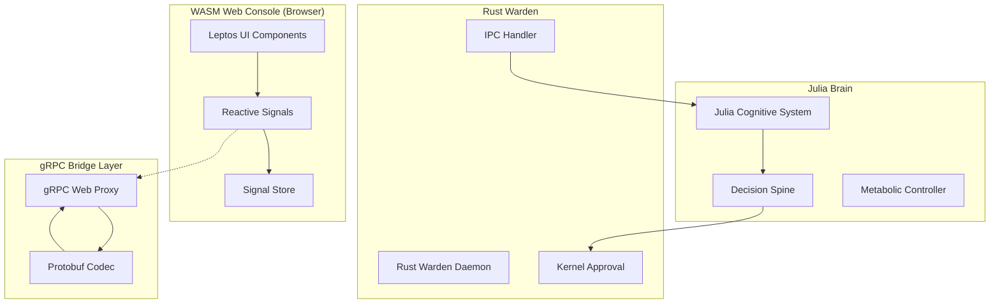
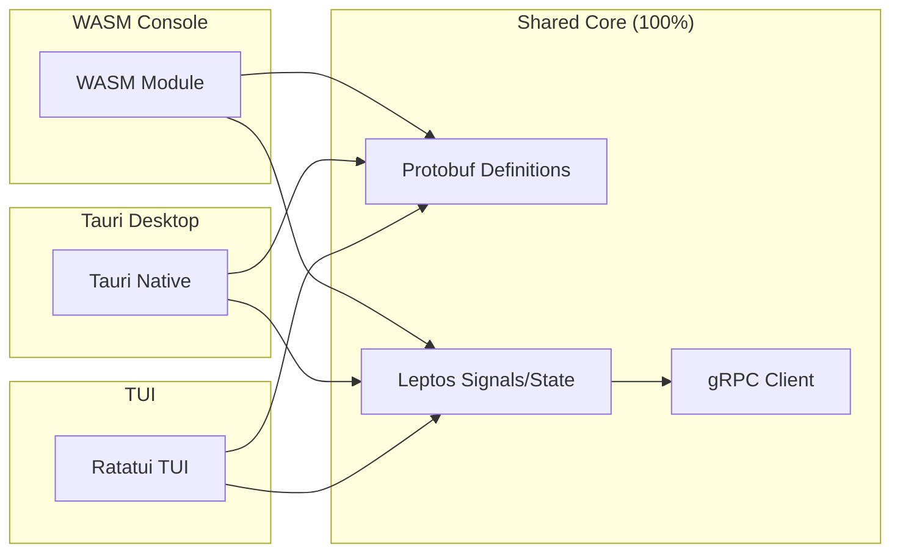

# ProjectX Jarvis/ITHERIS Full OS Interface Architecture

**Document Version:** 1.0  
**Date:** 2026-03-13  
**Classification:** Technical Architecture Specification  
**Status:** Design Document - Phase 1

---

## Table of Contents

1. [Executive Summary](#1-executive-summary)
2. [Technical Architecture: Leptos WASM Frontend](#2-technical-architecture-leptos-wasm-frontend)
3. [gRPC/Protobuf Communication Layer](#3-grpcprotobuf-communication-layer)
4. [UI Design: Bento Grid & Glassmorphism](#4-ui-design-bento-grid--glassmorphism)
5. [Decision Spine Integration](#5-decision-spine-integration)
6. [Circadian OS Skin](#6-circadian-os-skin)
7. [gRPC Service Contracts](#7-grpc-service-contracts)
8. [Containment Mode](#8-containment-mode)
9. [Cross-Environment Portability](#9-cross-environment-portability)
10. [Implementation Roadmap](#10-implementation-roadmap)

---

## 1. Executive Summary

This document defines the architecture for a portable "Management Console" OS interface for the ProjectX Jarvis/ITHERIS system. The interface serves as a cross-environment (laptop, VM, terminal) management layer that communicates with the Rust Warden via high-performance protocols.

### Design Philosophy

| Principle | Implementation |
|-----------|----------------|
| **Brain is advisory. Kernel is sovereign.** | All UI interactions flow through Decision Spine with visible approval/veto rationale |
| **136.1 Hz metabolic tick loop** | Real-time telemetry updates via reactive signals (no virtual DOM overhead) |
| **Fail-closed security** | Containment Mode triggers on Watchdog Timer hardware lockdown |
| **Adaptive visual systems** | Circadian OS Skin shifts color temperature based on Metabolic Clock |

### Deployment Priority

**Phase 1:** Rust TUI (Terminal) - Low-overhead headless monitoring  
**Phase 2:** Tauri Native App (Laptop) - Full desktop experience with hardware access  
**Phase 3:** WASM Web Console (VM) - Zero-install browser interface

---

## 2. Technical Architecture: Leptos WASM Frontend

### 2.1 Architecture Overview



### 2.2 Leptos Framework Configuration

The frontend uses [Leptos](https://leptos.dev/) for fine-grained reactivity:

| Feature | Configuration |
|---------|---------------|
| **Reactivity Model** | Signals (fine-grained, no virtual DOM) |
| **Server-Side Rendering** | Hydration-enabled for WASM |
| **Styling** | CSS Modules + CSS Variables |
| **State Management** | Leptos stores with persistence |
| **Router** | Leptos router for navigation |

### 2.3 Project Structure

```
console/
├── Cargo.toml              # Leptos + Tauri dependencies
├── src/
│   ├── main.rs            # Entry point
│   ├── app.rs             # Root component
│   ├── lib.rs             # Library exports
│   ├── components/        # UI components
│   │   ├── bento_grid/    # Bento grid layout
│   │   ├── tiles/         # Modular tiles
│   │   ├── glassmorphism/ # Glass effects
│   │   ├── circadian/     # Adaptive theming
│   │   └── containment/   # Fail-closed mode
│   ├── services/         # gRPC client
│   │   ├── grpc.rs        # gRPC Web client
│   │   ├── proto.rs       # Protobuf definitions
│   │   └── streams.rs     # Full-duplex streams
│   ├── state/            # Reactive state
│   │   ├── signals.rs     # Global signals
│   │   ├── store.rs       # Persistent store
│   │   └── theme.rs       # Theme manager
│   ├── pages/            # Route pages
│   │   ├── dashboard.rs   # Main dashboard
│   │   ├── decision_spine.rs
│   │   ├── metabolic.rs
│   │   └── containment.rs
│   └── styles/           # CSS
│       ├── bento.css
│       ├── glassmorphism.css
│       └── circadian.css
├── proto/                # Protobuf definitions
│   └── warden.proto
├── index.html
└── tailwind.config.js    # Optional: Tailwind integration
```

### 2.4 Fine-Grained Reactivity Signals

Real-time telemetry (136.1 Hz metabolic tick) uses Leptos signals for minimal overhead:

```rust
// Example: Reactive signal for metabolic energy
use leptos::create_signal;

fn MetabolicTile() -> impl IntoView {
    let (energy, set_energy) = create_signal(0.85);
    
    // Subscribe to gRPC stream - updates signal directly
    // No virtual DOM diffing - only this component re-renders
    spawn(async move {
        let mut stream = MetabolicStream::new().await;
        while let Some(update) = stream.next().await {
            set_energy(update.energy_level);
        }
    });
    
    view! {
        <div class="energy-tile">
            <span>Metabolic Energy</span>
            <progress value={energy()} max="1.0" />
            <span>{format!("{:.1}%", energy() * 100.0)}</span>
        </div>
    }
}
```

---

## 3. gRPC/Protobuf Communication Layer

### 3.1 Protocol Selection

| Aspect | Choice | Rationale |
|--------|--------|-----------|
| **Serialization** | Protobuf | 5-10x smaller than JSON for sub-millisecond responsiveness |
| **Transport** | gRPC-Web | Browser-compatible, works through VNC/browser bridges |
| **Streaming** | Full-duplex | Continuous sensor data + Advisory Proposals simultaneously |
| **Codec** | prost + tonic | Rust-native gRPC stack |

### 3.2 Rust Warden gRPC Server

The Rust Warden exposes gRPC endpoints:

```rust
// itheris-daemon/src/grpc.rs

use tonic::{Request, Response, Status};
use tokio::sync::mpsc;

pub mod warden {
    tonic::include_proto!("warden");
}

use warden::{
    warden_server::Warden,
    TelemetryRequest, TelemetryResponse,
    ProposalRequest, ProposalResponse,
    ConfirmationRequest, ConfirmationResponse,
};

#[derive(Default)]
pub struct WardenGrpcService {
    // ... existing warden state
}

#[tonic::async_trait]
impl Warden for WardenGrpcService {
    /// Stream continuous telemetry from Julia Brain
    async fn stream_telemetry(
        &self,
        request: Request<TelemetryRequest>,
    ) -> Result<Response<tonic::Streaming<TelemetryResponse>>, Status> {
        // Full-duplex: stream metrics while receiving commands
        let mut stream = self.telemetry_manager.subscribe();
        let output = tokio_stream::stream_fn(request.into_inner(), move |_| {
            let item = stream.recv();
            async move {
                match item.await {
                    Some(t) => Some(Ok(t)),
                    None => None,
                }
            }
        });
        Ok(Response::new(Box::pin(output)))
    }
    
    /// Submit proposal to Decision Spine
    async fn submit_proposal(
        &self,
        request: Request<ProposalRequest>,
    ) -> Result<Response<ProposalResponse>, Status> {
        let proposal = request.into_inner();
        // Forward to Decision Spine for kernel approval
        let result = self.decision_spine.process(proposal).await;
        Ok(Response::new(result))
    }
    
    /// Request sovereign confirmation
    async fn request_confirmation(
        &self,
        request: Request<ConfirmationRequest>,
    ) -> Result<Response<ConfirmationResponse>, Status> {
        let confirmation = request.into_inner();
        let result = self.kernel.confirm(confirmation).await;
        Ok(Response::new(result))
    }
}
```

### 3.3 Web Client Integration

```rust
// console/src/services/grpc.rs

use tonic::codec::ProstCodec;
use tonic::transport::Channel;

pub struct WardenClient {
    channel: Channel,
}

impl WardenClient {
    pub async fn new(uri: &str) -> Result<Self, Box<dyn std::error::Error>> {
        let channel = Channel::from_static_uri(uri.parse()?)
            .await?;
        Ok(Self { channel })
    }
    
    pub fn telemetry(&self) -> TelemetryClient<Channel> {
        TelemetryClient::new(self.channel.clone())
    }
    
    pub fn proposals(&self) -> ProposalClient<Channel> {
        ProposalClient::new(self.channel.clone())
    }
}
```

---

## 4. UI Design: Bento Grid & Glassmorphism

### 4.1 Bento Grid Layout

The "full OS" feel uses modular tiling inspired by macOS/Windows 11:

```css
/* console/src/styles/bento.css */

.bento-grid {
    display: grid;
    grid-template-columns: repeat(4, 1fr);
    grid-template-rows: repeat(3, 1fr);
    gap: 16px;
    padding: 24px;
    height: 100vh;
    width: 100vw;
}

.bento-tile {
    border-radius: 16px;
    padding: 20px;
    transition: transform 0.2s ease, box-shadow 0.2s ease;
}

.bento-tile:hover {
    transform: translateY(-2px);
    box-shadow: 0 8px 32px rgba(0, 0, 0, 0.15);
}

/* Tile sizing */
.tile-1x1 { grid-column: span 1; grid-row: span 1; }
.tile-2x1 { grid-column: span 2; grid-row: span 1; }
.tile-1x2 { grid-column: span 1; grid-row: span 2; }
.tile-2x2 { grid-column: span 2; grid-row: span 2; }
.tile-4x1 { grid-column: span 4; grid-row: span 1; }
.tile-4x2 { grid-column: span 4; grid-row: span 2; }

/* Specific tile zones */
.tile-cognitive { /* Executor, Strategist, Auditor */ }
.tile-metabolic { /* Energy, CPU, Memory */ }
.tile-decision { /* Decision Spine, Kernel Approval */ }
.tile-sensory { /* Perception streams */ }
```

### 4.2 Glassmorphism 2.0

```css
/* console/src/styles/glassmorphism.css */

:root {
    /* Glass effect layers */
    --glass-bg: rgba(255, 255, 255, 0.08);
    --glass-border: rgba(255, 255, 255, 0.18);
    --glass-blur: blur(20px);
    --glass-shadow: 0 8px 32px rgba(0, 0, 0, 0.37);
    
    /* Depth layers */
    --depth-surface: 0;
    --depth-elevated: 1;
    --depth-overlay: 2;
    --depth-sovereign: 3;
    
    /* Advisory vs Sovereign colors */
    --advisory-accent: #6366f1;  /* Indigo - brain proposals */
    --sovereign-accent: #10b981; /* Emerald - kernel approvals */
    --veto-accent: #ef4444;       /* Red - vetoed */
    --containment-accent: #f59e0b; /* Amber - warnings */
}

.glass-panel {
    background: var(--glass-bg);
    backdrop-filter: var(--glass-blur);
    -webkit-backdrop-filter: var(--glass-blur);
    border: 1px solid var(--glass-border);
    box-shadow: var(--glass-shadow);
}

.sovereign-panel {
    /* Kernel notifications - deeper glass */
    background: rgba(16, 185, 129, 0.12);
    border: 1px solid rgba(16, 185, 129, 0.3);
}

.advisory-panel {
    /* Neural outputs - lighter glass */
    background: rgba(99, 102, 241, 0.12);
    border: 1px solid rgba(99, 102, 241, 0.3);
}

.veto-panel {
    /* Vetoed actions - red warning */
    background: rgba(239, 68, 68, 0.12);
    border: 1px solid rgba(239, 68, 68, 0.3);
}
```

### 4.3 Dashboard Layout

```
┌────────────────────────────────────────────────────────────────────────┐
│  ┌──────────────────┐  ┌──────────────────┐  ┌──────────────────────┐  │
│  │  EXECUTOR        │  │  STRATEGIST      │  │  AUDITOR            │  │
│  │  (1x1 tile)      │  │  (1x1 tile)      │  │  (1x1 tile)         │  │
│  │  Current action  │  │  Planning state  │  │  Risk assessment    │  │
│  └──────────────────┘  └──────────────────┘  └──────────────────────┘  │
│                                                                        │
│  ┌─────────────────────────────────┐  ┌──────────────────────────┐  │
│  │  METABOLIC TICK                 │  │  DECISION SPINE          │  │
│  │  (2x1 tile)                     │  │  (2x2 tile)              │  │
│  │  ═══════════════════════════     │  │  ┌────────────────────┐  │  │
│  │  Energy: 85%  │  CPU: 42%       │  │  │ Proposal: Execute │  │  │
│  │  Memory: 3.2GB │  Tick: 136.1Hz  │  │  │ Confidence: 0.92  │  │  │
│  │                                │  │  │ Reasoning: ...    │  │  │
│  │  [████████████████░░░░]        │  │  │ ──────────────────│  │  │
│  │                                │  │  │ Status: APPROVED  │  │  │
│  └─────────────────────────────────┘  │  │ Rationale: Safe   │  │  │
│                                       │  └────────────────────┘  │  │
│  ┌──────────────────────────────────┐ └──────────────────────────┘  │
│  │  PERCEPTION STREAMS              │  ┌──────────────────────────┐  │
│  │  (2x1 tile)                     │  │  WARDEN STATUS          │  │
│  │  Audio │ Video │ Text │ IoT      │  │  (1x1 tile)             │  │
│  │  ✓ 42Hz  ✓ 30fps  ✓ Processing │  │  Uptime: 4h 32m         │  │
│  └──────────────────────────────────┘  └──────────────────────────┘  │
└────────────────────────────────────────────────────────────────────────┘
```

---

## 5. Decision Spine Integration

### 5.1 Sovereign Veto Dashboard

The Decision Spine UI shows every "thought" the Julia Brain proposes with kernel approval/veto rationale:

```rust
// console/src/pages/decision_spine.rs

#[component]
pub fn DecisionSpinePage() -> impl IntoView {
    let (proposals, set_proposals) = create_signal::<Vec<Proposal>>(vec![]);
    
    // Subscribe to Decision Spine stream
    spawn(async move {
        let mut stream = WardenClient::new("http://localhost:9090")
            .await
            .unwrap()
            .proposals()
            .subscribe()
            .await;
            
        while let Some(proposal) = stream.next().await {
            set_proposals.update(|p| {
                p.insert(0, proposal);
                if p.len() > 100 { p.pop(); }
            });
        }
    });
    
    view! {
        <div class="decision-spine">
            <h1>Decision Spine</h1>
            <For each={proposals}>
                {(proposal) => <ProposalCard proposal={proposal} />}
            </For>
        </div>
    }
}

#[component]
pub fn ProposalCard(proposal: Proposal) -> impl IntoView {
    let status_class = match proposal.status {
        ProposalStatus::Pending => "pending",
        ProposalStatus::Approved => "approved",
        ProposalStatus::Vetoed => "vetoed",
    };
    
    view! {
        <div class="proposal-card glass-panel {status_class}">
            <div class="proposal-header">
                <span class="agent-type">{proposal.agent_type}</span>
                <span class="timestamp>{proposal.timestamp}</span>
            </div>
            
            <div class="proposal-content">
                <h3>{proposal.decision}</h3>
                <p class="reasoning">{proposal.reasoning}</p>
                <div class="confidence">
                    <span>Confidence:</span>
                    <progress value={proposal.confidence} max="1.0" />
                    <span>{format!("{:.0}%", proposal.confidence * 100.0)}</span>
                </div>
            </div>
            
            <div class="rationale-chips">
                <For each={proposal.rationale_chips}>
                    {(chip) => <RationaleChip {chip} />}
                </For>
            </div>
            
            <div class="approval-status>
                match proposal.status {
                    ProposalStatus::Pending => "Awaiting Kernel Approval",
                    ProposalStatus::Approved => "✓ Approved by Rust Warden",
                    ProposalStatus::Vetoed => "✗ Vetoed - {proposal.veto_reason}",
                }
            </div>
        </div>
    }
}
```

### 5.2 Rationale Chips

Visual indicators showing why a proposal was approved or vetoed:

```css
.rationale-chip {
    display: inline-flex;
    align-items: center;
    gap: 4px;
    padding: 4px 12px;
    border-radius: 16px;
    font-size: 12px;
    font-weight: 500;
}

.rationale-chip.safety {
    background: rgba(16, 185, 129, 0.2);
    color: #10b981;
}

.rationale-chip.risk {
    background: rgba(239, 68, 68, 0.2);
    color: #ef4444;
}

.rationale-chip.entropy {
    background: rgba(139, 92, 246, 0.2);
    color: #8b5cf6;
}
```

---

## 6. Circadian OS Skin

### 6.1 Adaptive Visual System

The entire OS theme shifts color temperature based on:

1. **Metabolic Clock** - Internal AI "time of day" cycle
2. **Real-world time** - User's local time (optional)
3. **Cognitive mode** - Active/Dreaming/Recovery states

```rust
// console/src/state/theme.rs

#[derive(Clone, Copy, Debug, PartialEq)]
pub enum CircadianPhase {
    Dawn,      // 00:00 - 06:00: Cool blue
    Morning,   // 06:00 - 12:00: Warm orange
    Day,       // 12:00 - 18:00: Neutral white
    Evening,   // 18:00 - 24:00: Deep purple
}

#[derive(Clone)]
pub struct CircadianTheme {
    pub phase: CircadianPhase,
    pub color_temperature: f32,    // Kelvin (2700K - 6500K)
    pub accent_primary: String,
    pub accent_secondary: String,
    pub background_base: String,
    pub glass_opacity: f32,
}

impl CircadianTheme {
    pub fn from_metabolic_time(hour: f32) -> Self {
        match hour {
            0.0..=6.0 => CircadianTheme {
                phase: CircadianPhase::Dawn,
                color_temperature: 4000.0,
                accent_primary: "#0ea5e9".to_string(),    // Sky blue
                accent_secondary: "#0284c7".to_string(),
                background_base: "#0f172a".to_string(),
                glass_opacity: 0.06,
            },
            6.0..=12.0 => CircadianTheme {
                phase: CircadianPhase::Morning,
                color_temperature: 5500.0,
                accent_primary: "#f97316".to_string(),    // Orange
                accent_secondary: "#ea580c".to_string(),
                background_base: "#1c1917".to_string(),
                glass_opacity: 0.10,
            },
            12.0..=18.0 => CircadianTheme {
                phase: CircadianPhase::Day,
                color_temperature: 6500.0,
                accent_primary: "#6366f1".to_string(),    // Indigo
                accent_secondary: "#4f46e5".to_string(),
                background_base: "#18181b".to_string(),
                glass_opacity: 0.08,
            },
            _ => CircadianTheme {
                phase: CircadianPhase::Evening,
                color_temperature: 3000.0,
                accent_primary: "#a855f7".to_string(),    // Purple
                accent_secondary: "#9333ea".to_string(),
                background_base: "#0c0a09".to_string(),
                glass_opacity: 0.12,
            },
        }
    }
    
    pub fn apply_to_css(&self) -> String {
        format!(r#"
            :root {{
                --color-temp: {};
                --accent-primary: {};
                --accent-secondary: {};
                --bg-base: {};
                --glass-opacity: {};
            }}
        "#, 
            self.color_temperature,
            self.accent_primary,
            self.accent_secondary,
            self.background_base,
            self.glass_opacity
        )
    }
}
```

### 6.2 Cognitive Mode Themes

Additional theme overrides based on cognitive state:

```rust
pub fn get_theme(metabolic_state: &MetabolicState) -> CircadianTheme {
    let mut theme = CircadianTheme::from_metabolic_time(metabolic_state.hour);
    
    // Override based on cognitive mode
    match metabolic_state.mode {
        CognitiveMode::MODE_DREAMING => {
            // Dreaming mode: more ethereal, softer
            theme.glass_opacity *= 0.5;
            theme.accent_primary = "#c084fc".to_string(); // Purple
        }
        CognitiveMode::MODE_CRITICAL => {
            // Critical mode: high contrast, urgent
            theme.glass_opacity = 0.02;
            theme.accent_primary = "#fbbf24".to_string(); // Amber
        }
        CognitiveMode::MODE_ACTIVE => {
            // Full capacity: vibrant
            theme.glass_opacity *= 1.2;
        }
        _ => {}
    }
    
    theme
}
```

---

## 7. gRPC Service Contracts

### 7.1 Protobuf Definitions

```protobuf
// proto/warden.proto

syntax = "proto3";

package warden;

service WardenService {
    // Full-duplex telemetry stream
    rpc StreamTelemetry(TelemetryRequest) returns (stream TelemetryResponse);
    
    // Submit brain proposal for kernel approval
    rpc SubmitProposal(ProposalRequest) returns (ProposalResponse);
    
    // Request sovereign confirmation
    rpc RequestConfirmation(ConfirmationRequest) returns (ConfirmationResponse);
    
    // Subscribe to decision events
    rpc StreamDecisions(DecisionRequest) returns (stream DecisionEvent);
    
    // Emergency lockdown
    rpc TriggerContainment(ContainmentRequest) returns (ContainmentResponse);
}

// ============================================================================
// Telemetry Messages
// ============================================================================

message TelemetryRequest {
    repeated string metrics = 1;  // Which metrics to stream
    float sample_rate_hz = 2;    // Target sample rate
}

message TelemetryResponse {
    int64 timestamp_unix_ns = 1;
    float metabolic_energy = 2;
    float cpu_usage = 3;
    float memory_usage_gb = 4;
    float tick_rate_hz = 5;
    string cognitive_mode = 6;
    repeated float agent_confidences = 7;
    float ipc_latency_ms = 8;
}

// ============================================================================
// Decision Spine Messages
// ============================================================================

message ProposalRequest {
    string proposal_id = 1;
    string agent_id = 2;
    string agent_type = 3;  // executor, strategist, auditor
    string decision = 4;
    float confidence = 5;
    string reasoning = 6;
    repeated string evidence = 7;
    map<string, string> metadata = 8;
}

message ProposalResponse {
    string proposal_id = 1;
    ProposalStatus status = 2;
    string approval_reason = 3;
    repeated RationaleChip rationale_chips = 4;
    int64 approved_at_unix_ns = 5;
    string veto_reason = 6;
}

enum ProposalStatus {
    PROPOSAL_STATUS_UNSPECIFIED = 0;
    PROPOSAL_STATUS_PENDING = 1;
    PROPOSAL_STATUS_APPROVED = 2;
    PROPOSAL_STATUS_VETOED = 3;
}

message RationaleChip {
    string category = 1;   // safety, risk, entropy, capability
    string text = 2;
    bool is_positive = 3;
}

// ============================================================================
// Confirmation Messages
// ============================================================================

message ConfirmationRequest {
    string confirmation_id = 1;
    string action = 2;
    RiskLevel risk_level = 3;
    string required_capability = 4;
}

message ConfirmationResponse {
    string confirmation_id = 1;
    bool approved = 2;
    string reason = 3;
    int64 expires_at_unix_ns = 4;
}

enum RiskLevel {
    RISK_LEVEL_UNSPECIFIED = 0;
    RISK_LEVEL_READ_ONLY = 1;
    RISK_LEVEL_LOW = 2;
    RISK_LEVEL_MEDIUM = 3;
    RISK_LEVEL_HIGH = 4;
    RISK_LEVEL_CRITICAL = 5;
}

// ============================================================================
// Decision Events
// ============================================================================

message DecisionRequest {
    bool include_pending = 1;
    bool include_approved = 2;
    bool include_vetoed = 3;
    int32 max_events = 4;
}

message DecisionEvent {
    string event_id = 1;
    int64 timestamp_unix_ns = 2;
    string event_type = 3;  // proposal, approval, veto, execution
    string proposal_id = 4;
    string agent_id = 5;
    string decision = 6;
    ProposalStatus status = 7;
}

// ============================================================================
// Containment Messages
// ============================================================================

message ContainmentRequest {
    string reason = 1;
    string triggered_by = 2;  // watchdog, manual, protocol
}

message ContainmentResponse {
    bool success = 1;
    string status = 2;
    string instructions = 3;
    repeated string tpm_registers = 4;
}
```

---

## 8. Containment Mode

### 8.1 Fail-Closed Dashboard

When the Warden's Watchdog Timer triggers hardware lockdown, the UI transitions to high-contrast "Containment Mode":

```rust
// console/src/pages/containment.rs

#[component]
pub fn ContainmentMode(containment_state: ContainmentState) -> impl IntoView {
    view! {
        <div class="containment-overlay">
            <div class="containment-panel">
                <div class="warning-icon">⚠️</div>
                <h1>SYSTEM LOCKDOWN</h1>
                <p class="reason">{containment_state.trigger_reason}</p>
                
                <div class="tpm-status">
                    <h2>TPM Registers</h2>
                    <For each={containment_state.tpm_registers}>
                        {(reg) => <TpmRegisterDisplay {reg} />}
                    </For>
                </div>
                
                <div class="unseal-ceremony">
                    <h2>Manual Unsealing Ceremony</h2>
                    <p>To reset TPM registers and restore normal operation:</p>
                    
                    <ol class="ceremony-steps">
                        <li>Physically access the hardware security module</li>
                        <li>Insert the sovereign key into the TPM slot</li>
                        <li>Enter the ceremony passphrase</li>
                        <li>Confirm the 2-of-3 key split</li>
                        <li>Wait for TPM attestation (30 seconds)</li>
                    </ol>
                    
                    <button class="unseal-button">
                        Initiate Unsealing Ceremony
                    </button>
                </div>
                
                <div class="emergency-contact">
                    <p>For assistance: security@itheris.local</p>
                    <p>Incident ID: {containment_state.incident_id}</p>
                </div>
            </div>
        </div>
    }
}
```

### 8.2 Containment CSS

```css
.containment-overlay {
    position: fixed;
    top: 0;
    left: 0;
    right: 0;
    bottom: 0;
    background: #000000;
    display: flex;
    align-items: center;
    justify-content: center;
    z-index: 9999;
}

.containment-panel {
    background: #1a0000;
    border: 4px solid #ff0000;
    border-radius: 8px;
    padding: 48px;
    max-width: 800px;
    color: #ffcccc;
    font-family: 'JetBrains Mono', monospace;
}

.warning-icon {
    font-size: 64px;
    text-align: center;
    animation: pulse 1s infinite;
}

.containment-panel h1 {
    color: #ff0000;
    text-align: center;
    font-size: 32px;
    margin-bottom: 24px;
    text-transform: uppercase;
    letter-spacing: 4px;
}

.unseal-button {
    background: #ff0000;
    color: #000;
    border: none;
    padding: 16px 32px;
    font-size: 18px;
    font-weight: bold;
    cursor: pointer;
    margin-top: 24px;
    transition: background 0.2s;
}

.unseal-button:hover {
    background: #ff4444;
}
```

---

## 9. Cross-Environment Portability

### 9.1 Environment Matrix

| Environment | UI Implementation | Backend Transport | Key Advantage |
|-------------|-------------------|-------------------|---------------|
| **Laptop** | Tauri (Rust/WASM) Native | Direct IPC + gRPC | Hardware access for voice/gesture |
| **VM** | WASM Web Console | gRPC-Web over HTTP/1.1 | Zero-install, works through VNC |
| **Terminal** | Rust TUI (ratatui) | gRPC + Unix socket | Low-overhead, no browser |

### 9.2 Code Sharing Strategy



### 9.3 Tauri Desktop Entry Point

```rust
// console/src-tauri/main.rs

#![cfg_attr(not(debug_assertions), windows_subsystem = "windows")]

fn main() {
    tauri::Builder::default()
        .setup(|app| {
            // Initialize gRPC client
            let client = tauri::async_runtime::block_on(async {
                WardenClient::new("http://localhost:9090").await
            });
            
            app.manage(client);
            
            // Register Leptos WASM
            leptos::mount_to_root();
            
            Ok(())
        })
        .run(tauri::generate_context!())
        .expect("error while running tauri application");
}
```

### 9.4 TUI Implementation

```rust
// tui/src/main.rs

use ratatui::{
    backend::CrosstermBackend,
    layout::{Constraint, Direction, Layout},
    widgets::{Block, Borders, Paragraph},
    Frame, Terminal,
};
use std::io;

struct AppState {
    metabolic_energy: f32,
    cpu_usage: f32,
    pending_proposals: Vec<Proposal>,
    warden_status: String,
}

fn main() -> io::Result<()> {
    let backend = CrosstermBackend::new(io::stdout());
    let mut terminal = Terminal::new(backend)?;
    
    let mut state = AppState {
        metabolic_energy: 0.85,
        cpu_usage: 0.42,
        pending_proposals: vec![],
        warden_status: "Operational".to_string(),
    };
    
    loop {
        terminal.draw(|f| {
            let chunks = Layout::default()
                .direction(Direction::Vertical)
                .constraints([
                    Constraint::Length(3),
                    Constraint::Min(10),
                    Constraint::Length(3),
                ])
                .split(f.size());
            
            // Header
            let header = Paragraph::new("ITHERIS Management Console")
                .block(Block::default().borders(Borders::ALL).title("System"));
            f.render_widget(header, chunks[0]);
            
            // Main content
            let main = Layout::default()
                .direction(Direction::Horizontal)
                .constraints([Constraint::Percentage(50), Constraint::Percentage(50)])
                .split(chunks[1]);
            
            // Metabolic panel
            let metabolic = format!(
                "Metabolic Energy: {:.1}%\nCPU Usage: {:.1}%",
                state.metabolic_energy * 100.0,
                state.cpu_usage * 100.0
            );
            let metabolic = Paragraph::new(metabolic)
                .block(Block::default().borders(Borders::ALL).title("Metabolic"));
            f.render_widget(metabolic, main[0]);
            
            // Proposals panel
            let proposals = format!(
                "Pending Proposals: {}\nWarden Status: {}",
                state.pending_proposals.len(),
                state.warden_status
            );
            let proposals = Paragraph::new(proposals)
                .block(Block::default().borders(Borders::ALL).title("Decision Spine"));
            f.render_widget(proposals, main[1]);
            
            // Footer
            let footer = Paragraph::new("Press 'q' to quit")
                .block(Block::default().borders(Borders::ALL));
            f.render_widget(footer, chunks[2]);
        })?;
        
        // Handle input
        // ... event handling
    }
    
    Ok(())
}
```

---

## 10. Implementation Roadmap

### Phase 1: Rust TUI (Terminal) - Low-overhead headless monitoring (Weeks 1-4)

| Week | Deliverables |
|------|--------------|
| **1** | Ratatui project setup, terminal detection, gRPC Unix socket client |
| **2** | Core TUI widgets: Metabolic, Decision Spine, Warden Status |
| **3** | Real-time graphs, keyboard navigation, event handling |
| **4** | Cross-platform testing, performance optimization |

### Phase 2: Tauri Desktop App (Weeks 5-10)

| Week | Deliverables |
|------|--------------|
| **5** | Leptos + Tauri project setup, WASM build config |
| **6** | Shared gRPC client, Protobuf definitions |
| **7** | Bento grid layout, glassmorphism styling |
| **8** | Adaptive theming, Decision Spine dashboard |
| **9** | Native window management, system tray |
| **10** | Hardware access integration (voice, gesture), packaging |

### Phase 3: WASM Web Console (Weeks 11-14)

| Week | Deliverables |
|------|--------------|
| **11** | WASM-only build configuration |
| **12** | gRPC-Web proxy for browser compatibility |
| **13** | Shared components from Tauri (Bento, Glassmorphism) |
| **14** | Testing, optimization, documentation |

### Phase 4: Advanced Features (Weeks 15-18)

| Week | Deliverables |
|------|--------------|
| **15** | Circadian OS Skin fine-tuning |
| **16** | Containment Mode implementation |
| **17** | Performance optimization (136.1 Hz target) |
| **18** | Full integration testing, release |

---

## Appendix A: Dependencies

### Frontend (Leptos/Tauri)

```toml
# Cargo.toml for WASM/Tauri

[package]
name = "itheris-console"
version = "1.0.0"
edition = "2021"

[lib]
crate-type = ["cdylib", "rlib"]

[dependencies]
leptos = { version = "0.6", features = ["csr", "hydrate"] }
serde = { version = "1.0", features = ["derive"] }
serde_json = "1.0"
tonic = "0.12"
prost = "0.13"
tokio = { version = "1.0", features = ["rt-multi-thread", "macros"] }
tracing = "0.1"

[target.'cfg(not(target_arch = "wasm32"))'.dependencies]
tauri = { version = "2.0", features = ["tray-icon"] }

[target.'cfg(target_arch = "wasm32")'.dependencies]
wasm-bindgen = "0.2"
getrandom = { version = "0.2", features = ["js"] }
```

### Backend (Rust Warden gRPC)

```toml
# Add to itheris-daemon/Cargo.toml

[dependencies]
tonic = "0.12"
prost = "0.13"
tokio = { version = "1.0", features = ["rt-multi-thread", "sync"] }
```

---

## Appendix B: File Locations

| Component | Path |
|-----------|------|
| **WASM Console** | `/home/user/projectx/console/` |
| **gRPC Definitions** | `/home/user/projectx/proto/warden.proto` |
| **Rust Warden** | `/home/user/projectx/itheris-daemon/src/` |
| **Decision Spine (Julia)** | `/home/user/projectx/adaptive-kernel/cognition/spine/DecisionSpine.jl` |
| **Metabolic Controller** | `/home/user/projectx/adaptive-kernel/cognition/metabolic/MetabolicController.jl` |

---

## Appendix C: AI Coding Agent Prompt

For implementation, see the detailed AI coding agent prompt in:  
[`plans/AI_CODING_AGENT_PROMPT.md`](plans/AI_CODING_AGENT_PROMPT.md)

---

*Document generated: 2026-03-13*
*Architecture Status: DESIGN PHASE - Ready for Implementation*
