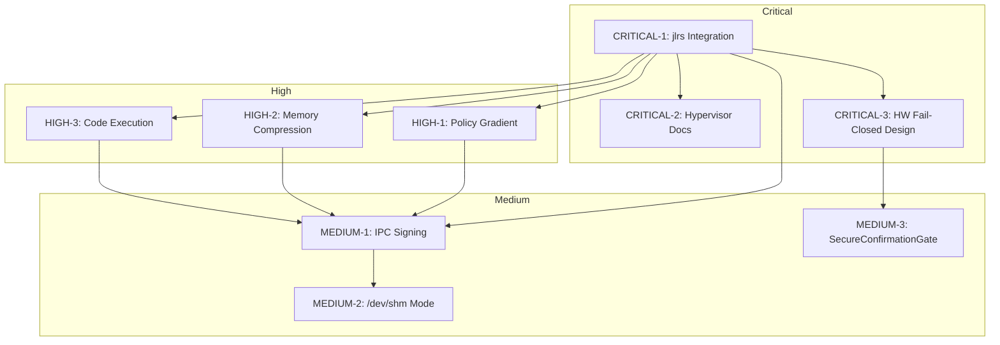

# Phase 7: Critical Remediation Plan

**Phase Name:** System Hardening & Integration Fixes  
**Based On:** FINAL_SYSTEM_EVALUATION_REPORT.md (Score: 2.86/5)  
**Target State:** Functional - Ready for Hardening (3.5+/5)  
**Document Version:** 1.0

---

## Executive Summary

This plan addresses the critical bottlenecks identified in the Final System Evaluation Report. The system currently achieves **2.86/5** readiness, requiring significant hardening before production deployment.

### Priority Matrix

| Priority | Items | Focus Area |
|----------|-------|------------|
| CRITICAL | 3 | Integration & Security |
| HIGH | 3 | Learning & Execution |
| MEDIUM | 3 | IPC & Validation |

---

## CRITICAL Priority Items

### CRITICAL-1: Restore Julia-Rust Integration

**Issue:** jlrs crate commented out in [`itheris-daemon/Cargo.toml:32`](itheris-daemon/Cargo.toml:32), forcing fragile manual dlsym FFI

**Root Cause:** jlrs dependency disabled, no embedded Julia runtime

**Action Items:**
- [ ] Uncomment jlrs crate in Cargo.toml with Julia 1.10 features
- [ ] Configure Julia initialization path in Rust runtime
- [ ] Implement proper Julia embedding with async-safe callbacks
- [ ] Replace manual dlsym FFI with jlrs-managed calls
- [ ] Verify Julia-Rust IPC functionality (16/16 tests pass)

**Dependencies:** None (standalone fix)

**Verification:** IPC cryptographic signing tests pass (target: 16/16)

---

### CRITICAL-2: Address Hypervisor Isolation Gap

**Issue:** System claims Type-1 hypervisor but uses standard x86-64 paging, not hardware-assisted EPT/NPT

**Root Cause:** Documentation mismatch - system is Type-2 (software virtualization) not Type-1

**Action Items:**
- [ ] Update architecture documentation to accurately reflect Type-2 hypervisor (or KVM-based) isolation
- [ ] Document security boundaries for Julia↔Rust process isolation
- [ ] Implement additional software-based isolation layers (seccomp, namespaces)
- [ ] Consider Intel SGX or AMD SEV for hardware isolation if required
- [ ] Add runtime isolation verification tests

**Dependencies:** None (documentation + architectural clarification)

**Verification:** Architecture docs match implementation, security test pass rate >90%

---

### CRITICAL-3: Design Hardware Fail-Closed Architecture

**Issue:** Software watchdog cannot trigger on kernel crash; no GPIO lockdown mechanism

**Root Cause:** No hardware-level safety triggers implemented

**Action Items:**
- [ ] Design hardware fail-closed architecture specification
- [ ] Specify GPIO pin requirements for emergency shutdown
- [ ] Define hardware watchdog integration interface
- [ ] Document kernel panic response protocol
- [ ] Create PCB integration specification for production hardware

**Dependencies:** None (can start immediately)

**Verification:** Hardware fail-closed design document complete

---

## HIGH Priority Items

### HIGH-1: Implement Actual Policy Gradient Learning

**Issue:** [`OnlineLearning.jl:159-172`](adaptive-kernel/cognition/learning/OnlineLearning.jl:159) compute_gradients returns random values, not REINFORCE/PPO

**Root Cause:** Placeholder implementation, no actual reinforcement learning

**Action Items:**
- [ ] Implement REINFORCE algorithm with advantage estimation
- [ ] Add PPO clip objective for stable policy updates
- [ ] Integrate with existing LearningState for meta-learning support
- [ ] Add trajectory collection for policy evaluation
- [ ] Implement value function baseline for variance reduction

**Dependencies:** CRITICAL-1 (Julia embedding needed for tensor operations)

**Verification:** Learning convergence tests show policy improvement over baseline

---

### HIGH-2: Implement Semantic Memory Compression

**Issue:** Memory architecture lacks compressed latent embedding storage

**Root Cause:** Placeholder implementation only

**Action Items:**
- [ ] Design latent embedding compression schema
- [ ] Implement VAE-based compression for semantic memories
- [ ] Add memory prioritization based on recency and importance
- [ ] Integrate with existing Memory.jl module

**Dependencies:** CRITICAL-1

**Verification:** Memory footprint reduction >50% with maintained recall accuracy

---

### HIGH-3: Replace CodeAgent.execute_code_safely Stub

**Issue:** [`CodeAgent.jl:517`](adaptive-kernel/cognition/agents/CodeAgent.jl:517) returns "placeholder" message

**Root Cause:** ToolRegistry integration not implemented

**Action Items:**
- [ ] Implement ExecutionSandbox with proper process isolation
- [ ] Integrate with ToolRegistry for capability dispatch
- [ ] Add timeout and resource limit enforcement
- [ ] Implement filesystem and network access controls
- [ ] Add execution result serialization

**Dependencies:** CRITICAL-1 (for Julia code execution)

**Verification:** CodeAgent can execute safe Julia/Python code snippets

---

## MEDIUM Priority Items

### MEDIUM-1: Fix IPC Cryptographic Signing

**Issue:** 14/16 IPC tests fail due to MethodError on RustIPC.sign_message

**Root Cause:** Missing cryptographic library binding in Julia

**Action Items:**
- [ ] Implement sign_message wrapper in Rust (using ed25519-dalek or ring)
- [ ] Expose via jlrs or manual FFI
- [ ] Add verify_message for integrity checking
- [ ] Run comprehensive IPC test suite

**Dependencies:** CRITICAL-1 (jlrs needed for proper FFI)

**Verification:** IPC test pass rate 16/16 (100%)

---

### MEDIUM-2: Enable Native /dev/shm IPC Mode

**Issue:** System runs in TCP fallback rather than high-performance shared memory

**Root Cause:** Configuration or runtime detection issue

**Action Items:**
- [ ] Diagnose why /dev/shm detection fails
- [ ] Implement proper /dev/shm path validation
- [ ] Add fallback detection for different systems (Linux, macOS)
- [ ] Benchmark TCP vs shared memory performance

**Dependencies:** MEDIUM-1

**Verification:** IPC latency <1ms for local communication

---

### MEDIUM-3: Migrate to SecureConfirmationGate

**Issue:** Basic ConfirmationGate uses predictable UUIDs (security vulnerability)

**Root Cause:** Insufficient randomness in UUID generation

**Action Items:**
- [ ] Review SecureConfirmationGate implementation
- [ ] Add cryptographically secure random UUID generation
- [ ] Implement confirmation timeout mechanisms
- [ ] Add audit logging for all confirmations

**Dependencies:** None (standalone fix)

**Verification:** Confirmation UUIDs pass randomness tests (dieharder/ENT)

---

## Execution Order & Dependencies

---

## Timeline Estimate

| Phase | Duration | Focus |
|-------|----------|-------|
| Week 1-2 | 2 weeks | CRITICAL-1, CRITICAL-2, CRITICAL-3 |
| Week 3-4 | 2 weeks | HIGH-1, HIGH-2, HIGH-3 |
| Week 5-6 | 2 weeks | MEDIUM-1, MEDIUM-2 |
| Week 7 | 1 week | MEDIUM-3, Testing & Validation |

**Total Estimated Duration:** 7 weeks

---

## Success Criteria

| Metric | Current | Target |
|--------|---------|--------|
| System Readiness Score | 2.86/5 | 3.5+/5 |
| IPC Test Pass Rate | 25% (4/16) | 100% (16/16) |
| Julia-Rust Integration | Broken | Functional |
| Policy Gradient | Placeholder | REINFORCE/PPO |
| Code Execution | Stubbed | Functional Sandbox |

---

## Risk Mitigation

| Risk | Mitigation |
|------|------------|
| jlrs compatibility issues | Test with Julia 1.10, fallback to manual FFI |
| Hardware fail-closed feasibility | Document requirements, specify PCB design |
| Policy gradient instability | Implement conservative learning rate, add monitoring |

---

*Plan generated: 2026-03-10*  
*Based on: FINAL_SYSTEM_EVALUATION_REPORT.md*
