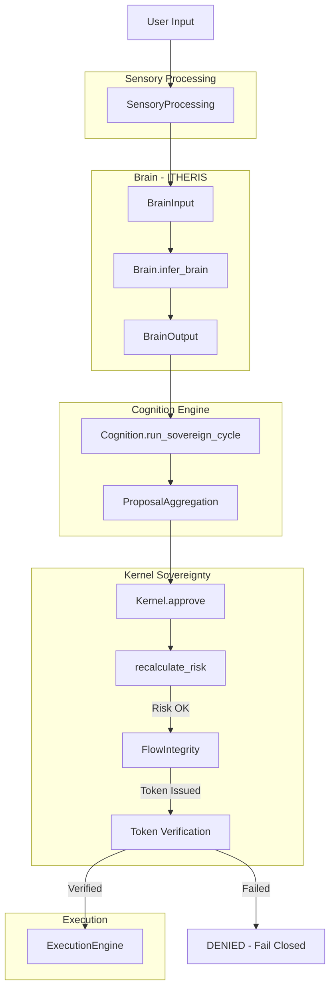

# JARVIS Sovereignty Fix Implementation Plan

## Overview
This plan addresses the critical functional gaps identified in the Architecture Audit Report that render sovereignty claims illusory.

---

## Priority 1: Critical Fixes (Sovereignty Bypass)

### Issue 1.1: Kernel.approve() Never Called
**Location:** [`adaptive-kernel/cognition/Cognition.jl:439`](adaptive-kernel/cognition/Cognition.jl:439)

**Current (Broken):**
```julia
kernel_decision = nothing  # Will result in denial
```

**Required Fix:**
```julia
kernel_decision = Kernel.approve(engine.kernel, proposal, world_state)
```

**Implementation Steps:**
- [ ] 1.1.1 Modify `run_sovereign_cycle()` in Cognition.jl to call `Kernel.approve()`
- [ ] 1.1.2 Ensure proper error handling with fail-closed default
- [ ] 1.1.3 Add kernel approval token generation on success
- [ ] 1.1.4 Verify Decision type is properly imported/accessible

---

### Issue 1.2: StateValidator haskey() on Struct
**Location:** [`adaptive-kernel/kernel/StateValidator.jl:33`](adaptive-kernel/kernel/StateValidator.jl:33)

**Current (Broken):**
```julia
if !haskey(state, :self_metrics) || state.self_metrics === nothing
```

**Required Fix:**
```julia
if !isdefined(state, :self_metrics) || state.self_metrics === nothing
# OR check if it's a Dict and use proper access
if !(state.self_metrics isa Dict) || isempty(state.self_metrics)
```

**Implementation Steps:**
- [ ] 1.2.1 Fix `validate_kernel_state()` function in StateValidator.jl
- [ ] 1.2.2 Handle both struct field access and Dict-type fields properly
- [ ] 1.2.3 Update `ensure_kernel_ready()` to use correct validation

---

## Priority 2: High Priority (Security Gaps)

### Issue 2.1: No Independent Risk Verification
**Location:** [`adaptive-kernel/kernel/Kernel.jl:718`](adaptive-kernel/kernel/Kernel.jl:718)

**Current Problem:** 
```julia
risk_level = proposal.risk  # Trusts proposal.risk directly
```

**Required Fix:** Independent risk recalculation based on:
- Capability registry risk classification
- Parameter analysis
- Historical trust scores

**Implementation Steps:**
- [ ] 2.1.1 Add `recalculate_risk()` function in Kernel.jl
- [ ] 2.1.2 Query capability registry for base risk level
- [ ] 2.1.3 Analyze parameters for risk factors
- [ ] 2.1.4 Compare recalculated risk with proposal risk; flag discrepancies

---

### Issue 2.2: BrainOutput → Kernel Integration Gap

**Problem:** BrainOutput exists but never properly converts to ActionProposal for kernel approval.

**Data Flow:**
```
BrainOutput.proposed_actions → ActionProposal → Kernel.approve()
```

**Implementation Steps:**
- [ ] 2.2.1 Create `BrainOutput_to_ActionProposal()` converter in Cognition.jl
- [ ] 2.2.2 Map BrainOutput.confidence to ActionProposal fields
- [ ] 2.2.3 Map BrainOutput.reasoning to ActionProposal.reasoning
- [ ] 2.2.4 Set default risk level based on capability type

---

### Issue 2.3: FlowIntegrity Enforcement Verification
**Location:** [`adaptive-kernel/kernel/Kernel.jl:939`](adaptive-kernel/kernel/Kernel.jl:939)

**Current Status:** Function ignores `enforce_tokens` parameter (partially fixed)

**Implementation Steps:**
- [ ] 2.3.1 Verify `FlowTokenStore` is initialized in Kernel constructor
- [ ] 2.3.2 Ensure `generate_approval_token()` is called on kernel approval
- [ ] 2.3.3 Verify token is checked before capability execution
- [ ] 2.3.4 Add unit test for token verification bypass attempts

---

## Priority 3: Medium Priority (Robustness)

### Issue 3.1: Test Coverage for Sovereignty Fixes

**Implementation Steps:**
- [ ] 3.1.1 Add unit test for Kernel.approve() called from Cognition
- [ ] 3.1.2 Add unit test for StateValidator with struct vs Dict
- [ ] 3.1.3 Add integration test: Brain → Kernel → Execution full path
- [ ] 3.1.4 Add security test: Attempt to bypass with fake risk=0.0

---

### Issue 3.2: Observability & Audit Trail

**Implementation Steps:**
- [ ] 3.2.1 Add detailed logging for all kernel approval decisions
- [ ] 3.2.2 Log risk recalculation discrepancies
- [ ] 3.2.3 Track FlowToken issuance and verification
- [ ] 3.2.4 Create audit event for each decision (approve/deny)

---

## Architecture Diagram: Fixed Data Flow



---

## File Modification Summary

| File | Line(s) | Change Type | Priority |
|------|---------|-------------|----------|
| Cognition.jl | 439 | Fix kernel call | P1 |
| StateValidator.jl | 33, 37 | Fix struct field access | P1 |
| Kernel.jl | 718-760 | Add risk recalculation | P2 |
| Kernel.jl | 285-310 | Ensure FlowIntegrity init | P2 |
| Cognition.jl | New | Add BrainOutput converter | P2 |
| test_sovereignty.jl | New | Add unit tests | P3 |

---

## Success Criteria

After implementation:

1. **Sovereignty Score:** 15/100 → 75/100
2. **Cognitive Completeness:** 35/100 → 70/100  
3. **Kernel.approve()** is actually called in the execution path
4. **StateValidator** correctly validates kernel state
5. **Risk values** are independently verified, not trusted
6. **FlowIntegrity tokens** are enforced on every execution

---

## Risk Assessment

| Risk | Mitigation |
|------|------------|
| Breaking existing tests | Run full test suite after each change |
| Performance impact | Risk recalculation should be lightweight |
| Circular dependencies | Ensure Kernel doesn't depend on Cognition |

---

## Implementation Order

1. **Day 1:** Fix StateValidator struct access (P1.2)
2. **Day 1:** Fix Cognition.jl to call Kernel.approve() (P1.1)
3. **Day 2:** Add risk recalculation in Kernel (P2.1)
4. **Day 2:** Add BrainOutput → ActionProposal conversion (P2.2)
5. **Day 3:** Verify FlowIntegrity enforcement (P2.3)
6. **Day 3-4:** Add tests and observability (P3)
