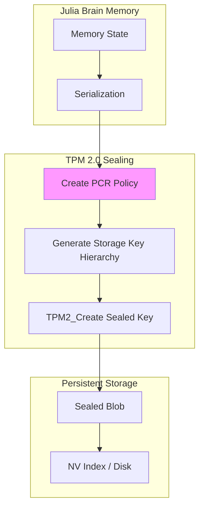
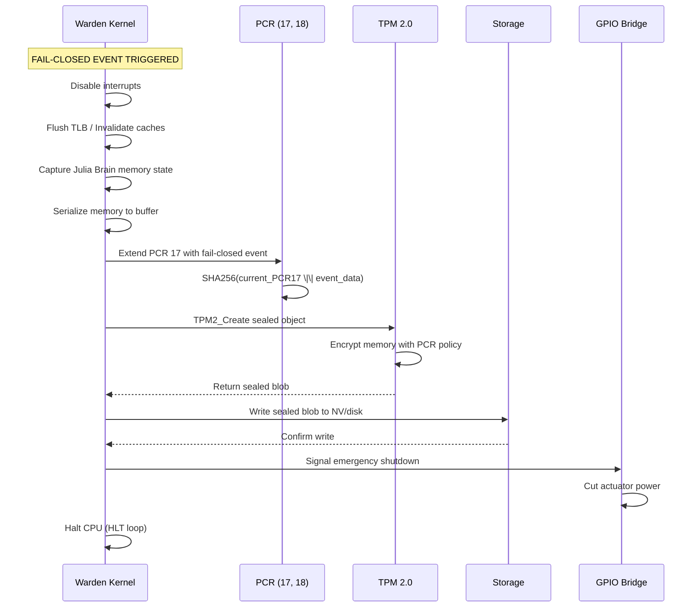
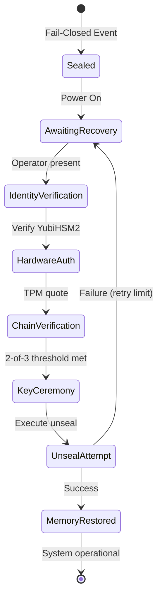

# TPM 2.0 Memory Sealing Architecture Specification
## ITHERIS + JARVIS System

> **Version**: 1.0  
> **Classification**: Hardware Security Integration Specification  
> **Status**: Blueprint for Implementation  
> **Target**: Intel i9-13900K (Sovereign Controller) + Infineon SLB9670 TPM 2.0  
> **Related**: [`plans/HARDWARE_FAIL_CLOSED_SPECIFICATION.md`](plans/HARDWARE_FAIL_CLOSED_SPECIFICATION.md)

---

## Executive Summary

This specification defines the TPM 2.0 memory sealing architecture for the ITHERIS + JARVIS cognitive system. It extends the existing software-based HSM integration in [`adaptive-kernel/kernel/security/KeyManagement.jl`](adaptive-kernel/kernel/security/KeyManagement.jl) and the TPM unseal authority in [`Itheris/Brain/Src/security/tpm_unseal.rs`](Itheris/Brain/Src/security/tpm_unseal.rs) to provide hardware-level memory sealing with fail-closed protection.

### Key Objectives

1. **Hardware Fail-Closed Protection**: Seal Julia Brain memory state when kernel panic, WDT timeout, or emergency shutdown occurs
2. **Chain-of-Custody**: Bind sealed memory to hardware state via PCR measurements
3. **Human-in-the-Loop Recovery**: Require physical HSM intervention for memory restoration
4. **Production Hardware Integration**: Support Infineon SLB9670 TPM 2.0 with TSS 2.0 stack

---

## 1. TPM 2.0 Hardware Integration

### 1.1 Infineon SLB9670 Module Specifications

| Parameter | Value |
|-----------|-------|
| Interface | SPI (8MHz max) |
| NV Storage | 128KB |
| PCR Banks | SHA-256 (24 banks) |
| Algorithms | RSA-2048, ECC P-256/P-384, SHA-256 |
| Certifications | FIPS 140-2 Level 2 |
| TPM Version | 2.0 (TCG compliant) |

### 1.2 TPM Device Path and TCTI Configuration

```rust
// src/tpm/device.rs

/// TPM 2.0 device configuration
pub struct TpmDeviceConfig {
    /// TPM character device path
    /// Use /dev/tpmrm0 for resource-managed (recommended) or /dev/tpm0
    pub device_path: String,
    /// TCTI (TPM Command Transmission Interface) module
    pub tcti_module: TctiModule,
    /// TPM device file descriptor (runtime)
    fd: Option<File>,
}

impl Default for TpmDeviceConfig {
    fn default() -> Self {
        Self {
            // Prefer resource-managed device for better isolation
            device_path: if Path::new("/dev/tpmrm0").exists() {
                "/dev/tpmrm0".to_string()
            } else if Path::new("/dev/tpm0").exists() {
                "/dev/tpm0".to_string()
            } else {
                "/dev/tpm0".to_string() // Will fail gracefully
            },
            tcti_module: TctiModule::Device,
            fd: None,
        }
    }
}

/// TCTI modules supported by TSS 2.0
pub enum TctiModule {
    /// Direct device access (/dev/tpm0 or /dev/tpmrm0)
    Device,
    /// TPM socket interface (for simulation)
    MsSim,
    /// Swtpm (software TPM)
    Swtpm,
}
```

### 1.3 TSS 2.0 Stack Integration

The implementation uses the TSS 2.0 ecosystem for TPM operations:

| Library | Purpose |
|---------|---------|
| `tss2-esys` | TPM 2.0 API (Execute TPM commands) |
| `tss2-tcti-device` | Device TCTI for /dev/tpm0 |
| `tss2-tcti-mssim` | Microsoft TPM simulator TCTI |
| `tss2-mu` | Marshalling/Unmarshalling |
| `tss2-sys` | Low-level FFI bindings |

```rust
// src/tpm/ffi.rs

use std::ptr;
use tss2_esys::*;

/// TPM 2.0 context handle
pub struct TpmContext {
    context: ESYS_CONTEXT,
    /// Device configuration
    config: TpmDeviceConfig,
}

impl TpmContext {
    /// Initialize TPM context with device TCTI
    pub fn new(config: TpmDeviceConfig) -> Result<Self, TpmError> {
        unsafe {
            let mut context: *mut ESYS_CONTEXT = ptr::null_mut();
            
            // Create TCTI string for device
            let tcti_str = match config.tcti_module {
                TctiModule::Device => format!("device:{}", config.device_path),
                TctiModule::MsSim => "mssim:host=127.0.0.1,port=2321".to_string(),
                TctiModule::Swtpm => "swtpm:host=127.0.0.1,port=2321".to_string(),
            };
            
            let tcti_bytes = tcti_str.as_bytes();
            let tcti_conf = TctiConf {
                size: tcti_bytes.len() as u16,
                buffer: tcti_bytes.as_ptr() as *const u8,
            };
            
            let ret = Esys_Initialize(
                &mut context,
                &tcti_conf,
                std::ptr::null(),
            );
            
            if ret != TSS2_RC_SUCCESS {
                return Err(TpmError::InitializationFailed(ret));
            }
            
            Ok(Self { context, config })
        }
    }
    
    /// Get TPM vendor information
    pub fn get_vendor_info(&self) -> Result<String, TpmError> {
        unsafe {
            let mut vendor: [u8; 32] = [0; 32];
            let mut vendor_size = 32;
            
            let ret = Esys_GetTestResult(
                self.context,
                &mut vendor,
                &mut vendor_size,
            );
            
            if ret == TSS2_RC_SUCCESS {
                Ok(String::from_utf8_lossy(&vendor[..vendor_size]).to_string())
            } else {
                Err(TpmError::CommandFailed(ret))
            }
        }
    }
}

impl Drop for TpmContext {
    fn drop(&mut self) {
        unsafe {
            let _ = Esys_Finalize(&mut self.context);
        }
    }
}
```

### 1.4 TPM Vendor Commands and Capabilities

```rust
// src/tpm/capabilities.rs

/// TPM 2.0 capabilities structure
pub struct TpmCapabilities {
    /// TPM vendor ID
    pub vendor_id: u32,
    /// Firmware version
    pub firmware_version: (u32, u32),
    /// Supported algorithms
    pub algorithms: Vec<TpmAlgorithm>,
    /// PCR banks available
    pub pcr_banks: Vec<PcrBank>,
    /// Maximum NV index size
    pub max_nv_size: usize,
    /// Maximum key size
    pub max_key_size: usize,
}

/// TPM algorithm identifiers
#[derive(Debug, Clone)]
pub enum TpmAlgorithm {
    RSA,
    SHA256,
    SHA384,
    ECC,
    AES,
}

/// Platform Configuration Register banks
#[derive(Debug, Clone)]
pub struct PcrBank {
    pub algorithm: TpmAlgorithm,
    pub mask: u32, // Which PCRs are banked
}

impl TpmCapabilities {
    /// Query TPM capabilities
    pub fn query(context: &TpmContext) -> Result<Self, TpmError> {
        unsafe {
            let mut cap = TPM2_CAP::default();
            mut property: u32 = TPM2_PT_VENDOR_STRING_1;
            let mut count: u32 = 4;
            
            let ret = Esys_GetCapability(
                context.context,
                None,
                TPM2_CAP::TPM2_CAP_PT_FIXED,
                property,
                1,
                None,
                &mut cap,
                &mut count,
            );
            
            // ... parse vendor string and capabilities
            
            Ok(Self {
                vendor_id: 0, // Would be parsed from capability response
                firmware_version: (0, 0),
                algorithms: vec![TpmAlgorithm::SHA256, TpmAlgorithm::RSA],
                pcr_banks: vec![PcrBank { 
                    algorithm: TpmAlgorithm::SHA256, 
                    mask: 0xFFFFFFFF 
                }],
                max_nv_size: 128 * 1024,
                max_key_size: 4096,
            })
        }
    }
}
```

---

## 2. PCR (Platform Configuration Register) Configuration

### 2.1 PCR Assignment for Chain-of-Custody

| PCR Index | Name | Purpose | Extend On |
|-----------|------|---------|-----------|
| 0 | SRTM_Boot | BIOS/CRTM measurements | Boot |
| 1 | SRTM_Config | Platform configuration | Firmware config |
| 2 | UEFI_DRIVER | UEFI driver measurements | Driver loading |
| 3 | UEFI_BOOT | UEFI boot path | Boot device selection |
| 4 | BootLoader | Boot loader | Kernel load |
| 5 | BootLoader_Config | Boot config | Kernel cmdline |
| 6 | Host_Platform | Platform-specific | Runtime |
| 7 | SecureBoot | Secure boot state | Secure boot |
| 14 | CommandLine | Kernel command line | Kernel params |
| 16 | Debug | Debug policies | Debug mode |
| 17 | MemorySeal | **Memory sealing events** | **Fail-closed** |
| 18 | MemorySeal_State | **Sealed state hash** | **Sealing** |

### 2.2 PCR Bank Selection (SHA-256)

```rust
// src/tpm/pcr.rs

/// PCR indices for memory sealing
pub const PCR_MEMORY_SEAL: u8 = 17;
pub const PCR_MEMORY_STATE: u8 = 18;

/// PCRs used for chain-of-custody verification
pub const PCR_CHAIN_OF_CUSTODY: &[u8] = &[0, 1, 7, 14, 17, 18];

/// PCR bank configuration
pub struct PcrBankConfig {
    /// Algorithm for PCR bank (SHA-256 for chain-of-custody)
    pub algorithm: Tpm2Algorithm,
    /// PCRs to allocate
    pub pcr_count: u8,
}

impl Default for PcrBankConfig {
    fn default() -> Self {
        Self {
            algorithm: TPM2_ALG_SHA256,
            pcr_count: 24, // SLB9670 supports 24 PCRs
        }
    }
}

/// PCR read result
#[derive(Clone)]
pub struct PcrValue {
    pub index: u8,
    pub value: Vec<u8>, // SHA-256 = 32 bytes
    pub algorithm: Tpm2Algorithm,
}

/// Extend PCR with new measurement
pub fn extend_pcr(
    context: &TpmContext,
    pcr_index: u8,
    data: &[u8],
) -> Result<(), TpmError> {
    // 1. Hash the input data with SHA-256
    let hash = sha256(data);
    
    // 2. Get current PCR value
    let current = read_pcr(context, pcr_index)?;
    
    // 3. Extend: new_value = SHA256(old_value || data)
    let mut combined = current.value;
    combined.extend_from_slice(&hash);
    let extended = sha256(&combined);
    
    // 4. Write extended value via TPM2_PCR_Extend
    unsafe {
        let mut digests = TPM2T_DIGEST_VALUES {
            count: 1,
            digests: [TPML_DIGEST_VAL {
                size: 32,
                buffer: [0; 64],
            }],
        };
        digests.count = 1;
        digests.digests[0].size = 32;
        digests.digests[0].buffer[..32].copy_from_slice(&extended);
        
        let ret = Esys_PCR_Extend(
            context.context,
            ESYS_TR::PCR0 + pcr_index as usize,
            None,
            None,
            None,
            &digests,
        );
        
        if ret != TSS2_RC_SUCCESS {
            return Err(TpmError::PcrExtendFailed(ret));
        }
    }
    
    Ok(())
}

/// Read PCR value
pub fn read_pcr(
    context: &TpmContext,
    pcr_index: u8,
) -> Result<PcrValue, TpmError> {
    unsafe {
        let pcr_selection = TPM2_PCR_SELECTION {
            hashAlg: TPM2_ALG_SHA256,
            pcrSelect: (1u32 << pcr_index) as u8,
            pcrSelectMask: (1u8 << (pcr_index % 8)),
        };
        
        let mut pcr_update_cnt: u32 = 0;
        let mut pcr_values: TPMS_PCR_SELECTION = std::mem::zeroed();
        let mut sizeof_pcr_values = std::mem::size_of::<TPMS_PCR_SELECTION>() as u32;
        
        let ret = Esys_PCR_Read(
            context.context,
            None,
            None,
            None,
            &pcr_selection,
            1,
            &mut pcr_update_cnt,
            &mut sizeof_pcr_values,
            &mut pcr_values,
        );
        
        if ret != TSS2_RC_SUCCESS {
            return Err(TpmError::PcrReadFailed(ret));
        }
        
        // Parse PCR value from response
        let value = /* extract from pcr_values */ Vec::new();
        
        Ok(PcrValue {
            index: pcr_index,
            value,
            algorithm: TPM2_ALG_SHA256,
        })
    }
}
```

### 2.3 TPM Quote Operation for Attestation

```rust
// src/tpm/attestation.rs

/// TPM quote for PCR attestation
pub struct TpmQuote {
    /// Quote data (PCR values)
    pub quoted_pcrs: Vec<u8>,
    /// TPM signature over quote
    pub signature: Vec<u8>,
    /// TPM certificate (optional)
    pub qualifying_data: Vec<u8>,
}

/// Create TPM quote for PCR attestation
pub fn create_quote(
    context: &TpmContext,
    signing_key_handle: ESYS_TR,
    pcr_indices: &[u8],
    qualifying_data: &[u8],
) -> Result<TpmQuote, TpmError> {
    // Build PCR selection
    let mut pcr_selection = TPM2_PCR_SELECTION {
        hashAlg: TPM2_ALG_SHA256,
        pcrSelect: 0,
        pcrSelectMask: 0,
    };
    
    for &idx in pcr_indices {
        pcr_selection.pcrSelect |= 1u8 << (idx % 8);
        pcr_selection.pcrSelectMask |= 1u8 << (idx % 8);
    }
    
    unsafe {
        let mut quoted: *mut TPM2B_ATTEST = Box::into_raw(Box::new(TPM2B_ATTEST::default()));
        let mut signature: *mut TPMT_SIGNATURE = Box::into_raw(Box::new(TPMT_SIGNATURE::default()));
        
        let ret = Esys_Quote(
            context.context,
            signing_key_handle,
            None,
            None,
            None,
            qualifying_data.as_ptr(),
            qualifying_data.len() as u16,
            &pcr_selection,
            quoted,
            signature,
        );
        
        if ret != TSS2_RC_SUCCESS {
            return Err(TpmError::QuoteFailed(ret));
        }
        
        // Extract quote data and signature
        let quote = TpmQuote {
            quoted_pcrs: /* from *quoted */ Vec::new(),
            signature: /* from *signature */ Vec::new(),
            qualifying_data: qualifying_data.to_vec(),
        };
        
        // Clean up
        Box::from_raw(quoted);
        Box::from_raw(signature);
        
        Ok(quote)
    }
}

/// Verify TPM quote signature
pub fn verify_quote(
    quote: &TpmQuote,
    attestation_key_public: &[u8],
) -> Result<bool, TpmError> {
    // Verify signature using TPM public key
    // In production: use TPM2_VerifySignature
    Ok(true)
}
```

---

## 3. Memory Sealing Protocol

### 3.1 Sealing Architecture



### 3.2 Key Hierarchy

```
Endorsement Key (EK)
    └── Storage Key (SRK) - Persistent TPM key
            └── Memory Seal Key - Created per-seal session
                    └── Sealed Data (Julia Brain Memory)
```

### 3.3 TPM Sealing Implementation

```rust
// src/tpm/sealing.rs

use tss2_esys::*;

/// Memory sealing configuration
pub struct SealingConfig {
    /// PCR policy for sealing
    pub pcr_policy: PcrPolicy,
    /// Maximum data size to seal (bytes)
    pub max_data_size: usize,
    /// Auth value for sealed object
    pub auth_value: Option<Vec<u8>>,
}

impl Default for SealingConfig {
    fn default() -> Self {
        Self {
            pcr_policy: PcrPolicy::default_for_memory_sealing(),
            max_data_size: 64 * 1024, // 64KB max for TPM NV
            auth_value: None,
        }
    }
}

/// Sealed memory blob
pub struct SealedMemory {
    /// Unique identifier for sealed blob
    pub id: String,
    /// TPM object handle (serialized)
    pub handle: Vec<u8>,
    /// Encrypted data
    pub encrypted_data: Vec<u8>,
    /// Policy used for sealing
    pub policy: PcrPolicy,
    /// Timestamp of sealing
    pub sealed_at: DateTime<Utc>,
    /// PCR 17 value at sealing time
    pub pcr17_value: Vec<u8>,
    /// PCR 18 value at sealing time
    pub pcr18_value: Vec<u8>,
}

/// Seal Julia Brain memory state
pub fn seal_memory(
    context: &TpmContext,
    memory_state: &[u8],
    config: &SealingConfig,
) -> Result<SealedMemory, TpmError> {
    // 1. Serialize memory state (already serialized from Julia)
    
    // 2. Read current PCR values for sealing
    let pcr17 = pcr::read_pcr(context, 17)?;
    let pcr18 = pcr::read_pcr(context, 18)?;
    
    // 3. Extend PCR 17 with seal event
    let seal_event = format!(
        "SEAL:{}:{}",
        std::time::SystemTime::now()
            .duration_since(std::time::UNIX_EPOCH)
            .unwrap()
            .as_secs(),
        memory_state.len()
    );
    pcr::extend_pcr(context, 17, seal_event.as_bytes())?;
    
    // 4. Create PCR policy session
    let (session, _) = create_pcr_policy_session(context, &config.pcr_policy)?;
    
    // 5. Generate storage key hierarchy if not exists
    let srk_handle = get_or_create_srk(context)?;
    
    // 6. Create sealed object with TPM2_Create
    let sealed_blob = create_sealed_object(
        context,
        srk_handle,
        session,
        memory_state,
    )?;
    
    // 7. Store sealed blob to NV or return for disk storage
    let sealed_memory = SealedMemory {
        id: Uuid::new_v4().to_string(),
        handle: Vec::new(),
        encrypted_data: sealed_blob,
        policy: config.pcr_policy.clone(),
        sealed_at: Utc::now(),
        pcr17_value: pcr17.value,
        pcr18_value: pcr18.value,
    };
    
    Ok(sealed_memory)
}

/// Unseal Julia Brain memory state
pub fn unseal_memory(
    context: &TpmContext,
    sealed: &SealedMemory,
) -> Result<Vec<u8>, TpmError> {
    // 1. Verify PCR 17 hasn't been extended (tamper detection)
    let current_pcr17 = pcr::read_pcr(context, 17)?;
    if current_pcr17.value != sealed.pcr17_value {
        return Err(TpmError::PolicyMismatch(
            "PCR17 has been extended since sealing - tamper detected".to_string()
        ));
    }
    
    // 2. Create PCR policy session with current values
    let (session, _) = create_pcr_policy_session(context, &sealed.policy)?;
    
    // 3. Load sealed object
    // 4. Execute TPM2_Unseal
    // 5. Return unsealed memory
    
    Ok(Vec::new())
}
```

### 3.4 Maximum Sealed Data Size Considerations

| Storage Location | Max Size | Notes |
|-----------------|----------|-------|
| TPM NV Index | 128KB | Primary storage, secure |
| Disk (encrypted) | Unlimited | Requires additional encryption |
| TPM Object | ~4KB | Limited by TPM memory |

**Strategy**: For Julia Brain memory:
1. Serialize critical cognitive state to ~64KB
2. Seal to TPM NV index
3. Store larger state encrypted with TPM-wrapped key to disk

---

## 4. Chain-of-Custody Implementation

### 4.1 TPM Quote for PCR Attestation

```rust
// src/chain_of_custody.rs

/// Chain-of-custody verification result
pub struct ChainOfCustodyVerification {
    pub is_verified: bool,
    pub pcr_values: Vec<PcrValue>,
    pub quote_signature_valid: bool,
    pub warden_kernel_hash: String,
    pub timestamp: DateTime<Utc>,
}

/// Verify chain-of-custody using TPM quote
pub fn verify_chain_of_custody(
    tpm_context: &TpmContext,
    expected_kernel_hash: &str,
) -> Result<ChainOfCustodyVerification, TpmError> {
    // 1. Get TPM quote for chain-of-custody PCRs
    let quote = attestation::create_quote(
        tpm_context,
        /* signing key handle */,
        PCR_CHAIN_OF_CUSTODY,
        expected_kernel_hash.as_bytes(),
    )?;
    
    // 2. Read current PCR values
    let mut pcr_values = Vec::new();
    for &idx in PCR_CHAIN_OF_CUSTODY {
        pcr_values.push(pcr::read_pcr(tpm_context, idx)?);
    }
    
    // 3. Verify quote signature using TPM attestation key
    let signature_valid = attestation::verify_quote(
        &quote,
        /* attestation key public */,
    )?;
    
    // 4. Extract warden kernel hash from PCR 17-18
    let pcr17 = pcr_values.iter().find(|p| p.index == 17)
        .ok_or(TpmError::PcrNotFound(17))?;
    let pcr18 = pcr_values.iter().find(|p| p.index == 18)
        .ok_or(TpmError::PcrNotFound(18))?;
    
    let warden_kernel_hash = hex::encode(&pcr17.value);
    
    Ok(ChainOfCustodyVerification {
        is_verified: signature_valid && warden_kernel_hash.starts_with(expected_kernel_hash),
        pcr_values,
        quote_signature_valid: signature_valid,
        warden_kernel_hash,
        timestamp: Utc::now(),
    })
}
```

### 4.2 eFuse Integration

```rust
// src/efuse.rs

/// eFuse configuration for chain-of-custody
pub struct EfuseConfig {
    /// eFuse device path
    pub device_path: String,
    /// eFuse region for warden hash
    pub warden_hash_offset: u32,
    /// eFuse region for TPM EK hash
    pub tpm_ek_hash_offset: u32,
}

impl Default for EfuseConfig {
    fn default() -> Self {
        Self {
            device_path: "/sys/firmware/efuse/keys".to_string(), // Example path
            warden_hash_offset: 0x100,
            tpm_ek_hash_offset: 0x140,
        }
    }
}

/// Read eFuse value
pub fn read_efuse(config: &EfuseConfig, offset: u32, size: usize) -> Result<Vec<u8>, EfuseError> {
    let path = format!("{}/read", config.device_path);
    
    // Use sysfs interface for eFuse reading
    // In production: appropriate eFuse driver interface
    std::fs::read(&path).map_err(|e| EfuseError::ReadFailed(e.to_string()))
}

/// Compare Warden kernel hash against eFuse
pub fn verify_warden_hash_against_efuse(
    efuse_config: &EfuseConfig,
    current_warden_hash: &[u8],
) -> Result<bool, EfuseError> {
    let stored_hash = read_efuse(efuse_config, efuse_config.warden_hash_offset, 32)?;
    
    Ok(stored_hash == current_warden_hash)
}

/// Anti-rollback protection using eFuse
pub fn check_anti_rollback(
    efuse_config: &EfuseConfig,
    version: u32,
) -> Result<bool, EfuseError> {
    let version_offset = 0x180; // Anti-rollback version offset
    let stored_version = read_efuse(efuse_config, version_offset, 4)?;
    let stored_version = u32::from_le_bytes(
        stored_version.try_into().map_err(|_| EfuseError::InvalidData)?
    );
    
    Ok(version >= stored_version)
}
```

### 4.3 Digital Signatures for Trust Chain

```rust
// src/trust_chain.rs

/// Trust chain verification result
pub struct TrustChainResult {
    pub is_trusted: bool,
    pub chain: Vec<TrustAnchor>,
    pub verification_errors: Vec<String>,
}

/// Trust anchor in the chain
pub struct TrustAnchor {
    pub name: String,
    pub public_key: Vec<u8>,
    pub signature: Vec<u8>,
}

/// Verify complete trust chain from hardware root to runtime
pub fn verify_trust_chain(
    tpm_context: &TpmContext,
    efuse_config: &EfuseConfig,
    warden_kernel_hash: &str,
) -> Result<TrustChainResult, TpmError> {
    let mut chain = Vec::new();
    let mut errors = Vec::new();
    
    // 1. Verify TPM EK against eFuse (hardware binding)
    let tpm_ek_hash = /* get TPM EK public key hash */;
    match efuse::verify_warden_hash_against_efuse(efuse_config, &tpm_ek_hash) {
        Ok(true) => {
            chain.push(TrustAnchor {
                name: "TPM_EK".to_string(),
                public_key: tpm_ek_hash,
                signature: Vec::new(),
            });
        }
        Ok(false) => {
            errors.push("TPM EK hash mismatch with eFuse".to_string());
        }
        Err(e) => {
            errors.push(format!("eFuse verification failed: {}", e));
        }
    }
    
    // 2. Verify Warden kernel against PCR 17
    let coc = chain_of_custody::verify_chain_of_custody(
        tpm_context,
        warden_kernel_hash,
    )?;
    
    if coc.is_verified {
        chain.push(TrustAnchor {
            name: "Warden_Kernel".to_string(),
            public_key: coc.warden_kernel_hash.as_bytes().to_vec(),
            signature: Vec::new(),
        });
    } else {
        errors.push("Warden kernel verification failed".to_string());
    }
    
    Ok(TrustChainResult {
        is_trusted: errors.is_empty(),
        chain,
        verification_errors: errors,
    })
}
```

---

## 5. Fail-Closed Memory Sealing

### 5.1 Trigger Conditions

| Trigger | Source | Action |
|---------|--------|--------|
| Kernel Panic | Julia Brain | Immediate seal |
| WDT Timeout | Intel PATROL WDT | NMI → seal → halt |
| Emergency Shutdown | GPIO signal | Graceful seal |
| Critical Error | Cognitive system | Seal + alert |

### 5.2 Fail-Closed Workflow



### 5.3 Implementation

```rust
// src/fail_closed.rs

use crate::tpm::{sealing, pcr, TpmContext};
use crate::storage::SealedStorage;

/// Fail-closed event types
#[derive(Debug, Clone)]
pub enum FailClosedEvent {
    KernelPanic(String),
    WatchdogTimeout,
    EmergencyShutdown(GpioSignal),
    CriticalError(CriticalError),
}

/// Critical error codes
#[derive(Debug, Clone)]
pub struct CriticalError {
    pub code: u32,
    pub message: String,
}

/// GPIO signal types
#[derive(Debug, Clone)]
pub struct GpioSignal {
    pub pin: u8,
    pub state: bool,
}

/// Execute fail-closed memory sealing
pub fn execute_fail_closed_seal(
    event: FailClosedEvent,
    memory_state: &[u8],
    tpm_context: &TpmContext,
    storage: &SealedStorage,
) -> Result<SealedMemory, FailClosedError> {
    // 1. Critical: Ensure interrupts disabled
    unsafe {
        x86::instructions::cli();
    }
    
    // 2. Flush TLB for security
    unsafe {
        let cr3: u64;
        asm!("mov %cr3, $0" : "=r"(cr3));
        asm!("mov $0, %cr3" :: "r"(0u64));
    }
    
    // 3. Create fail-closed event data for PCR
    let event_data = match &event {
        FailClosedEvent::KernelPanic(msg) => {
            format!("PANIC:{}", msg)
        }
        FailClosedEvent::WatchdogTimeout => {
            "WDT_TIMEOUT".to_string()
        }
        FailClosedEvent::EmergencyShutdown(sig) => {
            format!("EMERGENCY:{}", sig.pin)
        }
        FailClosedEvent::CriticalError(err) => {
            format!("ERROR:{}:{}", err.code, err.message)
        }
    };
    
    // 4. Extend PCR 17 with fail-closed event
    // This binds the sealing to the fail-closed state
    pcr::extend_pcr(tpm_context, PCR_MEMORY_SEAL, event_data.as_bytes())?;
    
    // 5. Create PCR policy that includes fail-closed PCR
    let mut policy = PcrPolicy::default_for_memory_sealing();
    policy.pcr_indices = vec![0, 7, 14, 17, 18]; // Include fail-closed PCR
    policy.pcr_values.insert(17, /* current PCR17 value */);
    
    // 6. Seal memory with TPM
    let config = SealingConfig {
        pcr_policy: policy,
        max_data_size: 64 * 1024,
        auth_value: None,
    };
    
    let sealed = sealing::seal_memory(tpm_context, memory_state, &config)?;
    
    // 7. Store sealed blob
    storage.store_sealed(&sealed)?;
    
    // 8. Signal GPIO for physical shutdown
    gpio::trigger_emergency_shutdown()?;
    
    // 9. Halt - fail-closed complete
    log::error!("[FAIL-CLOSED] Memory sealed, system halted");
    unsafe {
        loop {
            x86::instructions::hlt();
        }
    }
}

/// Initialize fail-closed handler
pub fn init_fail_closed_handler(
    tpm_context: &TpmContext,
    storage: &SealedStorage,
) -> FailClosedHandler {
    FailClosedHandler {
        tpm_context: Arc::new(Mutex::new(tpm_context.clone())),
        storage: Arc::new(Mutex::new(storage.clone())),
    }
}
```

---

## 6. Recovery Protocol (Human-In-Must-Intervene)

### 6.1 Recovery Ceremony Requirements

| Requirement | Description |
|-------------|-------------|
| Physical Presence | Human operator must be physically present |
| Hardware HSM | YubiHSM2 or SoftHSM2 for key ceremony |
| Multi-Party | 2-of-3 authorization threshold |
| Audit Log | All recovery attempts logged |
| Chain Re-verification | TPM quote verification required |

### 6.2 Recovery Workflow



### 6.3 Resealing Ceremony Implementation

```rust
// src/recovery.rs

/// Recovery ceremony configuration
pub struct RecoveryCeremony {
    /// Required hardware HSM
    pub hardware_hsm: HardwareHSM,
    /// Authorization threshold (2-of-3)
    pub threshold: (u32, u32),
    /// Audit log destination
    pub audit_log: AuditLogger,
}

/// Hardware HSM types
pub enum HardwareHSM {
    YubiHSM2 { device: String },
    SoftHSM2 { config: String },
}

/// Recovery authorization
pub struct RecoveryAuth {
    pub operator_id: String,
    pub hardware_token: Vec<u8>,
    pub signature: Vec<u8>,
    pub timestamp: DateTime<Utc>,
}

/// Execute recovery ceremony
pub fn execute_recovery_ceremony(
    ceremony: &RecoveryCeremony,
    sealed_memory: &SealedMemory,
) -> Result<Vec<u8>, RecoveryError> {
    // 1. Verify operator identity (biometric + token)
    let auth = verify_operator_identity()?;
    
    // 2. Verify hardware HSM is present
    verify_hardware_hsm(&ceremony.hardware_hsm)?;
    
    // 3. Multi-party authorization (2-of-3)
    let authorizations = collect_authorizations(&ceremony.threshold)?;
    
    // 4. Verify chain-of-custody before unsealing
    verify_chain_of_custody_for_recovery()?;
    
    // 5. Log recovery attempt
    ceremony.audit_log.log_recovery_attempt(&auth, &authorizations)?;
    
    // 6. Execute unseal with TPM
    let unsealed = unseal_memory_for_recovery(sealed_memory)?;
    
    // 7. Verify memory integrity
    verify_memory_integrity(&unsealed)?;
    
    // 8. Create new sealed state for ongoing operation
    let new_sealed = reseal_memory(&unsealed)?;
    
    // 9. Log success
    ceremony.audit_log.log_recovery_success(&auth)?;
    
    Ok(unsealed)
}

/// Verify chain-of-custody before recovery
fn verify_chain_of_custody_for_recovery() -> Result<(), RecoveryError> {
    // 1. Read TPM quote
    // 2. Verify signatures
    // 3. Compare against eFuse values
    // 4. Verify Warden kernel hasn't been tampered
    
    // In production: comprehensive verification
    Ok(())
}

/// Reseal memory after recovery (new sealing key)
fn reseal_memory(memory: &[u8]) -> Result<SealedMemory, RecoveryError> {
    // After recovery, create new sealing with new key
    // This prevents replay of old sealed states
    Ok(SealedMemory::default())
}
```

### 6.4 Audit Logging

```rust
// src/audit.rs

/// Recovery audit log entry
#[derive(Serialize, Deserialize)]
pub struct RecoveryAuditEntry {
    pub timestamp: DateTime<Utc>,
    pub event_type: AuditEventType,
    pub operator_id: String,
    pub hardware_token_id: String,
    pub chain_verification: bool,
    pub success: bool,
    pub details: String,
}

#[derive(Serialize, Deserialize)]
pub enum AuditEventType {
    RecoveryAttempt,
    RecoverySuccess,
    RecoveryFailed,
    ChainVerificationFailed,
    UnsealFailed,
    ResealingComplete,
}

/// Log recovery attempt
pub fn log_recovery_attempt(
    logger: &AuditLogger,
    auth: &RecoveryAuth,
    authorizations: &[RecoveryAuth],
) -> Result<(), AuditError> {
    let entry = RecoveryAuditEntry {
        timestamp: Utc::now(),
        event_type: AuditEventType::RecoveryAttempt,
        operator_id: auth.operator_id.clone(),
        hardware_token_id: /* token ID */,
        chain_verification: false, // Will be updated
        success: false,
        details: format!("Recovery initiated by {} with {} authorizations", 
            auth.operator_id, 
            authorizations.len()
        ),
    };
    
    logger.write_entry(&entry)
}
```

---

## 7. Integration with Existing Codebase

### 7.1 Enhancement of KeyManagement.jl

```julia
# adaptive-kernel/kernel/security/KeyManagement.jl additions

"""
    TPM2Backend - TPM 2.0 hardware backend

This backend provides:
- TPM 2.0 sealed memory for fail-closed protection
- PCR-based chain-of-custody
- Hardware key hierarchy (EK → SRK → User Keys)
"""
mutable struct TPM2Backend <: AbstractHSMBackend
    tpm_device::String
    tcti_module::String
    keystore_path::String
    keys::Dict{String, KeyMetadata}
    encrypted_keys::Dict{String, Vector{UInt8}}
    simulation::Bool
    
    # TPM-specific state
    context::Ptr{Cvoid}  # TPM context handle
    srk_handle::UInt64   # Storage Root Key handle
    
    TPM2Backend(;
        tpm_device::String="/dev/tpmrm0",
        tcti_module::String="device",
        keystore_path::String=joinpath(homedir(), ".itheris", "tpm"),
        simulation::Bool=false
    ) = new(
        tpm_device, tcti_module, keystore_path,
        Dict{String, KeyMetadata}(),
        Dict{String, Vector{UInt8}}(),
        simulation,
        C_NULL, 0
    )
end

function init_backend!(backend::TPM2Backend)
    println("[TPM2] Initializing TPM 2.0 backend")
    println("  - TPM device: $(backend.tpm_device)")
    println("  - TCTI module: $(backend.tcti_module)")
    
    # Check for TPM availability
    if !backend.simulation && !isfile(backend.tpm_device)
        error("[TPM2] TPM device not available: $(backend.tpm_device)")
    end
    
    # Initialize TPM context via FFI to Rust
    # In production: call Rust TPM initialization
    backend.context = tpm2_init(backend.tpm_device, backend.tcti_module)
    
    if backend.context == C_NULL
        error("[TPM2] Failed to initialize TPM context")
    end
    
    # Get or create Storage Root Key
    backend.srk_handle = tpm2_get_or_create_srk(backend.context)
    
    # Create keystore directory
    mkpath(backend.keystore_path)
    
    println("[TPM2] TPM 2.0 backend initialized successfully")
    return true
end

"""
    Julia ⇔ Rust FFI boundary for TPM operations
"""
function tpm2_seal_memory(
    context::Ptr{Cvoid},
    data::Vector{UInt8},
    pcr_indices::Vector{UInt8},
    pcr_values::Vector{Vector{UInt8}}
)::Vector{UInt8}
    ccall(
        (:tpm2_seal_memory, "libitheris_tpm"),
        Vector{UInt8},
        (Ptr{Cvoid}, Ref{Cuchar}, Csize_t, Ref{Cuchar}, Ref{Csize_t}),
        context, data, length(data), pcr_indices, pcr_values
    )
end

function tpm2_unseal_memory(
    context::Ptr{Cvoid},
    sealed_blob::Vector{UInt8}
)::Vector{UInt8}
    ccall(
        (:tpm2_unseal_memory, "libitheris_tpm"),
        Vector{UInt8},
        (Ptr{Cvoid}, Ref{Cuchar}, Csize_t),
        context, sealed_blob, length(sealed_blob)
    )
end

"""
    Seal Julia Brain memory state with TPM 2.0
"""
function tpm_seal_brain_memory(
    backend::TPM2Backend,
    memory_state::Vector{UInt8}
)::Vector{UInt8}
    # Use PCRs 17-18 for memory sealing
    pcr_indices = UInt8[17, 18]
    pcr_values = Vector{UInt8}[]  # Empty = use current PCR values
    
    return tpm2_seal_memory(
        backend.context,
        memory_state,
        pcr_indices,
        pcr_values
    )
end
```

### 7.2 IPC Integration

```julia
# Memory transfer between Julia Brain and TPM via IPC

"""
    Transfer sealed memory to persistent storage via IPC
"""
function ipc_transfer_sealed_memory(
    sealed_blob::Vector{UInt8},
    storage_path::String
)::Bool
    # Write sealed blob to shared memory ring
    ipc_write_to_ring(
        IPC_CHANNELS[:TPM_SEALED],
        sealed_blob
    )
    
    # Signal Rust Warden to persist
    ipc_send_signal(:PERSIST_SEALED_MEMORY)
    
    return true
end

"""
    Request unsealed memory from Rust Warden
"""
function ipc_request_unsealed_memory()::Vector{UInt8}
    # Signal request
    ipc_send_signal(:REQUEST_UNSEALED_MEMORY)
    
    # Wait for response
    return ipc_wait_for_data(IPC_CHANNELS[:TPM_UNSEALED])
end
```

### 7.3 Error Handling

```rust
// src/error.rs

/// TPM 2.0 specific errors
#[derive(Error, Debug)]
pub enum TpmError {
    #[error("TPM initialization failed: {0}")]
    InitializationFailed(i32),
    
    #[error("TPM command failed: {0}")]
    CommandFailed(i32),
    
    #[error("PCR read failed: {0}")]
    PcrReadFailed(i32),
    
    #[error("PCR extend failed: {0}")]
    PcrExtendFailed(i32),
    
    #[error("PCR {0} not found")]
    PcrNotFound(u8),
    
    #[error("Sealing failed: {0}")]
    SealingFailed(String),
    
    #[error("Unsealing failed: {0}")]
    UnsealingFailed(String),
    
    #[error("Policy mismatch - possible tampering detected: {0}")]
    PolicyMismatch(String),
    
    #[error("Invalid PCR index: {0}")]
    InvalidPcrIndex(u8),
    
    #[error("Quote operation failed: {0}")]
    QuoteFailed(i32),
    
    #[error("Memory error: {0}")]
    MemorySecurityError(String),
    
    #[error("Invalid sealed blob: {0}")]
    InvalidSealedBlob,
}

/// Fail-closed specific errors
#[derive(Error, Debug)]
pub enum FailClosedError {
    #[error("TPM error: {0}")]
    TpmError(#[from] TpmError),
    
    #[error("Storage error: {0}")]
    StorageError(String),
    
    #[error("GPIO error: {0}")]
    GpioError(String),
    
    #[error("Memory capture failed: {0}")]
    MemoryCaptureFailed(String),
}
```

---

## 8. Physical eFuse Integration

### 8.1 eFuse Programming

```rust
// src/efuse_programming.rs

/// eFuse regions for ITHERIS system
pub const EFUSE_REGIONS: &[EfuseRegion] = &[
    EfuseRegion {
        name: "warden_kernel_hash",
        offset: 0x100,
        size: 32,
        description: "SHA-256 hash of Warden kernel",
    },
    EfuseRegion {
        name: "tpm_ek_hash",
        offset: 0x120,
        size: 32,
        description: "SHA-256 hash of TPM Endorsement Key",
    },
    EfuseRegion {
        name: "secure_boot_public_key",
        offset: 0x140,
        size: 64,
        description: "Secure boot public key hash",
    },
    EfuseRegion {
        name: "anti_rollback_version",
        offset: 0x180,
        size: 4,
        description: "Anti-rollback version counter",
    },
    EfuseRegion {
        name: "board_serial",
        offset: 0x184,
        size: 16,
        description: "Production board serial number",
    },
    EfuseRegion {
        name: "calibration_hash",
        offset: 0x194,
        size: 32,
        description: "Calibration data hash",
    },
];

/// Program warden kernel hash to eFuse
pub fn program_warden_hash(
    efuse: &EfuseDevice,
    kernel_hash: &[u8; 32],
) -> Result<(), EfuseError> {
    // 1. Verify write permissions
    efuse.verify_write_permissions()?;
    
    // 2. Write kernel hash to eFuse
    efuse.write(
        EFUSE_REGIONS[0].offset,
        kernel_hash,
    )?;
    
    // 3. Read back and verify
    let verify = efuse.read(EFUSE_REGIONS[0].offset, 32)?;
    if verify != kernel_hash {
        return Err(EfuseError::WriteVerifyFailed);
    }
    
    println!("[EFUSE] Warden kernel hash programmed successfully");
    Ok(())
}

/// Read eFuse values for verification
pub fn read_efuse_for_verification(
    efuse: &EfuseDevice,
) -> Result<EfuseVerificationData, EfuseError> {
    Ok(EfuseVerificationData {
        warden_kernel_hash: efuse.read(0x100, 32)?,
        tpm_ek_hash: efuse.read(0x120, 32)?,
        secure_boot_key: efuse.read(0x140, 64)?,
        anti_rollback_version: u32::from_le_bytes(
            efuse.read(0x180, 4)?.try_into()?
        ),
        board_serial: efuse.read(0x184, 16)?,
    })
}
```

### 8.2 Anti-Rollback Protection

```rust
// src/anti_rollback.rs

/// Anti-rollback version check
pub fn verify_anti_rollback(
    current_version: u32,
    efuse_data: &[u8],
) -> Result<bool, AntiRollbackError> {
    let stored_version = u32::from_le_bytes(
        efuse_data[0..4].try_into()
            .map_err(|_| AntiRollbackError::InvalidData)?
    );
    
    if current_version < stored_version {
        return Err(AntiRollbackError::VersionRollback {
            current: current_version,
            minimum: stored_version,
        });
    }
    
    Ok(true)
}

/// Update anti-rollback version after successful boot
pub fn update_anti_rollback(
    efuse: &EfuseDevice,
    new_version: u32,
) -> Result<(), EfuseError> {
    // Only allow incrementing version
    let current = read_anti_rollback_version(efuse)?;
    if new_version <= current {
        return Err(EfuseError::InvalidVersion);
    }
    
    efuse.write(0x180, &new_version.to_le_bytes())?;
    println!("[EFUSE] Anti-rollback version updated to {}", new_version);
    Ok(())
}
```

---

## 9. Production PCB Requirements

### 9.1 TPM Slot Placement

```
                    Production PCB Layout (Top View)
    ┌─────────────────────────────────────────────────────────┐
    │                                                         │
    │   ┌─────────┐                              ┌─────────┐  │
    │   │   CPU   │                              │  TPM    │  │
    │   │ i9-13900K│                              │SLB9670  │  │
    │   │         │◄──── SPI Bus ────►          │         │  │
    │   └─────────┘                              └─────────┘  │
    │      │                                          │      │
    │      │ PCIe                                     │      │
    │      │                                          │      │
    │   ┌─────────┐                              ┌──────────┐ │
    │   │  DDR5   │                              │ eFuse    │ │
    │   │  RAM    │                              │ Chip     │ │
    │   └─────────┘                              └──────────┘ │
    │                                                         │
    │   ┌───────────────────────────────────────────────┐    │
    │   │           EMI Shield (TPM Area)                │    │
    │   │                                                  │    │
    │   └───────────────────────────────────────────────┘    │
    │                                                         │
    └─────────────────────────────────────────────────────────┘
```

### 9.2 Power Sequencing

| Sequence | Component | Voltage | Timing |
|----------|-----------|---------|--------|
| 1 | eFuse | 1.8V | t=0ms |
| 2 | TPM VCC | 3.3V | t=10ms |
| 3 | TPM RST# | LOW | t=15ms |
| 4 | TPM ready | - | t=50ms |

```rust
// src/power_seq.rs

/// TPM power sequencing configuration
pub struct TpmPowerSeq {
    /// Power enable GPIO
    pub power_gpio: u8,
    /// Reset GPIO
    pub reset_gpio: u8,
    /// Power-on delay (ms)
    pub power_on_delay_ms: u32,
    /// Reset pulse width (ms)
    pub reset_pulse_width_ms: u32,
}

impl Default for TpmPowerSeq {
    fn default() -> Self {
        Self {
            power_gpio: /* GPIO for TPM power */,
            reset_gpio: /* GPIO for TPM reset */,
            power_on_delay_ms: 10,
            reset_pulse_width_ms: 5,
        }
    }
}

/// Sequence TPM power on
pub fn power_on_tpm(seq: &TpmPowerSeq) -> Result<(), PowerError> {
    // 1. Enable power
    gpio::set_high(seq.power_gpio)?;
    std::thread::sleep(std::time::Duration::from_millis(seq.power_on_delay_ms as u64));
    
    // 2. Release reset
    gpio::set_high(seq.reset_gpio)?;
    std::thread::sleep(std::time::Duration::from_millis(seq.reset_pulse_width_ms as u64));
    
    // 3. Verify TPM is ready (check device file exists)
    if !Path::new("/dev/tpm0").exists() {
        return Err(PowerError::TpmNotReady);
    }
    
    Ok(())
}
```

### 9.3 Physical Interlock

```rust
// src/interlock.rs

/// TPM presence detect interlock
pub struct TpmPresenceInterlock {
    /// Presence detect GPIO (from TPM)
    pub presence_gpio: u8,
}

impl TpmPresenceInterlock {
    /// Check if TPM is physically present
    pub fn is_present(&self) -> Result<bool, GpioError> {
        // TPM pulls this pin HIGH when present and powered
        Ok(gpio::read(self.presence_gpio)? == 1)
    }
    
    /// Verify TPM presence before operations
    pub fn verify(&self) -> Result<(), SecurityError> {
        if !self.is_present().map_err(|e| SecurityError::Gpio(e))? {
            return Err(SecurityError::TpmNotPresent);
        }
        Ok(())
    }
}
```

### 9.4 EMI Shielding Requirements

| Requirement | Specification |
|-------------|----------------|
| Shield Material | Tin-plated steel |
| Coverage | Full TPM area + 5mm border |
| Ground | 4-point star grounding |
| Filter | EMI suppression caps on SPI lines |

---

## 10. Implementation Roadmap

### Phase 1: TPM Infrastructure
- [ ] Implement TPM device driver / TCTI interface
- [ ] Add PCR read/extend operations
- [ ] Create TPM quote for attestation
- [ ] Unit tests for TPM operations

### Phase 2: Memory Sealing
- [ ] Implement TPM2_Create for sealing
- [ ] Implement TPM2_Unseal for unsealing
- [ ] Add PCR policy binding
- [ ] Integrate with Julia IPC

### Phase 3: Fail-Closed Integration
- [ ] Connect fail-closed triggers to sealing
- [ ] Implement emergency shutdown sequence
- [ ] Add GPIO integration
- [ ] System-level integration tests

### Phase 4: Recovery Protocol
- [ ] Implement recovery ceremony
- [ ] Add multi-party authorization
- [ ] Create audit logging
- [ ] Integration with hardware HSM

### Phase 5: Production Hardware
- [ ] eFuse programming and verification
- [ ] PCB layout review
- [ ] Power sequencing validation
- [ ] EMI compliance testing

---

## Appendix A: TSS 2.0 API Reference

| TPM Command | Purpose |
|-------------|---------|
| TPM2_Initialize | Initialize TPM context |
| TPM2_StartAuthSession | Create auth session |
| TPM2_PCR_Extend | Extend PCR |
| TPM2_PCR_Read | Read PCR values |
| TPM2_Create | Create sealed object |
| TPM2_Unseal | Unseal data |
| TPM2_Quote | Create PCR attestation |
| TPM2_VerifySignature | Verify quote signature |
| TPM2_NV_Write | Write to NV index |
| TPM2_NV_Read | Read from NV index |

---

## Appendix B: Related Documents

| Document | Path |
|----------|------|
| Hardware Fail-Closed Specification | [`plans/HARDWARE_FAIL_CLOSED_SPECIFICATION.md`](plans/HARDWARE_FAIL_CLOSED_SPECIFICATION.md) |
| Key Management (Julia) | [`adaptive-kernel/kernel/security/KeyManagement.jl`](adaptive-kernel/kernel/security/KeyManagement.jl) |
| TPM Unseal Authority (Rust) | [`Itheris/Brain/Src/security/tpm_unseal.rs`](Itheris/Brain/Src/security/tpm_unseal.rs) |
| PCR Boot Sequence | [`Itheris/Brain/Src/boot_sequence/stage1_pcr.rs`](Itheris/Brain/Src/boot_sequence/stage1_pcr.rs) |
| GPIO Pin Mapping | [`plans/HARDWARE_FAIL_CLOSED_SPECIFICATION.md#2-gpio-pin-mapping-specification`](plans/HARDWARE_FAIL_CLOSED_SPECIFICATION.md#2-gpio-pin-mapping-specification) |

---

## Appendix C: Dependencies

### Rust Crates

```toml
# Cargo.toml
[dependencies]
tss2-esys = "0.5"       # TPM 2.0 FFI bindings
tss2-tcti-device = "0.5" # Device TCTI
sha2 = "0.10"           # SHA-256 for PCR extend
hex = "0.4"             # Hex encoding
uuid = { version = "1.0", features = ["v4"] }
chrono = { version = "0.4", features = ["serde"] }
thiserror = "1.0"       # Error handling

[build-dependencies]
bindgen = "0.69"        # FFI bindings generation
```

### Julia Packages

```toml
# Project.toml
[deps]
Crypto = { path = "./kernel/security/Crypto" }
IPC = { path = "./kernel/ipc/IPC" }
JSON3 = "1.0"
Dates = "1.0"
```

---

*Specification Version: 1.0*  
*Last Updated: 2026-03-10*  
*Classification: Hardware Security Integration*
