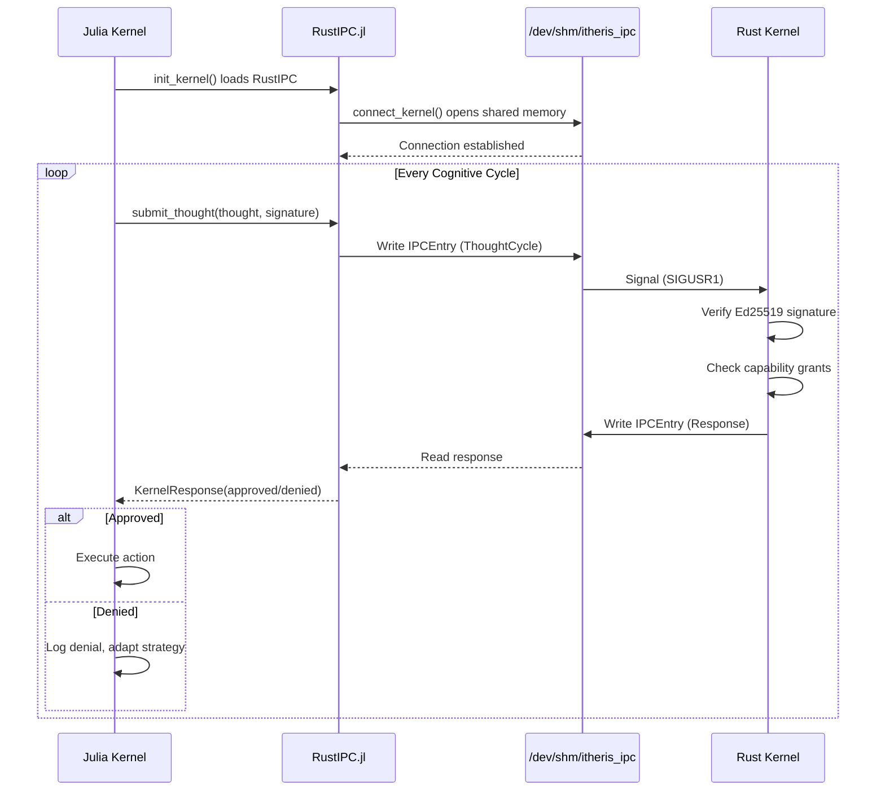

# Julia-Rust IPC Integration Plan

## Executive Summary

Activate the IPC connection between Julia Adaptive Kernel (Ring 3) and Rust Itheris Kernel (Ring 0) via shared memory at `/dev/shm/itheris_ipc`.

## Current Status

| Component | Status |
|-----------|--------|
| [`RustIPC.jl`](adaptive-kernel/kernel/ipc/RustIPC.jl:1) | Implemented, not loaded |
| [`ipc/mod.rs`](Itheris/Brain/Src/ipc/mod.rs:1) | Implemented, commented out in boot |
| [`KernelState`](adaptive-kernel/kernel/Kernel.jl:263) | No IPC connection field |
| [`init_kernel()`](adaptive-kernel/kernel/Kernel.jl:360) | No IPC initialization |

## Architecture

```mermaid
flowchart TB
    subgraph "Rust Kernel (Ring 0)"
        K[ItherisKernel]
        Crypto[Ed25519 Verification]
        Ledger[Immutable Ledger]
    end
    
    subgraph "Julia Kernel (Ring 3)"
        KB[Kernel.jl]
        IPC[RustIPC.jl]
        Brain[Brain / Cognition]
    end
    
    subgraph "IPC Bridge"
        SHM["/dev/shm/itheris_ipc<br/>16MB Ring Buffer"]
    end
    
    KB -->|1. Include RustIPC| IPC
    IPC -->|2. RustIPC.init()| SHM
    Brain -->|3. submit_thought| IPC
    IPC -->|4. Write ThoughtCycle| SHM
    SHM -->|5. Read Response| IPC
    IPC -->|6. Approve/Deny| Brain
    
    K -->|Verify| Crypto
    K -->|Log| Ledger
```

## Implementation Steps

### Phase 1: Julia-Side Integration

#### Step 1: Add RustIPC.jl include to Kernel.jl

File: `adaptive-kernel/kernel/Kernel.jl`

Add after existing includes (around line 17):

```julia
# Import RustIPC for Ring 0 communication
include(joinpath(@__DIR__, "ipc", "RustIPC.jl"))
using .RustIPC
```

#### Step 2: Add ipc_connection field to KernelState

File: `adaptive-kernel/kernel/Kernel.jl` lines 263-304

Add new field to `mutable struct KernelState`:

```julia
# IPC connection to Rust Ring 0 kernel
ipc_connection::Union{KernelConnection, Nothing}
```

#### Step 3: Initialize IPC in init_kernel()

File: `adaptive-kernel/kernel/Kernel.jl` line 424-429

Modify kernel initialization:

```julia
# Initialize IPC connection to Rust kernel
ipc_conn = RustIPC.init()

kernel = KernelState(...)
kernel.ipc_connection = ipc_conn
```

#### Step 4: Create IPC helper functions

File: `adaptive-kernel/kernel/Kernel.jl` - new section

```julia
# ============================================================================
# Rust Kernel IPC Interface
# ============================================================================

"""
    submit_to_rust(kernel::KernelState, thought::ThoughtCycle)::KernelResponse

Submit a thought cycle to Rust kernel for sovereign verification.
Returns approval/denial with cryptographic signature.
"""
function submit_to_rust(kernel::KernelState, thought::ThoughtCycle)::KernelResponse
    if kernel.ipc_connection === nothing
        return KernelResponse(false, "IPC not connected", UInt8[])
    end
    
    # Sign the thought with Julia kernel identity
    signature = sign_thought(thought, get_julia_identity())
    
    # Submit to Rust kernel
    RustIPC.submit_thought(kernel.ipc_connection, thought, signature)
end

"""
    check_rust_health(kernel::KernelState)::Bool

Check if Rust kernel is alive and responding.
"""
function check_rust_health(kernel::KernelState)::Bool
    if kernel.ipc_connection === nothing
        return false
    end
    RustIPC.health_check(kernel.ipc_connection)
end
```

#### Step 5: Modify step_once() for Rust integration

File: `adaptive-kernel/kernel/Kernel.jl` - find step_once function

Add thought cycle submission before action execution:

```julia
# Submit thought cycle to Rust kernel for verification
thought = ThoughtCycle(
    "JULIA_ADAPTIVE",
    action.capability_id,
    Dict("proposal_id" => action.proposal_id),
    now(),
    randstring(32)
)

response = submit_to_rust(kernel, thought)

# Only proceed if Rust approves
if !response.approved
    @warn "Rust kernel denied action" reason=response.reason
    # Fall back to local decision
end
```

#### Step 6: Add fallback logic

File: `adaptive-kernel/kernel/Kernel.jl`

When Rust kernel unavailable, continue in fallback mode:

```julia
if kernel.ipc_connection === nothing
    @warn "Running in fallback mode - Rust kernel not connected"
    # Use local FlowIntegrity gate instead
end
```

### Phase 2: Rust-Side Activation

#### Step 7: Enable IPC in boot.rs

File: `Itheris/Brain/Src/boot.rs` lines 45-47

Uncomment IPC initialization:

```rust
#[cfg(feature = "bare-metal")]
pub fn init_ipc() {
    println!("[BOOT] Initializing IPC...");
    let _ipc = ipc::ring_buffer::IpcRingBuffer::new();
}
```

#### Step 8: Enable IPC listener in main.rs

File: `Itheris/Brain/Src/main.rs`

Add shared memory listener:

```rust
fn spawn_ipc_listener(kernel: &ItherisKernel) {
    std::thread::spawn(|| {
        let shm = ShmRegion::open("/dev/shm/itheris_ipc");
        loop {
            if let Some(entry) = shm.poll() {
                let decision = kernel.enforce(&entry)?;
                shm.write_response(decision);
            }
        }
    });
}
```

### Phase 3: Startup Coordination

#### Step 9: Create startup script

File: `run_dual_kernel.sh`

```bash
#!/bin/bash
# Start Rust kernel first ( Ring 0)
echo "Starting Rust Itheris Kernel..."
cd Itheris/Brain && cargo run --release &
RUST_PID=$!

# Wait for shared memory to be ready
sleep 2

# Start Julia kernel (Ring 3)
echo "Starting Julia Adaptive Kernel..."
cd /home/user/projectx
julia --project=. run_kernel.jl &
JULIA_PID=$!

# Wait for both
wait $JULIA_PID
kill $RUST_PID
```

## Data Flow



## Configuration

### Identity Setup

```julia
# Julia kernel identity (registered with Rust kernel)
const JULIA_IDENTITY = "JULIA_ADAPTIVE"

# Ed25519 key pair - in production load from secure storage
JULIA_PRIVATE_KEY = load_or_generate_key()
```

### Shared Memory Configuration

| Parameter | Value |
|-----------|-------|
| Path | `/dev/shm/itheris_ipc` |
| Size | 16MB |
| Ring Buffer | 256 entries |
| Entry Size | 4240 bytes |
| Protocol | Ed25519 + SHA-256 + CRC32 |

## Error Handling

| Scenario | Behavior |
|----------|----------|
| Rust kernel not running | Fall back to local FlowIntegrity |
| Shared memory unavailable | Log warning, continue without verification |
| Signature verification fails | Deny action, log to ledger |
| IPC timeout | Retry 3x, then fallback |

## Testing Checklist

- [ ] Rust kernel starts and creates shared memory
- [ ] Julia kernel connects to shared memory
- [ ] Thought cycle submits successfully
- [ ] Rust kernel verifies and responds
- [ ] Approval/denial flows correctly
- [ ] Fallback mode works when Rust unavailable
- [ ] End-to-end cognitive cycle works
