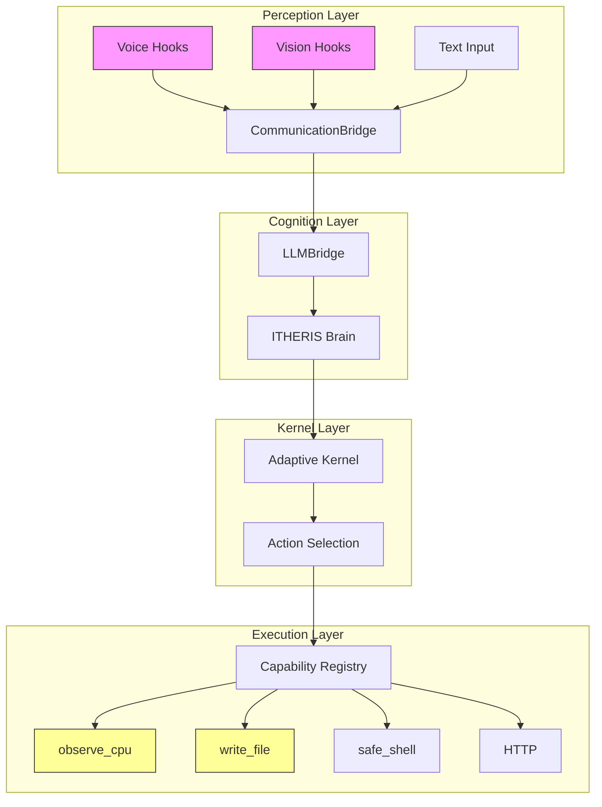
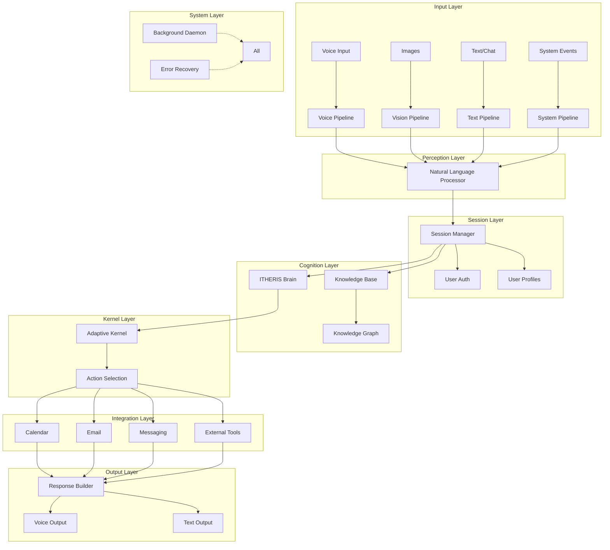
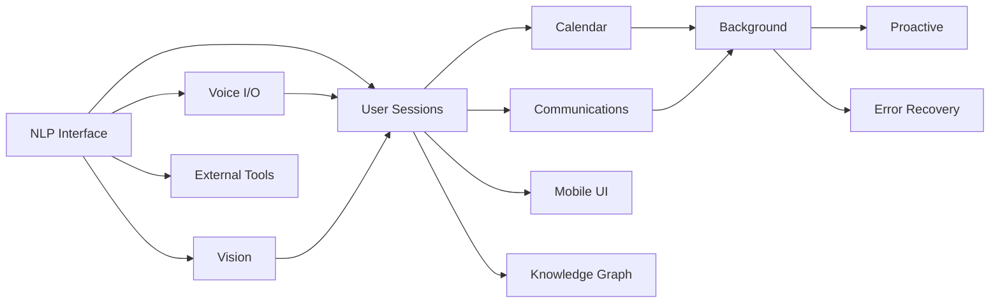

# Personal Assistant System Gap Analysis and Implementation Plan

**Generated:** 2026-02-26  
**Status:** ARCHITECTURAL PLANNING DOCUMENT  
**Classification:** IMPLEMENTATION ROADMAP

---

## Executive Summary

The current codebase (adaptive-kernel + JARVIS) provides a robust **cognitive architecture** with:
- Adaptive Kernel for sovereign decision-making
- ITHERIS neural brain with proper boundary enforcement
- Goal management and metacognition
- Basic capability registry (7 capabilities)

However, the system lacks the **peripheral integrations** and **consumer-facing features** required for a production-ready personal assistant. This document outlines the implementation plan to bridge these gaps.

---

## Current State Assessment

### Implemented Components

| Component | Status | Location |
|-----------|--------|----------|
| Adaptive Kernel | Production-ready | `adaptive-kernel/kernel/Kernel.jl` |
| ITHERIS Brain | Production-ready | `adaptive-kernel/brain/Brain.jl` |
| Capability Registry | Basic (7 capabilities) | `adaptive-kernel/registry/capability_registry.json` |
| Trust Classification | Implemented (5 levels) | `jarvis/src/types.jl` |
| Memory System | Semantic + Vector | `jarvis/src/memory/` |
| CommunicationBridge | Hooks exist | `jarvis/src/bridge/CommunicationBridge.jl` |
| Task Orchestration | Basic | `jarvis/src/orchestration/TaskOrchestrator.jl` |

### Architecture Diagram - Current State



---

## Gap Analysis

### Priority 1: Core I/O Integrations (Essential)

#### 1. Natural Language Interface
- **Current**: LLMBridge exists, basic prompt engineering
- **Missing**: Full NLP pipeline with intent classification, entity extraction, sentiment analysis
- **Impact**: Critical - blocks natural conversation
- **Dependencies**: None (foundational)

#### 2. Voice I/O (STT/TTS)
- **Current**: CommunicationBridge has hooks for Whisper/ElevenLabs
- **Missing**: Actual STT/TTS implementation
- **Impact**: High - blocks voice interaction
- **Dependencies**: Natural Language Interface

#### 3. Vision/Image Understanding
- **Current**: VLM hooks in CommunicationBridge
- **Missing**: Actual image processing integration
- **Impact**: High - blocks visual input
- **Dependencies**: Natural Language Interface

### Priority 2: User Experience (High)

#### 4. Persistent User Sessions
- **Current**: Basic trust levels (TRUST_BLOCKED → TRUST_FULL)
- **Missing**: User authentication, multi-user support, session continuity, user profiles
- **Impact**: High - blocks personalization
- **Dependencies**: None

#### 5. Calendar & Scheduling
- **Current**: TaskOrchestrator exists
- **Missing**: Temporal scheduling, reminders, calendar integration
- **Impact**: High - blocks proactive assistance
- **Dependencies**: Natural Language Interface

#### 6. Communication Platforms
- **Current**: None
- **Missing**: Email (Gmail), messaging (Slack/Discord), notifications
- **Impact**: Medium - blocks multi-channel interaction
- **Dependencies**: Natural Language Interface, User Sessions

### Priority 3: System Operations (Medium)

#### 7. Continuous Background Operation
- **Current**: Runs in cycles via harness
- **Missing**: Daemon mode, system tray, autostart
- **Impact**: Medium - blocks 24/7 operation
- **Dependencies**: None

#### 8. Mobile/Web Interface
- **Current**: JarvisDashboard (React)
- **Missing**: Mobile apps (iOS/Android), web portal
- **Impact**: Medium - blocks consumer access
- **Dependencies**: User Sessions

### Priority 4: Intelligence Enhancements (Long-term)

#### 9. Proactive Intelligence
- **Current**: Reactive to prompts
- **Missing**: Pattern recognition, preference inference, predictive assistance
- **Impact**: Medium - differentiates from basic assistants
- **Dependencies**: User Sessions, Memory System

#### 10. Knowledge Graph
- **Current**: VectorMemory for semantic storage
- **Missing**: Relational knowledge representation, entity relationships
- **Impact**: Medium - enables reasoning
- **Dependencies**: Natural Language Interface

### Priority 5: Infrastructure (Ongoing)

#### 11. External Tool Integrations
- **Current**: Basic sandboxed capabilities
- **Missing**: File management, code execution, database connections, API integrations
- **Impact**: High - limits functionality
- **Dependencies**: None

#### 12. Robust Error Recovery
- **Current**: Basic try-catch
- **Missing**: Circuit breakers, retry logic, fallback strategies, human escalation
- **Impact**: High - affects reliability
- **Dependencies**: None

---

## Implementation Plan

### Phase 1: Foundation (Weeks 1-4)

**Goal**: Enable natural language conversation as the primary interface

#### 1.1 Natural Language Interface Pipeline

```
┌─────────────────────────────────────────────────────────────────┐
│                    NLP Pipeline Architecture                    │
├─────────────────────────────────────────────────────────────────┤
│                                                                 │
│  User Input                                                     │
│      │                                                          │
│      ▼                                                          │
│  ┌─────────────┐    ┌─────────────┐    ┌─────────────┐       │
│  │   Tokenize  │───▶│    Parse     │───▶│   Intent    │       │
│  │             │    │              │    │  Classifier │       │
│  └─────────────┘    └─────────────┘    └──────┬──────┘       │
│                                                │               │
│                                                ▼               │
│                   ┌─────────────┐    ┌─────────────┐         │
│                   │   Entity    │◀───│    Chain    │         │
│                   │  Extractor  │    │   Builder   │         │
│                   └──────┬──────┘    └─────────────┘         │
│                          │                                     │
│                          ▼                                     │
│                   ┌─────────────┐    ┌─────────────┐         │
│                   │   Context   │───▶│   Action    │         │
│                   │   Manager   │    │   Planner   │         │
│                   └─────────────┘    └─────────────┘         │
│                                                                 │
└─────────────────────────────────────────────────────────────────┘
```

**Deliverables**:
- [ ] Intent classifier module (`adaptive-kernel/nlp/IntentClassifier.jl`)
- [ ] Entity extraction module (`adaptive-kernel/nlp/EntityExtractor.jl`)
- [ ] Context manager for multi-turn dialogue (`adaptive-kernel/nlp/ContextManager.jl`)
- [ ] Sentiment analyzer (`adaptive-kernel/nlp/SentimentAnalyzer.jl`)
- [ ] Integration with LLMBridge for prompt construction

**Implementation Steps**:
1. Create `adaptive-kernel/nlp/` directory structure
2. Implement rule-based intent classifier (initial), ML-based (later)
3. Build entity extraction using pattern matching + NER
4. Create context window management (last N turns)
5. Integrate with existing LLMBridge

#### 1.2 User Session Management

**Deliverables**:
- [ ] User authentication module (`jarvis/src/auth/`)
- [ ] Session manager with JWT/tokens (`jarvis/src/auth/SessionManager.jl`)
- [ ] User profile storage (`jarvis/src/auth/UserProfile.jl`)
- [ ] Preference storage per user (`jarvis/src/auth/Preferences.jl`)

**Implementation Steps**:
1. Define user database schema (SQLite initially)
2. Implement password hashing and JWT generation
3. Create session lifecycle management
4. Build user preference CRUD operations
5. Integrate trust levels with user authentication

### Phase 2: Multimodal I/O (Weeks 5-8)

**Goal**: Enable voice and vision interactions

#### 2.1 Voice I/O (STT/TTS)

```
┌─────────────────────────────────────────────────────────────────┐
│                      Voice Pipeline                             │
├─────────────────────────────────────────────────────────────────┤
│                                                                 │
│  Microphone ──▶ Audio Capture ──▶ VAD ──▶ STT ──▶ Text         │
│                                                                 │
│  Text ──▶ TTS ──▶ Audio Buffer ──▶ Speaker Output              │
│                                                                 │
│  Providers:                                                    │
│  - STT: OpenAI Whisper, Coqui STT                             │
│  - TTS: ElevenLabs, Coqui TTS, OpenAI TTS                    │
│                                                                 │
└─────────────────────────────────────────────────────────────────┘
```

**Deliverables**:
- [ ] STT integration (`jarvis/src/voice/STT.jl`)
- [ ] TTS integration (`jarvis/src/voice/TTS.jl`)
- [ ] Audio capture/playback (`jarvis/src/voice/AudioIO.jl`)
- [ ] Voice activity detection (`jarvis/src/voice/VAD.jl`)
- [ ] Voice configuration UI

#### 2.2 Vision/Image Understanding

**Deliverables**:
- [ ] Image capture from camera/screenshot (`jarvis/src/vision/ImageCapture.jl`)
- [ ] VLM integration for image analysis (`jarvis/src/vision/VLMClient.jl`)
- [ ] OCR for document understanding (`jarvis/src/vision/OCR.jl`)
- [ ] Vision configuration and gallery

### Phase 3: Productivity Features (Weeks 9-12)

**Goal**: Enable calendar, communications, and task management

#### 3.1 Calendar & Scheduling

**Deliverables**:
- [ ] Calendar data model (`jarvis/src/calendar/Calendar.jl`)
- [ ] Google Calendar integration (`jarvis/src/calendar/GoogleCalendar.jl`)
- [ ] Reminder system (`jarvis/src/calendar/Reminders.jl`)
- [ ] Scheduling assistant (find meeting times)
- [ ] Time-based task triggers

#### 3.2 Communication Platforms

**Deliverables**:
- [ ] Email client (`jarvis/src/comm/EmailClient.jl`)
  - Gmail API integration
  - Send/read emails
  - Email summarization
- [ ] Messaging integrations (`jarvis/src/comm/Messaging.jl`)
  - Slack integration
  - Discord integration
- [ ] Notification router (`jarvis/src/comm/Notifications.jl`)

### Phase 4: System Integration (Weeks 13-16)

**Goal**: Enable background operation and external integrations

#### 4.1 Background Operation (Daemon Mode)

**Deliverables**:
- [ ] System service/daemon implementation (`jarvis/daemon/`)
- [ ] System tray icon and menu
- [ ] Autostart configuration
- [ ] Event-driven wake triggers
- [ ] Background task queue

#### 4.2 External Tool Integrations

**Deliverables**:
- [ ] File management capabilities (`jarvis/src/tools/FileManager.jl`)
- [ ] Code execution environment (`jarvis/src/tools/CodeRunner.jl`)
- [ ] Database connectors (`jarvis/src/tools/Databases.jl`)
  - SQLite, PostgreSQL support
- [ ] External APIs (`jarvis/src/tools/ExternalAPIs.jl`)
  - Weather
  - News
  - Stocks
  - Wikipedia

### Phase 5: Intelligence Enhancements (Weeks 17-20)

**Goal**: Enable proactive assistance and knowledge reasoning

#### 5.1 Proactive Intelligence

**Deliverables**:
- [ ] User behavior pattern analyzer
- [ ] Preference learning system
- [ ] Predictive suggestion engine
- [ ] Habit tracking

#### 5.2 Knowledge Graph

**Deliverables**:
- [ ] Knowledge graph storage (`jarvis/src/knowledge/Graph.jl`)
- [ ] Entity relationship extraction
- [ ] Fact tracking and verification
- [ ] Semantic query interface

### Phase 6: Reliability & UI (Weeks 21-24)

**Goal**: Ensure production readiness

#### 6.1 Error Recovery

**Deliverables**:
- [ ] Circuit breaker pattern
- [ ] Retry logic with exponential backoff
- [ ] Fallback strategies for each integration
- [ ] Human escalation pathways
- [ ] Comprehensive logging and monitoring

#### 6.2 Mobile/Web Interface

**Deliverables**:
- [ ] Mobile app (React Native or Flutter)
- [ ] Web portal improvements
- [ ] Push notification support
- [ ] Offline capability

---

## Detailed Implementation Checklist

### Phase 1: Foundation

- [ ] **1.1.1** Create NLP module directory structure
- [ ] **1.1.2** Implement text tokenizer and normalizer
- [ ] **1.1.3** Build intent classifier with 20+ common intents
- [ ] **1.1.4** Create entity extractor for dates, times, locations, names
- [ ] **1.1.5** Implement context manager for 10-turn history
- [ ] **1.1.6** Add sentiment analysis (positive/negative/neutral)
- [ ] **1.1.7** Integrate NLP with LLMBridge prompts
- [ ] **1.2.1** Design user database schema
- [ ] **1.2.2** Implement user registration and login
- [ ] **1.2.3** Create session management with JWT
- [ ] **1.2.4** Build user profile CRUD operations
- [ ] **1.2.5** Implement preference storage system

### Phase 2: Multimodal I/O

- [ ] **2.1.1** Set up audio capture library (PortAudio)
- [ ] **2.1.2** Implement Whisper STT integration
- [ ] **2.1.3** Implement ElevenLabs TTS integration
- [ ] **2.1.4** Create voice activity detection
- [ ] **2.1.5** Build audio playback buffer
- [ ] **2.1.6** Add wake word detection (optional)
- [ ] **2.2.1** Create image capture from camera
- [ ] **2.2.2** Implement screenshot capture
- [ ] **2.2.3** Integrate GPT-4V for image analysis
- [ ] **2.2.4** Add OCR for document processing
- [ ] **2.2.5** Create image gallery management

### Phase 3: Productivity

- [ ] **3.1.1** Design calendar data model
- [ ] **3.1.2** Implement Google Calendar OAuth and API
- [ ] **3.1.3** Build event creation and modification
- [ ] **3.1.4** Create reminder system with notifications
- [ ] **3.1.5** Implement scheduling assistant algorithm
- [ ] **3.2.1** Set up Gmail API integration
- [ ] **3.2.2** Implement email send functionality
- [ ] **3.2.3** Add email read and summarize
- [ ] **3.2.4** Create Slack bot integration
- [ ] **3.2.5** Implement notification routing

### Phase 4: System Integration

- [ ] **4.1.1** Design daemon service architecture
- [ ] **4.1.2** Implement system tray functionality
- [ ] **4.1.3** Add autostart configuration
- [ ] **4.1.4** Create event-driven wake system
- [ ] **4.1.5** Implement background task queue
- [ ] **4.2.1** Expand file management capabilities
- [ ] **4.2.2** Create secure code execution environment
- [ ] **4.2.3** Implement database connectors
- [ ] **4.2.4** Add external API integrations

### Phase 5: Intelligence

- [ ] **5.1.1** Build behavior pattern analyzer
- [ ] **5.1.2** Implement preference learning
- [ ] **5.1.3** Create suggestion engine
- [ ] **5.1.4** Add habit tracking
- [ ] **5.2.1** Design knowledge graph schema
- [ ] **5.2.2** Implement entity extraction
- [ ] **5.2.3** Create relationship inference
- [ ] **5.2.4** Build semantic query interface

### Phase 6: Reliability & UI

- [ ] **6.1.1** Implement circuit breaker pattern
- [ ] **6.1.2** Add retry logic with backoff
- [ ] **6.1.3** Create fallback strategies
- [ ] **6.1.4** Implement comprehensive logging
- [ ] **6.1.5** Add monitoring and alerts
- [ ] **6.2.1** Build mobile app framework
- [ ] **6.2.2** Implement core mobile features
- [ ] **6.2.3** Add push notifications
- [ ] **6.2.4** Implement offline support

---

## Technical Architecture - Target State



---

## Risk Assessment

| Gap | Risk Level | Mitigation |
|-----|------------|-------------|
| Voice I/O | Medium | Start with text, add voice incrementally |
| External APIs | High | Use official SDKs, implement rate limiting |
| User Sessions | Medium | Use established auth patterns (JWT, OAuth) |
| Background Operation | Medium | Cross-platform service frameworks |
| Error Recovery | High | Extensive testing, gradual rollout |
| Mobile Apps | High | Consider cross-platform framework |

---

## Dependencies Graph



---

## Success Metrics

| Phase | Metric | Target |
|-------|--------|--------|
| Phase 1 | NLP intent accuracy | >85% |
| Phase 1 | Session startup time | <2s |
| Phase 2 | Voice latency (STT+TTS) | <1s |
| Phase 2 | Vision query accuracy | >90% |
| Phase 3 | Calendar sync reliability | 99.9% |
| Phase 4 | Daemon uptime | 99.5% |
| Phase 5 | Suggestion relevance | >70% |
| Phase 6 | Error recovery time | <30s |

---

## Recommended Implementation Order

1. **Natural Language Interface** (foundational - all other features depend on it)
2. **User Sessions** (enables personalization)
3. **Voice I/O** (high-impact feature for consumer adoption)
4. **Vision** (completes multimodal input)
5. **Calendar & Scheduling** (high-utility productivity feature)
6. **Communication Platforms** (email, messaging)
7. **Background Operation** (enables 24/7 availability)
8. **External Tools** (expands capabilities)
9. **Error Recovery** (ensures reliability)
10. **Knowledge Graph** (enables advanced reasoning)
11. **Proactive Intelligence** (differentiator)
12. **Mobile/Web UI** (consumer access)

---

## Conclusion

The current adaptive-kernel + JARVIS system provides a solid cognitive foundation. The implementation plan above addresses all 12 identified gaps in a prioritized, phased approach:

- **Phase 1 (Foundation)**: Natural language interface and user sessions
- **Phase 2 (Multimodal I/O)**: Voice and vision capabilities
- **Phase 3 (Productivity)**: Calendar and communications
- **Phase 4 (System Integration)**: Background operation and tools
- **Phase 5 (Intelligence)**: Proactive features and knowledge graph
- **Phase 6 (Reliability & UI)**: Error recovery and mobile apps

The core cognitive architecture is production-ready; the focus should be on building out the I/O and user experience layers in an incremental, testable manner.
