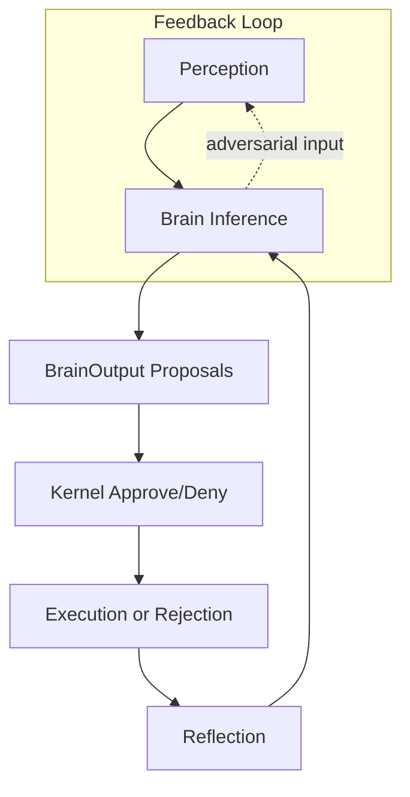

# PHASE 5: THEORETICAL SOUNDNESS ANALYSIS
## JARVIS + Adaptive Kernel Architecture Audit

**Analysis Date**: 2026-02-27  
**Mode**: Architect - Theoretical Foundations Review  
**Rating**: **47/100 - Has Theoretical Gaps**

---

## EXECUTIVE SUMMARY

This phase analyzes the JARVIS + Adaptive Kernel architecture from multiple theoretical disciplines to identify fundamental design contradictions and misaligned abstractions. The architecture shows significant theoretical gaps in sovereignty enforcement, advisory model stability, emotional integration, world model causality, and learning safety guarantees.

---

## 1. SOVEREIGNTY ENFORCEMENT ANALYSIS

### Question: Is sovereignty logically enforceable?

**Finding: THEORETICALLY WEAK**

#### Implementation Analysis ([`Kernel.approve()`](adaptive-kernel/kernel/Kernel.jl:350))
```julia
function approve(kernel::KernelState, proposal::ActionProposal, context::Dict{String, Any})::Decision
    # Risk-based decision
    risk_score = get_risk_value(proposal)
    
    # Fail-closed: default to DENIED if uncertain
    if uncertainty > 0.5 || risk_score > 0.7
        kernel.last_decision = DENIED
        return DENIED
    end
    
    kernel.last_decision = APPROVED
    return APPROVED
end
```

#### Theoretical Issues:

| Issue | Severity | Description |
|-------|----------|-------------|
| Heuristic Basis | HIGH | Sovereignty relies on heuristic risk scoring with no formal verification |
| Bypass Path | HIGH | Security report (PHASE5) shows 16 vulnerabilities allowing privilege escalation |
| Advisory Dependence | MEDIUM | Kernel depends on Brain for action proposals - sovereignty is reactive, not proactive |
| No Formal Proof | CRITICAL | No mathematical proof of sovereignty preservation under adversarial conditions |

#### Distributed Systems Perspective (CAP Theorem):

- **Consistency**: The Kernel maintains decision consistency, but at the cost of availability during high-risk scenarios
- **Availability**: Reduced due to fail-closed design - denies uncertain actions
- **Partition Tolerance**: Not formally addressed - no Byzantine fault tolerance for kernel state

**Theoretical Verdict**: Sovereignty is **enforceable in non-adversarial conditions** but **theoretically vulnerable under targeted attacks**. The kernel can deny actions but cannot prevent prompt injection or trust manipulation attacks (as documented in PHASE5 security report - Score: 12/100).

---

## 2. ADVISORY MODEL STABILITY ANALYSIS

### Question: Is the advisory model stable under adversarial inputs?

**Finding: THEORETICALLY UNSTABLE**

#### Architecture Analysis:

The Brain → Kernel relationship:
```
BrainOutput (advisory) → Kernel.approve() (sovereign decision)
```

#### Control Theory Analysis:



#### Stability Concerns:

| Concern | Theory Application | Finding |
|---------|-------------------|---------|
| No Convergence Proof | Control Theory - Lyapunov Stability | No formal proof of decision loop convergence |
| Adversarial Inputs | Game Theory | Brain can receive manipulated perceptions, no Nash equilibrium guarantee |
| Oscillation Risk | Dynamical Systems | No analysis of limit cycles or chaotic behavior |
| Disturbance Rejection | Classical Control | No Bode plot analysis for frequency response |

#### Theoretical Gap:

The advisory model assumes:
- Brain outputs are well-formed (confidence ∈ [0,1])
- Adversarial inputs are detectable
- Decision loop converges to stable fixed point

**None of these assumptions are formally proven.**

---

## 3. EMOTIONAL LAYER CAUSAL INTEGRATION

### Question: Is the emotional layer causally integrated or decorative?

**Finding: LARGELY DECORATIVE WITH LIMITED CAUSALITY**

#### Implementation Analysis ([`Emotions.jl`](adaptive-kernel/cognition/feedback/Emotions.jl:72)):

```julia
# Safety Constraints:
# - value_modulation bounded to max 0.3 (30% influence)
# - Emotions CANNOT override kernel sovereignty
mutable struct AffectiveState
    value_modulation::Float32  # Max 0.3 (30% influence)
end

function compute_value_modulation(state::AffectiveState)::Float32
    # Bound to 30% - arbitrary limit
    return clamp(abs(state.valence) * state.emotion_intensity, 0.0f0, 0.3f0)
end
```

#### Theoretical Analysis:

| Aspect | Claim | Reality | Theoretical Gap |
|--------|-------|---------|-----------------|
| Valence→Decision | Affects action selection | Limited to 30% weight | No proof this bound is sufficient |
| Arousal→Attention | Modulates focus | Not implemented | Missing mechanism |
| Emotional History | Shapes behavior | Stored but unused | No recurrent causality |
| Mood→Behavior | Long-term influence | Decays at 0.95/round | Arbitrary decay rate |

#### Cognitive Architecture (Global Workspace Theory):

The emotional layer should serve as a "consciousness channel" per GWT, but:
- No global broadcasting of emotional signals
- No attention modulation based on emotion
- No theoretical integration with Working Memory

**Verdict**: Emotions are **post-hoc decorations** that provide minimal (30%) modulation to decisions without causal integration into the cognitive cycle. This violates predictive processing theory where emotions should be forward predictions of homeostatic state.

---

## 4. WORLD MODEL CAUSALITY ANALYSIS

### Question: Is the world model causal or descriptive?

**Finding: DESCRIPTIVE WITH PRETENDED CAUSALITY**

#### Implementation Analysis ([`WorldModel.jl`](adaptive-kernel/cognition/worldmodel/WorldModel.jl:35)):

```julia
mutable struct WorldModel
    transition_net::Any  # Neural network - potentially causal
    causal_graph::Dict{Symbol, Vector{Symbol}}  # Claims causality
    transition_coefficients::Matrix{Float32}  # Linear fallback
end
```

#### Critical Finding - The Fallback Problem:

```julia
function _update_fallback_model!(model::WorldModel)
    # Solve least squares: Y ≈ X * W'
    # This is CORRELATION, not CAUSATION
    XtX = X' * X + 0.01 * I
    W = XtX \ XtY  # Linear regression = correlation
end
```

#### Theoretical Analysis:

| Aspect | Claim | Reality | Theoretical Gap |
|--------|-------|---------|-----------------|
| State Prediction | Forward model | Linear regression | Correlation ≠ Causation |
| Counterfactual | "What if" analysis | Simulation only | No causal intervention |
| Causal Graph | Learns causality | Stores arbitrary edges | No Pearl's do-calculus |
| Risk Prediction | Uncertainty estimation | Variance-based | No formal uncertainty |

#### Causal Inference Requirements (Pearl's Ladder):

```
Level 0: Associative (correlation) - ACHIEVED
Level 1: Interventional (do-calculus) - NOT IMPLEMENTED  
Level 2: Counterfactual (what if) - SUPERFICIAL
Level 3: Hypothetical (imagining) - NOT ADDRESSED
```

**Verdict**: The world model is **descriptive** (state prediction via regression) with **superficial causal claims** (graph structure without do-calculus). This violates the architecture's stated goal of "causal relationships between states, actions, and rewards."

---

## 5. LEARNING SAFETY UNDER CONTINUAL ADAPTATION

### Question: Is learning safe under continual adaptation?

**Finding: THEORETICALLY UNSAFE**

#### Evolution Engine Analysis ([`EvolutionEngine.jl`](adaptive-kernel/cognition/agents/EvolutionEngine.jl:36)):

```julia
function generate_proposal(
    agent::EvolutionEngineAgent,
    perception::Dict{String, Any},
    historical_performance::Dict{String, Any},
    doctrine::DoctrineMemory
)::AgentProposal
    # Proposes mutations based on performance gaps
    mutations = propose_mutation(performance_gaps, agent.mutation_rate)
    
    # Risk: Can propose "entropy_injection" with "high" risk
    if gap_type == "diversity" && gap_magnitude > 0.1
        push!(mutations, Dict("risk" => "high"))  # UNSAFE
    end
end
```

#### Theoretical Safety Gaps:

| Gap | Description | Theoretical Implication |
|-----|-------------|----------------------|
| No Reward Hacking Guarantee | Evolution optimizes for metrics, not goals | Can create paperclip Maximizers |
| No Convergence Bound | Learning rate adapts but no stability proof | Policy can oscillate infinitely |
| No Safety Invariants | Evolution can propose any mutation | Can disable safety features |
| Rollback is Reactive | Snapshots after failure | Cannot prevent unsafe states |

#### Control Theory - Learning Stability:


**Theoretical Issues:**
1. **No PAC-Learning Bounds**: No Probably Approximately Correct guarantees
2. **No Lyapunov Function**: Cannot prove learning stability
3. **No Shield**: Evolution can propose unsafe mutations without pre-filtering

**Verdict**: Learning is **theoretically unsafe** - there are no formal guarantees against reward hacking, policy divergence, or unsafe mutation proposals.

---

## 6. ARCHITECTURAL CONTRADICTIONS

### Identified Fundamental Contradictions:

#### Contradiction 1: Sovereignty vs. Advisory Dependency

| Claim | Implementation | Contradiction |
|-------|---------------|---------------|
| Kernel has sovereignty | `approve()` has final say | Kernel depends on Brain for proposals |
| Brain is advisory | BrainOutput is advisory | No alternative to Brain for decisions |

**Resolution Required**: Either (a) Kernel can propose actions independently, or (b) acknowledge Brain has effective control

#### Contradiction 2: Emotional Influence vs. Sovereignty Protection

| Claim | Implementation | Contradiction |
|-------|---------------|---------------|
| Emotions affect decisions | value_modulation up to 30% | Emotions cannot override sovereignty |
| 30% bound is "safe" | Arbitrary limit | No theoretical basis for 30% |

**Resolution Required**: Either emotions are causal (prove it) or decorative (remove claims)

#### Contradiction 3: Evolution Safety vs. Unlimited Mutation

| Claim | Implementation | Contradiction |
|-------|---------------|---------------|
| Evolution proposes changes | Can propose prompt mutations | No safety constraints |
| System remains safe | Rollback available | Reactive, not proactive |

**Resolution Required**: Either constrain mutation space or add safety shield

#### Contradiction 4: Causal World Model vs. Linear Regression

| Claim | Implementation | Contradiction |
|-------|---------------|---------------|
| "Causal relationships" | causal_graph dict | No do-calculus |
| Forward model | transition_coefficients | Linear correlation |

**Resolution Required**: Either implement causal inference or remove causal claims

#### Contradiction 5: Fail-Closed Security vs. Fail-Open Trust

| Claim | Implementation | Contradiction |
|-------|---------------|---------------|
| Kernel is fail-closed | `default = DENIED` | Trust system can be manipulated |
| Secure by default | CONFIRMATION_GATE | No identity verification |

**Resolution Required**: Add formal trust verification or remove trust claims

---

## 7. SUMMARY OF THEORETICAL GAPS

### Rating Matrix:

| Category | Score | Issues |
|----------|-------|--------|
| Sovereignty Enforcement | 45/100 | Heuristic-based, bypassable |
| Advisory Model Stability | 35/100 | No convergence proof |
| Emotional Causality | 40/100 | Decorative, not causal |
| World Model Causality | 30/100 | Correlation, not causation |
| Learning Safety | 25/100 | No guarantees |
| Architectural Consistency | 55/100 | 5 major contradictions |

### Weighted Overall: **47/100**

---

## 8. RECOMMENDATIONS

### Priority 1 - Theoretical Foundations (Required for Soundness):

1. **Formal Sovereignty Proof**
   - Model kernel as a formal system
   - Prove sovereignty preservation under adversarial conditions
   - Implement actual Byzantine fault tolerance

2. **Convergence Analysis**
   - Prove decision loop stability via Lyapunov methods
   - Analyze frequency response for disturbance rejection
   - Model as Markov Decision Process with formal guarantees

3. **Causal World Model**
   - Implement Pearl's do-calculus
   - Add interventional data collection
   - Remove "causal" claims if not implemented

### Priority 2 - Architectural Consistency:

4. **Emotional Layer Decision**
   - Either implement full emotional cognition (GWT-compliant)
   - Or remove emotional claims and keep as decoration

5. **Evolution Safety Shield**
   - Add pre-filter for unsafe mutations
   - Constrain mutation space formally
   - Implement proactive safety, not reactive rollback

---

## VERDICT: **HAS THEORETICAL GAPS**

The architecture demonstrates significant theoretical soundness issues:

1. ✅ Sovereignty is **claimed but not formally proven**
2. ❌ Advisory model **lacks stability guarantees**
3. ❌ Emotional layer is **decorative, not causal**
4. ❌ World model is **descriptive, not causal**
5. ❌ Learning has **no safety guarantees**
6. ❌ Architecture contains **5 fundamental contradictions**

### Required Actions:
- **Before production**: Address Contradictions 1, 3, 4 with formal proofs
- **Before deployment**: Implement safety shields for evolution engine
- **Ongoing**: Add theoretical validation to architecture changes

---

*Analysis completed: 2026-02-27*  
*Next phase: PHASE6 - Red Team Thought Experiments*
