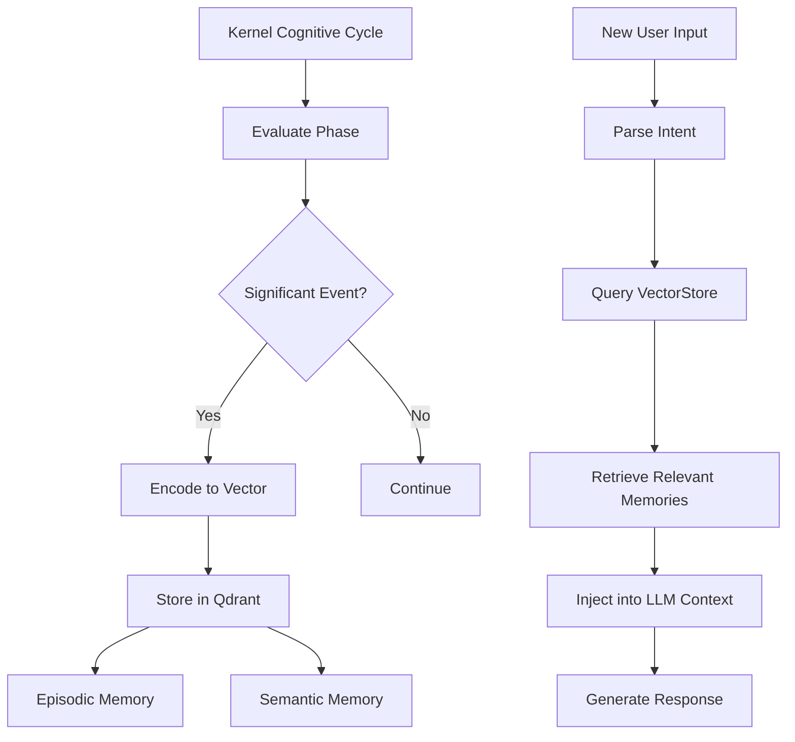
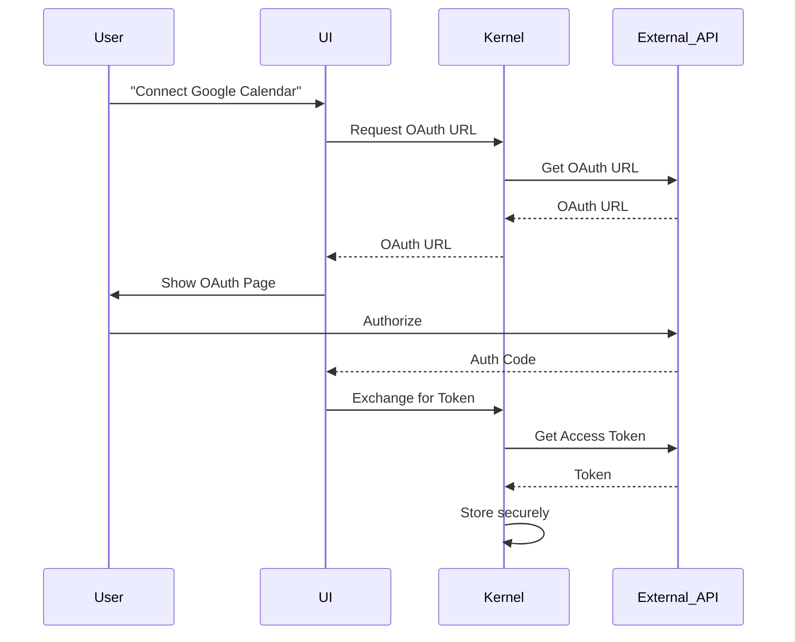
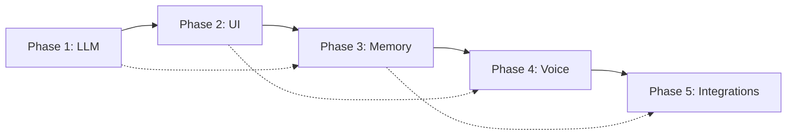

# ProjectX Personal Assistant Roadmap

## Executive Summary

This roadmap outlines the transformation of ProjectX from a cognitive kernel into a fully functioning personal assistant. The current architecture provides a solid foundation with cognitive cycles, security, and metacognition, but lacks the external interfaces needed for user interaction.

**Current Architecture:**
```
┌─────────────────────────────────────────────────────────────────────────┐
│                        PROJECTX ARCHITECTURE                           │
├─────────────────────────────────────────────────────────────────────────┤
│                                                                         │
│  ┌─────────────┐         ┌─────────────┐         ┌─────────────┐     │
│  │  FLUTTER    │         │   RUST      │         │    JULIA    │     │
│  │  WEB UI     │◄───────►│   BRIDGE    │◄───────►│   KERNEL    │     │
│  │itheris_link │  WebSocket│itheris_shell│  UDS   │adaptive-kern│     │
│  └─────────────┘         └─────────────┘         └─────────────┘     │
│         │                       │                       │             │
│         │                       │                       │             │
│         ▼                       ▼                       ▼             │
│  ┌─────────────┐         ┌─────────────┐         ┌─────────────┐     │
│  │ Mock Data   │         │ Ed25519     │         │ Cognitive   │     │
│  │ (not conn.) │         │ Security    │         │ Cycle       │     │
│  └─────────────┘         └─────────────┘         └─────────────┘     │
│                                                          │             │
│                                                          ▼             │
│                                                 ┌─────────────┐     │
│                                                 │  VectorStore│     │
│                                                 │  (Qdrant)   │     │
│                                                 └─────────────┘     │
│  MISSING:                       MISSING:         MISSING:            │
│  • Real WebSocket server        • WebSocket      • LLM integration  │
│  • LLM response generation      • bridge         • Memory triggers  │
│  • Voice I/O                    • to WebSocket   • HTTP API          │
│                                                                         │
└─────────────────────────────────────────────────────────────────────────┘
```

---

## Phase 1: LLM Integration

### Overview
Connect the kernel to an LLM provider (Ollama/OpenAI/Anthropic) to enable natural language understanding and generation.

### What Needs to Be Built

1. **LLM Client Module** (`adaptive-kernel/llm/`)
   - Unified LLM interface supporting multiple providers
   - Provider adapters: OpenAI, Anthropic, Ollama
   - Request/response handling with streaming support
   - Token management and rate limiting

2. **Prompt Engineering** 
   - System prompt templates for assistant persona
   - Context injection from kernel state
   - Conversation history management
   - Tool use prompting for capability invocation

3. **Integration Points**
   - Hook into kernel's DECIDE phase for natural language output
   - Connect to EVALUATE phase for intent parsing
   - Add capability call generation from LLM responses

### Files to Modify/Create

| File | Action | Description |
|------|--------|-------------|
| `adaptive-kernel/llm/client.jl` | CREATE | LLM client with provider abstraction |
| `adaptive-kernel/llm/prompts.jl` | CREATE | Prompt templates and context builders |
| `adaptive-kernel/llm/openai.jl` | CREATE | OpenAI GPT adapter |
| `adaptive-kernel/llm/ollama.jl` | CREATE | Ollama local model adapter |
| `adaptive-kernel/kernel/Kernel.jl` | MODIFY | Hook LLM into cognitive cycle |
| `adaptive-kernel/cognition/spine/DecisionSpine.jl` | MODIFY | Add LLM response generation |
| `config.toml` | MODIFY | Add LLM configuration (already exists, needs validation) |

### Dependencies Required

- **Julia Packages:**
  - `HTTP.jl` (already in use)
  - `JSON.jl` (already in use)
  - `Sockets.jl` (already in use)
  - `uuids` (optional, for conversation IDs)

- **External Services:**
  - Ollama (local, optional) - http://localhost:11434
  - OpenAI API (cloud) - api.openai.com
  - Anthropic API (cloud) - api.anthropic.com

### Estimated Complexity: **MEDIUM**
- Requires understanding of kernel's cognitive cycle
- Multiple provider implementations needed
- Error handling and fallback strategies

---

## Phase 2: Connect UI to Kernel

### Overview
Establish real-time bidirectional communication between the Flutter web UI and the Julia kernel via WebSockets.

### Current State
- UI has `WebSocketService` and `KernelConnector` (but no server to connect to)
- Kernel has no HTTP/WebSocket server
- Bridge uses Unix Domain Sockets, not suitable for web clients

### What Needs to Be Built

1. **Kernel HTTP Server** (`adaptive-kernel/server/`)
   - HTTP/WebSocket server running alongside kernel
   - Endpoints for:
     - `GET /ws` - WebSocket upgrade for real-time thought stream
     - `POST /api/message` - Send messages to kernel
     - `GET /api/status` - Kernel health and state
   - Event broadcasting for cognitive cycle events

2. **Protocol Implementation**
   - Message format matching Flutter's `KernelMessage`
   - Thought event serialization
   - Authorization request/response flow

3. **Flutter Integration**
   - Update `KernelConnector` to connect to actual server
   - Remove mock data dependencies
   - Add reconnection logic

### Files to Modify/Create

| File | Action | Description |
|------|--------|-------------|
| `adaptive-kernel/server/HTTPServer.jl` | CREATE | HTTP/WebSocket server |
| `adaptive-kernel/server/routes.jl` | CREATE | API route handlers |
| `adaptive-kernel/server/websocket.jl` | CREATE | WebSocket message handling |
| `adaptive-kernel/server/events.jl` | CREATE | Event broadcasting system |
| `adaptive-kernel/kernel/Kernel.jl` | MODIFY | Integrate server lifecycle |
| `adaptive-kernel/kernel/Metacognition.jl` | MODIFY | Emit events to UI |
| `itheris_link/lib/core/services/kernel_connector.dart` | MODIFY | Connect to real server |
| `itheris_link/lib/core/services/websocket_service.dart` | MODIFY | Remove mock data |
| `itheris_link/lib/features/the_stream/presentation/bloc/stream_bloc.dart` | MODIFY | Use real messages |

### Architecture After Phase 2

```
┌─────────────────────────────────────────────────────────────────────────┐
│                     PHASE 2 ARCHITECTURE                                │
├─────────────────────────────────────────────────────────────────────────┤
│                                                                         │
│  ┌─────────────┐              ┌─────────────┐              ┌─────────┐│
│  │  FLUTTER    │   WebSocket  │    JULIA    │              │         ││
│  │  WEB UI     │◄────────────►│   SERVER    │◄────────────►│ KERNEL  ││
│  │itheris_link │              │   (NEW)     │              │         ││
│  └─────────────┘              └─────────────┘              └─────────┘│
│                                        │                                  │
│                                        │ HTTP/WS                         │
│                                        ▼                                  │
│                                 ┌─────────────┐                          │
│                                 │  Event      │                          │
│                                 │  Broadcast  │                          │
│                                 └─────────────┘                          │
│                                                                         │
└─────────────────────────────────────────────────────────────────────────┘
```

### Dependencies Required

- **Julia Packages:**
  - `HTTP.jl` (already in use)
  - `WebSockets.jl` - for WebSocket handling
  - `JSON.jl` (already in use)

- **Flutter Packages:**
  - `web_socket_channel` (already in use)
  - No new packages needed

### Estimated Complexity: **MEDIUM-HIGH**
- WebSocket protocol implementation
- Event synchronization between kernel and UI
- Session management and reconnection handling

---

## Phase 3: Persistent Memory Integration

### Overview
Connect the existing VectorStore.jl to the kernel's cognitive cycle for long-term memory and semantic recall.

### Current State
- `VectorStore.jl` exists with Qdrant integration
- Has embedding generation via Ollama
- Not integrated into kernel's memory system

### What Needs to Be Built

1. **Memory Integration Layer**
   - Connect VectorStore to kernel's working memory
   - Automatic memory encoding during cognitive cycles
   - Context retrieval for decision making

2. **Memory Types**
   - Episodic memory: Store significant events
   - Semantic memory: Store facts and knowledge
   - Procedural memory: Store learned capabilities

3. **Recall System**
   - Query kernel state for relevant memories
   - Inject recalled context into LLM prompts
   - Memory consolidation triggers

### Files to Modify/Create

| File | Action | Description |
|------|--------|-------------|
| `adaptive-kernel/memory/VectorStore.jl` | MODIFY | Add kernel integration hooks |
| `adaptive-kernel/memory/EpisodicMemory.jl` | CREATE | Episode storage and retrieval |
| `adaptive-kernel/memory/SemanticMemory.jl` | CREATE | Fact and knowledge storage |
| `adaptive-kernel/kernel/Kernel.jl` | MODIFY | Add memory system hooks |
| `adaptive-kernel/llm/prompts.jl` | MODIFY | Inject memory context |
| `config.toml` | MODIFY | Qdrant connection settings |

### Dependencies Required

- **Julia Packages:**
  - All VectorStore.jl dependencies (already present)
  
- **External Services:**
  - Qdrant (via docker-compose) - localhost:6333
  - Ollama for embeddings (if local) - localhost:11434

### Memory Flow



### Estimated Complexity: **MEDIUM**
- Qdrant integration already exists
- Need to design memory significance heuristics
- Embedding quality affects recall accuracy

---

## Phase 4: Voice I/O

### Overview
Add speech recognition (STT) and speech synthesis (TTS) for voice-based interaction.

### Current State
- `config.toml` has STT/TTS configuration
- No implementation code exists

### What Needs to Be Built

1. **Speech-to-Text (STT)**
   - OpenAI Whisper integration for transcription
   - Audio stream handling from Flutter
   - Language detection and processing

2. **Text-to-Speech (TTS)**
   - ElevenLabs integration (configured in config.toml)
   - OpenAI TTS as fallback
   - Streaming audio to Flutter client

3. **Audio Pipeline**
   - WebRTC or similar for real-time audio
   - Audio format conversion
   - Wake word detection (optional)

### Files to Modify/Create

| File | Action | Description |
|------|--------|-------------|
| `adaptive-kernel/audio/STT.jl` | CREATE | Speech-to-text module |
| `adaptive-kernel/audio/TTS.jl` | CREATE | Text-to-speech module |
| `adaptive-kernel/audio/Pipeline.jl` | CREATE | Audio processing pipeline |
| `adaptive-kernel/server/HTTPServer.jl` | MODIFY | Add audio endpoints |
| `adaptive-kernel/llm/client.jl` | MODIFY | Stream TTS audio |
| `itheris_link/lib/core/services/audio_service.dart` | CREATE | Flutter audio handling |
| `itheris_link/lib/features/voice/` | CREATE | Voice input UI |

### Dependencies Required

- **Julia Packages:**
  - `HTTP.jl` for API calls
  - `LibSerialPort.jl` (optional, for audio devices)
  
- **Flutter Packages:**
  - `record` - audio recording
  - `just_audio` - audio playback
  - `speech_to_text` - platform STT

- **External Services:**
  - OpenAI Whisper API (or local Whisper)
  - ElevenLabs API (configured)
  - Optional: Coqui STT (self-hosted)

### Estimated Complexity: **HIGH**
- Real-time audio streaming challenges
- Multiple service integrations
- Platform-specific audio handling

---

## Phase 5: Personal Assistant Integrations

### Overview
Connect to user's digital life: calendar, email, reminders, and other services.

### Current State
- docker-compose has Finance MCP (port 3000) and GitHub MCP (port 3001)
- Kernel has existing capabilities for GitHub and Finance

### What Needs to Be Built

1. **Calendar Integration**
   - Google Calendar API / Outlook API
   - Event creation, reading, updates
   - Availability checking

2. **Email Integration**
   - Gmail API / IMAP integration
   - Send, read, search emails
   - Attachment handling

3. **Reminders/Todos**
   - Task creation and management
   - Due date handling
   - Notification triggers

4. **Additional Services**
   - Weather information
   - News briefing
   - Smart home controls (optional)

### Files to Modify/Create

| File | Action | Description |
|------|--------|-------------|
| `adaptive-kernel/capabilities/calendar.jl` | CREATE | Calendar operations |
| `adaptive-kernel/capabilities/email.jl` | CREATE | Email operations |
| `adaptive-kernel/capabilities/reminders.jl` | CREATE | Reminder management |
| `adaptive-kernel/integrations/` | CREATE | OAuth and API clients |
| `adaptive-kernel/world/WorldInterface.jl` | MODIFY | Add new capabilities |
| `adaptive-kernel/registry/capability_registry.json` | MODIFY | Register new capabilities |
| `config.toml` | MODIFY | Add service credentials |

### OAuth Flow



### Dependencies Required

- **Julia Packages:**
  - `HTTP.jl` for API calls
  - `MbedTLS.jl` for secure token storage
  - `Dates.jl` (already in use)

- **External APIs:**
  - Google Calendar API
  - Gmail API
  - Microsoft Graph API (Outlook)
  - Optional: Todoist, Notion, Slack APIs

### Estimated Complexity: **HIGH**
- OAuth implementation
- Multiple API integrations
- Security for credential storage

---

## Implementation Priority & Dependencies



### Recommended Order

1. **Phase 1 (LLM) first** - Foundation for all natural language interaction
2. **Phase 2 (UI) second** - Need to see LLM responses in UI
3. **Phase 3 (Memory) third** - Enhances LLM responses with context
4. **Phase 4 (Voice) fourth** - Adds convenience layer
5. **Phase 5 (Integrations) last** - Full personalization

---

## Risk Assessment

| Phase | Risk | Mitigation |
|-------|------|------------|
| LLM | API cost runaway | Set usage limits, local fallback |
| UI | Connection instability | Exponential backoff, offline mode |
| Memory | Qdrant downtime | Local cache fallback |
| Voice | Audio quality | Multiple provider fallback |
| Integrations | OAuth complexity | Use established libraries |

---

## Success Metrics

- **Phase 1:** LLM generates coherent responses to user queries
- **Phase 2:** UI displays real-time thought events from kernel
- **Phase 3:** System recalls previous conversations accurately
- **Phase 4:** Voice commands work with <2s latency
- **Phase 5:** Can create calendar events and send emails via voice

---

## Next Steps

1. **Immediate Actions:**
   - Review and approve this roadmap
   - Set up LLM API keys in config.toml
   - Start Phase 1 implementation

2. **Before Phase 2:**
   - Complete Phase 1 to have LLM working
   - Validate WebSocket server design

3. **Before Phase 3:**
   - Ensure Qdrant is running (docker-compose)
   - Design memory significance criteria

4. **Before Phase 4:**
   - Acquire ElevenLabs API key
   - Design audio streaming protocol

5. **Before Phase 5:**
   - Design OAuth flow for each service
   - Plan credential storage strategy
